# Ordinare per colonna in Power BI Desktop
In **Power BI Desktop** e nel **servizio Power BI** è possibile modificare l'aspetto di un oggetto visivo ordinandolo in base a campi dati diversi. La modifica dell'ordinamento di un oggetto visivo consente di dare risalto alle informazioni che si intende trasmettere e di garantire che l'oggetto visivo rispecchi realmente la tendenza o l'importanza che si intende comunicare.

Sia che si usino dati numerici (come cifre di vendita) o dati di tipo testo (come nomi di stati), si possono ordinare le visualizzazioni in qualsiasi modo ottenendo l'aspetto desiderato.  In **Power BI** sono disponibili funzionalità estremamente flessibili per l'ordinamento, nonché menu rapidi. In qualsiasi oggetto visivo selezionare il menu accessibile facendo clic sui puntini di sospensione (...), scegliere **Ordina per** e quindi selezionare il campo in base al quale eseguire l'ordinamento, come illustrato nell'immagine seguente.

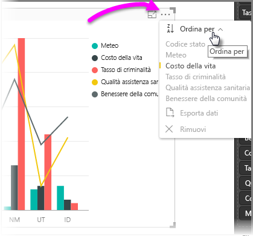

## Esempio con maggiore profondità
In questa sezione verrà presentato un esempio caratterizzato da maggiore profondità e ne verrà illustrato il funzionamento in **Power BI Desktop**.

La visualizzazione seguente riporta i primi 15 stati in termini di meteo (con classificazione da 1 a 50 in cui 1 corrisponde al numero maggiore di giornate di sole). Ecco come si presenta la visualizzazione prima di qualsiasi operazione di ordinamento:

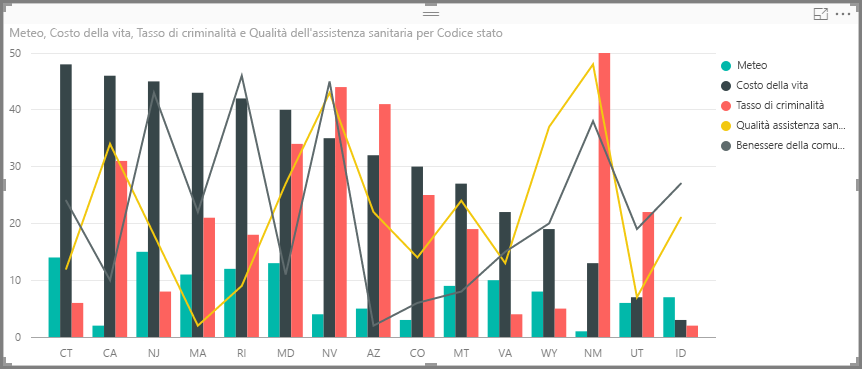

L'oggetto visivo è attualmente ordinato in base a **Cost of living**, come si può dedurre osservando la corrispondenza tra il colore delle barre decrescenti e la legenda. Un modo più efficiente per determinare la colonna di ordinamento corrente è tuttavia rappresentato dalla finestra di dialogo **Ordina per**, accessibile dal menu dei puntini di sospensione (...) nell'angolo superiore destro dell'oggetto visivo. Quando si selezionano i puntini di sospensione, viene visualizzato quanto segue:

Nel menu visualizzato selezionando i puntini di sospensione si possono osservare alcuni elementi:

* la barra gialla accanto a **Cost of living** e il fatto che **Cost of living** è in grassetto,
* la piccola icona accanto alle parole **Ordina per** con **Z/A** (con la Z sopra la A) e una freccia verso il basso.

Ognuno di questi elementi verrà esaminato in modo indipendente nelle prossime due sezioni.

## Selezione della colonna da usare per l'ordinamento
La barra gialla osservata accanto a **Cost of living** nel menu **Ordina per** indica che la colonna usata per ordinare l'oggetto visivo è **Cost of living**. Per eseguire l'ordinamento in base a un'altra colonna è sufficiente selezionare i puntini di sospensione per visualizzare il menu **Ordina per** e quindi selezionare un'altra colonna. È molto semplice.

Nell'immagine seguente, la colonna selezionata come colonna in base alla quale eseguire l'ordinamento è **Community well-being**, che corrisponde a una delle linee nell'oggetto visivo anziché a una delle barre. Ecco l'aspetto risultante dopo la selezione di **Community well-being**.

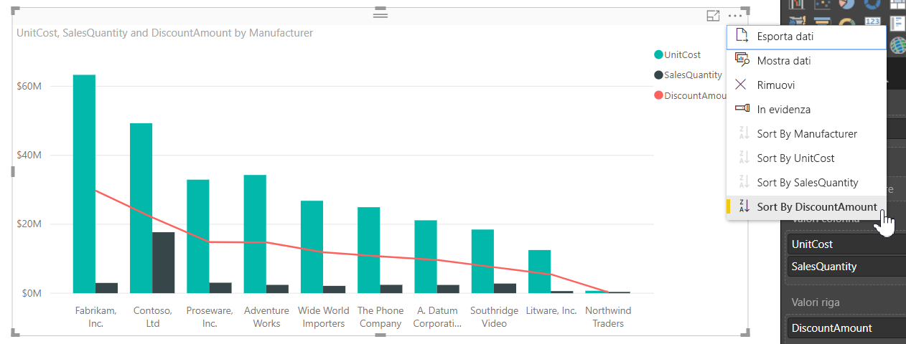

Si noti come è stato modificato l'oggetto visivo. I valori sono ordinati dal valore massimo di "Community well-being" (corrispondente in questo caso a RI, ovvero Rhode Island) al valore minimo (AZ, ovvero Arizona) degli stati inclusi in questo oggetto visivo. Tenere presente che il grafico complessivo include ancora solo i 15 stati con il numero maggiore di giornate di sole. È stato solo eseguito l'ordinamento in base a un'altra colonna inclusa nell'oggetto visivo.

Se si vuole un ordinamento crescente anziché decrescente, la prossima sezione illustra come è possibile ottenere facilmente tale risultato.

## Selezione dell'ordinamento dal più piccolo al più grande e viceversa
Esaminando più attentamente il menu **Ordina per** dell'immagine precedente, si può osservare che l'icona accanto a **Ordina per** contiene **Z/A** (con la Z sopra la A), come visualizzato di seguito:

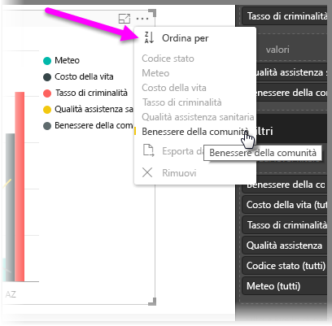

Quando l'icona visualizza **Z/A**, l'oggetto visivo è ordinato in base alla colonna selezionata dal valore più grande al più piccolo. Se si vuole modificare tale ordinamento, è sufficiente toccare o fare clic sull'icona **Z/A**. L'ordinamento verrà modificato in **A/Z** e l'oggetto visivo verrà ordinato (in base alla colonna selezionata) dal valore più piccolo al più grande.

Di seguito è riportato lo stesso oggetto visivo dopo che è stata toccata l'icona **Z/A** nel menu **Ordina per** per modificarne l'ordinamento. Si noti l'ordinamento opposto rispetto a prima: AZ (Arizona) è ora il primo stato riportato e RI (Rhode Island) è l'ultimo.

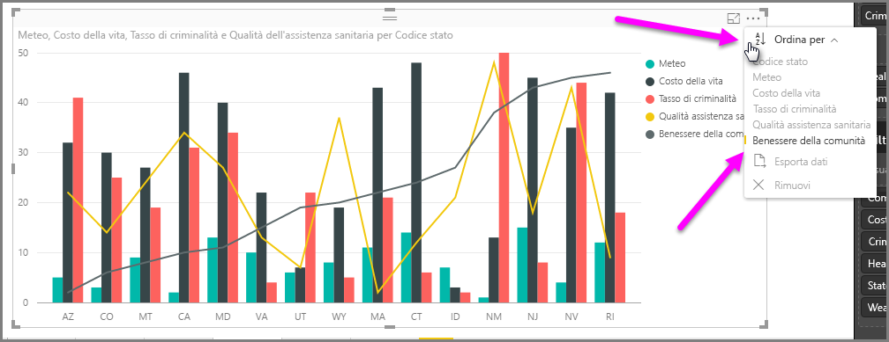

È possibile eseguire l'ordinamento in base a qualsiasi colonna inclusa nell'oggetto visivo. Si potrebbe facilmente selezionare Weather come colonna per l'ordinamento e quindi **Z/A** nel menu **Ordina per** per visualizzare per primi gli stati con il numero maggiore di giornate di sole (il valore massimo, perché in questo modello di dati Weather equivale alle giornate di tempo sereno) mantenendo comunque le altre colonne nell'oggetto visivo comunque si applichino allo stato. Ecco come si presenta l'oggetto visivo con tali impostazioni.

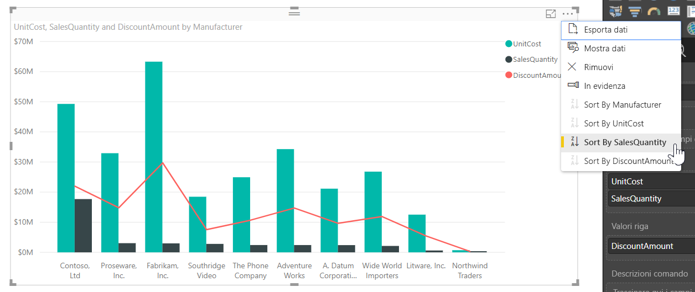

## Ordinamento con il pulsante Ordina per colonna
È possibile ordinare i dati in un altro modo, e cioè usando il pulsante **Ordina per colonna** nella barra multifunzione **Modellazione**.

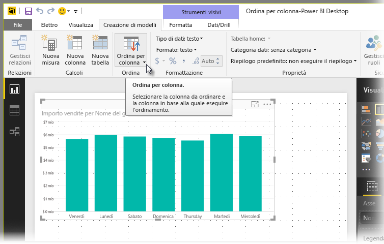

Questo approccio all'ordinamento richiede di selezionare una colonna dal riquadro **Campi** e quindi selezionare il pulsante **Ordina per colonna** per scegliere come (in base a quale colonna) si vuole ordinare l'oggetto visivo. È necessario selezionare la colonna (il campo) che si vuole ordinare dal riquadro **Campi** per abilitare il pulsante **Ordina per colonna**, altrimenti il pulsante è inattivo.

Verrà ora esaminato un esempio comune: sono disponibili i dati relativi a ogni giorno della settimana, che si vogliono ordinare in base all'ordine cronologico. La procedura seguente illustra come fare.

1. Prima di tutto, si noti che quando l'oggetto visivo è selezionato, ma non è selezionata alcuna colonna nel riquadro **Campi**, il pulsante **Ordina per colonna** è inattivo (in grigio).
   
   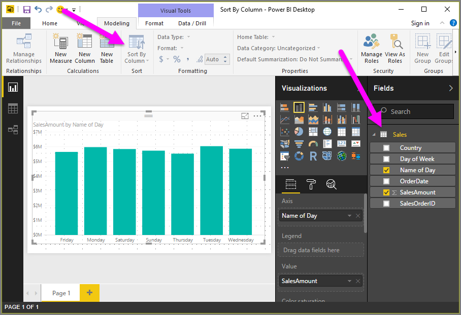
2. Quando si seleziona la colonna in base alla quale si vuole eseguire l'ordinamento, nel riquadro **Campi** il pulsante **Ordina per colonna** diventa attivo.
   
   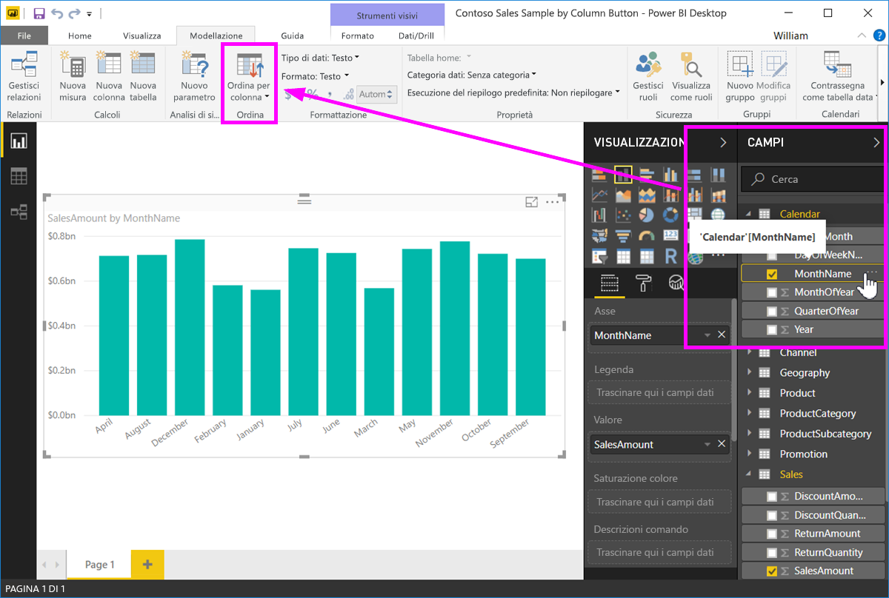
3. A questo punto, con l'oggetto visivo selezionato, è possibile selezionare *Giorno della settimana*, anziché il valore predefinito (*Nome del giorno*) e l'oggetto visivo è ordinato nell'ordine desiderato, cioè in base al giorno della settimana.
   
   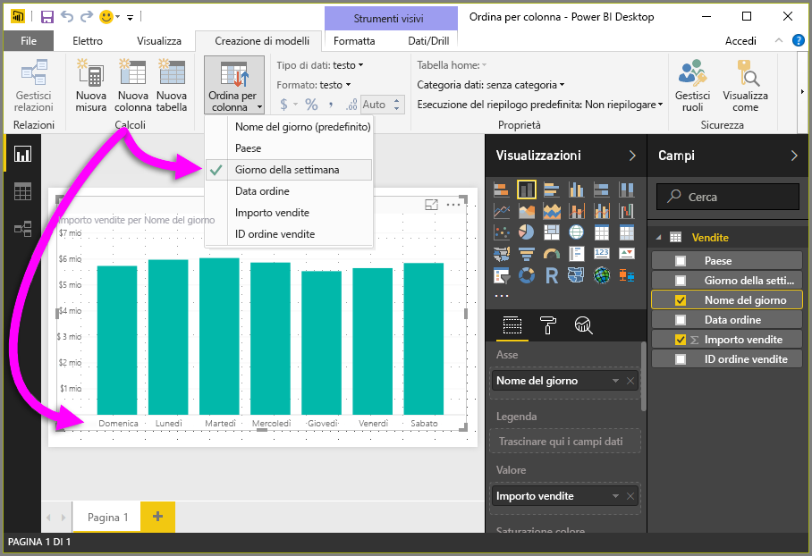

Tutto qui! Tenere presente che è necessario selezionare una colonna nel riquadro **Campi** per attivare il pulsante **Ordina per colonna**.

## Ripristino dell'ordinamento in base alla colonna predefinita
Si può eseguire l'ordinamento in base a qualsiasi colonna desiderata, ma talvolta si vuole ripristinare nell'oggetto visivo la colonna di ordinamento predefinita. Si tratta di un problema facilmente risolvibile. Per un oggetto visivo in cui è selezionata una colonna di ordinamento (con una barra gialla accanto nel menu **Ordina per**, come illustrato in precedenza), è sufficiente aprire il menu **Ordina per** e selezionare nuovamente tale colonna. Nella visualizzazione verrà ripristinata la colonna di ordinamento predefinita.

Ecco, ad esempio, il grafico precedente:

Tornando al menu e selezionando di nuovo **Weather**, l'oggetto visivo per impostazione predefinita viene ordinato alfabeticamente in base a **State Code**, come illustrato nell'immagine seguente.

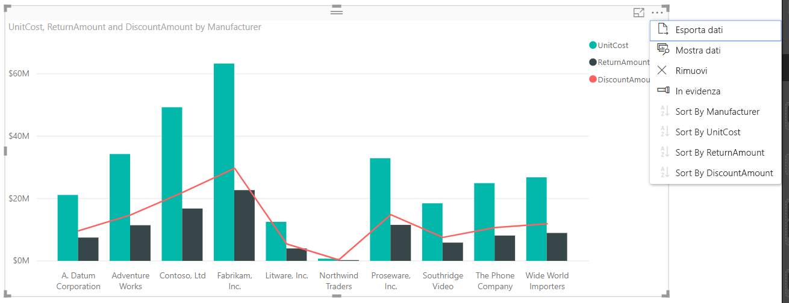

Con così tante opzioni per l'ordinamento degli oggetti visivi, è facile creare l'immagine o il grafico desiderato.

