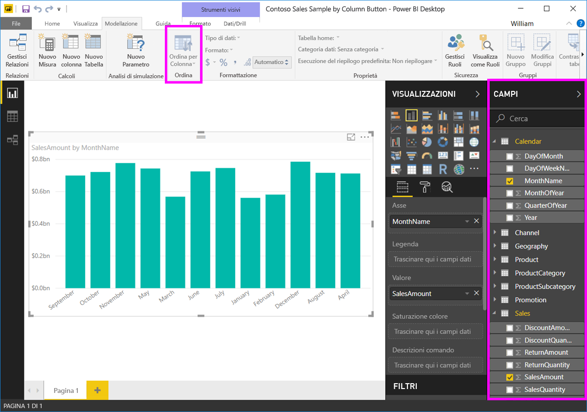

# Ordinare per colonna in Power BI Desktop
In **Power BI Desktop** e nel **servizio Power BI** è possibile modificare l'aspetto di un oggetto visivo ordinandolo in base a campi dati diversi. La modifica dell'ordinamento di un oggetto visivo consente di dare risalto alle informazioni da comunicare e di garantire che l'oggetto visivo evidenzi la tendenza prevista.

Sia che si usino dati numerici (come cifre di vendita) o dati di tipo testo (come nomi di stati), è possibile ordinare le visualizzazioni in qualsiasi modo per ottenere l'aspetto desiderato.  In **Power BI** sono disponibili funzionalità estremamente flessibili per l'ordinamento, nonché menu rapidi. In qualsiasi oggetto visivo, selezionare il menu accessibile facendo clic sui puntini di sospensione (...) e quindi selezionare il campo in base al quale eseguire l'ordinamento, come illustrato nell'immagine seguente.

## Esempio con maggiore profondità
In questa sezione verrà presentato un esempio caratterizzato da maggiore profondità e ne verrà illustrato il funzionamento in **Power BI Desktop**.

La visualizzazione seguente indica i costi, le quantità e gli importi per nome del produttore. Ecco come si presenta la visualizzazione prima di qualsiasi operazione di ordinamento.

L'oggetto visivo è attualmente ordinato in base a **Quantità vendite**, come si può dedurre osservando la corrispondenza tra il colore delle barre crescenti e la legenda. Un modo più efficiente per determinare la colonna di ordinamento corrente è il menu dei puntini di sospensione (...) nell'angolo superiore destro dell'oggetto visivo. Quando si selezionano i puntini di sospensione, viene visualizzato quanto segue:

* Il campo di ordinamento corrente è **Quantità vendite**, indicato dal fatto che **Ordina per Quantità vendite** è in grassetto e ha una barra gialla. 

* La direzione di ordinamento corrente è dal valore più piccolo al più grande, come indicato dalla piccola icona **A/Z** (A su Z) e dalla freccia verso il basso.

Il campo e la direzione di ordinamento vengono analizzati in dettaglio nelle due sezioni successive.

## Selezione della colonna da usare per l'ordinamento
La barra gialla accanto a **Ordina per Quantità vendite** nel menu **Altre opzioni** indica che l'oggetto visivo è ordinato in base alla colonna **Quantità vendite**. Per eseguire l'ordinamento in base a un'altra colonna è sufficiente selezionare i puntini di sospensione per visualizzare il menu corrispondente e quindi selezionare un'altra colonna.

Nell'immagine seguente la colonna selezionata come base per l'ordinamento è *DiscountAmount* (Importo sconto). che corrisponde a una delle linee nell'oggetto visivo anziché a una delle barre. Ecco l'aspetto risultante dopo la selezione di **Sort By DiscountAmount** (Ordina per Importo sconto).

Si noti come è stato modificato l'oggetto visivo. I valori sono ora ordinati dal valore massimo di DiscountAmount (Importo sconto), corrispondente in questo oggetto visivo a Fabrikam Inc., fino al valore minimo, corrispondente a Northwind Traders. 

Se si vuole un ordinamento crescente anziché decrescente, la prossima sezione illustra come è possibile ottenere facilmente tale risultato.

## Selezione dell'ordinamento dal più piccolo al più grande e viceversa
Se si esamina in dettaglio il menu **Opzioni** dell'immagine precedente, si può osservare che l'icona accanto a **Sort By DiscountAmount** (Ordina per Importo sconto) contiene **Z/A** (con la Z sopra la A), come visualizzato di seguito:

Quando l'icona visualizza **Z/A**, l'oggetto visivo è ordinato in base alla colonna selezionata dal valore più grande al più piccolo. Se si vuole modificare tale ordinamento, è sufficiente toccare o fare clic sull'icona **Z/A**. L'ordinamento verrà modificato in **A/Z** e l'oggetto visivo verrà ordinato (in base alla colonna selezionata) dal valore più piccolo al più grande.

Di seguito è riportato lo stesso oggetto visivo dopo che è stata toccata l'icona **Z/A** nel menu **Sort By DiscountAmount** (Ordina per Importo sconto) per modificarne l'ordinamento. Si noti che ora Northwind Traders è il primo produttore nell'elenco e Fabrikam Inc. è l'ultimo: l'ordinamento è opposto rispetto a quello precedente.

È possibile eseguire l'ordinamento in base a qualsiasi colonna inclusa nell'oggetto visivo, ad esempio selezionare Quantità vendite come colonna base per l'ordinamento con **Ordina per Quantità vendite**, per visualizzare per primi i produttori con il volume di vendite maggiore mantenendo comunque nell'oggetto visivo le altre colonne, quale che sia la loro associazione con il produttore. Ecco come si presenta l'oggetto visivo con tali impostazioni.

## Ordinamento con il pulsante Ordina per colonna
È possibile ordinare i dati in un altro modo, e cioè usando il pulsante **Ordina per colonna** nella barra multifunzione **Modellazione**.

Questo approccio all'ordinamento richiede di selezionare una colonna dal riquadro **Campi** e quindi selezionare il pulsante **Ordina per colonna** per scegliere come (in base a quale colonna) si vuole ordinare l'oggetto visivo. È necessario selezionare la colonna (il campo) che si vuole ordinare dal riquadro **Campi** per abilitare il pulsante **Ordina per colonna**, altrimenti il pulsante è inattivo.

Si consideri un caso comune: sono disponibili i dati di ogni mese dell'anno e si vuole ordinarli in ordine cronologico. La procedura seguente illustra come fare.

1. Prima di tutto, si noti che quando l'oggetto visivo è selezionato, ma non è selezionata alcuna colonna nel riquadro **Campi**, il pulsante **Ordina per colonna** è inattivo (in grigio).
   
   

2. Quando si seleziona la colonna in base alla quale si vuole eseguire l'ordinamento, nel riquadro **Campi** il pulsante **Ordina per colonna** diventa attivo.
   
   
3. A questo punto, con l'oggetto visivo selezionato, è possibile selezionare *Mese dell'anno* anziché il valore predefinito (*Nome del mese*) e l'oggetto visivo viene ordinato nell'ordine desiderato, ovvero in base al mese dell'anno.
   
   

Tutto qui! Tenere presente che è necessario selezionare una colonna nel riquadro **Campi** per attivare il pulsante **Ordina per colonna**.

## Ripristino dell'ordinamento in base alla colonna predefinita
Si può eseguire l'ordinamento in base a qualsiasi colonna desiderata, ma talvolta si vuole ripristinare nell'oggetto visivo la colonna di ordinamento predefinita. ma si tratta di un problema facilmente risolvibile. Per un oggetto visivo in cui è selezionata una colonna di ordinamento (affiancata da una barra gialla nel menu puntini di sospensione, come illustrato in precedenza), è sufficiente aprire il menu **Altre opzioni** e selezionare nuovamente tale colonna. Nella visualizzazione viene ripristinata la colonna di ordinamento predefinita.

Ecco, ad esempio, il grafico precedente:

Se si torna al menu e si seleziona di nuovo **Quantità vendite**, l'oggetto visivo assume l'ordinamento alfabetico predefinito in base a **Produttore**, come illustrato nell'immagine seguente.

Con così tante opzioni per l'ordinamento degli oggetti visivi, è facile creare l'immagine o il grafico desiderato.

