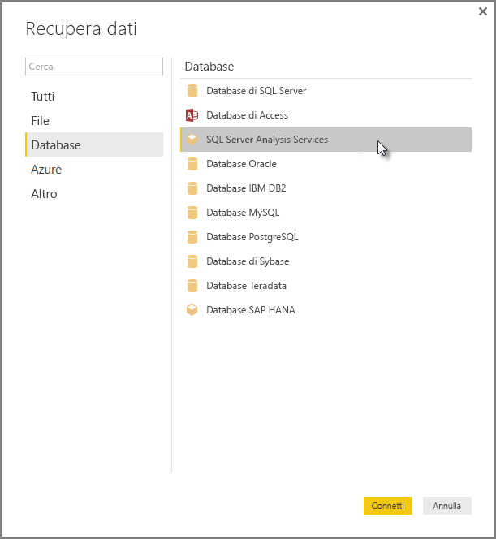

# Connettersi ai modelli multidimensionali SSAS in Power BI Desktop
Con Power BI Desktop è possibile accedere ai **modelli multidimensionali di SSAS**, comunemente noti come **MD SSAS**.

Per connettersi a un database **MD SSAS**, selezionare **Recupera dati &gt; Database &gt; Database di SQL Server Analysis Services** come illustrato nella figura seguente:

I **modelli multidimensionali SSAS** in modalità di connessione dinamica sono supportati sia nel servizio Power BI che in Power BI Desktop. È anche possibile pubblicare e caricare i report che usano i **modelli multidimensionali SSAS** in modalità dinamica nel servizio Power BI.

## Caratteristiche e funzionalità di MD SSAS
Nelle sezioni seguenti sono descritte le caratteristiche e le funzionalità di Power BI e delle connessioni SSAS MD.

### Metadati tabulari dei modelli multidimensionali
Nella tabella seguente viene illustrata la corrispondenza tra gli oggetti multidimensionali e i metadati tabulari restituiti a Power BI Desktop. Quando si crea una visualizzazione, ad esempio una tabella, una matrice, un grafico o un filtro dei dati, Power BI esegue query nel modello per ottenere metadati tabulari e, in base ai metadati restituiti, esegue query DAX appropriate in Analysis Services.

| Oggetto BISM-multidimensionale | Metadati tabulari |
| --- | --- |
| Cubo |Modello |
| Dimensione cubo |Tabella |
| Attributi dimensione (chiavi, nome) |Colonne |
| Gruppo di misure |Tabella |
| Misura |Misura |
| Misure senza gruppo di misure associato |In una tabella denominata *Misure* |
| Relazione gruppo di misure -> dimensione cubo |Relazione |
| Punto di vista |Punto di vista |
| Indicatore KPI |Indicatore KPI |
| Gerarchie utente/padre-figlio |Gerarchie |

### Misure, gruppi di misure e indicatori KPI
In Power BI i gruppi di misure in un cubo multidimensionale vengono esposti come tabelle nel riquadro **Campi** con accanto il segno ∑. Le misure calcolate che non dispongono di un gruppo di misure associato vengono raggruppate in una tabella speciale denominata *Misure* nei metadati tabulari.

In un modello multidimensionale è possibile definire l'inserimento di un set di misure o di indicatori KPI di un cubo all'interno di una *cartella di visualizzazione*, che consente di semplificare modelli complessi. Power BI riconosce le cartelle di visualizzazione presenti nei metadati tabulari e mostra le misure e gli indicatori KPI all'interno di tali cartelle. Gli indicatori KPI nei database multidimensionali supportano *Valore*, *Obiettivo*, *Icona stato* e *Icona tendenza*.

### Tipi di attributi della dimensione
I modelli multidimensionali supportano anche l'associazione degli attributi di dimensione a tipi di attributo di dimensione specifici. Ad esempio nei metadati tabulari viene esposta una dimensione **Geografia** con attributi *Città*, *Provincia*, *Paese* e *Codice postale* ai quali sono associati tipi di elementi geografici appropriati. Power BI riconosce i metadati, consentendo di creare viste mappa. Queste associazioni sono riconoscibili in Power BI dall'icona della *mappa* accanto all'elemento nel riquadro **Campo** .

Power BI può anche visualizzare le immagini di cui viene fornito un campo contenente l'URL (Uniform Resource Locator) corrispondente. È possibile specificare questi campi con il tipo *ImageURL* in SQL Server Data Tools o successivamente in Power BI. Le informazioni relative al tipo vengono fornite a Power BI con i metadati tabulari. Power BI può quindi recuperare tali immagini dall'URL e visualizzarle all'interno di oggetti visivi.

### Gerarchie padre-figlio
I modelli multidimensionali supportano le gerarchie padre-figlio, che vengono presentate sotto forma di *gerarchia* nei metadati tabulari. All'interno di questi ogni livello della gerarchia padre-figlio viene esposta come colonna nascosta. L'attributo chiave della dimensione padre-figlio non viene esposto nei metadati tabulari.

### Membri calcolati della dimensione
I modelli multidimensionali supportano la creazione di vari tipi di *membri calcolati*. I due tipi più comuni di membri calcolati sono i seguenti:

* Membri calcolati in gerarchie di attributi e non di pari livello di *Tutti*
* Membri calcolati in gerarchie utente

I modelli multidimensionali espongono i *membri calcolati in gerarchie di attributi* come valori di una colonna. Quando si espongono membri calcolati di questo tipo, sono presenti alcune opzioni e alcuni vincoli aggiuntivi:

* Tra gli attributi della dimensione può essere presente l'attributo facoltativo *UnknownMember*
* Un attributo contenente membri calcolati può essere l'attributo chiave della dimensione solo se è l'unico attributo della dimensione stessa
* Un attributo contenente membri calcolati non può essere un attributo padre-figlio

I membri calcolati delle gerarchie utente non vengono esposti in Power BI. È invece possibile connettersi a un cubo contenente membri calcolati in gerarchie utente, ma non è possibile visualizzare i membri calcolati se questi non soddisfano i vincoli indicati nel precedente elenco.

### Sicurezza
I modelli multidimensionali supportano la sicurezza a livello di dimensione e di cella per mezzo di *ruoli*. Quando ci si connette a un cubo con Power BI, vengono eseguite l'autenticazione e la valutazione per l'assegnazione all'utente delle autorizzazioni appropriate. Quando a un utente si applica la *sicurezza delle dimensioni* , i membri delle dimensioni interessate non sono visibili dall'utente in Power BI. Se però per un utente è definito un tipo di autorizzazione *sicurezza delle celle* che applica restrizioni ad alcune celle,l'utente non può connettersi al cubo tramite Power BI.

## Considerazioni e limitazioni
Esistono alcune limitazioni all'uso di **MD SSAS**:

* Per il corretto funzionamento del connettore MD SSAS di Power BI Desktop, nei server devono essere in esecuzione SQL Server 2012 SP1 CU4 o versioni successive di Analysis Services.
* Solo le edizioni Enterprise e BI di SQL Server 2012 e SQL Server 2014 supportano le connessioni dinamiche. Per la versione standard di SQL Server, è necessario SQL Server 2016 o versione successiva per le connessioni dinamiche.
* *Azioni* e *set denominati* non sono esposti in Power BI. È comunque possibile connettersi a cubi che contengono anche *azioni* o *set denominati* e creare oggetti visivi e report.
* Può verificarsi un problema per cui Power BI visualizza metadati per un modello SSAS, ma non è possibile recuperare dati dal modello. Questo problema può verificarsi quando nel sistema è installata la versione a 32 bit del provider MSOLAP e non è disponibile la versione a 64 bit. Il problema viene in genere risolto con l'installazione della versione a 64 bit.
* Non è possibile creare misure a livello di report quando si crea un report con connessione dinamica a un modello multidimensionale di SSAS. Le uniche misure disponibili sono quelle definite nel modello MD.

## Funzionalità supportate di SSAS MD in Power BI Desktop
Le seguenti funzionalità di SSAS MD sono supportate in Power BI Desktop:

* In questa versione di **MD SSAS** è supportato l'utilizzo degli elementi seguenti (su queste funzionalità sono disponibili [altre informazioni](https://docs.microsoft.com/sql/analysis-services/multidimensional-models/understanding-power-view-for-multidimensional-models?view=sql-server-2014)):
  * Cartelle di visualizzazione
  * Tendenze degli indicatori KPI
  * Membri predefiniti
  * Attributi della dimensione
  * Membri calcolati della dimensione (deve essere un singolo membro reale quando la dimensione ha più attributi, non può essere l'attributo chiave della dimensione a meno che si tratti dell'unico attributo e non può essere un attributo padre-figlio)
  * Tipi di attributi della dimensione
  * Gerarchie
  * Misure (con o senza gruppi di misure)
  * Misure di tipo Variant
  * Indicatori KPI
  * ImageUrl
  * Sicurezza delle dimensioni

## Risoluzione dei problemi 
L'elenco seguente descrive tutti i problemi noti relativi alla connessione a SQL Server Analysis Services (SSAS). 

* **Errore: Non è stato possibile caricare lo schema del modello** - Questo errore si verifica in genere quando l'utente che si connette a Analysis Services non ha accesso al database o al cubo.
