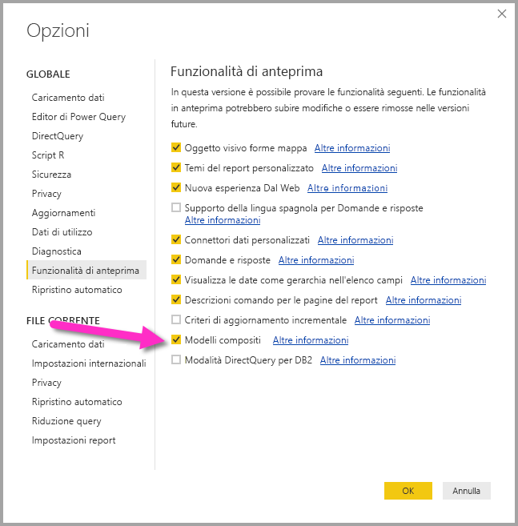

# Modalità di archiviazione in Power BI Desktop (anteprima)

In **Power BI Desktop** è possibile specificare le **modalità di archiviazione** delle tabelle e avere in questo modo il controllo sulla memorizzazione nella cache in memoria dei dati delle tabelle per i report. 

L'impostazione della **modalità di archiviazione** offre numerosi vantaggi. È possibile impostare la **modalità di archiviazione** per ogni tabella singolarmente nel modello, consentendo così a un singolo set di dati di sfruttare uno dei molti vantaggi seguenti:

* **Prestazioni delle query** - Quando gli utenti interagiscono con gli oggetti visivi nei report di Power BI, vengono inviate query DAX al set di dati. La memorizzazione dei dati nella cache dati in memoria tramite l'impostazione corretta della **modalità di archiviazione** può migliorare le prestazioni delle query e l'interattività dei report.
* **Set di dati di grandi dimensioni** - Le tabelle che non vengono memorizzate nella cache non utilizzano memoria per la memorizzazione nella cache. È possibile abilitare l'analisi interattiva su set di dati estesi, troppo grandi o onerosi per essere memorizzati completamente nella cache in memoria. È possibile scegliere le tabelle che vale o meno la pena di memorizzare nella cache.
* **Ottimizzazione dell'aggiornamento dei dati** - Le tabelle che non vengono memorizzate nella cache non devono essere aggiornate. È possibile ridurre i tempi di aggiornamento memorizzando nella cache solo i dati necessari per soddisfare i contratti di servizio e i requisiti aziendali.
* **Requisiti di accesso quasi in tempo reale** - Le tabelle con requisiti di accesso quasi in tempo reale possono trarre vantaggio dal non essere memorizzate nella cache, per ridurre la latenza dei dati.
* **Writeback** - Il writeback consente agli utenti aziendali di sperimentare vari scenari di simulazione modificando i valori delle celle. Le applicazioni personalizzate possono applicare le modifiche all'origine dati. Le tabelle che non vengono memorizzate nella cache possono riflettere le modifiche immediatamente, consentendo l'analisi istantanea degli effetti.

L'impostazione della **modalità di archiviazione** in **Power BI Desktop** corrisponde a una di tre funzionalità correlate:

* **Modelli compositi** - Consente a un report di avere più connessioni dati, tra cui connessioni DirectQuery o importazione, in qualsiasi combinazione.
* **Relazioni molti-a-molti** - Con i **modelli compositi** è possibile stabilire **relazioni molti-a-molti** tra tabelle, rimuovendo i requisiti per i valori univoci nelle tabelle ed evitando soluzioni alternative precedenti, come l'introduzione di nuove tabelle solo per stabilire relazioni. 
* **Modalità di archiviazione** - È ora possibile specificare gli oggetti visivi che richiedono una query per origini dati back-end e quelli che non la richiedono vengono importati anche se basati su DirectQuery, con conseguente miglioramento delle prestazioni e riduzione del carico per il back-end. In precedenza, anche oggetti visivi semplici, come i filtri dei dati, attivavano l'invio di query alle origini di back-end. 

Questa raccolta delle tre funzionalità correlate per i **modelli compositi** è descritta in articoli separati:

* I **modelli compositi** sono descritti in dettaglio in un articolo apposito [Modelli compositi in Power BI Desktop (anteprima)](desktop-composite-models.md).
* Le **relazioni molti-a-molti** sono descritte nell'articolo specifico [Relazioni molti-a-molti in Power BI Desktop (anteprima)](desktop-many-to-many-relationships.md).
* La **modalità di archiviazione** è descritta in dettaglio in questo articolo.

## Abilitazione della funzionalità di anteprima modalità di archiviazione

La funzionalità **modalità di archiviazione** è disponibile in anteprima e deve essere abilitata in **Power BI Desktop**. Per abilitare la **modalità di archiviazione**, selezionare **File > Opzioni e impostazioni > Opzioni > Funzionalità in anteprima** e quindi selezionare la casella di controllo **Modelli compositi**. 

È necessario riavviare **Power BI Desktop** per rendere effettiva la modifica.

## Uso della proprietà modalità di archiviazione

La **modalità di archiviazione** è una proprietà che è possibile impostare per ogni tabella nel modello. Per impostare la **modalità di archiviazione**, selezionare la tabella nel riquadro **Campi** e quindi fare clic con il pulsante destro del mouse per visualizzare il menu di scelta rapida. Scegliere **Proprietà** dal menu di scelta rapida.

L'opzione **modalità di archiviazione** viene visualizzata nel riquadro **Proprietà campi** per la tabella. Da qui è possibile visualizzare la **modalità di archiviazione** corrente o modificarla.

Esistono tre valori per **modalità di archiviazione**:

* **Importa** - Con l'impostazione **Importa**, le tabelle importate vengono memorizzate nella cache. Le query inviate al set di dati di Power BI che restituiscono dati dalle tabelle importate possono essere soddisfatte solo dai dati memorizzati nella cache.
* **DirectQuery** - Con questa impostazione, le tabelle non vengono memorizzate nella cache. Le query inviate al set di dati di Power BI (ad esempio, le query DAX) che restituiscono dati dalle tabelle in modalità DirectQuery possono essere soddisfatte solo mediante l'esecuzione di query su richiesta sull'origine dati. Le query inviate all'origine dati usano il linguaggio di query per l'origine dati (ad esempio, SQL).
* **Doppia** - Le tabelle con questa impostazione possono essere o meno memorizzate nella cache, a seconda del contesto della query inviata al set di dati di Power BI. In alcuni casi, le query vengono soddisfatte dai dati memorizzati nella cache. In altri, tramite l'esecuzione di una query su richiesta sull'origine dati.

L'impostazione di Importa per una tabella è un'operazione *irreversibile* e non è possibile modificarla in DirectQuery o Doppia.

## Vincoli delle impostazioni DirectQuery e Doppia per le tabelle

Le tabelle in modalità Doppia sono soggette agli stessi vincoli delle tabelle in modalità DirectQuery, incluse trasformazioni M limitate e funzioni DAX con restrizioni nelle colonne calcolate. Per altre informazioni, vedere [Implicazioni dell'uso di DirectQuery](desktop-directquery-about.md#implications-of-using-directquery).

## Regole per le relazioni nelle tabelle con modalità di archiviazione diverse

Le relazioni devono essere conformi alle regole basate sulla **modalità di archiviazione** delle tabelle correlate. In questa sezione sono disponibili esempi di combinazioni valide. Per informazioni complete, vedere [Relazioni molti-a-molti in Power BI Desktop (anteprima)](desktop-many-to-many-relationships.md).

Per un set di dati con una singola origine dati, sono valide le combinazioni di relazioni**uno-a-molti** seguenti:

| Tabella sul lato **molti** | Tabella sul lato **uno** |
| ------------- |----------------------| 
| Doppia          | Doppia                 | 
| Importa        | Importa o Doppia       | 
| DirectQuery   | DirectQuery o Doppia  | 

## Propagazione di Doppia
Esaminiamo un esempio. Si consideri il modello semplice seguente, in cui tutte le tabelle provengono da un'origine singola che supporta le impostazioni Importa e DirectQuery.

Per iniziare, si supponga che tutte le tabelle in questo modello siano di tipo DirectQuery. Se si modifica la **modalità di archiviazione** della tabella *SurveyResponse* impostando Importa, viene visualizzata la finestra di messaggio seguente:

Le tabelle delle dimensioni (*Customer*, *Date* e *Geography*) devono essere impostate su **Doppia** per rispettare le regole per le relazioni descritte in precedenza. Invece di richiedere che queste tabelle vengano impostate su **Doppia** anticipatamente, possono essere impostate in un'unica operazione.

La logica di propagazione è progettata per agevolare l'uso di modelli contenenti molte tabelle. Si supponga di avere un modello con 50 tabelle e che solo determinate tabelle dei fatti (transazionali) debbano essere memorizzata nella cache. La logica in **Power BI Desktop** determina il set minimo di tabelle delle dimensioni che devono essere impostate su **Doppia**, quindi non è necessario procedere manualmente.

La logica di propagazione attraversa solo un lato delle relazioni **uno-a-molti**.

* L'impostazione della tabella *Customer* su **Importa** (anziché modificare *SurveyResponse*) non è consentita a causa delle relative relazioni con le tabelle DirectQuery *Sales* e *SurveyResponse*.
* L'impostazione della tabella *Customer* su **Doppia** (anziché modificare *SurveyResponse*) è consentita. La logica di propagazione imposta anche la tabella *Geography* su **Doppia**.

## Esempio di utilizzo della modalità di archiviazione
È possibile continuare con l'esempio nella sezione precedente e immaginare di applicare le impostazioni della proprietà **Modalità di archiviazione** seguenti:

| Tabella                   | Modalità di archiviazione         |
| ----------------------- |----------------------| 
| *Sales*                 | DirectQuery          | 
| *SurveyResponse*        | Importa               | 
| *Date*                  | Doppia                 | 
| *Customer*              | Doppia                 | 
| *Geography*             | Doppia                 | 

Queste impostazioni della modalità di archiviazione determinano i comportamenti seguenti, supponendo che la tabella *Sales* includa un volume di dati significativo.
* Le tabelle delle dimensioni (*Date*, *Customer* e *Geography*) vengono memorizzate nella cache, in modo che i tempi di caricamento dei report iniziali siano veloci durante il recupero dei valori dei filtri dei dati da visualizzare.
* Se la tabella *Sales* non viene memorizzata nella cache, si verificano i risultati seguenti:
    * I tempi di aggiornamento dei dati risultano migliorati e si riduce il consumo di memoria
    * Le query dei report basate sulla tabella*Sales* vengono eseguite in modalità DirectQuery e potrebbero richiedere più tempo, ma sono più vicine a risultati in tempo reale perché non viene introdotta alcuna latenza per la memorizzazione nella cache

* Le query dei report basate sulla tabella *SurveyResponse* vengono restituite dalla cache in memoria e pertanto dovrebbero essere relativamente veloci.

## Query con o senza riscontri nella cache

Connettendo **SQL Profiler** alla porta di diagnostica per **Power BI Desktop**, è possibile visualizzare le query con o senza riscontri nella cache in memoria eseguendo una traccia basata sugli eventi seguenti:

* Queries Events\Query Begin
* Query Processing\Vertipaq SE Query Begin
* Query Processing\DirectQuery Begin

Per ogni evento *Query Begin*, controllare altri eventi con lo stesso *ActivityID*. Ad esempio, se non è presente alcun evento *DirectQuery Begin*, ma esiste un evento *Vertipaq SE Query Begin*, la query è stata risposta dalla cache.

Le query che fanno riferimento a tabelle in modalità **Doppia** restituiscono dati dalla cache se possibile, in caso contrario, viene usata la modalità DirectQuery.

Proseguendo con l'esempio precedente, la query seguente fa riferimento solo a una colonna dalla tabella *Date*, in modalità **Doppia**. Di conseguenza, dovrebbe trovare riscontri nella cache.

La query seguente fa riferimento solo a una colonna dalla tabella *Sales*, in modalità **DirectQuery**. Pertanto, *non* dovrebbe trovare riscontri nella cache.

La query seguente è interessante perché combina entrambe le colonne. Questa query non troverà riscontri nella cache. Si potrebbe inizialmente prevedere di recuperare valori *CalendarYear* dalla cache e valori *SalesAmount* dall'origine e quindi combinare i risultati, ma sarebbe meno efficiente rispetto all'invio dell'operazione SUM/GROUP BY al sistema di origine. Se viene eseguito il push dell'operazione all'origine, il numero di righe restituite sarà probabilmente molto inferiore. 

> [!NOTE]
> Questo comportamento è diverso dalle [relazioni molti-a-molti in Power BI Desktop (anteprima)](desktop-many-to-many-relationships.md) quando si combinano tabelle memorizzate nella cache e non memorizzate nella cache.

## Le cache devono essere mantenute sincronizzate

Le query visualizzate nella sezione precedente mostrano che le tabella in modalità **Doppia** talvolta trovano riscontri nella cache e a volte non li trovano. Per questo motivo, se la cache non è aggiornata possono essere restituiti valori diversi. L'esecuzione di query non tenterà di mascherare problemi dei dati, ad esempio filtrando i risultati di DirectQuery in modo che corrispondano ai valori memorizzati nella cache. È responsabilità dell'utente conoscere i flussi di dati e progettare il sistema di conseguenza. Esistono tecniche consolidate per gestire questi casi nell'origine, se necessario.

La modalità di archiviazione **Doppia** è un'ottimizzazione delle prestazioni. Deve essere usata solo in modi che non compromettono la possibilità di soddisfare i requisiti aziendali. Per un comportamento alternativo, prendere in considerazione le tecniche descritte nell'articolo [Relazioni molti-a-molti in Power BI Desktop (anteprima)](desktop-many-to-many-relationships.md).

## Vista dati
Se per almeno una tabella nel set di dati la **modalità di archiviazione** è impostata su Importa o Doppia, viene visualizzata la scheda **Vista dati**.

Se selezionate in *Vista dati**, le tabelle in modalità **Doppia** e **Importa** mostrano i dati memorizzati nella cache. Le tabelle in modalità DirectQuery non mostrano dati e viene visualizzato un messaggio che indica che non è possibile visualizzare tabelle DirectQuery.

## Limitazioni e considerazioni

Esistono alcune limitazioni per questa versione della **modalità di archiviazione** e la relativa correlazione con i **modelli compositi**.

Le origini multidimensionali seguenti non possono essere usate con i **modelli compositi**:

* SAP HANA
* SAP Business Warehouse
* SQL Server Analysis Services
* Set di dati Power BI

Quando ci si connette a tali origini multidimensionali tramite DirectQuery, non è neanche possibile connettersi a un'altra origine DirectQuery o attuare combinazioni con dati importati.

Le limitazioni esistenti per l'uso di DirectQuery sono valide anche quando si usano i **modelli compositi**. Molte di queste limitazioni si riferiscono attualmente a ogni singola tabella, a seconda della **modalità di archiviazione** della tabella. Ad esempio, una colonna calcolata per una tabella importata può fare riferimento ad altre tabelle, ma una colonna calcolata per una tabella di DirectQuery è ancora limitata e può fare riferimento solo alle colonne nella stessa tabella. Altre limitazioni si applicano al modello nel suo complesso, se una qualsiasi delle tabelle all'interno del modello è in modalità DirectQuery. Ad esempio, le funzionalità **Informazioni rapide** e **Domande e risposte** non sono disponibili per un modello se per una delle tabelle all'interno di esso è impostata la **modalità di archiviazione** DirectQuery. 

## Passaggi successivi

Gli articoli seguenti includono ulteriori informazioni sui modelli compositi e descrivono anche la modalità DirectQuery in modo dettagliato.

* [Modelli compositi in Power BI Desktop (anteprima)](desktop-composite-models.md)
* [Relazioni molti-a-molti in Power BI Desktop (anteprima)](desktop-many-to-many-relationships.md)

Articoli su DirectQuery:

* [Uso di DirectQuery in Power BI](desktop-directquery-about.md)
* [Origini dati supportate da DirectQuery in Power BI](desktop-directquery-data-sources.md)

