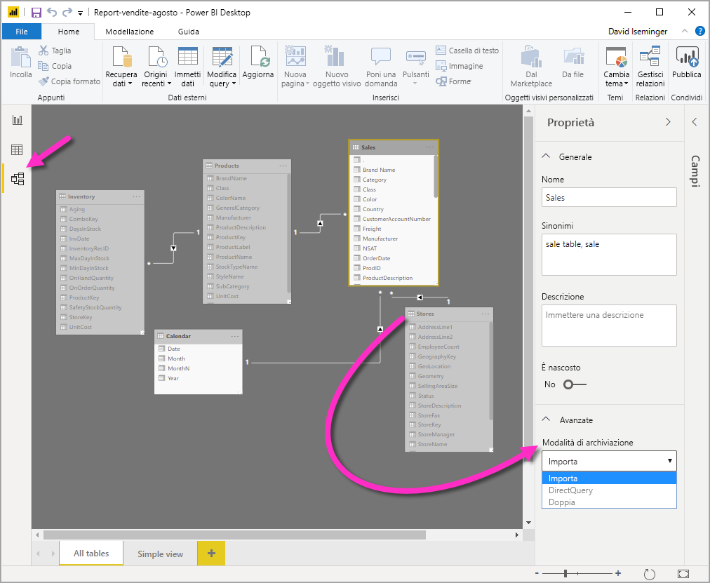
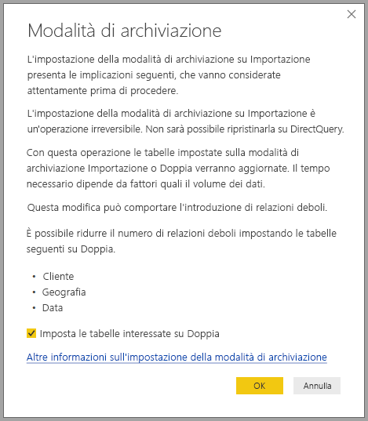

# Gestire la modalità di archiviazione in Power BI Desktop

In Microsoft Power BI Desktop è possibile specificare la modalità di archiviazione delle tabelle. La modalità di archiviazione consente di controllare se Power BI Desktop memorizza i dati delle tabelle nella cache in memoria per i report. 

L'impostazione della modalità di archiviazione offre numerosi vantaggi. È possibile impostare la modalità di archiviazione singolarmente per ogni tabella nel modello. Questa azione abilita un singolo set di dati, che offre i vantaggi seguenti:

* **Prestazioni delle query**: quando gli utenti interagiscono con gli oggetti visivi nei report di Power BI, vengono inviate query DAX (Data Analysis Expressions) al set di dati. La memorizzazione dei dati nella cache in memoria tramite l'impostazione corretta della modalità di archiviazione può migliorare le prestazioni delle query e l'interattività dei report.

* **Set di dati di grandi dimensioni**: le tabelle che non vengono memorizzate nella cache non utilizzano memoria per la memorizzazione nella cache. È possibile abilitare l'analisi interattiva su set di dati estesi, troppo grandi o onerosi per essere memorizzati completamente nella cache in memoria. È possibile scegliere le tabelle che vale o meno la pena di memorizzare nella cache.

* **Ottimizzazione dell'aggiornamento dei dati**: non è necessario aggiornare le tabelle che non vengono memorizzate nella cache. È possibile ridurre i tempi di aggiornamento memorizzando nella cache solo i dati necessari per soddisfare i contratti di servizio e i requisiti aziendali.

* **Requisiti di accesso quasi in tempo reale**: le tabelle con requisiti di accesso quasi in tempo reale potrebbero trarre vantaggio dal non essere memorizzate nella cache, per ridurre la latenza dei dati.

* **Writeback**: il writeback consente agli utenti aziendali di sperimentare vari scenari di simulazione modificando i valori delle celle. Le applicazioni personalizzate possono applicare le modifiche all'origine dati. Le tabelle che non vengono memorizzate nella cache possono visualizzare le modifiche immediatamente, consentendo l'analisi istantanea degli effetti.

L'impostazione della modalità di archiviazione in Power BI Desktop corrisponde a una di tre funzionalità correlate:

* **Modelli compositi**: consente a un report di avere due o più connessioni dati, tra cui connessioni DirectQuery o importazione, in qualsiasi combinazione. Per altre informazioni, vedere [Usare modelli compositi in Power BI Desktop](desktop-composite-models.md).

* **Relazioni molti-a-molti**: Con i modelli compositi è possibile stabilire *relazioni molti-a-molti* tra le tabelle. In una relazione molti-a-molti vengono rimossi i requisiti per i valori univoci nelle tabelle. Annulla anche le soluzioni alternative precedenti, ad esempio l'introduzione di nuove tabelle solo per stabilire relazioni. Per altre informazioni, vedere [Relazioni molti-a-molti in Power BI Desktop](desktop-many-to-many-relationships.md).

* **Modalità di archiviazione**: con questa modalità è ora possibile specificare gli oggetti visivi che richiedono una query per origini dati back-end. Quelli che non la richiedono vengono importati anche se basati su DirectQuery, con conseguente miglioramento delle prestazioni e riduzione del carico per il back-end. In precedenza, anche oggetti visivi semplici, come i filtri dei dati, attivavano query che venivano inviate alle origini di back-end. 

## Usare la proprietà Modalità di archiviazione

La proprietà **Modalità di archiviazione** è una proprietà che è possibile impostare per ogni tabella del modello e controlla il modo in cui Power BI memorizza nella cache i dati della tabella.

Per impostare la proprietà **Modalità di archiviazione** o visualizzarne l'impostazione corrente: 

1. nella visualizzazione **Modello** selezionare la tabella di cui si vogliono visualizzare o impostare le proprietà. 
2. Nel riquadro **Proprietà** espandere la sezione **Avanzate** e quindi l'elenco a discesa **Modalità di archiviazione**.

   

Impostare la proprietà **Modalità di archiviazione** su uno dei tre valori seguenti:

* **Importa**: le tabelle importate con questa impostazione vengono memorizzate nella cache. Le query inviate al set di dati di Power BI che restituiscono dati dalle tabelle importate possono essere soddisfatte solo dai dati memorizzati nella cache.

* **DirectQuery**: le tabelle con questa impostazione non vengono memorizzate nella cache. Le query inviate al set di dati di Power BI, ad esempio le query DAX, e che restituiscono dati dalle tabelle in modalità DirectQuery possono essere soddisfatte solo eseguendo query su richiesta sull'origine dati. Le query inviate all'origine dati usano il linguaggio di query specifico per l'origine dati, ad esempio SQL.

* **Doppia**: le tabelle con questa impostazione possono essere o meno memorizzate nella cache, a seconda del contesto della query inviata al set di dati di Power BI. In alcuni casi, le query possono essere soddisfatte con i dati memorizzati nella cache. In altri casi, per soddisfare le query occorre eseguire una query su richiesta sull'origine dati.

L'impostazione su **Importa** della proprietà **Modalità di archiviazione** di una tabella è un'operazione *irreversibile*. Una volta impostata, questa proprietà non può essere modificata in **DirectQuery** o **Doppia**.

> [!NOTE]
> È possibile usare la modalità di archiviazione **Doppia** in Power BI Desktop e nel servizio Power BI.

## Vincoli delle impostazioni DirectQuery e Doppia per le tabelle

Le tabelle Dual hanno gli stessi vincoli funzionali delle tabelle DirectQuery, incluse trasformazioni M limitate e funzioni DAX con restrizioni nelle colonne calcolate. Per altre informazioni, vedere [Implicazioni dell'uso di DirectQuery](desktop-directquery-about.md#implications-of-using-directquery).

## Propagazione dell'impostazione Doppia
Si consideri il modello semplice seguente, in cui tutte le tabelle provengono da un'origine singola che supporta le impostazioni Importa e DirectQuery.

Si supponga, ad esempio, che tutte le tabelle in questo modello siano inizialmente impostate su **DirectQuery**. Se si modifica la proprietà **Modalità di archiviazione** della tabella **SurveyResponse** impostandola su **Importa**, viene visualizzata la finestra di avviso seguente:

È possibile impostare le tabelle delle dimensioni (**Customer**, **Geography** e **Date**) su **Doppia** per ridurre il numero di relazioni deboli nel set di dati e migliorare le prestazioni. Le relazioni deboli implicano in genere almeno una tabella DirectQuery in cui non è possibile effettuare il push della logica di join nei sistemi di origine. Poiché le tabelle in modalità Doppia possono fungere da tabelle in modalità DirectQuery o Importa, questa situazione viene evitata.

La logica di propagazione è progettata per agevolare l'uso di modelli contenenti molte tabelle. Si supponga di avere un modello con 50 tabelle e che solo determinate tabelle dei fatti (transazionali) debbano essere memorizzate nella cache. La logica in Power BI Desktop calcola il set minimo di tabelle delle dimensioni che devono essere impostate su **Doppia**, quindi non è necessario procedere manualmente.

La logica di propagazione attraversa solo un lato delle relazioni uno-a-molti.

## Esempio di utilizzo della modalità di archiviazione
È possibile continuare con l'esempio nella sezione precedente e immaginare di applicare le impostazioni della proprietà Modalità di archiviazione seguenti:

| Tabella                   | Modalità di archiviazione         |
| ----------------------- |----------------------| 
| Vendite                 | DirectQuery          | 
| SurveyResponse        | Importa               | 
| Data                  | Doppia                 | 
| Cliente              | Doppia                 | 
| Geografia             | Doppia                 | 

L'impostazione di queste proprietà della modalità di archiviazione determina i comportamenti seguenti, supponendo che la tabella **Sales** includa un volume di dati significativo:
* Power BI Desktop memorizza nella cache le tabelle delle dimensioni (**Date**, **Customer** e **Geography**) e quindi i tempi di caricamento dei report iniziali sono veloci quando vengono recuperati i valori di filtro dei dati da visualizzare.
* Power BI Desktop non memorizza nella cache la tabella **Sales**. Se non si memorizza nella cache questa tabella, Power BI Desktop presenta i risultati seguenti:
    * I tempi di aggiornamento dei dati risultano migliorati e si riduce il consumo di memoria.
    * Le query dei report basate sulla tabella **Sales** vengono eseguite in modalità **DirectQuery**. Queste query potrebbero richiedere più tempo, ma offrono risultati più vicini all'esecuzione in tempo reale perché non viene introdotta alcuna latenza di memorizzazione nella cache.

* Le query dei report basate sulla tabella **SurveyResponse** vengono restituite dalla cache in memoria e pertanto sono relativamente veloci.

## Query con o senza riscontri nella cache

Se si connette SQL Profiler alla porta di diagnostica per Power BI Desktop, è possibile visualizzare le query con o senza riscontri nella cache in memoria eseguendo una traccia basata sugli eventi seguenti:

* Queries Events\Query Begin
* Query Processing\Vertipaq SE Query Begin
* Query Processing\DirectQuery Begin

Per ogni evento *Query Begin*, controllare altri eventi con lo stesso *ActivityID*. Se, ad esempio, non è presente alcun evento *DirectQuery Begin*, ma esiste un evento *Vertipaq SE Query Begin*, la risposta alla query è stata restituita dalla cache.

Le query che fanno riferimento a tabelle in modalità Doppia restituiscono dati dalla cache, se possibile. In caso contrario, viene usata la modalità DirectQuery.

Proseguendo con l'esempio precedente, la query seguente fa riferimento solo a una colonna dalla tabella **Date**, in modalità **Doppia**. La query dovrebbe pertanto trovare un riscontro nella cache:

La query seguente fa riferimento solo a una colonna dalla tabella **Sales**, in modalità **DirectQuery**. *Non* dovrebbe pertanto trovare riscontri nella cache:

La query seguente è interessante perché combina entrambe le colonne. Questa query non ottiene un riscontro positivo dalla cache. Si potrebbe inizialmente prevedere di recuperare i valori **CalendarYear** dalla cache e i valori **SalesAmount** dall'origine e quindi combinare i risultati, ma questo approccio sarebbe meno efficiente rispetto all'invio dell'operazione SUM/GROUP BY al sistema di origine. Se viene eseguito il push dell'operazione all'origine, il numero di righe restituite sarà probabilmente molto inferiore: 

> [!NOTE]
> Questo comportamento è diverso dalle [relazioni molti-a-molti](desktop-many-to-many-relationships.md) in Power BI Desktop quando le tabelle memorizzate nella cache e quelle non memorizzate nella cache sono combinate.

## Le cache devono essere mantenute sincronizzate

Le query visualizzate nella sezione precedente mostrano che le tabelle in modalità Doppia talvolta trovano riscontri nella cache e altre volte non li trovano. Per questo motivo, se la cache non è aggiornata possono essere restituiti valori diversi. L'esecuzione della query non proverà a mascherare i problemi dei dati, ad esempio filtrando i risultati di DirectQuery in modo che corrispondano ai valori memorizzati nella cache. È responsabilità dell'utente conoscere i flussi di dati e progettare il sistema di conseguenza. Esistono tecniche consolidate per gestire questi casi nell'origine, se necessario.

La modalità di archiviazione **Doppia** è un'ottimizzazione delle prestazioni. Deve essere usata solo in modi che non compromettono la possibilità di soddisfare i requisiti aziendali. Per un comportamento alternativo, prendere in considerazione le tecniche descritte in [Relazioni molti-a-molti in Power BI Desktop](desktop-many-to-many-relationships.md).

## Vista dati
Se per almeno una tabella nel set di dati la modalità di archiviazione è impostata su **Importa** o **Doppia**, la scheda della visualizzazione **Dati** è visibile.

Quando si selezionano tabelle in modalità Doppia e Importa nella visualizzazione **Dati**, vengono mostrati i dati memorizzati nella cache. Le tabelle in modalità DirectQuery non mostrano dati e viene restituito un messaggio per segnalare che non è possibile visualizzare tabelle di questo tipo.

## Limitazioni e considerazioni

Esistono alcune limitazioni per questa versione della modalità di archiviazione e la relativa correlazione con i modelli compositi.

Le seguenti origini con connessione dinamica (multidimensionali) non possono essere usate con i modelli compositi:

* SAP HANA
* SAP Business Warehouse
* SQL Server Analysis Services
* Set di dati Power BI
* Azure Analysis Services

Quando ci si connette a queste origini multidimensionali tramite DirectQuery, non è possibile connettersi a un'altra origine DirectQuery o combinarla con dati importati.

Le limitazioni esistenti per l'uso di DirectQuery sono valide anche quando si usano i modelli compositi. Molte di queste limitazioni si riferiscono attualmente a ogni singola tabella, a seconda della modalità di archiviazione della tabella. Ad esempio, una colonna calcolata per una tabella importata può fare riferimento ad altre tabelle, ma una colonna calcolata per una tabella di DirectQuery è ancora limitata e può fare riferimento solo alle colonne nella stessa tabella. Altre limitazioni si applicano al modello nel suo complesso, se una qualsiasi delle tabelle all'interno del modello è in modalità DirectQuery. Ad esempio, le funzionalità Informazioni rapide e Domande e risposte non sono disponibili per un modello se per una delle tabelle all'interno di esso è impostata la modalità di archiviazione DirectQuery. 

## Passaggi successivi

Per altre informazioni sui modelli compositi e DirectQuery, vedere gli articoli seguenti:
* [Modelli compositi in Power BI Desktop](desktop-composite-models.md)
* [Relazioni molti-a-molti in Power BI Desktop](desktop-many-to-many-relationships.md)
* [Uso di DirectQuery in Power BI](desktop-directquery-about.md)
* [Origini dati supportate da DirectQuery in Power BI](desktop-directquery-data-sources.md)
