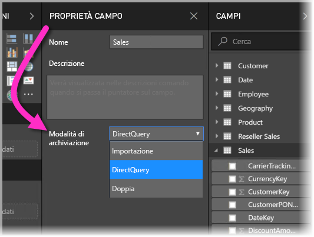
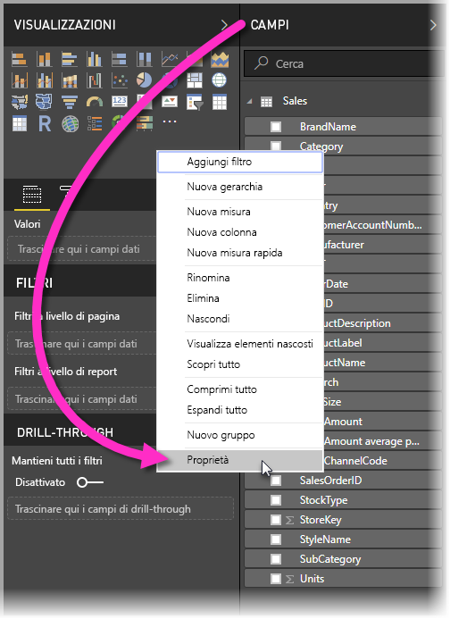
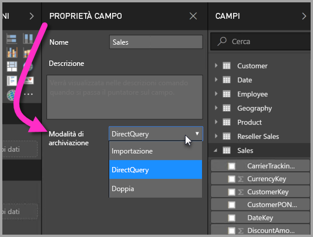
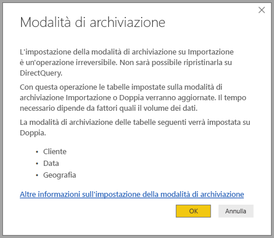

# Modalità di archiviazione in Power BI Desktop

In Microsoft Power BI Desktop è possibile specificare la *modalità di archiviazione* delle tabelle. La *modalità di archiviazione* consente di controllare se Power BI Desktop memorizza i dati delle tabelle nella cache in memoria per i report. 

L'impostazione della modalità di archiviazione offre numerosi vantaggi. È possibile impostare la modalità di archiviazione per ogni tabella singolarmente nel modello. Questa azione abilita un singolo set di dati, che offre i vantaggi seguenti:

* **Prestazioni delle query**: quando gli utenti interagiscono con gli oggetti visivi nei report di Power BI, vengono inviate query DAX (Data Analysis Expressions) al set di dati. La memorizzazione dei dati nella cache in memoria tramite l'impostazione corretta della modalità di archiviazione può migliorare le prestazioni delle query e l'interattività dei report.

* **Set di dati di grandi dimensioni**: le tabelle che non vengono memorizzate nella cache non utilizzano memoria per la memorizzazione nella cache. È possibile abilitare l'analisi interattiva su set di dati estesi, troppo grandi o onerosi per essere memorizzati completamente nella cache in memoria. È possibile scegliere le tabelle che vale o meno la pena di memorizzare nella cache.

* **Ottimizzazione dell'aggiornamento dei dati**: le tabelle che non vengono memorizzate nella cache non devono essere aggiornate. È possibile ridurre i tempi di aggiornamento memorizzando nella cache solo i dati necessari per soddisfare i contratti di servizio e i requisiti aziendali.

* **Requisiti di accesso quasi in tempo reale**: le tabelle con requisiti di accesso quasi in tempo reale potrebbero trarre vantaggio dal non essere memorizzate nella cache, per ridurre la latenza dei dati.

* **Writeback**: il writeback consente agli utenti aziendali di sperimentare vari scenari di simulazione modificando i valori delle celle. Le applicazioni personalizzate possono applicare le modifiche all'origine dati. Le tabelle che non vengono memorizzate nella cache possono visualizzare le modifiche immediatamente, consentendo l'analisi istantanea degli effetti.

L'impostazione della modalità di archiviazione in Power BI Desktop corrisponde a una di tre funzionalità correlate:

* **Modelli compositi**: consente a un report di avere due o più connessioni dati, tra cui connessioni DirectQuery o importazione, in qualsiasi combinazione. Per altre informazioni, vedere [Modelli compositi in Power BI Desktop](desktop-composite-models.md).

* **Relazioni molti-a-molti**: con i *modelli compositi* è possibile stabilire *relazioni molti-a-molti* tra le tabelle. *Relazioni molti-a-molti* rimuove i requisiti per valori univoci nelle tabelle. Annulla anche le soluzioni alternative precedenti, ad esempio l'introduzione di nuove tabelle solo per stabilire relazioni. Per altre informazioni, vedere [Relazioni molti-a-molti in Power BI Desktop](desktop-many-to-many-relationships.md).

* **Modalità di archiviazione**: è ora possibile specificare gli oggetti visivi che richiedono una query per origini dati back-end. Quelli che non la richiedono vengono importati anche se basati su DirectQuery, con conseguente miglioramento delle prestazioni e riduzione del carico per il back-end. In precedenza, anche oggetti visivi semplici, come i filtri dei dati, attivavano query che venivano inviate alle origini di back-end. La modalità di archiviazione è descritta più dettagliatamente in questo articolo.

## Usare la proprietà modalità di archiviazione

La modalità di archiviazione è una proprietà che è possibile impostare per ogni tabella nel modello. Per impostare la modalità di archiviazione, nel riquadro **Campi** fare clic con il pulsante destro del mouse sulla tabella di cui si vogliono impostare le proprietà e quindi scegliere **Proprietà**.

La proprietà corrente viene visualizzata nell'elenco a discesa **Modalità di archiviazione** nel riquadro **Proprietà campo** della tabella. Da qui è possibile visualizzare la modalità di archiviazione corrente o modificarla.

Esistono tre valori per la modalità di archiviazione:

* **Importa**: quando il valore è impostato su **Importa**, le tabelle importate vengono memorizzate nella cache. Le query inviate al set di dati di Power BI che restituiscono dati dalle tabelle importate possono essere soddisfatte solo dai dati memorizzati nella cache.

* **DirectQuery**: con questa impostazione, le tabelle DirectQuery non vengono memorizzate nella cache. Le query inviate al set di dati di Power BI, ad esempio le query DAX (Data Analysis Expressions), e che restituiscono dati dalle tabelle in modalità DirectQuery possono essere soddisfatte solo mediante l'esecuzione di query su richiesta sull'origine dati. Le query inviate all'origine dati usano il linguaggio di query per l'origine dati, ad esempio SQL.

* **Doppia**: le tabelle con questa impostazione possono essere o meno memorizzate nella cache, a seconda del contesto della query inviata al set di dati di Power BI. In alcuni casi, le query possono essere soddisfatte con i dati memorizzati nella cache. In altri casi, per soddisfare le query occorre eseguire una query su richiesta sull'origine dati.

L'impostazione di una tabella su **Importa** è un'operazione *irreversibile*. Non è possibile modificare questa proprietà impostandola su DirectQuery o Doppia.

## Vincoli delle impostazioni DirectQuery e Doppia per le tabelle

Le tabelle Dual hanno gli stessi vincoli funzionali delle tabelle DirectQuery, incluse trasformazioni M limitate e funzioni DAX con restrizioni nelle colonne calcolate. Per altre informazioni, vedere [Implicazioni dell'uso di DirectQuery](desktop-directquery-about.md#implications-of-using-directquery).

## Propagazione di Doppia
Si consideri il modello semplice seguente, in cui tutte le tabelle provengono da un'origine singola che supporta le impostazioni Importa e DirectQuery.

Per iniziare, si supponga che tutte le tabelle in questo modello siano di tipo DirectQuery. Se si modifica la **modalità di archiviazione** della tabella *SurveyResponse* impostando Importa, viene visualizzata la finestra di avviso seguente:

Le tabelle delle dimensioni (*Customer*, *Geography* e *Date*) possono essere impostate su **Dual** per ridurre il numero di relazioni deboli nel set di dati e migliorare le prestazioni. Le relazioni deboli implicano in genere almeno una tabella DirectQuery in cui non è possibile effettuare il push della logica di join nei sistemi di origine. Il fatto che le tabelle **Dual** possano fungere da DirectQuery o Import consente di evitare questo problema.

La logica di propagazione è progettata per agevolare l'uso di modelli contenenti molte tabelle. Si supponga di avere un modello con 50 tabelle e che solo determinate tabelle dei fatti (transazionali) debbano essere memorizzata nella cache. La logica in Power BI Desktop calcola il set minimo di tabelle delle dimensioni che devono essere impostate su **Doppia**, quindi non è necessario procedere manualmente.

La logica di propagazione attraversa solo un lato delle relazioni **uno-a-molti**.

## Esempio di utilizzo della modalità di archiviazione
È possibile continuare con l'esempio nella sezione precedente e immaginare di applicare le impostazioni della proprietà Modalità di archiviazione seguenti:

| Tabella                   | Modalità di archiviazione         |
| ----------------------- |----------------------| 
| *Sales*                 | DirectQuery          | 
| *SurveyResponse*        | Importa               | 
| *Date*                  | Doppia                 | 
| *Customer*              | Doppia                 | 
| *Geography*             | Doppia                 | 

L'impostazione di queste proprietà della modalità di archiviazione determina i comportamenti seguenti, supponendo che la tabella *Sales* includa un volume di dati significativo.
* Power BI Desktop memorizza nella cache le tabelle delle dimensioni (*Date*, *Customer* e *Geography*), quindi i tempi di caricamento dei report iniziali dovrebbero essere veloci quando si recuperano i valori di filtro dei dati da visualizzare.
* Se non si memorizza nella cache la tabella *Sales*, Power BI Desktop fornisce i risultati seguenti:
    * I tempi di aggiornamento dei dati risultano migliorati e si riduce il consumo di memoria.
    * Le query dei report basate sulla tabella *Sales* vengono eseguite in modalità DirectQuery. Queste query potrebbero richiedere più tempo, ma offrono risultati più in tempo reale perché non viene introdotta alcuna latenza per la memorizzazione nella cache.

* Le query dei report basate sulla tabella *SurveyResponse* vengono restituite dalla cache in memoria e pertanto dovrebbero essere relativamente veloci.

## Query con o senza riscontri nella cache

Connettendo **SQL Profiler** alla porta di diagnostica per Power BI Desktop, è possibile visualizzare le query con o senza riscontri nella cache in memoria eseguendo una traccia basata sugli eventi seguenti:

* Queries Events\Query Begin
* Query Processing\Vertipaq SE Query Begin
* Query Processing\DirectQuery Begin

Per ogni evento *Query Begin*, controllare altri eventi con lo stesso *ActivityID*. Ad esempio, se non è presente alcun evento *DirectQuery Begin*, ma esiste un evento *Vertipaq SE Query Begin*, la query è stata risposta dalla cache.

Le query che fanno riferimento a tabelle in modalità **Doppia** restituiscono dati dalla cache, se possibile. In caso contrario, viene usata la modalità DirectQuery.

Proseguendo con l'esempio precedente, la query seguente fa riferimento solo a una colonna dalla tabella *Date*, in modalità **Doppia**. La query dovrebbe pertanto ottenere un riscontro positivo dalla cache.

La query seguente fa riferimento solo a una colonna dalla tabella *Sales*, in modalità **DirectQuery**. Pertanto, *non* dovrebbe trovare riscontri nella cache.

La query seguente è interessante perché combina entrambe le colonne. Questa query non ottiene un riscontro positivo dalla cache. Si potrebbe inizialmente prevedere di recuperare i valori *CalendarYear* dalla cache e i valori *SalesAmount* dall'origine e quindi combinare i risultati, ma questo approccio sarebbe meno efficiente rispetto all'invio dell'operazione SUM/GROUP BY al sistema di origine. Se viene eseguito il push dell'operazione all'origine, il numero di righe restituite sarà probabilmente molto inferiore. 

> [!NOTE]
> Questo comportamento è diverso dalle [relazioni molti-a-molti in Power BI Desktop](desktop-many-to-many-relationships.md) quando le tabelle memorizzate nella cache e non memorizzate nella cache sono combinate.

## Le cache devono essere mantenute sincronizzate

Le query visualizzate nella sezione precedente mostrano che le tabella in modalità **Doppia** talvolta trovano riscontri nella cache e a volte non li trovano. Per questo motivo, se la cache non è aggiornata possono essere restituiti valori diversi. L'esecuzione di query non tenterà di mascherare problemi dei dati, ad esempio filtrando i risultati di DirectQuery in modo che corrispondano ai valori memorizzati nella cache. È responsabilità dell'utente conoscere i flussi di dati e progettare il sistema di conseguenza. Esistono tecniche consolidate per gestire questi casi nell'origine, se necessario.

La modalità di archiviazione *Doppia* è un'ottimizzazione delle prestazioni. Deve essere usata solo in modi che non compromettono la possibilità di soddisfare i requisiti aziendali. Per un comportamento alternativo, prendere in considerazione le tecniche descritte nell'articolo [Relazioni molti-a-molti in Power BI Desktop](desktop-many-to-many-relationships.md).

## Vista dati
Se per almeno una tabella nel set di dati la modalità di archiviazione è impostata su **Importa** o **Doppia**, viene visualizzata la scheda **Vista dati**.

Se selezionate in **Vista dati**, le tabelle in modalità **Doppia** e **Importa** mostrano i dati memorizzati nella cache. Le tabelle in modalità DirectQuery non mostrano dati e viene visualizzato un messaggio che indica che non è possibile visualizzare tabelle DirectQuery.

## Limitazioni e considerazioni

Esistono alcune limitazioni per questa versione della modalità di archiviazione e la relativa correlazione con i modelli compositi.

Non è possibile usare modelli compositi con le origini Live Connect (multidimensionali) seguenti:

* SAP HANA
* SAP Business Warehouse
* SQL Server Analysis Services
* Set di dati Power BI
* Azure Analysis Services

Quando ci si connette a tali origini multidimensionali tramite DirectQuery, non è possibile connettersi a un'altra origine DirectQuery o attuare combinazioni con dati importati.

Le limitazioni esistenti per l'uso di DirectQuery sono valide anche quando si usano i modelli compositi. Molte di queste limitazioni si riferiscono attualmente a ogni singola tabella, a seconda della modalità di archiviazione della tabella. Ad esempio, una colonna calcolata per una tabella importata può fare riferimento ad altre tabelle, ma una colonna calcolata per una tabella di DirectQuery è ancora limitata e può fare riferimento solo alle colonne nella stessa tabella. Altre limitazioni si applicano al modello nel suo complesso, se una qualsiasi delle tabelle all'interno del modello è in modalità DirectQuery. Ad esempio, le funzionalità Informazioni rapide e Domande e risposte non sono disponibili per un modello se per una delle tabelle all'interno di esso è impostata la modalità di archiviazione DirectQuery. 

## Passaggi successivi

Per altre informazioni sui modelli compositi e DirectQuery, vedere gli articoli seguenti:
* [Modelli compositi in Power BI Desktop](desktop-composite-models.md)
* [Relazioni molti-a-molti in Power BI Desktop](desktop-many-to-many-relationships.md)
* [Uso di DirectQuery in Power BI](desktop-directquery-about.md)
* [Origini dati supportate da DirectQuery in Power BI](desktop-directquery-data-sources.md)
