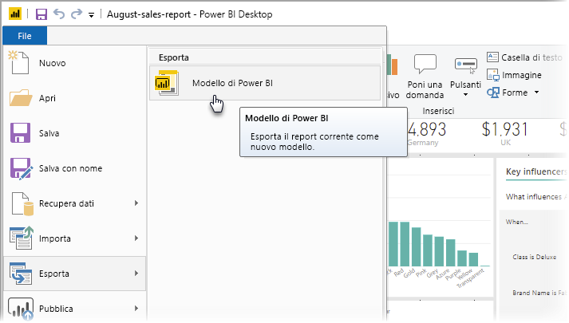
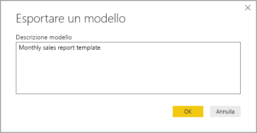
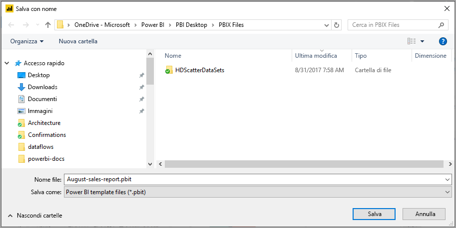
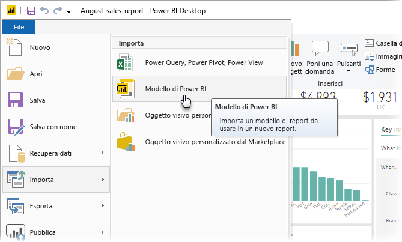
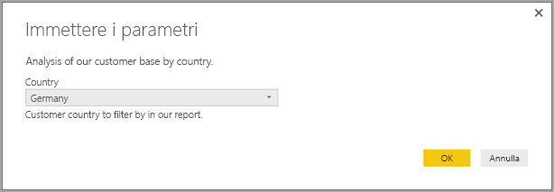
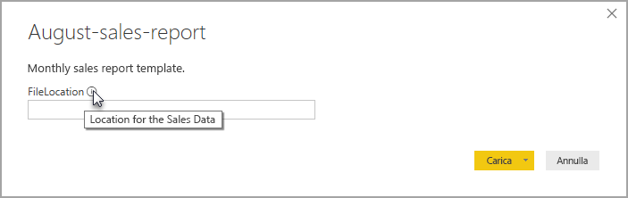

# Creare modelli di report per Power BI Desktop

**Power BI Desktop** consente di creare report accattivanti per la condivisione di informazioni dettagliate nell'ambito dell'intera organizzazione. Con i **modelli** di Power BI Desktop è possibile semplificare il lavoro creando un modello di report in base a uno già esistente, che può essere usato dall'autore o da altri utenti dell'organizzazione come punto di partenza per il layout, il modello di dati e le query di un nuovo report. Usando i modelli in **Power BI Desktop** è possibile iniziare subito a creare report e standardizzare questo processo di creazione.

## Creazione di modelli

I modelli di report di Power BI contengono le informazioni seguenti del report da cui sono stati generati:

* **Pagine**, oggetti visivi e altri elementi grafici del report
* **Definizione del modello di dati**, inclusi lo schema, le relazioni, le misure e altri artefatti
* Tutte le **definizioni di query**, ad esempio query, parametri e altri elementi di query

Gli unici elementi *non* inclusi nei modelli sono i dati del report. 

Nei modelli di report si usa l'estensione pbit, a differenza dei report di Power BI Desktop che usano l'estensione pbix. 

Per creare un modello di report, selezionare **File > Esporta > Modello di Power BI** dal menu. Viene così visualizzata la finestra seguente, in cui viene chiesto di specificare una descrizione per il modello. In questo esempio, la descrizione del modello è *Monthly sales report template.*

Selezionare **OK**. Viene chiesto di specificare un percorso in cui archiviare il file del modello con estensione pbit.

A questo punto l'operazione è completata. Il modello di report di Power BI viene creato nel percorso di file specificato, con l'estensione pbit.

> [!NOTE]
> I file dei modelli di report di Power BI sono in genere molto più piccoli rispetto a un report di Power BI Desktop, perché non contengono i dati, ma solo le definizioni del report. 

## Uso dei modelli

Per usare un modello di report di Power BI, è sufficiente aprirlo in Power BI Desktop e iniziare a usarlo. È possibile aprire i modelli di report di Power BI in due modi:

* Fare doppio clic su qualsiasi file con estensione pbit per avviare automaticamente Power BI Desktop e caricare il modello
* Selezionare **File > Importa > Modello di Power BI** da Power BI Desktop

Quando si apre un modello di report, viene visualizzata una finestra di dialogo per tutti i parametri definiti nel report su cui si basa il modello. Se, ad esempio, un report analizza i clienti in base al paese o all'area geografica e ha un parametro *Country* per specificare la base clienti, viene visualizzato un messaggio in cui viene chiesto di selezionare un valore per *Country* dall'elenco di valori specificati durante la definizione del parametro. 

Dopo che sono stati specificati i parametri obbligatori, viene chiesto di indicare il percorso dei dati sottostanti associati al report. L'autore del report corrente può quindi connettersi ai dati in base alle relative credenziali.

Dopo che sono stati specificati i parametri e i dati, viene creato un report contenente tutte le pagine, gli oggetti visivi, gli artefatti del modello di dati e le query che facevano parte del report su cui si basa il modello. 

Questo è tutto. In Power BI Desktop è possibile creare e usare con facilità modelli di report e quindi riprodurre facilmente layout accattivanti e altri aspetti dei report e condividerli con altri utenti.

## Passaggi successivi
Potrebbe anche essere interessante scoprire di più sui **parametri di query**:
* [Uso dei parametri di query in Power BI Desktop](https://docs.microsoft.com/power-query/power-query-query-parameters)

Power BI Desktop offre inoltre molte altre possibilità. Per altre informazioni sulle capacità disponibili, vedere le risorse seguenti:

* [Che cos'è Power BI Desktop?](desktop-what-is-desktop.md)
* [Panoramica delle query con Power BI Desktop](desktop-query-overview.md)
* [Tipi di dati in Power BI Desktop](desktop-data-types.md)
* [Effettuare il data shaping e combinare i dati con Power BI Desktop](desktop-shape-and-combine-data.md)
* [Attività di query comuni in Power BI Desktop](desktop-common-query-tasks.md)    
