# Creare descrizioni comando basate sulle pagine del report in Power BI Desktop
È possibile creare **descrizioni comando** graficamente avanzate che appaiono quando si passa il mouse sugli oggetti visivi, in base alle pagine del report create in **Power BI Desktop**. Creando una pagina del report che funge da descrizione comando, le descrizioni comando personalizzate possono includere oggetti visivi, immagini e qualsiasi altra raccolta di elementi creati nella pagina del report. 

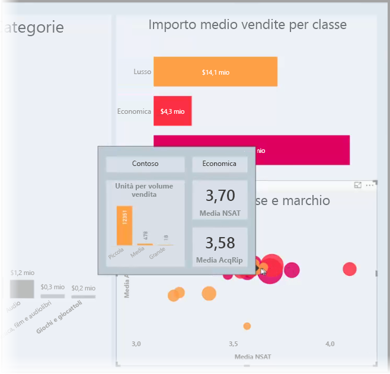

È possibile creare qualsiasi numero di pagine di descrizione comando. Ogni pagina di descrizione comando può essere associata a uno o più campi del report, in modo che quando si passa il mouse su un oggetto visivo che include il campo selezionato, la descrizione comando creata nella pagina di descrizione comando venga visualizzata quando si passa il mouse sull'oggetto visivo, filtrata in base al punto dati su cui è posizionato il puntatore del mouse. 

Con le descrizioni comando dei report è possibile effettuare diverse operazioni. Di seguito vengono descritte le procedure per la creazione delle descrizioni comando e per la loro configurazione.

## Creare una pagina di descrizione comando del report
Per iniziare, creare una nuova pagina del report facendo clic sul pulsante **+**, disponibile nella parte inferiore dell'area di disegno di **Power BI Desktop**, nell'area delle schede della pagina. Il pulsante si trova accanto all'ultima pagina del report. 

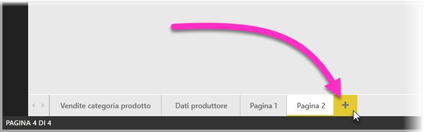

La descrizione comando può avere qualsiasi dimensione, ma occorre tenere presente che viene visualizzata al passaggio del mouse sull'area di disegno del report, quindi è opportuno per mantenere le dimensioni relativamente ridotte. Nel riquadro **Formato** della scheda **Dimensioni pagina** è possibile visualizzare un nuovo modello di dimensioni di pagina denominato *Descrizione comando*. In questo modo è disponibile una dimensione dell'area di disegno della pagina del report che può essere usata per la descrizione comando.

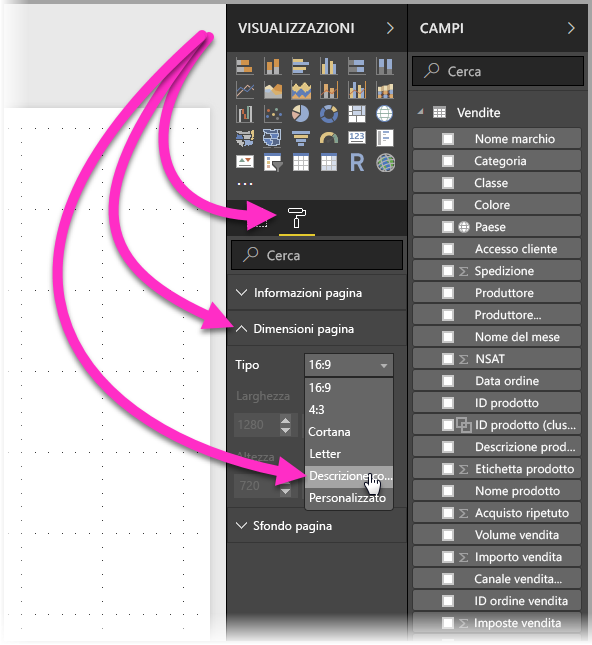

Per impostazione predefinita **Power BI Desktop** adatta l'area di disegno del report allo spazio disponibile nella pagina. Spesso l'operazione funziona, ma non nel caso delle descrizioni comando. Per avere un'idea più precisa dell'aspetto che avrà al termine la descrizione comando, è possibile impostare **Visualizzazione pagina** sulle dimensioni effettive. 

A tale scopo, selezionare la scheda **Visualizzazione** dalla barra multifunzione. Da qui, selezionare **Visualizzazione pagina > Dimensioni effettive**, come illustrato nell'immagine seguente.

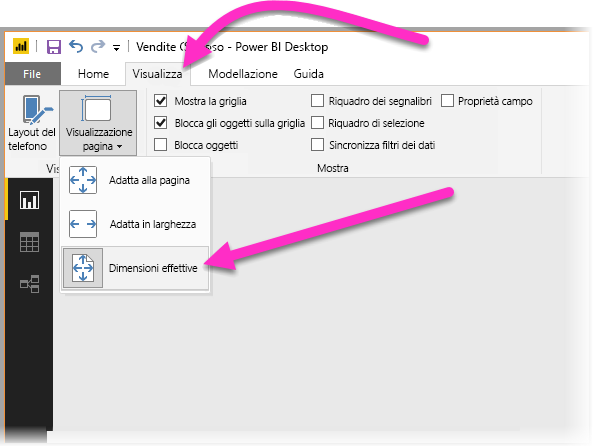

È anche possibile denominare la pagina del report in modo che il suo scopo sia chiaro. Basta selezionare la scheda **Informazioni pagina** nel riquadro **Formato**, quindi digitare il nome nel campo **Nome** visualizzato. Nella figura seguente il nome del report di descrizione comando è *Tooltip 1*, ma è possibile assegnare qualsiasi nome.

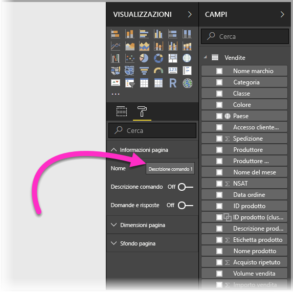

Da qui è possibile creare tutti gli oggetti visivi da visualizzare nella descrizione comando. La figura seguente illustra due schede e un grafico a barre raggruppate nella pagina di descrizione comando, insieme a un colore di sfondo per la pagina stessa e gli sfondi per ognuno degli oggetti visivi, da usare per ottenere un determinato aspetto.

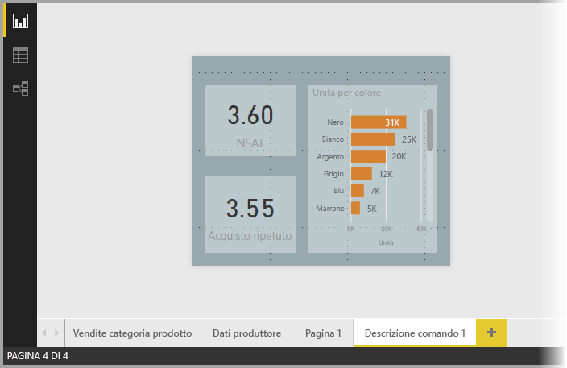

Esistono altre azioni da completare prima che la pagina del report di descrizione comando sia pronta per funzionare come descrizione comando. È necessario configurare la pagina di descrizione comando in diversi modi, come descritto nella sezione successiva. 

## Configurare la pagina del report di descrizione comando

Dopo aver creato la pagina del report di descrizione comando, è necessario configurare la pagina affinché **Power BI Desktop** la registri come descrizione comando e per assicurarsi che venga visualizzata in corrispondenza degli oggetti visivi corretti.

Per iniziare, è necessario posizionare il dispositivo di scorrimento **Descrizione comando** su **Attivato** nella scheda **Informazioni pagina** per rendere la pagina una descrizione comando. 

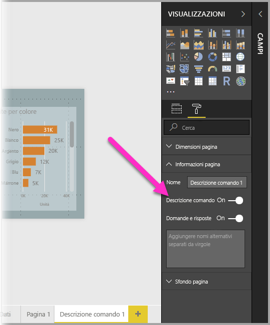

Quando il dispositivo di scorrimento è impostato su Attivato, specificare i campi per cui dovrà essere visualizzata la descrizione comando del report. La descrizione comando verrà visualizzata per gli oggetti visivi del report che includono il campo specificato. Per specificare il campo o i campi da usare, trascinarli nel bucket **Campi della descrizione comando**, disponibile nella sezione **Campi** del riquadro **Visualizzazioni**. Nella figura seguente il campo *SalesAmount* è stato trascinato nel bucket **Campi della descrizione comando**.

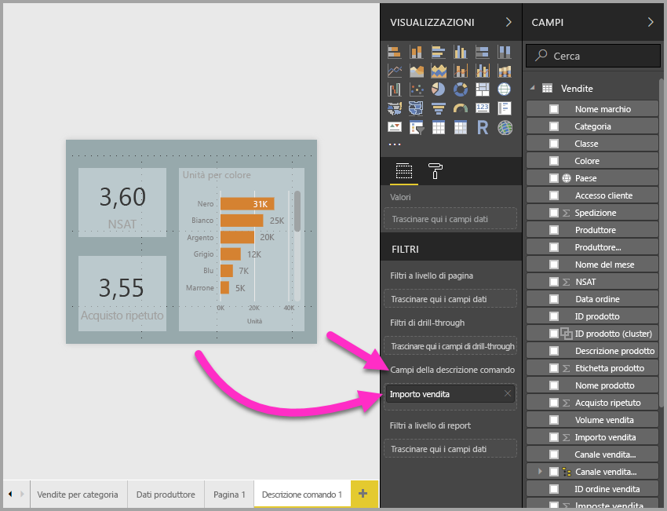
 
Nel bucket **Campi delle descrizioni comando** è possibile inserire campi sia categorici che numerici, incluse le misure.

Al termine, la pagina del report di descrizione comando così creata verrà usata come descrizione comando negli oggetti visivi del report che usano i campi inseriti nel bucket **Campi della descrizione comando**, sostituendo la descrizione comando predefinita di Power BI.

## Impostazione manuale di una descrizione comando del report

Oltre a creare una descrizione comando che appare automaticamente quando si passa il mouse sopra un oggetto visivo che contiene il campo specificato, è possibile impostare manualmente una descrizione comando. 

Per ogni oggetto visivo che supporta le descrizioni comando del report ora è disponibile una scheda **Descrizione comando** nel riquadro **Formattazione**. 

Per impostare manualmente una descrizione comando, selezionare l'oggetto visivo per il quale si vuole specificare la descrizione comando manuale, quindi nel riquadro **Visualizzazioni** selezionare la sezione **Formato** ed espandere la scheda **Descrizione comando**.

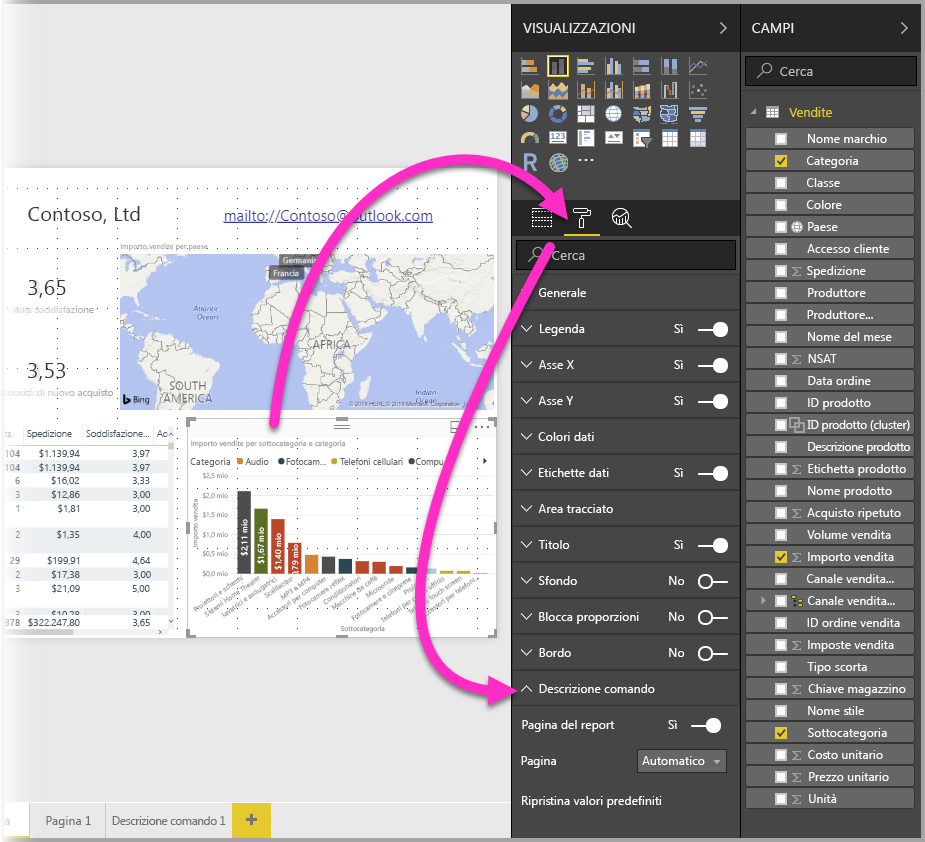

Nell'elenco a discesa **Pagina** selezionare la pagina di descrizione comando da usare per l'oggetto visivo selezionato. Si noti che solo le pagine del report specificate come pagine **Descrizione comando** appaiono nella finestra di dialogo.

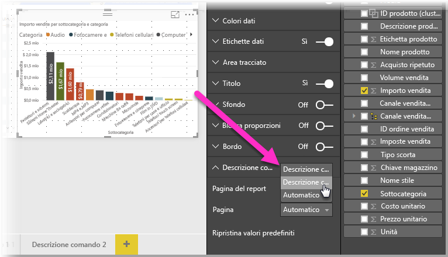

La possibilità di impostare manualmente una descrizione comando offre diverse opzioni. È possibile impostare una pagina vuota per una descrizione comando ignorando in questo modo la selezione predefinita della descrizione comando di Power BI. Un altro uso consiste nel rifiutare la descrizione comando automaticamente selezionata da Power BI come descrizione comando. Se, ad esempio, un oggetto visivo include due campi e ad entrambi i campi è associata una descrizione comando, Power BI ne seleziona solo uno da visualizzare. Poiché probabilmente non è il risultato che si vuole ottenere, è possibile selezionare manualmente la descrizione comando da visualizzare.

## Ripristino delle descrizioni comando predefinite

Se si crea una descrizione comando manuale per un oggetto visivo, ma si decide di usare la descrizione comando predefinita, è sempre possibile tornare alla descrizione comando predefinita offerta da Power BI. A tale scopo, quando si seleziona un oggetto visivo e la scheda **Descrizione comando** viene espansa, è sufficiente selezionare *Automatico* dall'elenco a discesa **Pagina** per tornare all'impostazione predefinita.

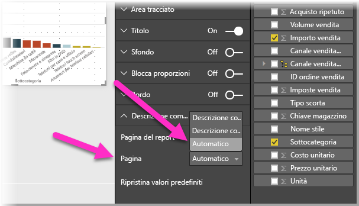

## Descrizioni comando e grafici a linee personalizzati del report

Occorre tenere presenti alcune considerazioni quando le descrizioni comando del report interagiscono con gli oggetti visivi dei grafici a linee e con gli oggetti visivi in caso di evidenziazione incrociata.

### Descrizioni comando e grafici a linee del report

Quando viene visualizzata una descrizione comando del report per un grafico a linee, appare una sola descrizione comando per tutte le linee del grafico. Questo comportamento è simile a quello della descrizione comando predefinita per i grafici a linee, per cui viene visualizzata una sola descrizione comando. 

Questo avviene perché il campo nella legenda non viene passato come filtro per la descrizione comando. Nella figura seguente la descrizione comando visualizzata specifica tutte le unità vendute in quel giorno per tutte e tre le classi visualizzate nella descrizione comando del report (in questo esempio, Deluxe, Economy e Regular). 

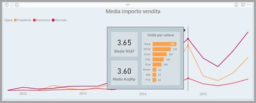

### Descrizioni comando ed evidenziazione incrociata nel report

Quando un oggetto visivo viene evidenziato in modo incrociato in un report, le descrizioni comando del report visualizzano sempre i dati evidenziati in modo incrociato, anche se si passa il mouse sopra la sezione in dissolvenza del punto dati. Nella figura seguente il mouse passa sopra la sezione in dissolvenza, ovvero quella non evidenziata, del grafico a barre, ma la descrizione comando del report continua a visualizzare i dati relativi alla parte evidenziata del punto dati (i dati evidenziati).

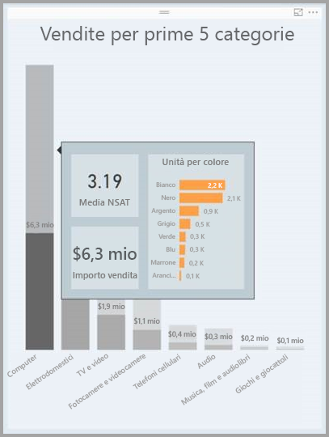

## Limitazioni e considerazioni
Occorre tenere presenti alcune limitazioni e considerazioni relative alle **descrizioni comando**.

* A partire dalla versione di dicembre 2018 di **Power BI Desktop**, anche gli oggetti visivi dei pulsanti supportano le descrizioni comando.
* Le descrizioni comando dei report non sono supportate per i report visualizzati con app per dispositivi mobili. 
* Le descrizioni comando dei report non sono supportate per gli oggetti visivi personalizzati. 
* I cluster non sono attualmente supportati come i campi che possono essere visualizzati nelle descrizioni comando dei report. 
* Quando si sceglie un campo da visualizzare per le descrizioni comando del report, se si usa un campo rispetto a una categoria, gli oggetti visivi che contengono tale campo visualizzano la descrizione comando specificata solo quando il riepilogo con il campo selezionato corrisponde. 

## Passaggi successivi
Per altre informazioni su funzionalità simili o che interagiscono con le descrizioni comando dei report, vedere gli articoli seguenti:

* [Usare il drill-through in Power BI Desktop](desktop-drillthrough.md)
* [Visualizzare un riquadro del dashboard o un oggetto visivo di un report in modalità messa a fuoco](consumer/end-user-focus.md)

