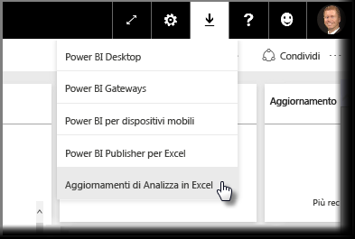
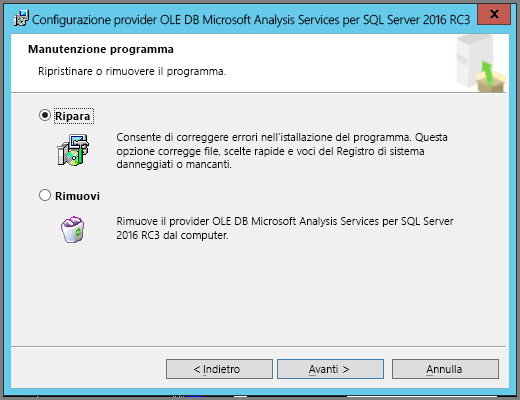
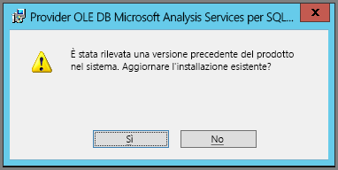

# Risoluzione dei problemi di Analizza in Excel
Quando si usa Analizza in Excel, a volte si ottiene un risultato imprevisto oppure la funzionalità non funziona correttamente. Questa pagina offre soluzioni per problemi comuni nell'uso di Analizza in Excel.

> [!NOTE]
> È disponibile una pagina separata per la descrizione e l'abilitazione di [Analizza in Excel](service-analyze-in-excel.md).
> 
> Se si verifica uno scenario diverso da quelli elencati di seguito e che causa problemi, è possibile richiedere ulteriore assistenza sul [sito della community](http://community.powerbi.com/) oppure creare un [ticket di supporto](https://powerbi.microsoft.com/support/).
> 
> 

Questo articolo contiene le sezioni seguenti per la risoluzione dei problemi:

* Aggiornare le librerie di Excel per il provider OLE DB
* Determinare se è necessario aggiornare le librerie di Excel
* Errore Impossibile stabilire la connessione
* Errore Non consentito
* Modello di dati mancante
* Errore di token scaduto
* Non è possibile accedere ad Analysis Services locale
* Impossibile trascinare elementi nell'area Valori della tabella pivot (nessuna misura)

## Aggiornare le librerie di Excel per il provider OLE DB
Per usare **Analizza in Excel**, il computer deve avere un provider OLE DB AS corrente installato. Questo [post della community](http://community.powerbi.com/t5/Service/Analyze-in-Excel-Initialization-of-the-data-source-failed/m-p/30837#M8081) è un'ottima fonte per verificare l'installazione del provider OLE DB o per scaricare una versione recente.

Le librerie di Excel devono corrispondere alla versione di Windows in termini di livello di bit. Se si usa Windows a 64 bit è necessario installare il provider OLE DB a 64 bit.

Per scaricare le librerie più recenti di Excel, visitare Power BI e selezionare la **freccia a discesa** nell'angolo superiore destro del servizio Power BI, quindi selezionare **Aggiornamenti di Analizza in Excel**.

Nella finestra di dialogo visualizzata selezionare **Scarica (anteprima)**.

## Determinare se è necessario aggiornare le librerie di Excel
È possibile scaricare la versione più recente delle librerie del provider OLE DB di Excel dai collegamenti indicati nella sezione precedente. Quando si scarica la libreria del provider OLE DB e si avvia l'installazione, vengono eseguite verifiche sulla versione corrente installata.

Se le librerie client del provider OLE DB di Excel sono aggiornate, verrà visualizzata una finestra di dialogo simile alla seguente:

C:\Users\davidi\Desktop\powerbi-content-pr\articles\media\powerbi-desktop-troubleshooting-analyze-in-excel

Se invece la versione in fase di installazione è più recente della versione presente nel computer, verrà visualizzata la finestra di dialogo seguente:

Se viene visualizzata la finestra di dialogo che chiede di eseguire l'aggiornamento, continuare con l'installazione per ottenere la versione più recente del provider OLE DB.

## Errore Impossibile stabilire la connessione
La causa principale dell'errore *Impossibile stabilire la connessione* è che le librerie client di provider OLE DB del computer non sono aggiornate. Per informazioni su come determinare il corretto aggiornamento e per i collegamenti di download, vedere **Aggiornare le librerie di Excel per il provider OLE DB** in precedenza in questo articolo.

## Errore Non consentito
Alcuni utenti hanno più di un account Power BI e quando Excel prova a connettersi a Power BI con le credenziali esistenti potrebbero essere usate credenziali che non hanno accesso al set di dati o al report di interesse.

In questo caso potrebbe essere visualizzato un errore con titolo **Non consentito**, che indica che l'accesso a Power BI è stato probabilmente eseguito con credenziali che non hanno autorizzazioni per il set di dati. Dopo aver rilevato un errore **Non consentito**, quando viene richiesto di immettere le credenziali usare quelle con autorizzazione ad accedere al set di dati da usare.

Se si verificano ancora errori, accedere a Power BI con l'account che ha l'autorizzazione e verificare che in Power BI sia possibile visualizzare e accedere ai set di dati cui si prova ad accedere in Excel.

## Modello di dati mancante
Se si verifica un errore che indica **Can't find OLAP cube model** (Impossibile trovare modello di cubo OLAP), il set di dati cui si vuole accedere non ha un modello di dati e di conseguenza non può essere analizzato in Excel.

## Errore di token scaduto
Se viene visualizzato un errore di **token scaduto**, la funzionalità **Analizza in Excel** non è stata usata di recente nel computer. È sufficiente immettere nuovamente le credenziali o riaprire il file e l'errore non verrà più visualizzato.

## Non è possibile accedere ad Analysis Services locale
Se si prova ad accedere a un set di dati con connessioni ai dati di Analysis Services locale si può ricevere un messaggi di errore. **Analizza in Excel** supporta la connessione a set di dati e report in **Analysis Services** locale con una stringa di connessione, purché il computer si trovi nello stesso dominio del server di **Analysis Services** e che l'account abbia accesso a tale server di **Analysis Services**.

## Impossibile trascinare elementi nell'area Valori della tabella pivot (nessuna misura)
Quando **Analizza in Excel** si connette a un modello OLAP esterno (ovvero la modalità di connessione di Excel a Power BI), la *tabella pivot* [richiede **misure** da definire nel modello esterno](https://support.microsoft.com/kb/234700), poiché tutti i calcoli vengono eseguiti nel server. Questo comportamento è diverso rispetto a quando si lavora con un'origine dati locale (ad esempio le tabelle in Excel, o quando si lavora con set di dati in **Power BI Desktop** o **Servizio Power BI**), nel qual caso il modello tabulare è disponibile in locale ed [è possibile utilizzare le misure implicite](https://msdn.microsoft.com/library/gg399077.aspx), ovvero misure che vengono generate in modo dinamico e non sono archiviate nel modello di dati. In questi casi, il comportamento in Excel è diverso da quello in **Power BI Desktop** o **Servizio Power BI**: alcune colonne nei dati potrebbero essere considerate come misure in Power BI, ma non possono essere usate come valori (misure) in Excel.

Per risolvere questo problema, ci sono alcune opzioni:

1. Creare le [misure nel modello di dati in **Power BI Desktop**](desktop-tutorial-create-measures.md), quindi pubblicare il modello di dati per il **Servizio Power BI** e accedere al set di dati pubblicato da Excel.
2. Creare [misure nel modello di dati da PowerPivot per Excel](https://support.office.com/article/Create-a-Measure-in-Power-Pivot-d3cc1495-b4e5-48e7-ba98-163022a71198).
3. Se si importano dati da una cartella di lavoro di Excel contenente solo tabelle (e nessun modello di dati), [aggiungere le tabelle al modello di dati](https://support.office.com/article/Add-worksheet-data-to-a-Data-Model-using-a-linked-table-d3665fc3-99b0-479d-ba09-a37640f5be42), quindi seguire i passaggi nell'opzione 2 qui sopra per creare misure nel modello di dati.

Dopo aver definito le misure nel modello di Servizio Power BI, sarà possibile usarle nell'area **Valori** delle tabelle pivot di Excel.

## Passaggi successivi
[Analizza in Excel](service-analyze-in-excel.md)

[Esercitazione: Creare misure personalizzate in Power BI Desktop](desktop-tutorial-create-measures.md)

[Misure in PowerPivot](https://msdn.microsoft.com/library/gg399077.aspx)

[Creare una misura in PowerPivot](https://support.office.com/article/Create-a-Measure-in-Power-Pivot-d3cc1495-b4e5-48e7-ba98-163022a71198)

[Aggiungere i dati di un foglio di lavoro a un modello di dati usando una tabella collegata](https://support.office.com/article/Add-worksheet-data-to-a-Data-Model-using-a-linked-table-d3665fc3-99b0-479d-ba09-a37640f5be42)

[Differenze tra le tabelle pivot OLAP e non OLAP in Excel](https://support.microsoft.com/kb/234700)

