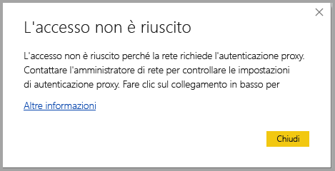
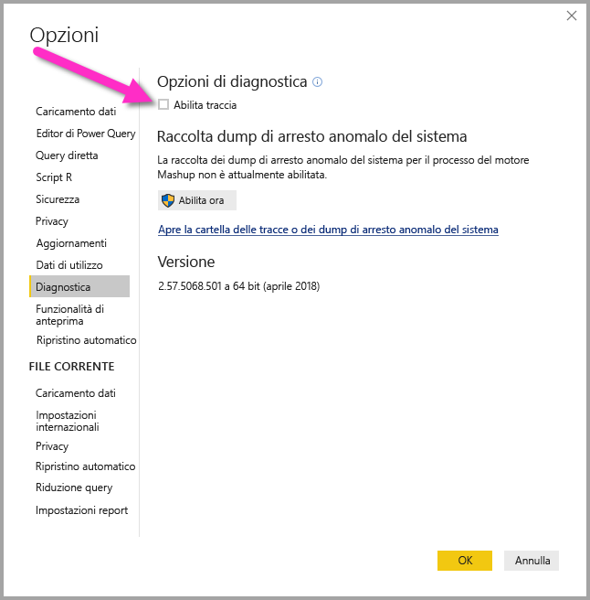

# Risoluzione dei problemi di accesso per Power BI Desktop
In alcuni casi possono verificarsi errori durante i tentativi di accesso a **Power BI Desktop**. Esistono due motivi principali per i problemi di accesso: **errori di autenticazione del proxy** ed **errori di reindirizzamento di URL non HTTPS**. 

Per determinare quale problema sta causando il problema di accesso, il primo passaggio consiste nel contattare l'amministratore e fornire le informazioni di diagnostica in modo che sia possibile stabilire la causa del problema. Tracciando i problemi associati al problema di accesso, gli amministratori possono determinare quale degli errori seguenti è applicabile. 

Verranno ora esaminati tutti questi problemi singolarmente. Alla fine di questo articolo sono disponibili indicazioni su come acquisire una *traccia* in Power BI Desktop, utile per risalire alle cause dei problemi.

## Errore Richiesta autenticazione proxy

La schermata seguente mostra un esempio dell'errore *Richiesta autenticazione proxy*.

Le eccezioni seguenti nei file di traccia di *Power BI Desktop* sono associate a questo errore:

* *Microsoft.PowerBI.Client.Windows.Services.PowerBIWebException*
* *HttpStatusCode: ProxyAuthenticationRequired*

Quando si verifica questo errore, il motivo più probabile è che un server di autenticazione proxy nella rete sta bloccando le richieste Web inviate da **Power BI Desktop**. 

Se la rete usa un server di autenticazione proxy, l'amministratore può risolvere questo problema aggiungendo i domini seguenti all'elenco degli elementi consentiti nel server di autenticazione proxy:

* app.powerbi.com
* api.powerbi.com
* domini nello spazio dei nomi *.analysis.windows.net

Per i clienti che fanno parte di un cloud per enti pubblici, è possibile risolvere il problema aggiungendo i domini seguenti nell'elenco degli elementi consentiti nel server di autenticazione proxy:

* app.powerbigov.us
* api.powerbigov.us
* domini nello spazio dei nomi *.analysis.usgovcloudapi.net

## Errore di reindirizzamento di URL non HTTPS non supportato

Le versioni correnti di **Power BI Desktop** usano la versione corrente di Active Directory Authentication Library (ADAL), che non consente un reindirizzamento a URL non protetti (non HTTPS). 

Le eccezioni seguenti nei file di traccia di *Power BI Desktop* sono associate a questo errore:

* *Microsoft.IdentityModel.Clients.ActiveDirectory.AdalServiceException: reindirizzamento di URL non HTTPS non supportato in WebView*
* *ErrorCode: non_https_redirect_failed*

Se si verifica l'errore *ErrorCode: non_https_redirect_failed*, significa che una o più pagine o provider di reindirizzamento nella catena di reindirizzamento non rappresentano un endpoint protetto HTTPS oppure che un'autorità di certificazione di uno o più reindirizzamenti non è inclusa tra le radici attendibili del dispositivo. Tutti i provider in qualsiasi catena di reindirizzamento dell'accesso devono usare un URL HTTPS. Per risolvere questo problema, contattare l'amministratore e richiedere l'uso di URL protetti per i relativi siti di autenticazione. 

## Come raccogliere una traccia in Power BI Desktop

Per raccogliere una traccia in **Power BI Desktop**, seguire questa procedura:

1. Abilitare la traccia in **Power BI Desktop**. A questo scopo, passare a **File > Opzioni e impostazioni > Opzioni** e quindi selezionare **Diagnostica** tra le opzioni nel riquadro sinistro. Nel riquadro visualizzato selezionare la casella di controllo accanto ad **Abilita traccia**, come illustrato nella figura seguente. Potrebbe essere necessario riavviare **Power BI Desktop**.
   
   

2. Seguire quindi i passaggi per riprodurre l'errore. Quando si verifica questo errore, **Power BI Desktop** aggiunge gli eventi nel log di traccia, mantenuto nel computer locale.

3. Passare alla cartella Traces nel computer locale. È possibile trovare tale cartella selezionando il collegamento in **Diagnostica** in cui è stata abilitata la traccia, visualizzato come *Apre la cartella delle tracce o dei dump di arresto anomalo del sistema* nell'immagine precedente. Questa cartella spesso si trova nel computer locale nel percorso seguente:

    `C:\Users/<user name>/AppData/Local/Microsoft/Power BI Desktop/Traces`

In tale cartella possono esistere molti file di traccia. Assicurarsi di inviare solo i file recenti all'amministratore per facilitare l'identificazione rapida dell'errore. 

