# Esercitazione: Combinare dati di vendita da Excel e da un feed OData

Succede spesso che i dati siano in più origini dati. Si potrebbero avere ad esempio due database, uno contenente informazioni sui prodotti e un altro con informazioni sulle vendite. Con **Power BI Desktop** è possibile combinare dati provenienti da origini diverse per creare analisi e visualizzazioni dei dati interessanti e stimolanti. 

In questa esercitazione vengono combinati i dati provenienti da due origini dati: 

1. Una cartella di lavoro di Excel con informazioni sui prodotti
2. Un feed OData contenente dati sugli ordini

Si importerà ogni set di dati ed eseguiranno operazioni di trasformazione e aggregazione. Si useranno poi i dati delle due origini dati per generare un report di analisi delle vendite con visualizzazioni interattive. Queste tecniche potranno essere anche applicate a query di SQL Server, file CSV e altre origini dati in Power BI Desktop.

>[!NOTE]
>Power BI Desktop offre in genere diversi modi per completare un'attività. È ad esempio possibile fare clic con il pulsante destro del mouse oppure usare il menu **Altre opzioni** in una colonna o in una cella per visualizzare selezioni di barre multifunzioni aggiuntive. Nei passaggi seguenti sono descritti diversi metodi alternativi. 

## Importare i dati sui prodotti da Excel

Per prima cosa, importare i dati sui prodotti dalla cartella di lavoro di Excel Products.xlsx in Power BI Desktop.

1. [Scaricare la cartella di lavoro di Excel Products.xlsx](https://download.microsoft.com/download/1/4/E/14EDED28-6C58-4055-A65C-23B4DA81C4DE/Products.xlsx) e salvarla come **Products.xlsx**.
   
2. Selezionare la freccia dell'elenco a discesa accanto a **Dati** nella scheda **Home** della barra multifunzione di Power BI Desktop, quindi selezionare **Excel** dall'elenco a discesa **Più comuni**. 
   
   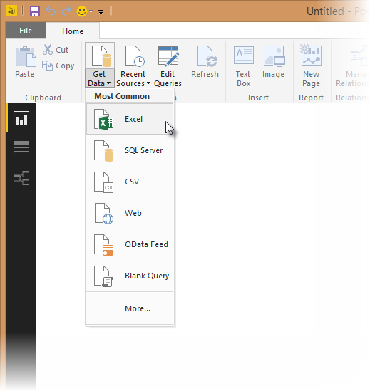
   
   >[!NOTE]
   >È possibile selezionare direttamente la voce **Dati** oppure selezionare **Recupera dati** nella finestra di dialogo **Attività iniziali** di Power BI, quindi selezionare **Excel** o **File** > **Excel** nella finestra di dialogo **Recupera dati** e infine scegliere **Connetti**.
   
3. Nella finestra di dialogo **Apri** individuare e selezionare il file **Products.xlsx** e quindi scegliere **Apri**.
   
4. Nel riquadro **Strumento di navigazione** selezionare la tabella **Products** e quindi **Modifica**.
   
   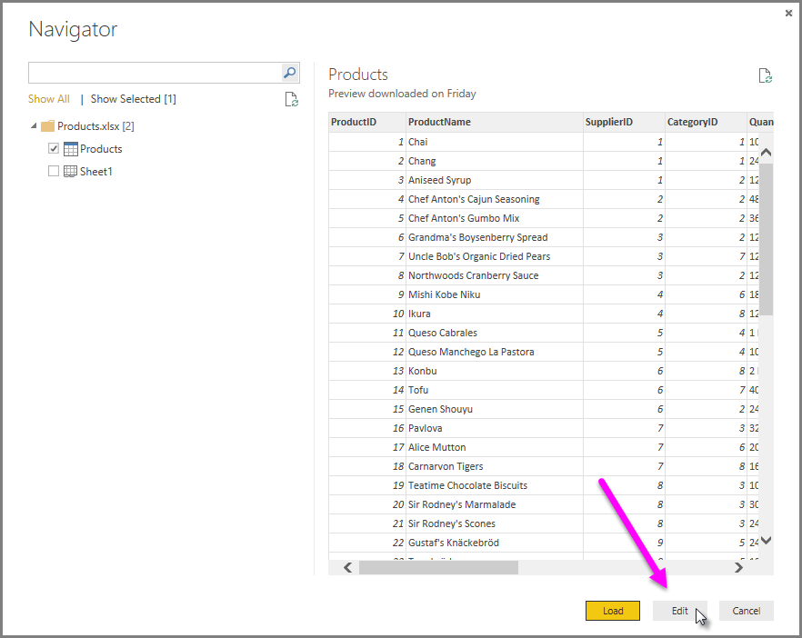
   
Un'anteprima della tabella verrà aperta nell'**Editor di Power Query**, in cui è possibile applicare trasformazioni per pulire i dati.
   

   
>[!NOTE]
>È anche possibile aprire l'**Editor di Power Query** selezionando **Modifica query** > **Modifica query** nella barra multifunzione **Home** in Power BI Desktop oppure facendo clic con il pulsante destro del mouse o scegliendo **Altre opzioni** accanto a qualsiasi query in **Visualizzazione Report** e scegliendo **Modifica query**.

## Pulire le colonne dei prodotti

Il report combinato userà le colonne **ProductID**, **ProductName**, **QuantityPerUnit** e **UnitsInStock** della cartella di lavoro di Excel. Le altre colonne possono essere rimosse. 

1. Nell'**Editor di Power Query** selezionare le colonne **ProductID**, **ProductName**, **QuantityPerUnit** e **UnitsInStock**. È possibile usare **CTRL**+**CLIC** per selezionare più di una colonna oppure **MAIUSC**+**CLIC** per selezionare colonne affiancate.
   
2. Fare clic con il pulsante destro del mouse sulle intestazioni selezionate. Selezionare **Rimuovi altre colonne** dall'elenco a discesa. 
   È anche possibile selezionare **Rimuovi colonne** > **Rimuovi altre colonne** nel gruppo **Gestisci colonne** nella scheda **Home** della barra multifunzione. 
   
   

## Importare i dati sugli ordini da un feed OData

Successivamente, importare i dati degli ordini dal feed OData del sistema di vendite di esempio Northwind. 

1. Nell'**Editor di Power Query** selezionare **Nuova origine**, quindi selezionare **Feed OData** dall'elenco a discesa **Più comuni**. 
   
   
   
2. Nella finestra di dialogo **Feed OData** incollare l'URL del feed Northwind OData `https://services.odata.org/V3/Northwind/Northwind.svc/`. Selezionare **OK**.
   
   
   
3. Nel riquadro **Strumento di navigazione** selezionare la tabella **Orders** e quindi scegliere **OK** per caricare i dati nell'**Editor di Power Query**.
   
   
   
   >[!NOTE]
   >In **Strumento di navigazione** è possibile selezionare un nome di tabella, senza selezionare la casella di controllo, per visualizzare un'anteprima.

## Espandere i dati degli ordini

Quando ci si connette a origini dati contenenti più tabelle, ad esempio un database relazionale o il feed Northwind OData, è possibile usare riferimenti a tabelle per creare query. La tabella **Orders** include riferimenti a diverse tabelle correlate. È possibile usare l'operazione **Espandi** per aggiungere le colonne **ProductID**, **UnitPrice** e **Quantity** dalla tabella **Order_Details** correlata nella tabella di interesse (**Orders**). 

1. Scorrere verso destra la tabella **Orders** finché non viene visualizzata la colonna **Order_Details**, che al posto dei dati conterrà riferimenti a un'altra tabella.
   
   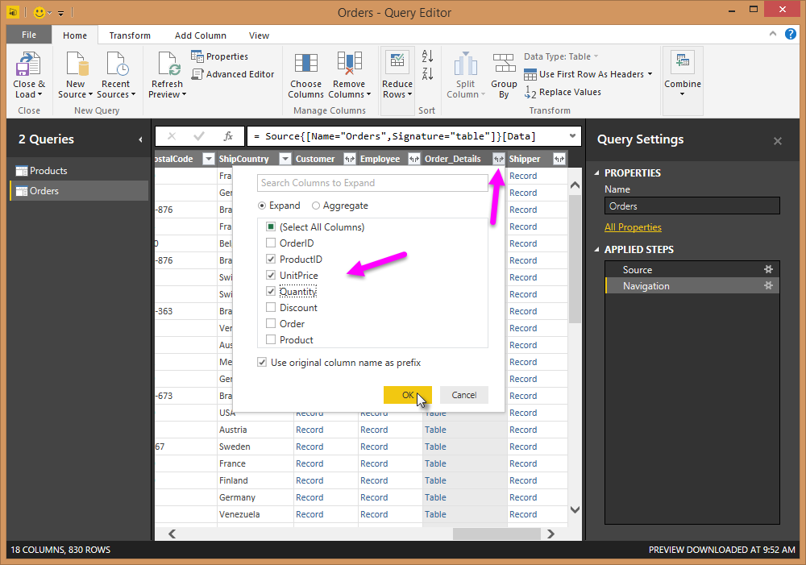
   
2. Selezionare l'icona di **espansione** () nell'intestazione di colonna **Order_Details**. 
   
3. Nell'elenco a discesa **Espandi** :
   
   1. Selezionare **(Seleziona tutte le colonne)** per deselezionare tutte le colonne.
      
   2. Selezionare **ProductID**, **UnitPrice** e **Quantity** e quindi scegliere **OK**.
      
      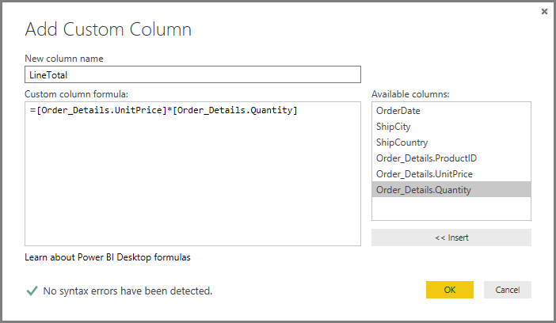

Dopo aver espanso la tabella **Order_Details**, la colonna **Order_Details** viene sostituita da tre nuove colonne di tabella annidata. Per ogni dato aggiunto relativo all'ordine vengono aggiunte nuove righe nella tabella. 

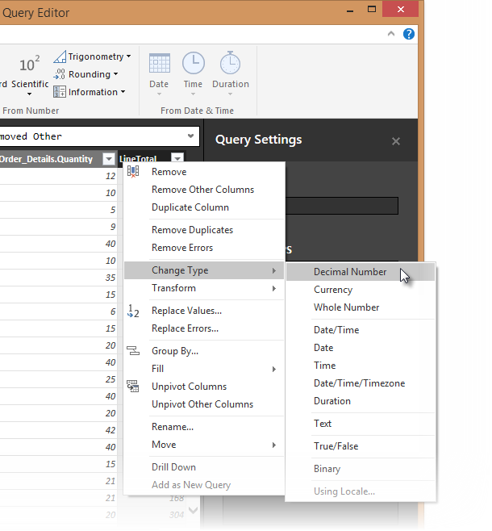

## Creare una colonna calcolata personalizzata

L'Editor di Power Query consente di creare calcoli e campi personalizzati per ottimizzare i dati. Per calcolare il prezzo totale per ogni articolo dell'ordine, si creerà una colonna personalizzata che moltiplicherà il prezzo unitario per la quantità di articoli.

1. Nella scheda **Aggiungi colonna** della barra multifunzione dell'Editor di Power Query selezionare **Colonna personalizzata**.
   
   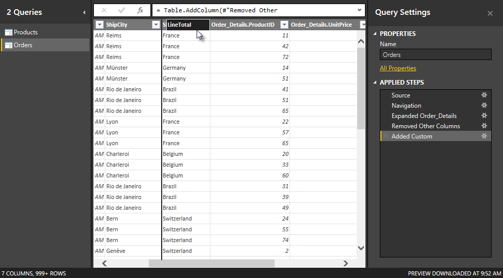
   
2. Nella finestra di dialogo **Colonna personalizzata** digitare **LineTotal** nel campo **Nome nuova colonna**.

3. Nel campo **Formula colonna personalizzata** dopo *=* immettere **[Order_Details.UnitPrice]** \* **[Order_Details.Quantity]** . È anche possibile selezionare i nomi dei campi dalla casella di scorrimento **Colonne disponibili** e selezionare **<< Inserisci** invece di digitarli. 

4. Selezionare **OK**.
   
   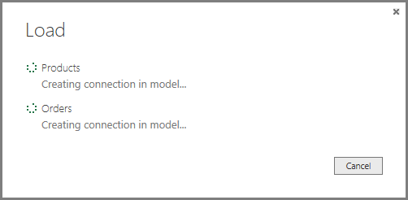

   Il nuovo campo **LineTotal** viene visualizzato come ultima colonna nella tabella **Orders**.

## Impostare il nuovo tipo di dati del campo

Quando l'Editor di Power Query si connette ai dati, ipotizza un tipo di dati per ogni campo per motivi di visualizzazione. Un'icona di intestazione indica il tipo di dati assegnato a ogni campo. È anche possibile controllare in **Tipo di dati** nel gruppo **Trasforma** nella scheda **Home** della barra multifunzione. 

Il tipo di dati della nuova colonna **LineTotal** è **Qualsiasi**, ma contiene valori di valuta. Per assegnare un tipo di dati, fare clic con il pulsante destro del mouse sull'intestazione di colonna **LineTotal**, selezionare **Modifica tipo** dall'elenco a discesa, quindi selezionare **Numero decimale fisso**. 

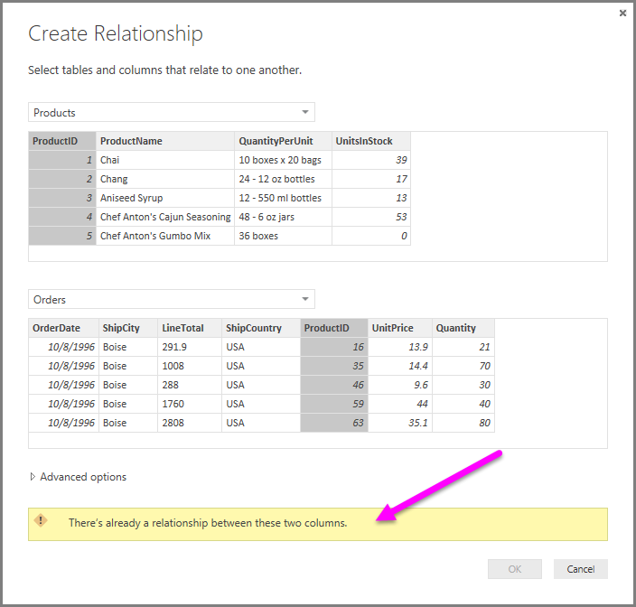

>[!NOTE]
>È anche possibile selezionare la colonna **LineTotal**, quindi selezionare la freccia a discesa accanto a **Tipo di dati** nell'area **Trasforma** della scheda **Home** della barra multifunzione e quindi selezionare **Numero decimale fisso**.

## Pulire le colonne degli ordini

Per semplificare l'uso del modello all'interno di report, è possibile eliminare, rinominare e riordinare alcune colonne.

Il report userà le colonne seguenti:

* **OrderDate**
* **ShipCity**
* **ShipCountry**
* **Order_Details.ProductID**
* **Order_Details.UnitPrice**
* **Order_Details.Quantity**
* **LineTotal**

Selezionare le colonne e usare **Rimuovi altre colonne** come per i dati di Excel. Oppure è possibile selezionare le colonne non elencate, fare clic con il pulsante destro del mouse su una delle colonne e selezionare **Rimuovi colonne**. 

È possibile rinominare le colonne usando il prefisso "**Order_Details.** " per semplificarne la lettura:

1. Fare doppio clic o toccare e tenere premuta ogni intestazione di colonna oppure fare clic con il pulsante destro del mouse sull'intestazione di colonna e scegliere **Rinomina** dall'elenco a discesa. 

2. Eliminare il prefisso **Order_Details.** da ogni nome e quindi premere **INVIO**.

Infine, per rendere la colonna **LineTotal** più accessibile, trascinarla verso sinistra, a destra della colonna **ShipCountry**.

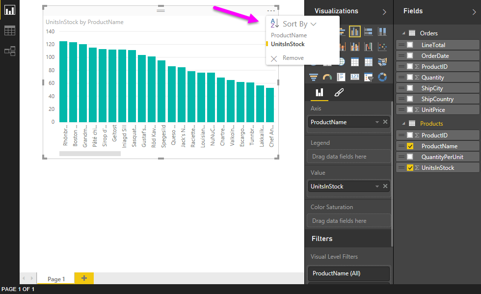

## Rivedere i passaggi della query

Le azioni di definizione di forma e trasformazione dei dati eseguite nell'Editor di Power Query vengono registrate. Ogni azione viene visualizzata a destra nel riquadro **Impostazioni query** sotto **Passaggi applicati**. È possibile tornare in **Passaggi applicati** per rivedere i passaggi e, se necessario, modificarli, eliminarli o riorganizzarli. Modificare i passaggi precedenti è comunque rischioso perché può interrompere i passaggi successivi.

Selezionare ognuna delle query nell'elenco **Query** sul lato sinistro dell'Editor di Power Query ed esaminare i **Passaggi applicati** in **Impostazioni query**. Dopo avere applicato le trasformazioni dei dati precedenti, **Passaggi applicati** avrà un aspetto simile al seguente per le due query:

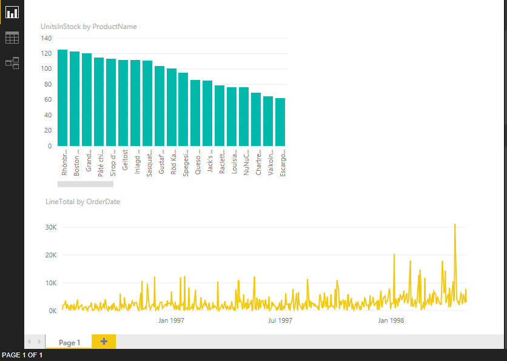 &nbsp;&nbsp; 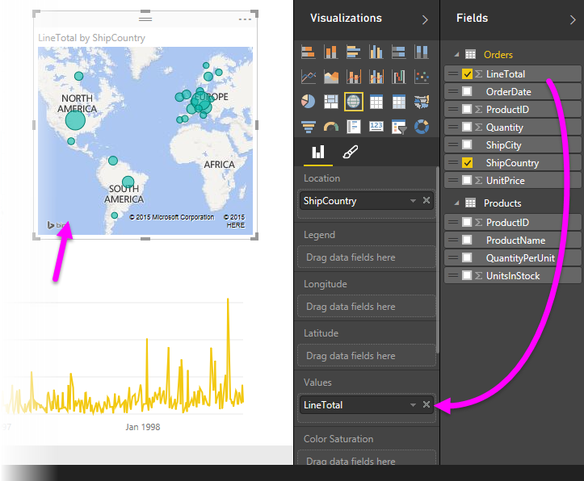

>[!TIP]
>Alla base di ogni passaggio applicato esistono formule sottostanti scritte nel **linguaggio di Power Query**, noto anche come linguaggio [**M**](https://docs.microsoft.com/powerquery-m/power-query-m-reference). Per visualizzare e modificare le formule, selezionare **Editor avanzato** nel gruppo **Query** della scheda Home della barra multifunzione. 

## Importare le query trasformate

Al termine della trasformazione dei dati e prima di importare i dati nella visualizzazione Report di Power BI Desktop, selezionare **Chiudi e applica** > **Chiudi e applica** nel gruppo **Chiudi** della scheda **Home** della barra multifunzione. 

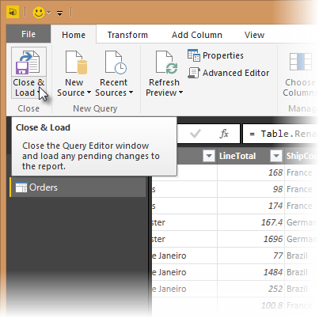

Dopo che i dati sono stati caricati, le query vengono visualizzate nell'elenco **Campi** nella visualizzazione Report di Power BI Desktop.

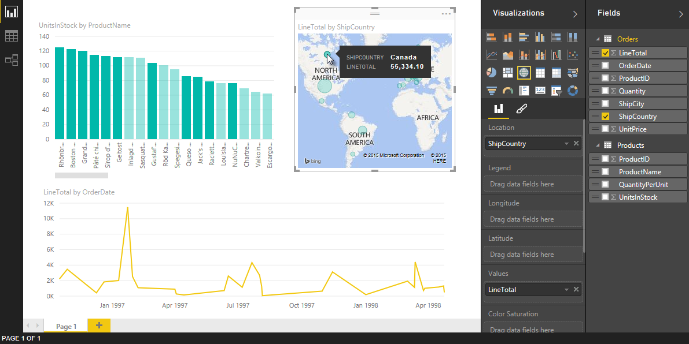

## Gestire la relazione tra i set di dati

In Power BI Desktop non è necessario combinare query per crearne report corrispondenti. È tuttavia possibile usare le relazioni tra i set di dati, in base ai campi che hanno in comune, per estendere e migliorare i report. Power BI Desktop può rilevare automaticamente le relazioni oppure è possibile crearle nella finestra di dialogo **Gestisci relazioni** di Power BI Desktop. Per altre informazioni, vedere [Creare e gestire le relazioni in Power BI Desktop](desktop-create-and-manage-relationships.md).

Il campo **ProductID** condiviso crea una relazione tra i set di dati di Orders e Products di questa esercitazione. 

1. Nella visualizzazione Report di Power BI Desktop selezionare **Gestisci relazioni** nell'area **Relazioni** della scheda **Home** della barra multifunzione.
   
   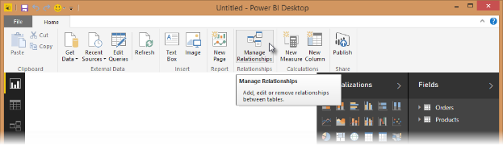
   
2. Nella finestra di dialogo **Gestisci relazioni** è possibile notare che Power BI Desktop ha già rilevato ed elencato una relazione attiva tra le tabelle Products e Orders. Per visualizzare la relazione, selezionare **Modifica**. 
   
   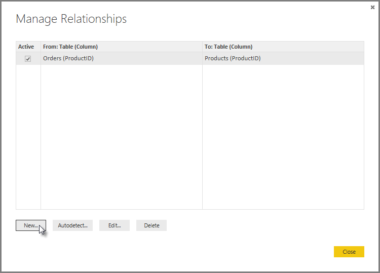
   
   Viene visualizzata la finestra di dialogo **Modifica relazione** con i dettagli relativi alla relazione.  
   
   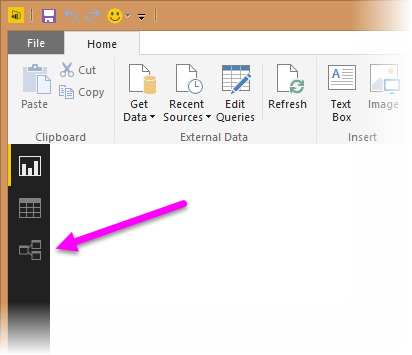
   
3. Power BI Desktop ha rilevato automaticamente la relazione in modo corretto, pertanto è possibile selezionare **Annulla**, quindi **Chiudi**.

Per visualizzare e gestire le relazioni tra query, selezionare **Modello** sul lato sinistro in Power BI Desktop. Fare doppio clic sulla freccia sulla linea che collega le due query per aprire la finestra di dialogo **Modifica relazione** e visualizzare o modificare la relazione. 

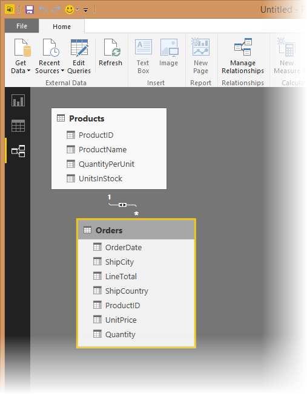

Per tornare alla visualizzazione Report dalla visualizzazione Relazioni, selezionare l'icona **Report**. 

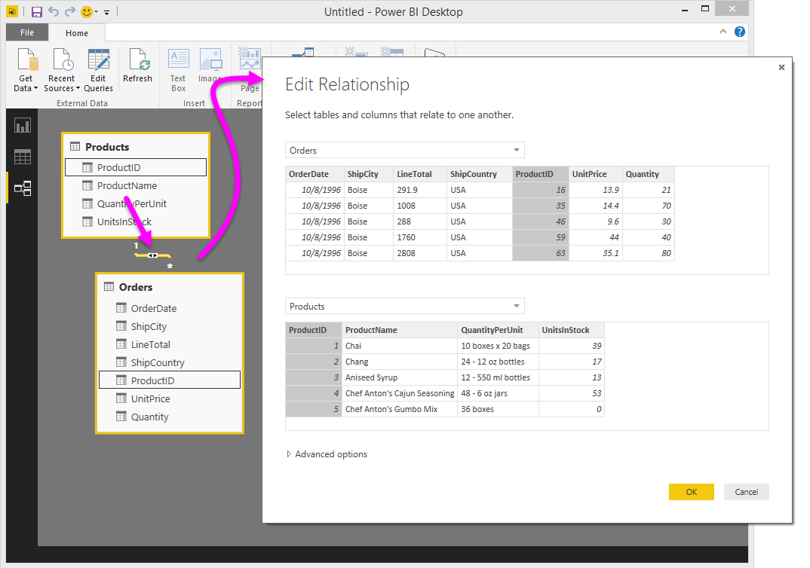

## Creare visualizzazioni usando i dati

Nella visualizzazione Report in Power BI Desktop è possibile creare visualizzazioni diverse per ottenere informazioni utili sui dati. I report possono avere più pagine e ogni pagina può includere più oggetti visivi. È possibile interagire con le visualizzazioni per semplificare l'analisi e il riconoscimento dei dati. Per altre informazioni, vedere [Interagire con un report nella visualizzazione di modifica nel servizio Power BI](service-interact-with-a-report-in-editing-view.md).

È possibile usare i set di dati e la relazione esistente tra di essi per semplificare la visualizzazione e l'analisi dei dati di vendita. 

Per prima cosa, creare un istogramma a colonne in pila che usa i campi da entrambe le query per mostrare la quantità di ogni prodotto ordinato. 

1. Selezionare il campo **Quantity** da **Orders** nel riquadro **Campi** a destra oppure trascinarlo in uno spazio vuoto nell'area di disegno. Si crea così un istogramma in pila che illustra la quantità totale di tutti i prodotti ordinati. 
   
2. Per visualizzare la quantità di ogni prodotto ordinato, selezionare **ProductName** da **Products** nel riquadro **Campi** oppure trascinarlo nel grafico. 
   
3. Per ordinare i prodotti dai più ordinati ai meno ordinati, selezionare i puntini di sospensione ( **...** ) **Altre opzioni** in alto a destra nella visualizzazione, quindi selezionare **Ordina per Quantity**.
   
4. Usare i punti di controllo negli angoli del grafico per aumentarne le dimensioni in modo che siano visibili più nomi di prodotto. 
   
   

Successivamente, creare un grafico che mostri gli importi in dollari degli ordini (**LineTotal**) nel tempo (**OrderDate**). 

1. Senza selezionare alcun elemento nell'area di disegno, selezionare **LineTotal** da **Orders** nel riquadro **Campi** oppure trascinarlo in uno spazio vuoto nell'area di disegno. L'istogramma a colonne in pila mostra l'importo totale in dollari di tutti gli ordini. 
   
2. Selezionare l'istogramma in pila, quindi scegliere **OrderDate** da **Orders** oppure trascinarlo nel grafico. Il grafico mostrerà i totali riga per ogni data dell'ordine. 
   
3. Ridimensionare la visualizzazione trascinando gli angoli in modo da visualizzare un maggior numero di dati. 
   
   
   
   >[!TIP]
   >Se si visualizzano solo gli anni nel grafico (solo tre punti dati), fare clic sulla freccia a discesa accanto a **OrderDate** nel campo **Axis** del riquadro **Visualizzazioni** e selezionare **OrderDate** anziché **Gerarchia data**. 

Infine, creare una visualizzazione mappa che mostri gli importi degli ordini da ogni paese. 

1. Senza selezionare alcun elemento nell'area di disegno, selezionare **ShipCountry** da **Orders** nel riquadro **Campi** oppure trascinarlo in uno spazio vuoto nell'area di disegno. Power BI Desktop rileva che i dati si riferiscono a nomi di paese. Crea quindi automaticamente una visualizzazione mappa con un punto dati per ogni paese in cui sono stati ordinati prodotti. 
   
2. Perché le dimensioni dei punti dati rappresentino gli importi degli ordini di ogni paese, trascinare il campo **LineTotal** sulla mappa. È anche possibile trascinare il campo in **Trascinare qui i campi dati** in **Size** nel riquadro **Visualizzazioni**. Le dimensioni dei cerchi sulla mappa riflettono gli importi in dollari degli ordini da ogni paese. 
   
   

## Interagire con gli oggetti visivi del report per un'analisi approfondita

Power BI Desktop consente di interagire con gli oggetti visivi che si evidenziano e filtrano a vicenda per rilevare altre tendenze. Per altre informazioni, vedere [Filtri ed evidenziazione nei report di Power BI](power-bi-reports-filters-and-highlighting.md). 

A causa della relazione tra le query, le interazioni con una visualizzazione avrà effetto su tutte le altre visualizzazioni nella pagina. 

Nella visualizzazione mappa selezionare il cerchio centrato in **Canada**. Le altre due visualizzazioni applicano un filtro per evidenziare i totali riga e i quantitativi degli ordini in Canada.

Selezionare uno dei prodotti nel grafico **Quantity by ProductName**. La mappa e il grafico delle date vengono filtrati in modo da riflettere i dati per quel prodotto. Selezionare una delle date nel grafico **LineTotal by OrderDate**. La mappa e il grafico dei prodotti vengono filtrati in modo da visualizzare i dati per quella data. 
>[!TIP]
>Per deselezionare una selezione, selezionarla nuovamente oppure selezionare una delle altre visualizzazioni. 

## Completare il report di analisi delle vendite

Il report completato combina i dati del file di Excel Products.xlsx e i dati del feed Northwind OData in oggetti visivi che consentono di analizzare informazioni sugli ordini per paesi, periodi di tempo e prodotti diversi. Quando il report è pronto, è possibile [caricarlo nel servizio Power BI](desktop-upload-desktop-files.md) per condividerlo con altri utenti di Power BI.

## Passaggi successivi
* [Altre esercitazioni su Power BI Desktop](https://go.microsoft.com/fwlink/?LinkID=521937)
* [Video su Power BI Desktop](https://go.microsoft.com/fwlink/?LinkID=519322)
* [Forum di Power BI](https://go.microsoft.com/fwlink/?LinkID=519326)
* [Blog su Power BI](https://go.microsoft.com/fwlink/?LinkID=519327)
