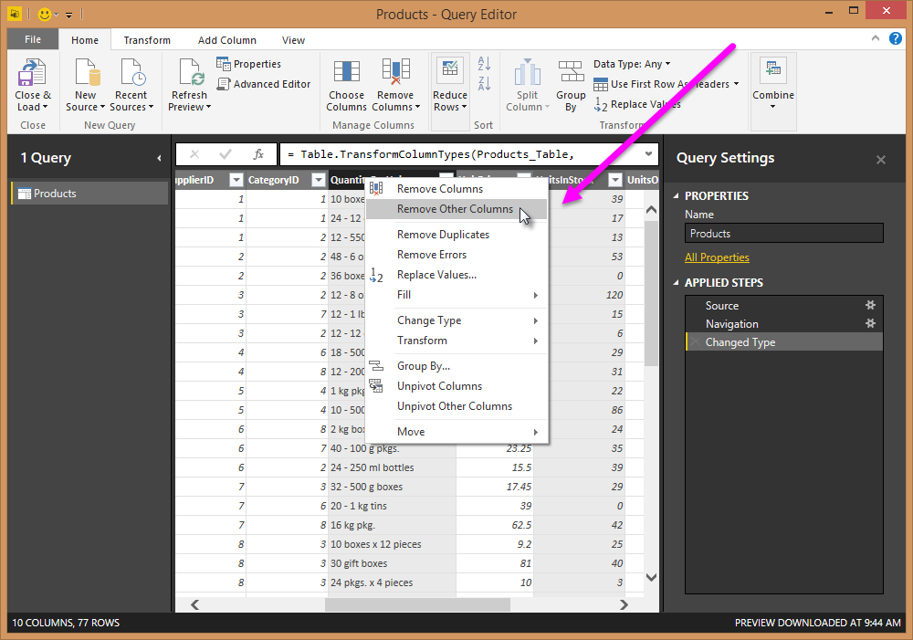
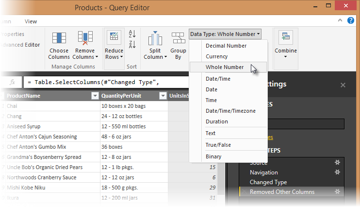
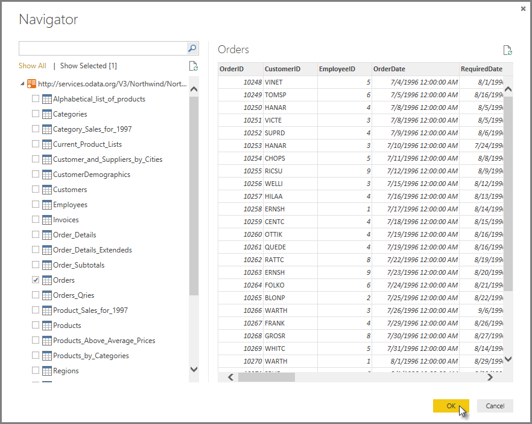
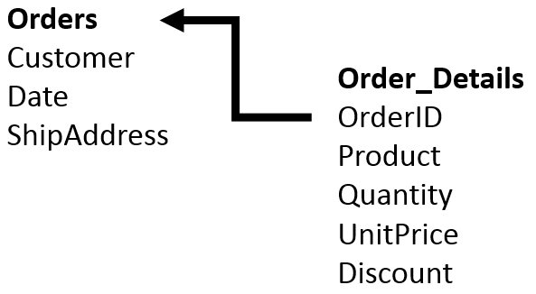

# Esercitazione: Analisi dei dati di vendita da Excel e da un feed OData
Con **Power BI Desktop** è possibile connettersi a origini dati di qualsiasi tipo e quindi eseguirne la combinazione e il data shaping in modi che semplificano la creazione di analisi e visualizzazioni dei dati interessanti e stimolanti. In questa esercitazione verrà descritto come combinare dati da due origini dati. 

La presenza dei dati in più origini dati diverse, ad esempio le informazioni sui prodotti in un database e le informazioni di vendita in un altro, è abbastanza comune. Le tecniche descritte in questo documento includono una cartella di lavoro di Excel e un feed OData, ma si tratta di tecniche generali che possono essere applicate anche ad altre origini dati, come query di SQL Server, file CSV o qualsiasi origine dati in Power BI Desktop.

In questa esercitazione verranno importati dati da Excel (che include le informazioni sui prodotti) e da un feed OData (che contiene i dati degli ordini). Verranno eseguiti passaggi di trasformazione e aggregazione e verranno combinati dati di entrambe le origini per creare un report denominato **Total Sales per Product and Year** che include visualizzazioni interattive. 

Il report finale avrà un aspetto analogo al seguente:

Per seguire i passaggi di questa esercitazione, è necessario scaricare la cartella di lavoro Products**.**[ Fare clic ](http://download.microsoft.com/download/1/4/E/14EDED28-6C58-4055-A65C-23B4DA81C4DE/Products.xlsx)[qui](http://download.microsoft.com/download/1/4/E/14EDED28-6C58-4055-A65C-23B4DA81C4DE/Products.xlsx)[ per scaricare ](http://download.microsoft.com/download/1/4/E/14EDED28-6C58-4055-A65C-23B4DA81C4DE/Products.xlsx)**[Products.xlsx](http://download.microsoft.com/download/1/4/E/14EDED28-6C58-4055-A65C-23B4DA81C4DE/Products.xlsx)**[. ](http://download.microsoft.com/download/1/4/E/14EDED28-6C58-4055-A65C-23B4DA81C4DE/Products.xlsx)

Nella finestra di dialogo **Salva con nome** assegnare al file il nome **Products.xlsx**.

## Attività 1: Recuperare i dati sui prodotti da una cartella di lavoro di Excel
In questa attività vengono importati in Power BI Desktop i prodotti disponibili nel file Products.xlsx.

### Passaggio 1: Connettersi a una cartella di lavoro di Excel
1. Avviare Power BI Desktop.
2. Nella scheda Home della barra multifunzione selezionare **Recupera dati**. Poiché Excel è una delle connessioni dati **Più comuni** , è possibile scegliere Excel direttamente dal menu **Recupera dati** .
   
   
3. Se si fa clic direttamente sul pulsante Recupera dati, è anche possibile selezionare **File \> Excel** e quindi **Connetti**.
4. Nella finestra di dialogo **Apri file** selezionare il file **Products.xlsx** .
5. Nel riquadro **Strumento di navigazione** selezionare la tabella **Products** e quindi **Modifica**.
   
   

### Passaggio 2: Rimuovere altre colonne per visualizzare solo le colonne di interesse
In questo passaggio vengono rimosse tutte le colonne ad eccezione di **ProductID**, **ProductName**, **UnitsInStock**e **QuantityPerUnit**. Power BI Desktop offre in genere diversi modi per completare la stessa attività. Ad esempio, molti pulsanti sulla barra multifunzione possono essere visualizzati anche usando il menu di scelta rapida in una colonna o una cella.

Power BI Desktop include l'Editor di query, in cui è possibile eseguire attività di data shaping e trasformazione delle connessioni dati. L'Editor di query viene avviato automaticamente quando si seleziona **Modifica** in **Strumento di navigazione**. Per aprire l'Editor di query, è anche possibile selezionare **Modifica query** nella scheda **Home** della barra multifunzione in Power BI Desktop. I passaggi seguenti vengono eseguiti nell'Editor di query.

1. Nell'Editor di query selezionare le colonne **ProductID**, **ProductName**, **QuantityPerUnit**e **UnitsInStock** (tenendo premuto **CTRL** per selezionare più di una colonna oppure **MAIUSC** per selezionare colonne contigue).
2. Selezionare **Rimuovi colonne**\>**Rimuovi altre colonne** sulla barra multifunzione oppure fare clic con il pulsante destro del mouse su un'intestazione di colonna e quindi scegliere **Rimuovi altre colonne**.

### Passaggio 3: Modificare il tipo di dati della colonna UnitsInStock
Quando l'Editor di query si connette ai dati, esamina ogni campo per determinare il tipo di dati migliore. Poiché per le cartelle di lavoro di Excel i prodotti in magazzino sono sempre un numero intero, in questo passaggio il tipo di dati della colonna **UnitsInStock** viene impostato su Numero intero.

1. Selezionare la colonna **UnitsInStock** .
2. Fare clic sul pulsante **Tipo di dati** nella scheda **Home** della barra multifunzione.
3. Se il tipo di dati non è ancora impostato su Numero intero, selezionare **Numero intero** nell'elenco a discesa. Il pulsante **Tipo di dati** mostra anche il tipo di dati per la selezione corrente.
   
         

### Passaggi di Power BI Desktop creati
Quando si eseguono attività di query nell'Editor di query, vengono creati passaggi di query, visualizzati nell'elenco **Passaggi applicati** nel riquadro **Impostazioni query** . A ogni passaggio della query corrisponde una formula, definita anche linguaggio "M". Per altre informazioni sul linguaggio delle formule "M", vedere [Informazioni sulle formule di Power Query](https://support.office.com/Article/Learn-about-Power-Query-formulas-6bc50988-022b-4799-a709-f8aafdee2b2f).

| Attività | Passaggio di query | Formula |
| --- | --- | --- |
| Connessione a una cartella di lavoro di Excel |Origine |Source{[Name="Products"]}[Data] |
| Promozione della prima riga a intestazione di colonna della tabella |Prima riga come intestazione |[Table.PromoteHeaders](https://support.office.com/Article/TablePromoteHeaders-b8eaeb95-042a-42e1-9164-6d3c646acadc "Table.PromoteHeaders")   (Products) |
| Rimozione di altre colonne per visualizzare solo le colonne di interesse |Rimosse altre colonne |[Table.SelectColumns](https://support.office.com/Article/TableSelectColumns-20bb9e28-9fd3-4cd2-a21b-97972c82ec22 "Table.SelectColumns")   (FirstRowAsHeader,{"ProductID", "ProductName", "QuantityPerUnit", "UnitsInStock"}) |
| Modifica del tipo di dati |Modificato tipo |Table.TransformColumnTypes(\#"Rimosse altre colonne",{{"UnitsInStock", Int64.Type}}) |

## Attività 2: Importare i dati degli ordini da un feed OData
In questa attività vengono inseriti i dati degli ordini. Questo passaggio rappresenta la connessione a un sistema di vendite. I dati vengono importati in Power BI Desktop dal feed di esempio Northwind OData, disponibile all'URL seguente, che è possibile copiare (e quindi incollare) nel passaggio sotto: <http://services.odata.org/V3/Northwind/Northwind.svc/>. 

### Passaggio 1: Connettersi a un feed OData
1. Nella scheda **Home** della barra multifunzione dell'Editor di query selezionare **Recupera dati**.
2. Passare all'origine dati **Feed OData** .
3. In **URL** nella finestra di dialogo **Feed OData** incollare l'URL del feed Northwind OData.
4. Selezionare **OK**.
5. Nel riquadro **Strumento di navigazione** selezionare la tabella **Orders** e quindi **Modifica**.
   
   

>[!NOTE]
>È possibile fare clic su un nome di tabella, senza selezionare la casella di controllo, per visualizzare un'anteprima.

### Passaggio 2: Espandere la tabella Order\_Details
La tabella **Orders** contiene un riferimento a una tabella **Details** , che a sua volta contiene i singoli prodotti inclusi in ogni ordine. Quando ci si connette a origini dati con più tabelle, ad esempio un database relazionale, è possibile usare questi riferimenti per creare la query. 

In questo passaggio si espande la tabella **Order\_Details** correlata alla tabella **Orders** per combinare le colonne **ProductID**, **UnitPrice** e **Quantity** di **Order\_Details** nella tabella **Orders**. Ecco una rappresentazione dei dati in queste tabelle:

L'operazione **Espandi** combina le colonne da una tabella correlata in una tabella in base all'argomento. Quando viene eseguita la query, le righe della tabella correlata (**Order\_Details**) vengono combinate nelle righe della tabella in base all'argomento (**Orders**).

Dopo l'espansione della tabella **Order\_Details**, tre nuove colonne e altre righe vengono aggiunte alla tabella **Orders**, una per ogni riga nella tabella annidata o correlata.

1. Nella visualizzazione **Query** scorrere fino alla colonna **Order\_Details**.
2. Nella colonna **Order\_Details** selezionare l'icona di espansione ().
3. Nell'elenco a discesa **Espandi** :
   1. Selezionare **(Seleziona tutte le colonne)** per deselezionare tutte le colonne.
   2. Selezionare **ProductID**, **UnitPrice**e **Quantity**.
   3. Fare clic su **OK**.
      

### Passaggio 3: Rimuovere altre colonne per visualizzare solo le colonne di interesse
In questo passaggio vengono rimosse tutte le colonne ad eccezione di **OrderDate, ShipCity**, **ShipCountry**, **Order\_Details.ProductID**, **Order\_Details.UnitPrice** e **Order\_Details.Quantity**. Nell'attività precedente è stata usata l'opzione **Rimuovi altre colonne**. Per questa attività, vengono rimosse alcune colonne selezionate.

1. Nella visualizzazione **Query** selezionare tutte le colonne completando i passaggi a e b.
   1. Fare clic sulla prima colonna (**OrderID**).
   2. Tenendo premuto MAIUSC, fare clic sull'ultima colonna (**Shipper**).
   3. Quando tutte le colonne sono selezionate, tenendo premuto CTRL deselezionare le colonne **OrderDate**, **ShipCity**, **ShipCountry**, **Order\_Details.ProductID**, **Order\_Details.UnitPrice** e **Order\_Details.Quantity**.
2. Quando sono selezionate solo le colonne che si vuole rimuovere, fare clic con il pulsante destro del mouse sull'intestazione di una qualsiasi delle colonne selezionate e scegliere **Rimuovi colonne**.

### Passaggio 4: Calcolare il totale riga per ogni riga di Order\_Details
Power BI Desktop permette di creare calcoli in base alle colonne importate, per ottimizzare i dati a cui ci si connette. In questo passaggio viene usata l'opzione **Colonna personalizzata** per creare una colonna personalizzata e calcolare il totale riga per ogni riga di **Order\_Details**.

Calcolare il totale riga per ogni riga di **Order\_Details**:

1. Nella scheda **Aggiungi colonna** della barra multifunzione fare clic su **Aggiungi** **colonna personalizzata**.
   
   
2. Nella casella di testo **Formula colonna personalizzata** della finestra di dialogo **Aggiungi colonna personalizzata** immettere **[Order\_Details.UnitPrice] \* [Order\_Details.Quantity]**.
3. Nella casella di testo **Nuovo nome di colonna** immettere **LineTotal**.
   
   
4. Fare clic su **OK**.

### Passaggio 5: Impostare il tipo di dati del campo LineTotal
1. Fare clic con il pulsante destro del mouse sulla colonna **LineTotal** .
2. Selezionare **Modifica tipo** e scegliere **Numero decimale**.
   
   

### Passaggio 6: Rinominare e riordinare le colonne nella query
In questo passaggio viene semplificato l'uso del modello per la creazione di report, rinominando le colonne finali e modificandone l'ordine.

1. In **Editor di query**trascinare la colonna **LineTotal** verso sinistra, dopo **ShipCountry**.
   
   
2. Rimuovere il prefisso *Order\_Details.* dalle colonne **Order\_Details.ProductID**, **Order\_Details.UnitPrice** e **Order\_Details.Quantity** facendo doppio clic su ogni intestazione di colonna e quindi eliminando tale testo dal nome.

### Passaggi di Power BI Desktop creati
Quando si eseguono attività di query nell'Editor di query, vengono creati passaggi di query, visualizzati nell'elenco **Passaggi applicati** nel riquadro **Impostazioni query** . A ogni passaggio della query corrisponde una formula di Power Query, definita anche linguaggio "M". Per altre informazioni su questo linguaggio delle formule, vedere [Informazioni sulle formule di Power Query](https://support.office.com/Article/Learn-about-Power-Query-formulas-6bc50988-022b-4799-a709-f8aafdee2b2f "Informazioni sulle formule di Power Query").

| Attività | Passaggio di query | Formula |
| --- | --- | --- |
| Connessione a un feed OData |Origine |Source{[Name="Orders"]}[Data] |
| Espandere la tabella Order\_Details |Espandere Order\_Details |[Table.ExpandTableColumn](https://support.office.com/Article/TableExpandTableColumn-54903f25-75a2-4a44-a9a3-52a9d895ee98 "Table.ExpandTableColumn")   (Orders, "Order\_Details", {"ProductID", "UnitPrice", "Quantity"}, {"Order\_Details.ProductID", "Order\_Details.UnitPrice", "Order\_Details.Quantity"}) |
| Rimozione di altre colonne per visualizzare solo le colonne di interesse |Rimosse colonne |[Table.RemoveColumns](https://support.office.com/Article/TableRemoveColumns-6265190e-2f58-4300-85b8-df88fc1a67d3 "Table.RemoveColumns")  (\#"Expand Order\_Details",{"OrderID", "CustomerID", "EmployeeID", "RequiredDate", "ShippedDate", "ShipVia", "Freight", "ShipName", "ShipAddress", "ShipCity", "ShipRegion", "ShipPostalCode", "ShipCountry", "Customer", "Employee", "Shipper"}) |
| Calcolare il totale riga per ogni riga di Order\_Details |Inserite colonne |[Table.AddColumn](https://support.office.com/Article/TableAddColumn-6c64d0a5-9654-4d15-bfb6-9cc380aaf3c0 "Table.AddColumn")   (RemovedColumns, "Custom", each [Order\_Details.UnitPrice] \* [Order\_Details.Quantity]) |

## Attività 3: Combinare le query Products e Total Sales
In Power BI Desktop non è necessario combinare query per crearne i report corrispondenti. È invece possibile creare **Relazioni** tra i set di dati. Queste relazioni possono essere create su qualsiasi colonna comune nei set di dati. Per altre informazioni, vedere [Creare e gestire le relazioni in Power BI Desktop](desktop-create-and-manage-relationships.md).

In questa esercitazione i dati relativi agli ordini e quelli relativi ai prodotti condividono un campo 'ProductID' comune e di conseguenza è necessario garantire che esista una relazione tra questi dati nel modello usato con Power BI Desktop. È sufficiente indicare a Power BI Desktop che le colonne di ogni tabella sono correlate, ovvero includono gli stessi valori. Power BI Desktop determina automaticamente la direzione e la cardinalità della relazione e in alcuni casi è in grado di rilevare automaticamente anche le relazioni.

In questa attività viene verificato che esista una relazione in Power BI Desktop tra le query **Products** e **Total Sales** .

### Passaggio 1: Verificare la relazione tra Products e Total Sales
1. Prima di tutto, è necessario caricare il modello creato nell'Editor di query in Power BI Desktop. Nella scheda **Home** della barra multifunzione dell'editor di query selezionare **Chiudi e carica**.
   
   
2. Power BI Desktop carica i dati dalle due query.
   
         
3. Una volta caricati i dati, selezionare il pulsante **Gestisci relazioni** nella scheda **Home** della barra multifunzione.
   
   
4. Selezionare il pulsante **Nuovo** .
   
   
5. Quando si prova a creare una relazione, si scopre che ne esiste già una. Come mostrato nella finestra di dialogo **Crea relazione** (dalle colonne ombreggiate), per i campi **ProductsID** in ogni query è già definita una relazione.
   
    
6. Selezionare **Annulla**e quindi la vista **Relazione** in Power BI Desktop.
   
   
7. Ecco cosa viene visualizzato, indicando la relazione tra le query:
   
   
8. Quando si fa doppio clic sulla freccia sulla linea che collega le query, viene visualizzata la finestra di dialogo **Modifica relazione** .
   
   
9. Poiché non è necessario apportare modifiche, selezionare semplicemente **Annulla** per chiudere la finestra di dialogo **Modifica relazione** .

## Attività 4: Creare elementi visivi usando i dati
Power BI Desktop permette di creare un'ampia gamma di visualizzazioni per ottenere informazioni utili dai dati. È possibile creare report con più pagine e ogni pagina può includere più elementi visivi. È possibile interagire con le visualizzazioni per semplificare l'analisi e la comprensione dei dati. Per altre informazioni sulla modifica dei report, vedere [Interagire con un report nella Visualizzazione di modifica in Power BI](service-interact-with-a-report-in-editing-view.md).

In questa attività viene creato un report basato sui dati caricati nei passaggi precedenti. Viene usato il riquadro Campi per selezionare le colonne da cui creare le visualizzazioni.

### Passaggio 1: Creare grafici che mostrano informazioni relative alle unità in magazzino per prodotto e al totale delle vendite per anno
Trascinare **UnitsInStock** dal riquadro Campi (che si trova sul lato destro dello schermo) in uno spazio vuoto dell'area di disegno. Viene creata una visualizzazione tabella. Trascinare quindi ProductName nella casella Asse, che si trova nella metà inferiore del riquadro Visualizzazioni. Selezionare **Ordina per \> UnitsInStock** facendo clic sui puntini di sospensione nell'angolo superiore destro della visualizzazione.

Trascinare **OrderDate** nell'area di disegno sotto il primo grafico, quindi trascinare LineTotal (di nuovo dal riquadro Campi) nell'elemento visivo e infine selezionare Grafico a linee. Viene creata la visualizzazione seguente.

 Trascinare **ShipCountry** in uno spazio dell'area di disegno in alto a destra. Poiché è stato selezionato un campo geografico, è stata automaticamente creata una mappa. Trascinare ora **LineTotal** nel campo **Valori**. I cerchi sulla mappa per ogni paese hanno ora dimensioni relative a **LineTotal** per gli ordini spediti in tali paesi.

### Passaggio 2: Interagire con gli elementi visivi del report per un'analisi approfondita
Power BI Desktop permette di interagire con gli elementi visivi che si evidenziano e filtrano a vicenda per rilevare altre tendenze. Per informazioni più dettagliate, vedere [Informazioni su filtri ed evidenziazione nei report di Power BI](power-bi-reports-filters-and-highlighting.md).

1. Fare clic sul cerchio azzurro sul **Canad****a**. Si noti il modo in cui gli altri elementi visivi vengono filtrati per mostrare Stock (**ShipCountry**) e Total Orders (**LineTotal**) solo per il Canada.
   
   

## Report di analisi delle vendite completo
Dopo aver eseguito tutti questi passaggi, sarà disponibile un report delle vendite che combina i dati del file Products.xlsx e del feed Northwind OData. Questo report mostra gli elementi visivi che permettono di analizzare le informazioni di vendita di diversi paesi. È possibile scaricare un file di Power BI Desktop completo per questa esercitazione facendo clic [qui](http://download.microsoft.com/download/1/4/E/14EDED28-6C58-4055-A65C-23B4DA81C4DE/Analyzing_Sales_Data.pbix).

## Passaggi successivi
* [Altre esercitazioni su Power BI Desktop](http://go.microsoft.com/fwlink/?LinkID=521937)
* [Video su Power BI Desktop](http://go.microsoft.com/fwlink/?LinkID=519322)
* [Forum di Power BI](http://go.microsoft.com/fwlink/?LinkID=519326)
* [Blog su Power BI](http://go.microsoft.com/fwlink/?LinkID=519327)

