# Esercitazione: Creare colonne calcolate in Power BI Desktop
Talvolta i dati analizzati non contengono un campo specifico necessario per ottenere i risultati desiderati. In questo caso, è utile usare le colonne calcolate. Le colonne calcolate usano formule DAX (Data Analysis Expressions) per definire i valori di una colonna. Tali valori possono essere di qualsiasi tipo, ad esempio la combinazione di valori di testo di due diverse colonne in un'altra posizione nel modello o il risultato del calcolo di un valore numerico a partire da altri valori. Si immagini, ad esempio, che nei dati siano presenti le colonne Città e Stato (come campi nell'elenco dei campi) ma si voglia un unico campo, Località, che includa entrambi come singolo valore, ad esempio Miami, FL. Le colonne calcolate servono esattamente per questo scopo.

Le colonne calcolate sono simili alle misure perché sono entrambe basate su una formula DAX, ma si differenziano per la modalità d'uso. Le misure vengono spesso usate nell'area relativa ai valori di una visualizzazione, per calcolare i risultati in base ad altri campi presenti in una riga di una tabella, oppure in un'area relativa a un asse, una legenda o un gruppo di una visualizzazione. Le colonne calcolate vengono invece usate quando si vogliono i risultati della colonna in una determinata riga nella tabella oppure nell'area relativa a un asse, una legenda o un gruppo.

Questa esercitazione illustra il significato e la modalità di creazione delle colonne calcolate in Power BI Desktop. L'argomento è rivolto agli utenti di Power BI che sanno già usare Power BI Desktop per creare modelli più avanzati. L'utente dovrebbe avere già familiarità con l'uso di Query per importare i dati, l'uso di più tabelle correlate e l'aggiunta di campi all'area di disegno report. Se non si ha familiarità con Power BI Desktop, vedere l'articolo [Introduzione a Power BI Desktop](desktop-getting-started.md).

Per completare i passaggi di questa esercitazione, è necessario scaricare il file [Contoso Sales Sample for Power BI Desktop](http://download.microsoft.com/download/4/6/A/46AB5E74-50F6-4761-8EDB-5AE077FD603C/Contoso%20Sales%20Sample%20for%20Power%20BI%20Desktop.zip). Si tratta dello stesso file di esempio usato nell'esercitazione [Creare misure personalizzate in Power BI Desktop](desktop-tutorial-create-measures.md). Il file include i dati delle vendite della società fittizia Contoso, Inc. Dal momento che i dati nel file sono stati importati da un database, non sarà possibile connettersi all'origine dati o visualizzare i dati nell'Editor di query. Una volta scaricato il file nel computer, aprirlo in Power BI Desktop.

## Creare una colonna calcolata
Si supponga di voler visualizzare le categorie di prodotti insieme alle sottocategorie in un singolo valore nelle righe, ad esempio Cellulari - Accessori, Cellulari - Smartphone e PDA e così via. In Visualizzazione Report e Vista dati (in questo caso, Visualizzazione Report), analizzando le tabelle di prodotti nell'elenco dei campi è possibile notare che non sono disponibili campi che offrono ciò che si vuole. Sono tuttavia presenti un campo ProductCategory e un campo ProductSubcategory, ognuno nella relativa tabella.

 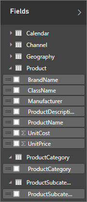

Si creerà una nuova colonna calcolata per combinare i valori di queste due colonne in nuovi valori per la nuova colonna. È interessante notare che è necessario combinare dati di due tabelle diverse in una singola colonna. Dal momento che si userà DAX per creare la nuova colonna, è possibile sfruttare tutte le potenzialità del modello già disponibile, incluse le relazioni tra tabelle diverse già esistenti.

### Per creare una colonna ProductFullCategory
1.  Fare clic con il pulsante destro del mouse oppure fare clic sulla freccia verso il basso nella tabella **ProductSubcategory** nell'elenco dei campi e quindi scegliere **Nuova colonna**. In questo modo, la nuova colonna verrà aggiunta alla tabella ProductSubcategory.
    
    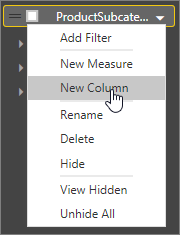
    
    La barra della formula viene visualizzata nella parte superiore dell'area di disegno report, o griglia dei dati. Qui è possibile rinominare la colonna e immettere una formula DAX.
    
    
    
    Per impostazione predefinita, una nuova colonna calcolata viene semplicemente denominata Column. Se non viene rinominata, le altre colonne create verranno denominate Column 2, Column 3 e così via. Per semplificare l'identificazione delle colonne, si assegnerà un nuovo nome alla nuova colonna.
    
2.  Il nome **Column** è già evidenziato nella barra della formula, quindi è sufficiente digitare **ProductFullCategory**.
    
    A questo punto, è possibile iniziare a immettere la formula. Si vuole che i valori nella nuova colonna inizino con il nome ProductCategory della tabella ProductCategory. Dal momento che questa colonna si trova in una tabella diversa, ma correlata, viene usata la funzione [RELATED](https://msdn.microsoft.com/library/ee634202.aspx) per eseguire l'operazione.
    
3.  Dopo il segno di uguale digitare **R**. Verrà visualizzato un elenco a discesa di suggerimenti con tutte le funzioni DAX che iniziano con la lettera R. Man mano che si digita, l'elenco di suggerimenti viene ridotto fino a mostrare la funzione desiderata. Accanto alla funzione viene visualizzata la relativa descrizione. Selezionare **RELATED** scorrendo verso il basso e quindi premere INVIO.
    
    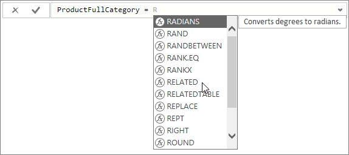
    
    Viene visualizzata una parentesi aperta, con un altro elenco di suggerimenti con tutte le colonne disponibili che è possibile passare alla funzione RELATED. Vengono visualizzate anche una descrizione e informazioni dettagliate sui parametri previsti.
    
    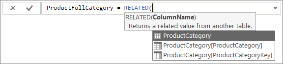
    
    Un'espressione è sempre racchiusa tra una parentesi aperta e una chiusa. In questo caso, l'espressione conterrà un solo argomento, passato alla funzione RELATED, costituito da una colonna correlata da cui restituire i valori. L'elenco delle colonne viene limitato automaticamente, per mostrare solo le colonne correlate. In questo caso, si vuole la colonna ProductCategory nella tabella ProductCategory.
    
    Selezionare **ProductCategory[ProductCategory]**e quindi digitare una parentesi chiusa.
    
    > [!TIP]
    > Gli errori di sintassi sono spesso causati da parentesi chiuse mancanti o nella posizione sbagliata. Spesso, però, Power BI Desktop le aggiunge se l'utente le dimentica.
    > 
    > 
    
    
    
4. Si vuole aggiungere un simbolo trattino per separare i valori, quindi, dopo la parentesi chiusa della prima espressione, digitare uno spazio, una e commerciale (&), virgolette, uno spazio, un trattino (-), un altro spazio, virgolette di chiusura e quindi un'altra e commerciale. La formula a questo punto dovrebbe essere simile alla seguente:
    
    **ProductFullCategory = RELATED(ProductCategory[ProductCategory]) & " - " &**
    
    > [!TIP]
    > Fare clic sulla freccia di espansione verso il basso sul lato destro della barra della formula per espandere l'editor di formule. Fare clic su Alt e Invio per spostarsi di una riga verso il basso e Tab per spostare gli elementi.
    > 
    > 
    
5.  Infine, immettere un'altra parentesi quadra aperta e selezionare la colonna **[ProductSubcategory]** per completare la formula. La formula dovrebbe essere simile alla seguente:
    
    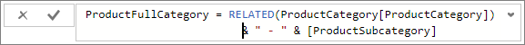
    
    Si noterà che non è stata usata un'altra funzione RELATED nella seconda espressione per chiamare la colonna ProductSubcategory. Questa colonna si trova infatti nella stessa tabella in cui si sta creando la nuova colonna. È possibile immettere [ProductCategory] con il nome della tabella (completo) o senza (non completo).
    
6.  Completare la formula premendo INVIO oppure facendo clic sul segno di spunta nella barra della formula. La formula viene convalidata e aggiunta all'elenco dei campi nella tabella **ProductSubcategory** .
    
    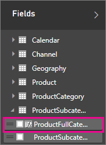
    
    Si noterà che le colonne calcolate sono associate a un'icona speciale nell'elenco dei campi. Ciò indica che contengono una formula. Questa visualizzazione è presente solo in Power BI Desktop. Nel servizio Power BI (il proprio sito di Power BI) non è possibile modificare una formula, quindi un campo costituito da una colonna calcolata non sarà associato a un'icona.
    
## Aggiungere la nuova colonna a un report
È ora possibile aggiungere la nuova colonna ProductFullCategory all'area di disegno report. Esaminare SalesAmount per ProductFullCategory.

Trascinare la colonna **ProductFullCategory** dalla tabella **ProductSubcategory** all'area di disegno report e quindi trascinare il campo **SalesAmount** dalla tabella **Sales** nel grafico.

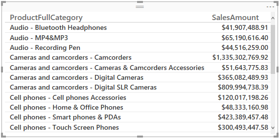

## Creare un'altra colonna
Ora che è stato appreso come creare una colonna calcolata, è possibile crearne un'altra.

L'esempio Contoso Sales for Power BI Desktop contiene dati sulle vendite sia per i negozi attivi sia per quelli non attivi. Si vogliono segnalare in modo chiaro i dati visualizzati per i negozi non attivi. Si vuole, in concreto, creare un campo denominato Active StoreName. A tale scopo, si creerà un'altra colonna. In questo caso, quando un negozio non è attivo, si vuole che la nuova colonna Active StoreName (come campo) mostri il nome del negozio come "Inactive" e mostri invece il nome reale per i negozi attivi.

Fortunatamente, la tabella Stores include una colonna denominata Status, con un valore On per i negozi attivi e Off per quelli non attivi. È possibile testare i valori per ogni riga nella colonna Status per creare nuovi valori nella nuova colonna.

### Per creare una colonna Active StoreName
1.  Creare una nuova colonna calcolata denominata **Active StoreName** nella tabella **Stores**.
    
    Per questa colonna, la formula DAX controllerà lo stato di ogni negozio. Se lo stato è On, la formula restituirà il nome del negozio. Se è Off, il nome sarà "Inactive". A tale scopo, viene usata la funzione logica [IF](https://msdn.microsoft.com/library/ee634824.aspx) per testare lo stato dei negozi e restituire un valore specifico se il risultato è true o false.
    
2.  Digitare prima di tutto **IF**. L'elenco di suggerimenti mostrerà gli elementi che è possibile aggiungere. Selezionare **IF**.
    
    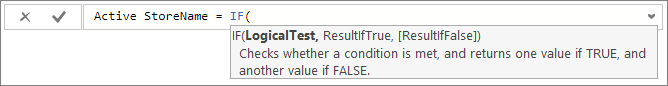
    
    Il primo argomento per IF è un test logico. Si vuole verificare se un negozio ha o meno uno stato "On".
    
3.  Digitare una parentesi quadra aperta **[**, che consente di selezionare le colonne per la tabella Stores. Selezionare **[Status]**.
    
    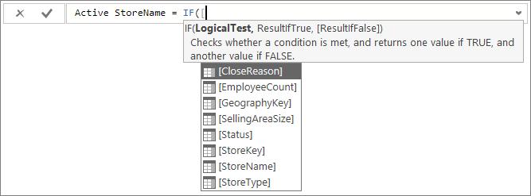
    
4.  Subito dopo **[Status]**, digitare **="On"**, quindi immettere una virgola (**,**) per specificare il secondo argomento. La descrizione comando suggerisce che è necessario aggiungere il valore da usare quando il risultato è true.
    
    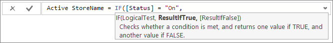
    
5.  Se lo stato del negozio è On, si vuole visualizzare il nome del negozio. Digitare una parentesi quadra aperta **[** e selezionare la colonna **[StoreName]** , quindi digitare un'altra virgola per poter immettere il terzo argomento.
    
    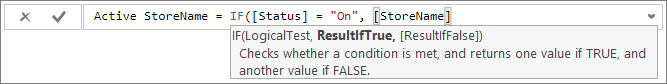
    
6.  È necessario aggiungere un valore da usare quando il risultato è false. In questo caso il valore sarà **"Inactive"**.
    
    
    
7.  Completare la formula premendo INVIO oppure facendo clic sul segno di spunta nella barra della formula. La formula viene convalidata e aggiunta all'elenco dei campi nella tabella Stores.
    
    Analogamente a qualsiasi altro campo, è possibile usare la nuova colonna Active StoreName nelle visualizzazioni. In questo grafico i negozi con stato On sono visualizzati singolarmente con il relativo nome, mentre quelli con stato Off sono raggruppati e visualizzati come Inactive. 
    
    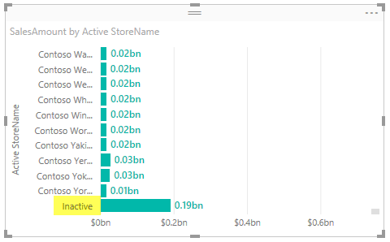
    
## Concetti appresi
Le colonne calcolate possono rendere più completi i dati, fornendo in modo semplice informazioni approfondite. È stato appreso come creare colonne calcolate usando la barra della formula, come usare l'elenco di suggerimenti e come scegliere il nome più appropriato per le nuove colonne.

## Passaggi successivi
Per approfondire i concetti relativi alle formule DAX e creare colonne calcolate con formule DAX più avanzate, vedere [Nozioni di DAX in Power BI Desktop](desktop-quickstart-learn-dax-basics.md). Questo articolo illustra i concetti fondamentali in DAX, ad esempio sintassi, funzioni e una maggiore comprensione del contesto.

Non dimenticare di aggiungere ai Preferiti la pagina [Riferimento a Data Analysis Expressions (DAX)](https://msdn.microsoft.com/library/gg413422.aspx). che include informazioni dettagliate sulla sintassi e sugli operatori DAX, nonché sulle oltre 200 funzioni DAX disponibili.

