# Esercitazione: Creare colonne calcolate in Power BI Desktop

Talvolta i dati analizzati non contengono un campo specifico necessario per ottenere i risultati desiderati. In questo caso, può essere utile usare le *colonne calcolate*. Per definire i valori delle colonne calcolate vengono usate le formule DAX (Data Analysis Expressions), ovvero formule che consentono in pratica di combinare valori di testo di colonne diverse o di calcolare un valore numerico a partire da altri valori. Si immagini, ad esempio, che nei dati siano presenti i campi **Città** e **Stato**, ma che si voglia avere un unico campo, **Località**, che includa entrambi con un singolo valore, ad esempio "Miami, FL". Le colonne calcolate servono esattamente per questo scopo.

Le colonne calcolate sono simili alle [misure](desktop-tutorial-create-measures.md), perché si basano entrambe su una formula DAX, ma si distinguono da queste per la modalità d'uso. Spesso le misure vengono usate in un'area **Valori** della visualizzazione per calcolare i risultati in base ad altri campi. Le colonne calcolate vengono usate come nuovi **campi** in righe, assi, legende e aree dei gruppi di visualizzazione.

Questa esercitazione illustra il significato e la modalità di creazione delle colonne calcolate, nonché l'uso di queste colonne nelle visualizzazioni dei report in Power BI Desktop. 

### Prerequisiti
- Questa esercitazione è destinata agli utenti di Power BI che sono già in grado di usare Power BI Desktop per creare modelli più avanzati. L'utente dovrebbe avere già acquisito familiarità con l'uso di **Recupera dati** e dell'**editor di Power Query** per importare i dati, con l'uso di più tabelle correlate e con l'aggiunta di campi al canvas del report. Se non si ha familiarità con Power BI Desktop, vedere l'articolo [Introduzione a Power BI Desktop](desktop-getting-started.md).
  
- L'esercitazione usa il file [Contoso Sales Sample for Power BI Desktop](http://download.microsoft.com/download/4/6/A/46AB5E74-50F6-4761-8EDB-5AE077FD603C/Contoso%20Sales%20Sample%20for%20Power%20BI%20Desktop.zip), lo stesso esempio usato per l'esercitazione [Creare misure personalizzate in Power BI Desktop](desktop-tutorial-create-measures.md). I dati delle vendite della società fittizia Contoso, Inc. sono stati importati da un database, non sarà quindi possibile connettersi all'origine dati o visualizzare i dati nell'editor di Power Query. Scaricare ed estrarre il file nel computer in uso e quindi aprirlo in Power BI Desktop.

## Creare una colonna calcolata con i valori di tabelle correlate

Si supponga di voler visualizzare nel proprio Report vendite le categorie e le sottocategorie di prodotti come singoli valori, ad esempio "Cellulari - Accessori", "Cellulari - Smartphone e PDA" e così via. Non esiste alcun campo nell'elenco **Campi** che fornisce tali dati, ma esistono i campi **ProductCategory** e **ProductSubcategory**, ognuno nella relativa tabella. È possibile creare una colonna calcolata che combina i valori di queste due colonne. Con le formule DAX è possibile sfruttare tutte le potenzialità del modello già disponibile, incluse le relazioni tra tabelle diverse già esistenti. 

 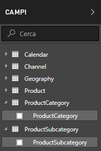

1.  Selezionare i puntini di sospensione (...) di **Altre opzioni** o fare clic con il pulsante destro del mouse sulla tabella **ProductSubcategory** nell'elenco Campi e quindi scegliere **Nuova colonna**. In questo modo, la nuova colonna viene creata nella tabella ProductSubcategory.
    
    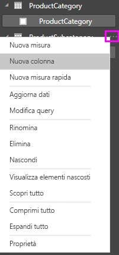
    
    La barra della formula viene visualizzata nella parte superiore del canvas del report e consente di rinominare la colonna e immettere una formula DAX.
    
    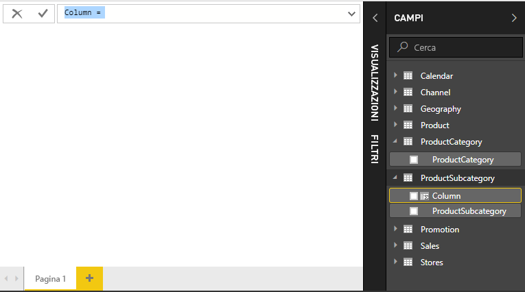
    
2.  Per impostazione predefinita, una nuova colonna calcolata viene denominata semplicemente Column. Se non la si rinomina, eventuali nuove colonne aggiuntive verranno denominate Column 2, Column 3 e così via. Se si vuole semplificare l'identificazione della colonna, poiché il nome **Column** è già evidenziato nella barra della formula, rinominarla digitando **ProductFullCategory** e quindi digitare un segno di uguale (**=**).
    
3.  Si vuole che i valori nella nuova colonna inizino con il nome ProductCategory. Dal momento che questa colonna si trova in una tabella diversa, ma correlata, è possibile usare la funzione [RELATED](https://msdn.microsoft.com/library/ee634202.aspx) per eseguire l'operazione.
    
    Dopo il segno di uguale digitare **r**. Viene visualizzato un elenco a discesa di suggerimenti contenente tutte le funzioni DAX che iniziano con la lettera R. Selezionando una funzione, è possibile visualizzare una descrizione del relativo risultato. Durante la digitazione, l'elenco dei suggerimenti mostra l'opzione più simile alla funzione desiderata. Selezionare **RELATED** e quindi premere **INVIO**.
    
    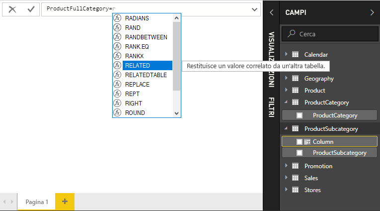
    
    Viene visualizzata una parentesi aperta e un altro elenco di suggerimenti delle colonne correlate che è possibile passare alla funzione RELATED, con descrizioni e informazioni dettagliate sui parametri previsti. 
    
    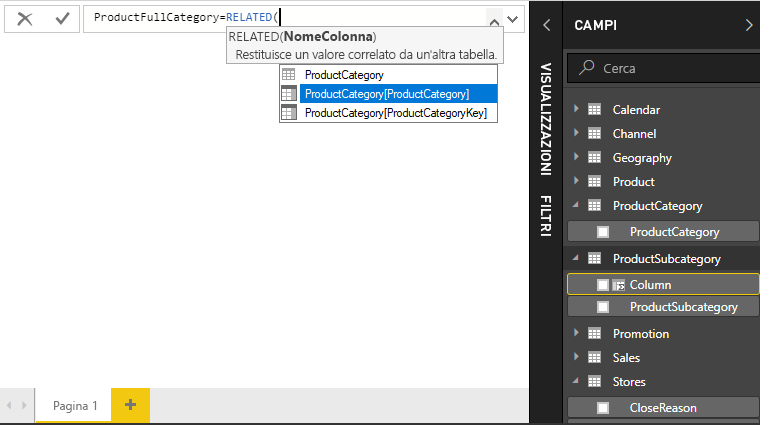
    
4.  Si vuole usare la colonna **ProductCategory** dalla tabella **ProductCategory**. Selezionare **ProductCategory[ProductCategory]**, premere **INVIO** e quindi digitare una parentesi chiusa.
    
    > [!TIP]
    > Gli errori di sintassi sono spesso causati da una parentesi di chiusura mancante o posizionata in modo errato, anche se in alcuni casi Power BI Desktop la aggiungerà automaticamente.
    
4. Si desidera che ProductCategories e ProductSubcategories nei nuovi valori siano separate da trattini e spazi. Dopo la parentesi di chiusura della prima espressione, digitare quindi spazio, e commerciale (**&**), virgolette doppie (**"**), spazio, trattino (**-**), poi ancora spazio, virgolette doppie ed e commerciale. La formula a questo punto dovrebbe essere simile alla seguente:
    
    `ProductFullCategory = RELATED(ProductCategory[ProductCategory]) & " - " &`
    
    > [!TIP]
    > Se è necessario più spazio, selezionare la freccia di espansione verso il basso sul lato destro della barra della formula per espandere l'editor di formule. Nell'editor premere **ALT+INVIO** per spostarsi di una riga verso il basso e **TAB** per spostare gli elementi.
    
5.  Immettere una parentesi quadra aperta (**[**) e selezionare la colonna **[ProductSubcategory]** per completare la formula. 
    
    
    
    Non è necessario usare un'altra funzione RELATED per chiamare la tabella ProductSubcategory nella seconda espressione, perché si sta creando la colonna calcolata in questa tabella. È possibile immettere [ProductSubCategory] con il prefisso del nome della tabella (completo) o senza (non completo).
    
6.  Completare la formula premendo **INVIO** oppure facendo clic sul segno di spunta nella barra della formula. La formula viene convalidata e il nome di colonna **ProductFullCategory** viene visualizzato nella tabella **ProductSubcategory** nell'elenco Campi. 
    
    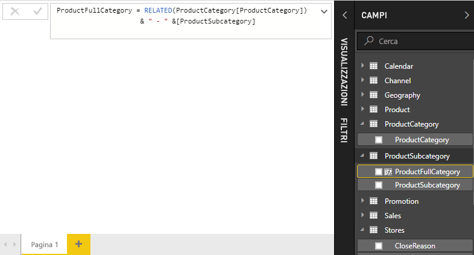
    
    >[!NOTE]
    >In Power BI Desktop le colonne calcolate hanno un'icona specifica nell'elenco Campi, indicante che contengono formule. Nel servizio Power BI (il sito di Power BI) non è possibile modificare le formule e quindi le colonne calcolate non hanno icone.
    
## Usare la nuova colonna in un report

È ora possibile usare la nuova colonna ProductFullCategory per esaminare SalesAmount in base a ProductFullCategory.

1. Selezionare o trascinare la colonna **ProductFullCategory** dalla tabella **ProductSubcategory** nel canvas del report per creare una tabella contenente tutti i nomi di ProductFullCategory.
   
   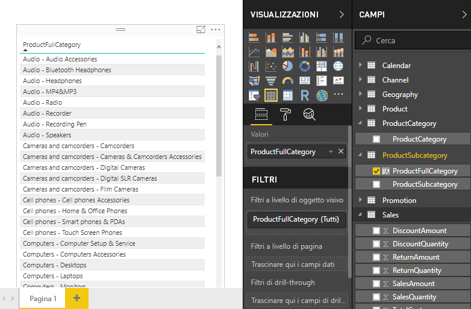
    
2. Selezionare o trascinare il campo **SalesAmount** dalla tabella **Sales** nella tabella per visualizzare il valore SalesAmount per ogni ProductFullCategory.
   
   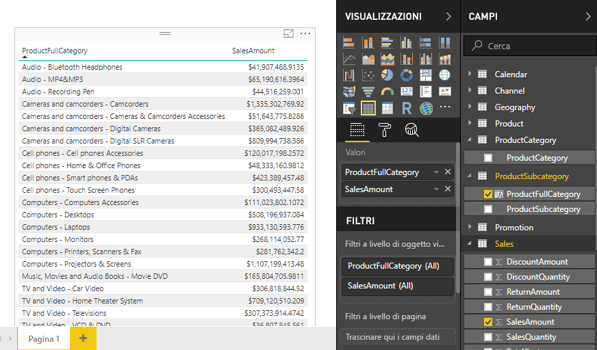
    
## Creare una colonna calcolata che usa una funzione IF

L'esempio Contoso Sales contiene dati sulle vendite sia per i punti vendita attivi sia per quelli non attivi. Si vuole essere certi che le vendite dei punti vendita attivi siano chiaramente separate dalle vendite di quelli non attivi nel report e si crea quindi un campo Active StoreName. Nella nuova colonna calcolata Active StoreName, i punti vendita attivi vengono visualizzati con il nome completo, mentre quelli non attivi vengono raggruppati in "Inactive". 

Fortunatamente, la tabella Stores include una colonna denominata **Status**, con i valori "On" per i punti vendita attivi e "Off" per quelli non attivi, che è possibile usare per creare i valori per la nuova colonna Active StoreName. La formula DAX userà la funzione logica [IF](https://msdn.microsoft.com/library/ee634824.aspx) per testare lo stato dei punti vendita e restituire un valore specifico in base al risultato. Se lo stato del punto vendita è impostato su "On", la formula restituirà il nome corrispondente. Se è impostato su "Off", la formula assegnerà il valore "Inactive" ad Active StoreName. 

1.  Creare una nuova colonna calcolata nella tabella **Stores** e assegnare alla colonna il nome **Active StoreName** nella barra della formula.
    
2.  Dopo il segno **=** iniziare a digitare **IF**. L'elenco di suggerimenti mostrerà gli elementi che è possibile aggiungere. Selezionare **IF**.
    
    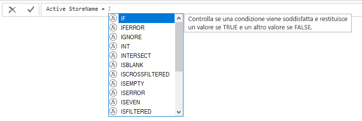
    
3.  Il primo argomento per IF è un test logico per verificare se lo stato di un punto vendita è "On". Digitare una parentesi quadra aperta **[**, in modo da elencare le colonne della tabella Stores, e selezionare **[Status]**.
    
    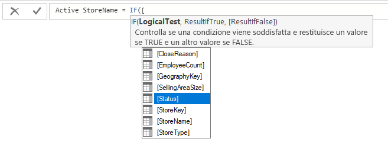
    
4.  Subito dopo **[Status]** digitare **="On"** e quindi digitare una virgola (**,**) per terminare l'argomento. La descrizione del comando indica che è necessario aggiungere un valore da restituire quando il risultato è TRUE.
    
    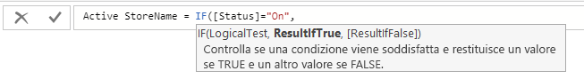
    
5.  Se lo stato del punto vendita è impostato su "On", si vuole visualizzare il relativo nome. Digitare una parentesi quadra aperta (**[**) e selezionare la colonna **[StoreName]**, quindi digitare un'altra virgola. La descrizione del comando ora indica che è necessario aggiungere un valore da restituire quando il risultato è FALSE. 
    
    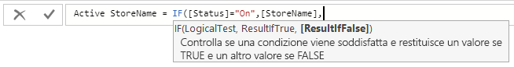
    
6.  Si vuole che il valore sia *Inactive*, quindi digitare **"Inactive"** e completare la formula premendo **INVIO** o selezionando il segno di spunta nella barra della formula. La formula viene convalidata e viene visualizzato il nome della nuova colonna nella tabella **Stores** nell'elenco Campi.
    
    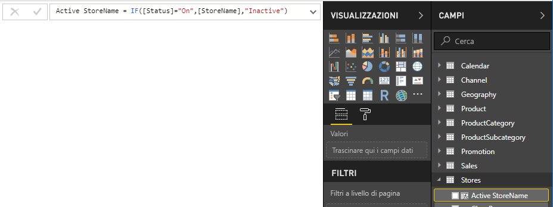
    
8.  È possibile usare la nuova colonna Active StoreName nelle visualizzazioni come qualsiasi altro campo. Per visualizzare SalesAmounts per Active StoreName, selezionare il campo **Active StoreName** oppure trascinarlo nel canvas e quindi selezionare il campo **SalesAmount** o trascinarlo nella tabella. In questa tabella i punti vendita attivi vengono visualizzati singolarmente in base al nome, mentre quelli non attivi vengono raggruppati alla fine e visualizzati come *Inactive*. 
    
    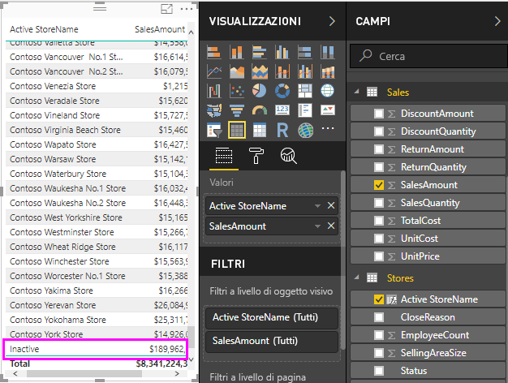
    
## Informazioni apprese
Le colonne calcolate possono offrire una visione dei dati più dettagliata e approfondita. Si è appreso come creare colonne calcolate nell'elenco dei campi e nella barra della formula, usare elenchi di suggerimenti e descrizioni comandi per creare formule, chiamare funzioni DAX come RELATED e IF con gli argomenti appropriati e usare le colonne calcolate nelle visualizzazioni del report.

## Passaggi successivi
Per approfondire i concetti relativi alle formule DAX e creare colonne calcolate con formule più avanzate, vedere [Nozioni di DAX in Power BI Desktop](desktop-quickstart-learn-dax-basics.md). Questo articolo illustra i concetti fondamentali in DAX, ad esempio sintassi, funzioni e una maggiore comprensione del contesto.

Non dimenticare di aggiungere ai Preferiti la pagina [Riferimento a Data Analysis Expressions (DAX)](https://msdn.microsoft.com/library/gg413422.aspx). che include informazioni dettagliate sulla sintassi e sugli operatori DAX, nonché sulle oltre 200 funzioni DAX disponibili.

