# Esercitazione: Creare misure personalizzate in Power BI Desktop
Con le misure è possibile creare alcune delle soluzioni di analisi dati più potenti in Power BI Desktop. Consentono infatti di eseguire calcoli sui dati durante l'interazione con i report. Questa esercitazione illustra il significato e la modalità di creazione delle misure di base in Power BI Desktop.

Questo articolo è destinato agli utenti di Power BI che sono già in grado di usare Power BI Desktop per creare modelli più avanzati. L'utente dovrebbe avere già familiarità con l'uso delle funzionalità Recupera dati ed Editor di query per importare i dati, l'uso di più tabelle correlate e l'aggiunta di campi all'area di disegno del report. Se non si ha familiarità con Power BI Desktop, vedere l'articolo [Introduzione a Power BI Desktop](desktop-getting-started.md).

Per completare i passaggi di questa esercitazione, è necessario scaricare il file [Contoso Sales Sample for Power BI Desktop](http://download.microsoft.com/download/4/6/A/46AB5E74-50F6-4761-8EDB-5AE077FD603C/Contoso%20Sales%20Sample%20for%20Power%20BI%20Desktop.zip). Il file include i dati delle vendite online della società fittizia Contoso, Inc. Poiché i dati nel file sono stati importati da un database, non sarà possibile connettersi all'origine dati o visualizzare i dati nell'Editor di query. Una volta scaricato il file nel computer, aprirlo in Power BI Desktop.

## A cosa servono le misure
Le misure vengono spesso create automaticamente, ad esempio quando si seleziona la casella di controllo accanto al campo **SalesAmount** della tabella **Sales** nell'elenco dei campi o si trascina **SalesAmount** nell'area di disegno del report.

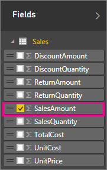

Apparirà una nuova visualizzazione grafico, simile alla seguente:

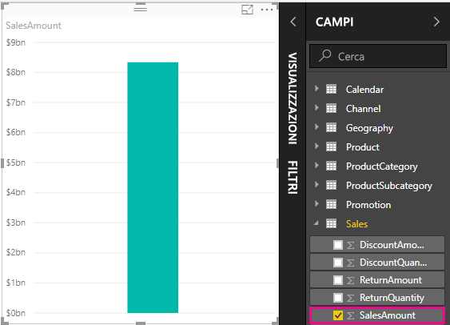

Viene visualizzato un istogramma che mostra l'importo totale dei valori delle vendite dal campo SalesAmount.  Il campo SalesAmount è in realtà una semplice colonna denominata SalesAmount presente nella tabella Sales già importata.

La colonna SalesAmount contiene più di due milioni di righe relative ai valori delle vendite. È lecito chiedersi perché non viene visualizzata una tabella contenente le righe corrispondenti a tutti questi valori. Power BI Desktop sa che il tipo di dati di tutti i valori in SalesAmount è numerico e che gli utenti vorranno probabilmente aggregarli in qualche modo, ad esempio sommarli, calcolarne la media, conteggiarli e così via.

Ogni volta che nell'elenco dei campi viene visualizzato un campo con l'icona sigma , significa che il campo è numerico e i relativi valori possono essere aggregati. In questo caso, quando si seleziona SalesAmount, Power BI Desktop crea la propria misura, calcolando la somma di tutti gli importi delle vendite e visualizzandola nel grafico.

La somma costituisce il tipo di aggregazione predefinito quando si seleziona un campo il cui tipo di dati è numerico, ma è possibile passare facilmente a un altro tipo di aggregazione.

Se nell'area **Valore** si fa clic sulla freccia verso il basso accanto a **SalesAmount**, è possibile selezionare l'opzione **Media**.

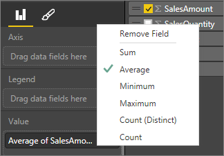

La visualizzazione cambia e illustra la media di tutti i valori delle vendite nel campo SalesAmount.

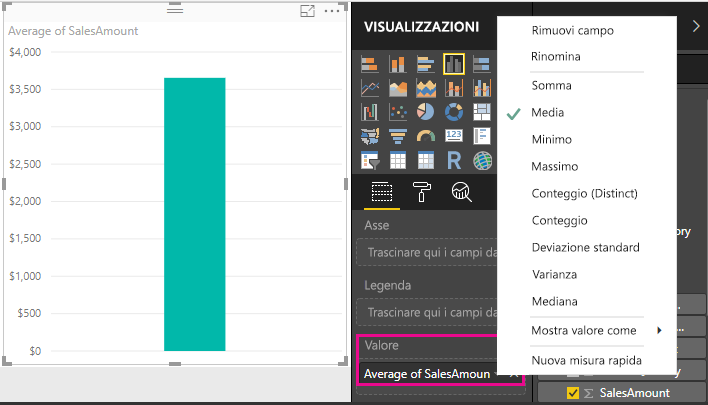

È possibile modificare il tipo di aggregazione in base al risultato che si vuole ottenere, ma non tutti i tipi di aggregazione sono validi con qualsiasi tipo di dati numerico. Ad esempio, per il campo SalesAmount i tipi di aggregazione Somma e Media sono significativi, così come Minimo e Massimo, mentre Conteggio non è rilevante per questo campo perché, pur se numerici, i relativi valori sono di tipo valuta.

Comprendere l'uso delle aggregazioni è di fondamentale importanza per comprendere le misure, perché ogni misura eseguirà un tipo di aggregazione. Più avanti, durante la creazione di alcune misure personalizzate, verranno esaminati altri esempi relativi all'uso di un'aggregazione di tipo Somma.

I valori calcolati dalle misure sono soggetti a continue variazioni in risposta alle interazioni con il report. Se ad esempio si trascina nel grafico il campo **RegionCountryName** della tabella **Geography** , verrà calcolata la media degli importi delle vendite per ogni singolo paese e ne verrà visualizzato il valore.

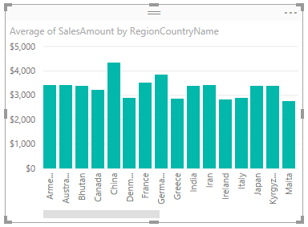

Quando il risultato di una misura cambia in seguito a un'interazione con il report, l'impatto riguarda il *contesto* della misura. In effetti, ogni volta che si interagisce con il report, si modifica il contesto in cui una misura calcola e visualizza i risultati.

Nella maggior parte dei casi Power BI esegue le operazioni necessarie, calcolando e restituendo i valori in base ai campi aggiunti e ai tipi di aggregazione scelti. In altri casi potrebbe invece essere necessario creare misure personalizzate per eseguire calcoli più complessi e univoci.

Con Power BI Desktop per creare misure personalizzate viene usato il linguaggio delle formule DAX (Data Analysis Expressions). Le formule DAX somigliano molto alle formule di Excel. In effetti, DAX usa in molti casi funzioni, operatori e sintassi simili a quelle delle formule di Excel. Le funzioni di DAX sono però concepite in modo da funzionare con dati relazionali ed eseguire calcoli più dinamici durante l'interazione con i report.

Sono disponibili oltre 200 funzioni DAX che eseguono vari tipi di operazioni, dalle aggregazioni semplici, come Somma e Media, fino a funzioni statistiche e di filtro più complesse. In questo articolo non verranno fornite informazioni dettagliate sul linguaggio DAX, ma sono comunque disponibili numerose risorse in proposito. Al termine di questa esercitazione, vedere l'articolo [Nozioni di DAX in Power BI Desktop](desktop-quickstart-learn-dax-basics.md).

Le misure personalizzate create vengono aggiunte all'elenco dei campi della tabella desiderata. Le misure di questo tipo sono dette *modello* e rimarranno nella tabella sotto forma di campo. Uno dei principali vantaggi delle misure modello è dato dal fatto che è possibile assegnare loro un nome qualsiasi al fine di facilitarne l'identificazione. È possibile inoltre usarle come argomento in altre espressioni DAX e creare misure che consentano di eseguire molto rapidamente calcoli complessi.

## Creare misure personalizzate
Si supponga di voler analizzare il fatturato netto. Analizzando la tabella Sales nell'elenco dei campi, è possibile notare che non esiste alcun campo NetSales per il fatturato netto. Esistono però i componenti essenziali per creare una misura che consenta di calcolare il fatturato netto.

È necessaria una misura che sottragga sconti e resi dagli importi delle vendite. Dal momento che la misura deve calcolare un risultato per un qualsiasi contesto della visualizzazione corrente, è necessario sottrarre la somma di DiscountAmount e ReturnAmount dalla somma di SalesAmount. Detta in questi termini l'operazione può generare confusione, ma diventerà tutto più chiaro tra poco.

### Creare la misura Net Sales
1.  Fare clic con il pulsante destro del mouse oppure fare clic sulla freccia verso il basso nella tabella **Sales** nell'elenco dei campi e quindi scegliere **Nuova misura**. In questo modo la nuova misura verrà salvata nella tabella Sales, dove sarà più facilmente individuabile.
    
    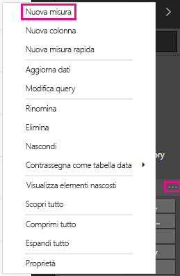
    
    > [!TIP]
    > Per creare una nuova misura, è anche possibile fare clic sul pulsante Nuova misura della barra multifunzione nella scheda Home di Power BI Desktop.
    > 
    > 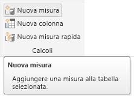
    > 
    > Quando si crea una misura usando la barra multifunzione, la misura viene creata in una qualsiasi delle tabelle. Anche se una misura non deve necessariamente appartenere a una determinata tabella, sarà più semplice individuarla se viene creata in una tabella più logica per i propri scopi. Se quindi si vuole creare una misura in una determinata tabella, fare clic innanzitutto sulla tabella per attivarla, quindi fare clic su Nuova misura. In questo caso, la prima misura verrà creata nella tabella Sales.
    > 
    > 
    
    La barra della formula viene visualizzata nella parte superiore dell'area di disegno del report. Qui è possibile rinominare la misura e immettere una formula DAX.
    
    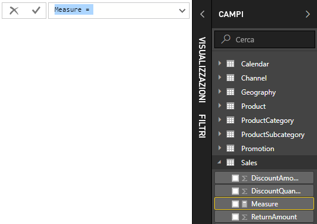
    
    Assegnare quindi un nome alla nuova misura. Per impostazione predefinita, a una nuova misura viene assegnato il nome Misura. Se non viene rinominata, le altre colonne create verranno denominate Misura 2, Misura 3 e così via. Per facilitare l'identificazione delle misure, assegnare alla nuova misura il nome Net Sales.
    
2. Evidenziare **Misura** nella barra della formula, quindi digitare **Net Sales**.
    
    A questo punto, è possibile iniziare a immettere la formula.
    
3.  Dopo il segno di uguale digitare **S**. Verrà visualizzato un elenco a discesa di suggerimenti con tutte le funzioni DAX che iniziano con la lettera S. Man mano che si digita, l'elenco di suggerimenti viene ridotto fino a mostrare la funzione desiderata. Selezionare **SUM** scorrendo verso il basso e quindi premere INVIO.
    
    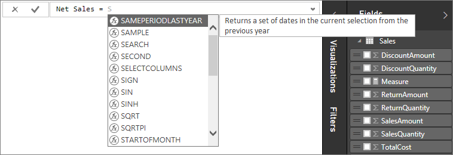
    
    Dopo aver premuto INVIO, viene visualizzata una parentesi aperta, con un altro elenco di suggerimenti con tutte le colonne disponibili che è possibile passare alla funzione SUM.
    
    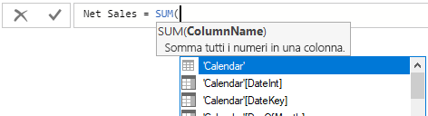
    
    Un'espressione è sempre racchiusa tra una parentesi aperta e una chiusa. In questo caso, l'espressione conterrà un solo argomento da passare alla funzione SUM, costituito da una colonna da sommare. È possibile restringere l'elenco delle colonne digitando le prime lettere dell'elemento desiderato. In questo caso, si tratta della colonna SalesAmount, di conseguenza quando si inizia a digitare salesam, l'elenco si riduce sempre più fino a visualizzare due elementi che è possibile selezionare e che corrispondono in realtà alla stessa colonna. Una è [SalesAmount], perché la misura viene creata nella stessa tabella della colonna SalesAmount; nell'altra il nome della tabella precede quello della colonna.
    
    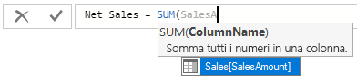
    
    In generale, è consigliabile immettere il nome completo di una colonna per facilitare la lettura delle formule.
    
4. Selezionare **Sales[SalesAmount]**, quindi digitare una parentesi chiusa.
    
    > [!TIP]
    > Gli errori di sintassi sono spesso causati da parentesi chiuse mancanti o nella posizione sbagliata.
    > 
    > 
    
    A questo punto si vogliono sottrarre altre due colonne.
    
5.  Dopo la parentesi chiusa della prima espressione digitare uno spazio e quindi un operatore di sottrazione (**-**) seguito da un altro spazio. Immettere quindi un'altra funzione SUM con la colonna **Sales [DiscountAmount]** come argomento.
    
    
    
    Lo spazio per la formula comincia a esaurirsi, ma si tratta di un problema facilmente risolvibile.
    
6.  Fare clic sulla freccia di espansione verso il basso sul lato destro della barra della formula.
    
    
    
    A questo punto si ha a disposizione più spazio ed è possibile immettere nuove parti della formula su una nuova riga premendo ALT+INVIO. È anche possibile spostare elementi premendo TAB.
    
    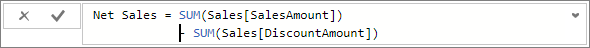
    
    Si può quindi aggiungere la parte finale della formula.
    
7.  Aggiungere un altro operatore di sottrazione seguito da un'altra funzione SUM e dalla colonna **Sales[ReturnAmount]** come argomento.
    
    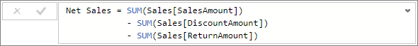
    
    La formula è pronta.

8.  Per completarla, premere INVIO oppure fare clic sul segno di spunta nella barra della formula. La formula viene convalidata e aggiunta all'elenco dei campi nella tabella Sales.

### Aggiungere la nuova misura a un report
È ora possibile aggiungere la misura Net Sales all'area di disegno del report per calcolare il fatturato netto per tutti gli eventuali altri campi aggiunti al report. Verrà ora esaminato il fatturato netto per paese.

1.  Trascinare la misura **Net Sales** dalla tabella **Sales** all'area di disegno report.
    
2. A questo punto, trascinare il campo **RegionCountryName** della tabella **Geography** nel grafico.
    
    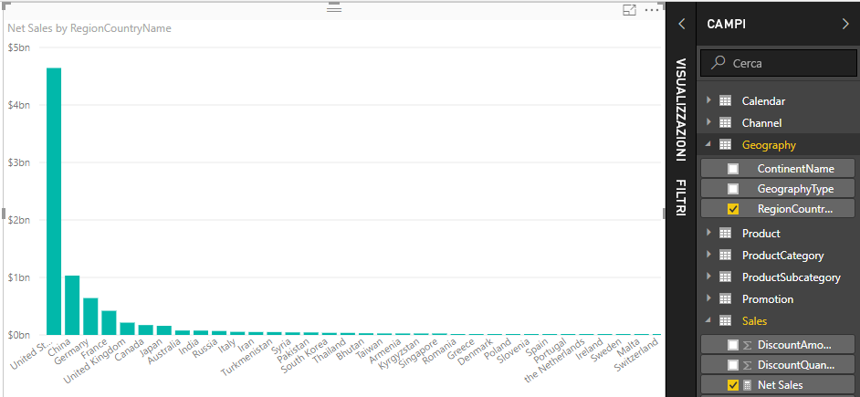
    
    Aggiungere altri dati.
    
3.  Trascinare il campo **SalesAmount** nel grafico per vedere la differenza tra fatturato netto e importo delle vendite.
    
    A questo punto il grafico contiene effettivamente due misure, ovvero SalesAmount, sommato automaticamente, e la misura Net Sales creata manualmente. In ogni caso, i risultati sono stati calcolati nel contesto di un altro campo presente nel grafico, ovvero i paesi in RegionCountryName.
    
    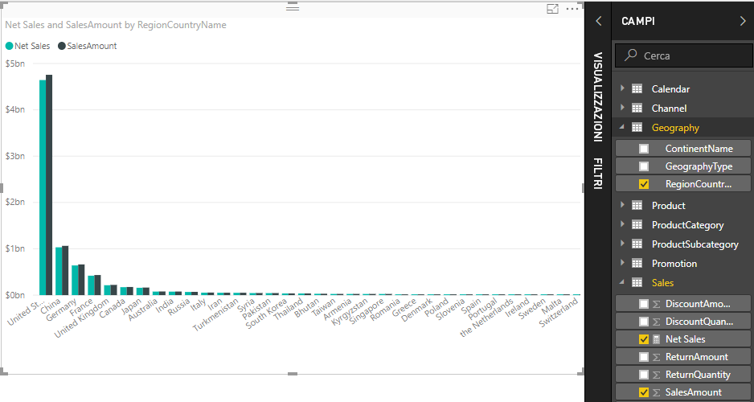
    
    Aggiungere un filtro dei dati, in modo da suddividere ulteriormente il fatturato netto e gli importi delle vendite per anno di calendario.
    
4.  Fare clic su un'area vuota accanto al grafico, quindi in **Visualizzazioni** fare clic sulla visualizzazione Tabella.
    
    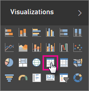
    
    Verrà creata una visualizzazione tabella vuota nell'area di disegno del report.
    
    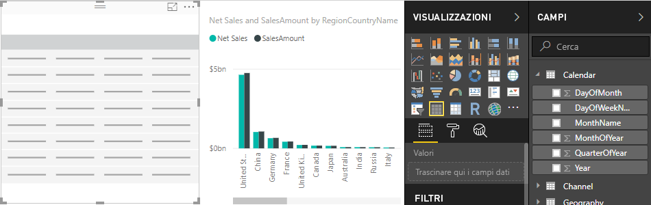
    
5.  Trascinare il campo **Year** della tabella **Calendar** nella nuova tabella vuota.
    
    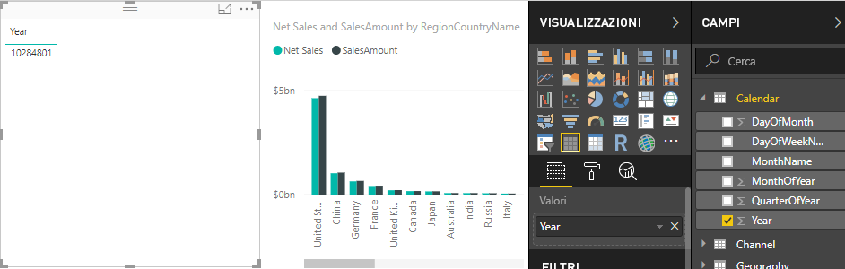
    
    Dal momento che Year è un campo numerico, Power BI Desktop ne ha sommato i valori e ha restituito un grafico che però non è efficace quanto un filtro dei dati.
    
6. In **Valori** fare clic sulla freccia verso il basso accanto a **Year**, quindi fare clic su **Non riepilogare**.
    
    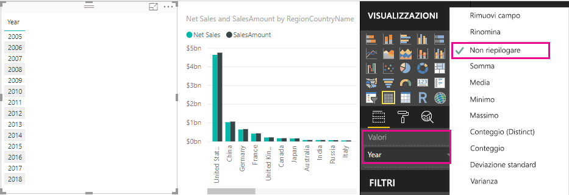
    
    A questo punto è possibile convertire il campo Year nella visualizzazione tabella in un filtro dei dati.

    7.  In **Visualizzazioni** fare clic sulla visualizzazione **Filtro dei dati**.

    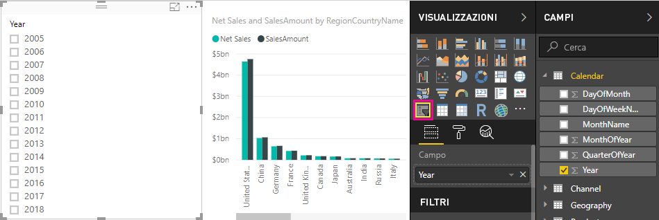
    
    Il campo Year è ora un filtro dei dati. È possibile selezionare singoli anni o gruppi di anni per suddividere di conseguenza le visualizzazioni del report.
    
8. Procedere e fare clic su **2013**. Il grafico cambia: le misure Net Sales e SalesAmount vengono ricalcolate e mostrano i nuovi risultati solo per il 2013. Anche in questo caso è stato modificato il contesto in cui le misure consentono di calcolare e visualizzare risultati.
    
    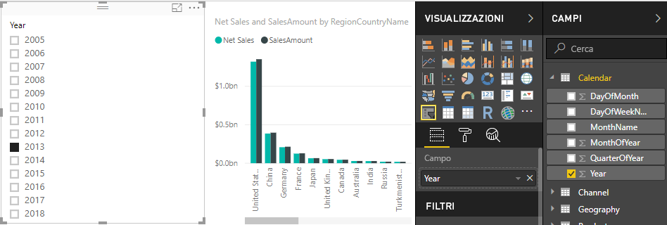

## Creare un'altra misura
Ora che è stato appreso come creare una misura personalizzata, è possibile crearne un'altra.

### Creare la misura Net Sales per Unit
Si supponga ora di voler individuare i prodotti più venduti in termini di vendite per unità.

Ovviamente si può creare una nuova misura. In questo caso, si tratta di dividere il fatturato netto per la quantità di unità vendute, ovvero dividere il risultato di Net Sales per la somma di Sales[SalesQuantity].

1.  Creare una nuova misura denominata **Net Sales per Unit** nella tabella Sales o Products.
    
    In questa misura verrà usata la misura Net Sales creata in precedenza. Con DAX si può fare riferimento ad altre misure nella formula.
    
2.  Iniziare a digitare **Net Sales**. L'elenco di suggerimenti mostrerà gli elementi che è possibile aggiungere. Selezionare **[Net Sales]**.
    
    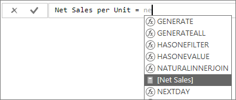
    
    È anche possibile fare riferimento a un'altra misura semplicemente digitando una parentesi aperta (**[**). L'elenco dei suggerimenti mostrerà solo le misure che è possibile aggiungere alla formula.
    
    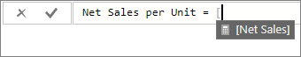
    
3.  Subito dopo **[Net Sales]** immettere uno spazio e quindi un operatore di divisione (**/**) seguito da una funzione SUM e infine digitare **Quantity**. L'elenco dei suggerimenti mostra tutte le colonne il cui nome contiene il termine Quantity. Selezionare **Sales[SalesQuantity]**. La formula a questo punto dovrebbe essere simile alla seguente:
    
    > **Net Sales per Unit = [Net Sales] / SUM(Sales[SalesQuantity])**
    > 
    > 
    
    L'immissione di formule DAX è effettivamente molto semplice quando si usano le funzionalità di ricerca e suggerimenti dell'editor DAX. Esaminare ora i risultati ottenuti con la nuova misura Net Sales per Unit.
    
4. Trascinare la misura **Net Sales per Unit** su un'area vuota dell'area di disegno del report.
    
    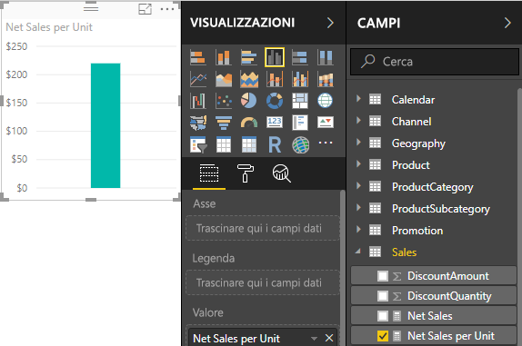
    
    Sembra poco interessante, ma si può fare di meglio.
    
5.  Impostare il tipo di visualizzazione grafico su **Mappa ad albero**.
    
    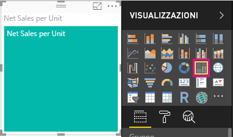
    
6. A questo punto, trascinare il campo **ProductCategory** della tabella **ProductCategory** nell'area **Gruppo**.
    
    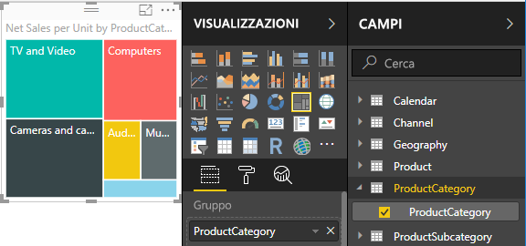
    
    Le informazioni visualizzate sono interessanti, ma si supponga di voler esaminare il fatturato netto per prodotto.
    
7. Rimuovere il campo **ProductCategory** e trascinare il campo **ProductName** dalla tabella **Product** all'area **Gruppo**. 
    
    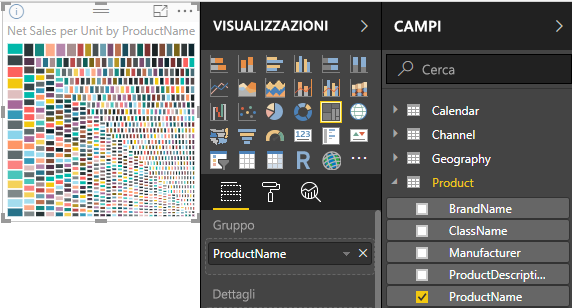
    
    È stato illustrato solo un esempio, ma è stato comunque molto interessante. Naturalmente, è possibile usare questa mappa ad albero in moltissimi altri modi, che però esulano dall'ambito di questa esercitazione.

## Concetti appresi
Le misure costituiscono un potente strumento per ottenere informazioni dettagliate dai dati. Nell'articolo è stato spiegato come usare la barra della formula per creare misure. È possibile assegnare alle misure un nome qualsiasi purché significativo. Grazie poi agli elenchi di suggerimenti è possibile individuare e selezionare facilmente l'elemento corretto da aggiungere alle formule. È stato inoltre introdotto il concetto di contesto, in cui il risultato dei calcoli nelle misure cambia in base ad altri campi o ad altre espressioni nella formula della misura.

## Passaggi successivi
Per approfondire i concetti relativi alle formule DAX e creare misure più complesse, vedere l'articolo [Nozioni di DAX in Power BI Desktop](desktop-quickstart-learn-dax-basics.md). Questo articolo illustra i concetti fondamentali in DAX, ad esempio sintassi, funzioni e una maggiore comprensione del contesto.

Non dimenticare di aggiungere ai Preferiti la pagina [Riferimento a Data Analysis Expressions (DAX)](https://msdn.microsoft.com/library/gg413422.aspx). che include informazioni dettagliate sulla sintassi e sugli operatori DAX, nonché sulle oltre 200 funzioni DAX disponibili.

