# Esercitazione: Analisi di Facebook con Power BI Desktop
Questa esercitazione illustra come importare e visualizzare i dati da **Facebook**. Durante l'esercitazione verrà illustrato come connettersi a una pagina specifica di Facebook (la pagina Power BI), applicare passaggi di trasformazione dei dati e creare alcune visualizzazioni.

Ecco i passaggi che sono necessari:

* **Attività 1:** Connettersi a una pagina di Facebook
* **Attività 2:**Creare visualizzazioni con la vista Report
  
  * **Passaggio 1:**Creare una visualizzazione di mappa ad albero
* **Attività 3:**Effettuare operazioni di data shaping nella vista Query
  
  * **Passaggio 1:**Suddividere la colonna data/ora in due
  * **Passaggio 2:**Aggiungere un valore aggregato da una tabella correlata
* **Attività 4:**Creare altre visualizzazioni con la vista Report
  
  * **Passaggio 1:**Caricare la query nel report
  * **Passaggio 2:**Creare un grafico a linee e un grafico a barre

## **Attività 1: Connettersi a una pagina di Facebook**
In questa attività vengono importati dati dal sito [Facebook di Microsoft Power BI](https://www.facebook.com/microsoftbi) disponibile all'URL seguente: *https://www.facebook.com/microsoftbi*.

Chiunque può connettersi a questa pagina e seguire i passaggi indicati: non è necessaria alcuna credenziale speciale (ad eccezione del proprio account Facebook, usato in questo passaggio).

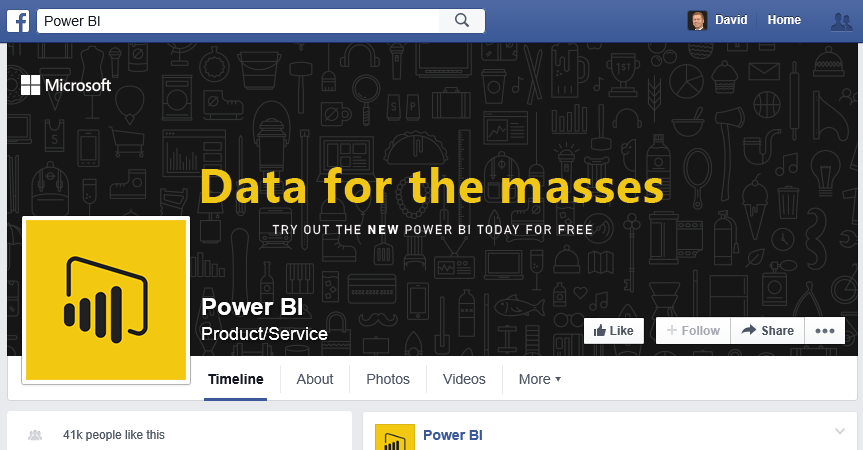

1. Nella finestra di dialogo **Attività iniziali** o nella scheda **Home** della barra multifunzione selezionare **Recupera dati**.
2. Verrà visualizzata la finestra di dialogo **Recupera dati** , che consente di selezionare tra diverse origini dati. Selezionare **Facebook** dal gruppo **Altro** .
   
   
   
   Quando si seleziona **Connetti**, viene visualizzata una finestra di dialogo che avvisa in merito ai rischi legati all'uso di un servizio di terze parti.
   
   
3. Facendo clic su Continua, viene visualizzata la finestra di dialogo **Facebook** in cui è possibile incollare il nome della pagina (**microsoftbi**) nella casella di testo **Nome utente** . Selezionare **Post** nell'elenco a discesa **Connessione** .
   
   
4. Fare clic su **OK**.
5. Alla richiesta di credenziali, accedere con l'account Facebook e consentire l'accesso di Power BI attraverso il proprio account.
   
   

Una volta stabilita una connessione alla pagina, verranno visualizzati i dati che vengono caricati nel modello. 

L' **Editor di query** mostra i dati. L'**editor di query** fa parte di Power BI Desktop, ma viene caricato in una finestra separata e rappresenta la posizione in cui si eseguono tutte le trasformazioni nelle connessioni dati.

Quando i dati sono come si desidera, è possibile caricarli in Power BI Desktop. Selezionare **Chiudi e carica** nella scheda **Home** della barra multifunzione.

Verrà visualizzata una finestra di dialogo che indica lo stato di avanzamento del caricamento dei dati nel modello di dati di Power BI Desktop.

Al termine del caricamento, verrà visualizzata la vista **Report** in cui le colonne della tabella sono elencate nell'elenco **Campi** a destra.

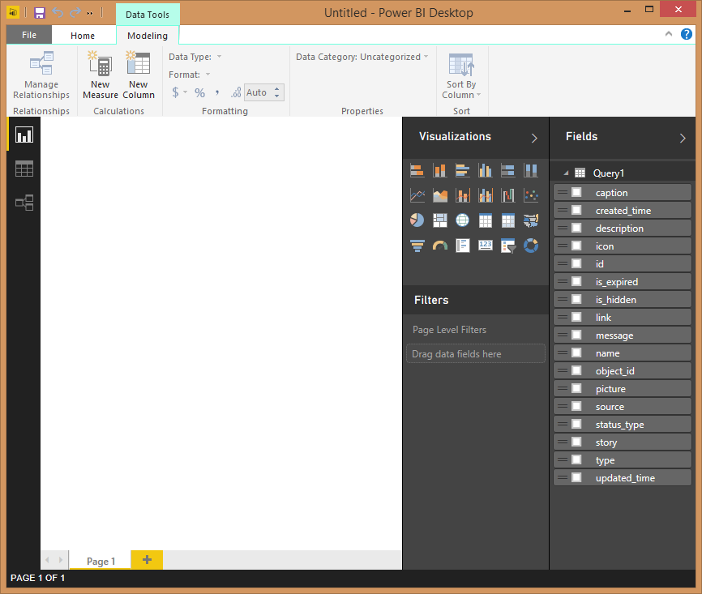

## **Attività 2: Creare visualizzazioni con la visualizzazione Report**
Dopo aver ottenuto i dati dalla pagina, è possibile ricavare in maniera rapida e semplice informazioni approfondite sui dati usando le visualizzazioni.

**Passaggio 1:** Creare una visualizzazione di mappa ad albero

La creazione di una visualizzazione è semplice, è sufficiente trascinare un campo dall'elenco **Campi** e rilasciarlo nell'**area di disegno report**.

Trascinare il campo **tipo** e rilasciarlo nell' **area di disegno report** . Power BI Desktop crea una nuova visualizzazione nell' **area di disegno report**. Trascinare quindi **tipo** da **Campi** (lo stesso campo appena trascinato nell' **area di disegno report** ) nell'area **Valore** per creare una visualizzazione **Grafico a barre** .

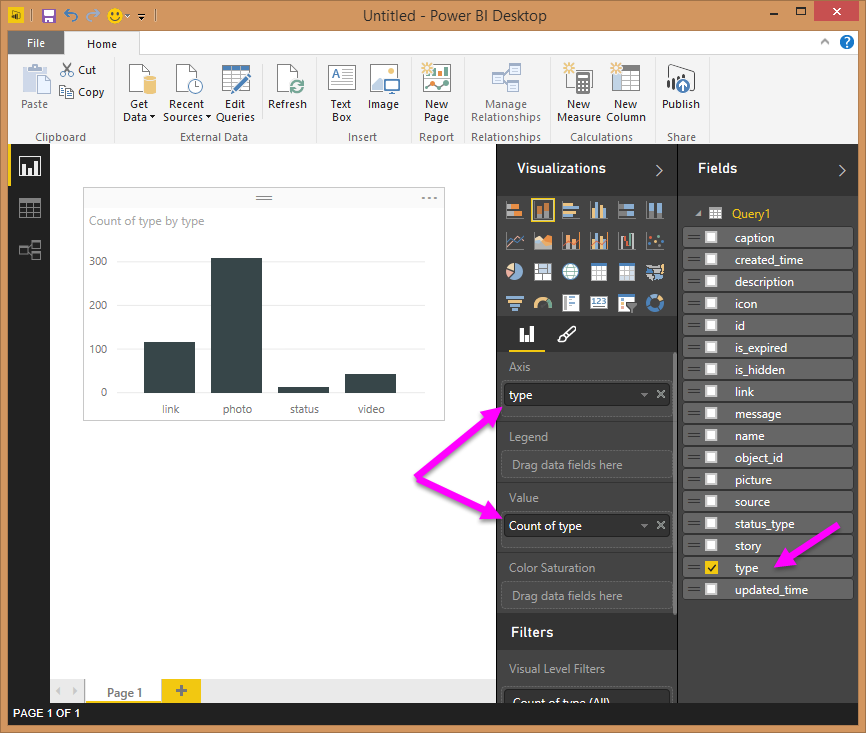

È possibile modificare con facilità il tipo di visualizzazione selezionando un'icona diversa nel riquadro **Visualizzazioni** . Modificare il tipo in **Mappa ad albero** selezionando la relativa icona in **Visualizzazioni**, come illustrato nella figura seguente.

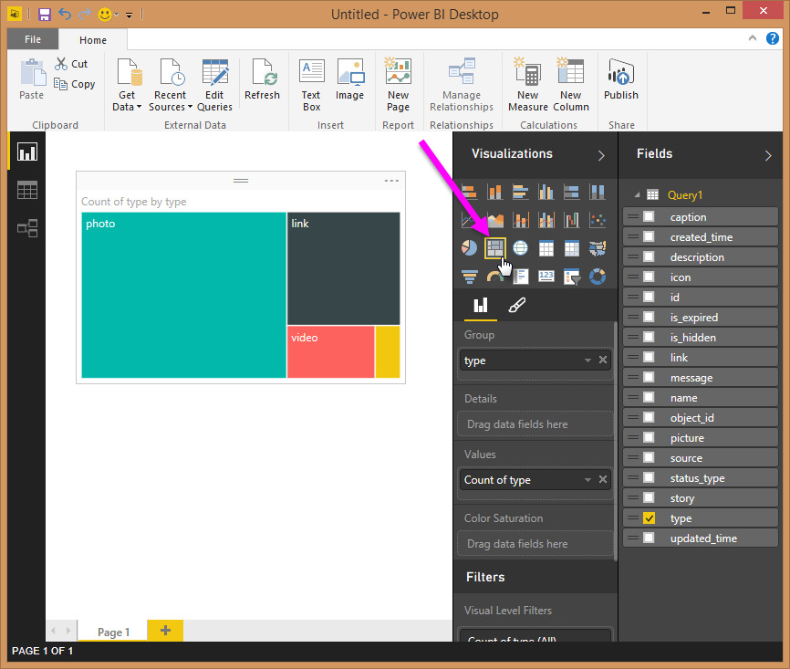

Verrà quindi aggiunta una legenda e verrà modificato il colore di un punto dati. Selezionare l'icona **Formatta** nel riquadro **Visualizzazioni**. L'icona **Formatta** ha l'aspetto di un pennello.

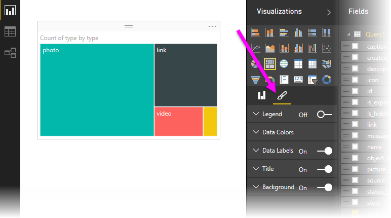

Quando si seleziona la freccia rivolta verso il basso accanto a **Legenda**, la sezione si espande per mostrare come personalizzare la legenda per la visualizzazione selezionata. In questo caso sono state effettuate le selezioni seguenti:

* Dispositivo di scorrimento **Legenda** spostato su **Attiva** per visualizzare una legenda
* Opzione **Destra** selezionata nell'elenco a discesa **Posizione legenda**
* Dispositivo di scorrimento **Titolo** spostato anch'esso su **Attiva** per visualizzare un titolo per la legenda
* Digitato il testo **tipo** come titolo della legenda

Nella figura seguente tali impostazioni sono già state applicate e sono riflesse nella visualizzazione.

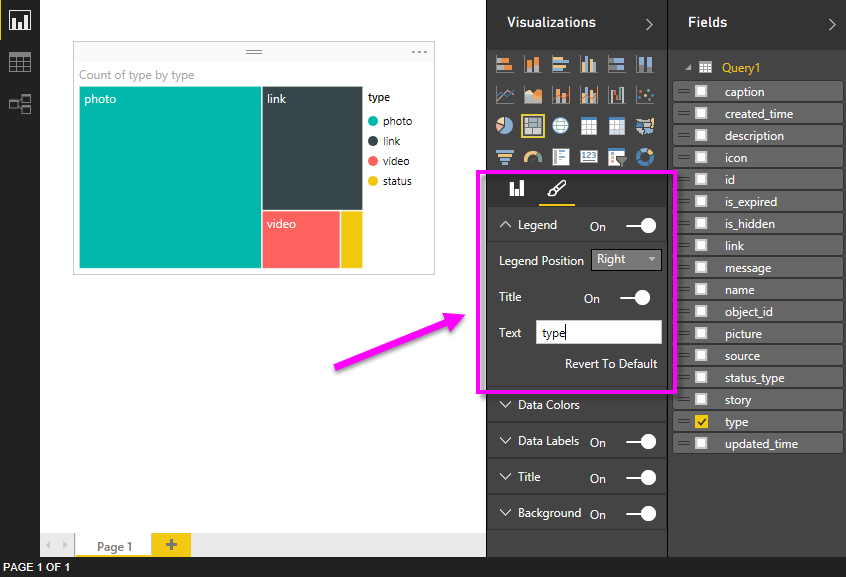

Verrà quindi modificato il colore di uno dei punti dati. Il punto dati relativo al collegamento deve essere blu, per essere più simile al colore comune per i collegamenti ipertestuali.

Selezionare la freccia accanto a **Colori dati** per espandere la sezione. Vengono visualizzati i punti dati, con frecce di selezione accanto a ogni colore che consentono di selezionare un colore diverso per ogni punto dati.

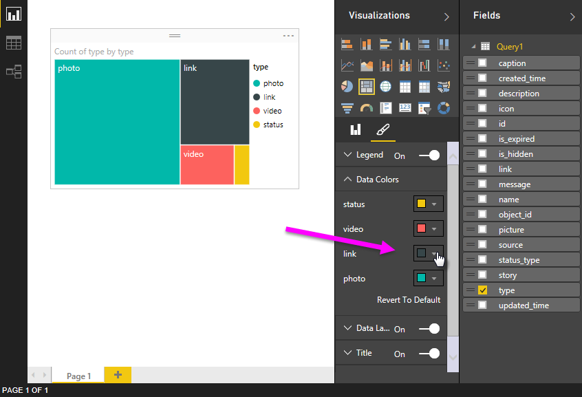

Quando si fa clic sulla freccia rivolta verso il basso per la casella relativa al colore accanto a un punto dati, viene visualizzata una finestra di dialogo di selezione colore, in cui è possibile scegliere il colore. In questo caso, verrà scelto un blu chiaro.

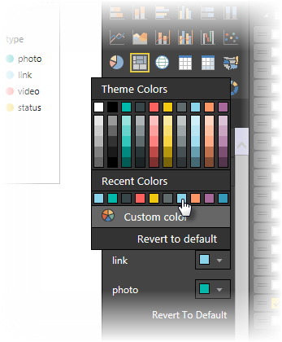

Questo risultato è più appropriato. Nella figura seguente è possibile vedere come viene applicato il colore al punto dati nella visualizzazione e osservare che viene aggiornata automaticamente anche la legenda, in base al colore nella sezione **Colori dati** .

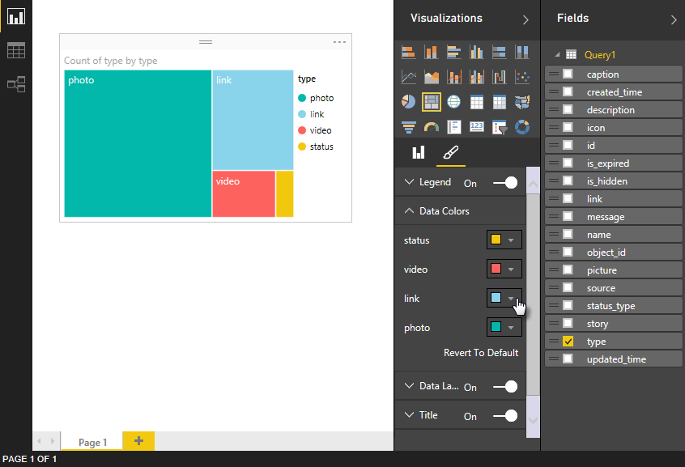

## **Attività 3: Effettuare operazioni di data shaping nella tabella**
Ora che è stata importata la tabella selezionata e si inizia a visualizzarla, è possibile notare che è necessario eseguire diversi passaggi di data shaping e di pulizia dei dati per poter usare i dati al meglio.

**Passaggio 1:** Suddividere la colonna data/ora in due

In questo passaggio, la colonna **created\_time** verrà suddivisa per ottenere i valori di data e ora. Ogni volta che si vuole modificare una query esistente in Power BI Desktop, è necessario avviare l' **Editor di query**. A tale scopo, selezionare **Modifica query** nella scheda **Home** .

1. Nella griglia dell'**editor di query** scorrere verso destra fino a visualizzare la colonna **created\_time**
2. Fare clic con il pulsante destro del mouse su un'intestazione di colonna nella griglia di **anteprima query** e quindi scegliere **Dividi colonna \> In base al delimitatore** per suddividere le colonne. Scegliere **Personalizzato** nell'elenco a discesa del delimitatore e immettere **"T"**. Si noti che questa operazione è disponibile anche nella scheda **Home** della barra multifunzione, nel gruppo **Gestisci colonne**.
   
   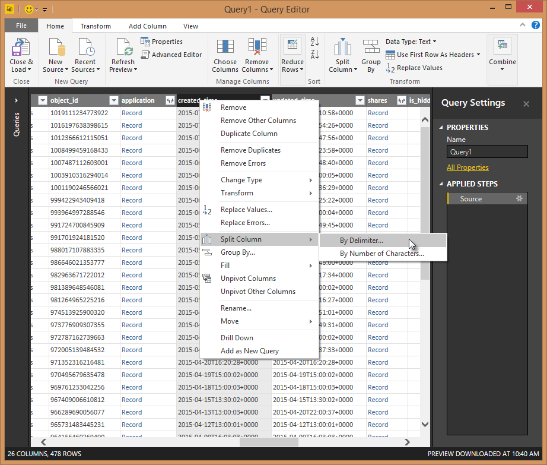
   
   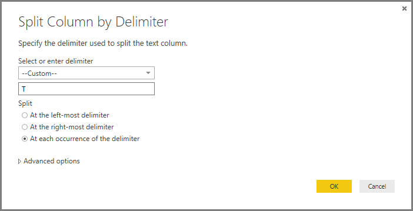
3. Rinominare le colonne create rispettivamente in **created\_date** e **created\_time**.
4. Selezionare la nuova colonna, **created\_time**, **** e nella barra multifunzione della **visualizzazione Query** passare alla scheda **Aggiungi colonna** e selezionare **Ora\>Ora** nel gruppo **Da Data e ora**. Verrà aggiunta una nuova colonna che include solo il componente relativo all'ora.
   
   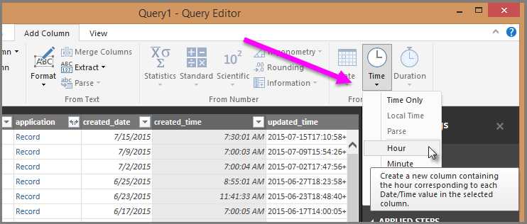
5. Modificare il tipo della nuova colonna **Ora** in **Numero intero**, passando alla scheda **Home** e selezionando l'elenco a discesa **Tipo di dati** oppure facendo clic con il pulsante destro del mouse sulla colonna e scegliendo **Trasforma\>Numero intero**.
   
   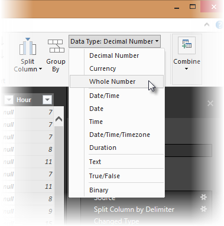

**Passaggio 2:** Aggiungere un valore aggregato da una tabella correlata

In questo passaggio viene aggiunto il numero di condivisioni dal valore annidato, in modo che sia possibile usarlo nelle visualizzazioni.

1. Continuare a scorrere verso destra fino a visualizzare la colonna **shares** . Il valore annidato indica che è necessario eseguire un'altra trasformazione per ottenere i valori effettivi.
2. Nella parte superiore destra dell'intestazione di colonna, selezionare l'icona  per aprire il generatore **Espandi/Aggrega**. Selezionare **conteggio** e fare clic su **OK**. Verrà aggiunto il numero di condivisioni per ogni riga nella tabella.
   
   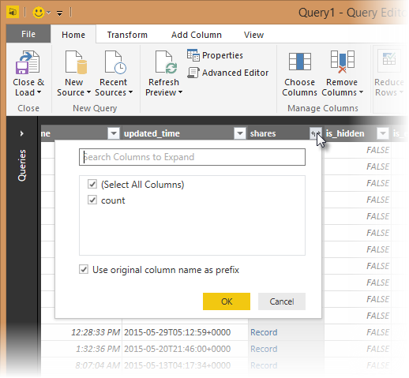
   
   Dopo avere caricato i dati, rinominare la colonna in **shares** facendo doppio clic sul nome della colonna, facendo clic con il pulsante destro del mouse sulla colonna oppure nella vista **Query** selezionando **Rinomina** nella scheda **Trasforma** della barra multifunzione e quindi il gruppo **Qualsiasi colonna** .
3. Infine, modificare il tipo della nuova colonna **shares** in **Numero intero**. Con la colonna selezionata, per modificare il tipo fare clic con il pulsante destro del mouse sulla colonna e scegliere **Trasforma\>Numero intero** oppure **** passare alla scheda **Home** e selezionare l'elenco a discesa **Tipo di dati**.

### Passaggi di query creati
Quando si eseguono trasformazioni nella vista Query, i passaggi di query vengono creati ed elencati nel riquadro **Impostazioni query** , nell'elenco **PASSAGGI APPLICATI** . A ogni passaggio della query corrisponde una formula di query, definita anche linguaggio "M".

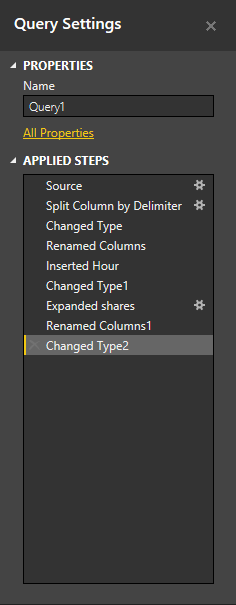

| Attività | Passaggio di query | Formula |
| --- | --- | --- |
| Connessione a un'origine Facebook |Origine |Facebook.Graph (&quot;https://graph.facebook.com/microsoftbi/posts&quot;) |
| **Divisione delle colonne** per ottenere i valori necessari |Suddividi colonna in base al delimitatore |Table.SplitColumn  (Source,&quot;created_time&quot;,Splitter.SplitTextByDelimiter(&quot;T&quot;),{&quot;created_time.1&quot;, &quot;created_time.2&quot;}) |
| **Modifica del tipo** delle nuove colonne (passaggio automatico) |Modificato tipo |Table.TransformColumnTypes  (#&quot;Split Column by Delimiter&quot;,{{&quot;created_time.1&quot;, type date}, {&quot;created_time.2&quot;, type time}}) |
| **Rinominare**una colonna**** |Rinominate colonne |Table.RenameColumns  (#&quot;Changed Type&quot;,{{&quot;created_time.1&quot;, &quot;created_date&quot;}, {&quot;created_time.2&quot;, &quot;created_time&quot;}}) |
| **Inserire **una colonna**** |Inserita ora |Table.AddColumn  (#&quot;Renamed Columns&quot;, &quot;Hour&quot;, each Time.Hour([created_time]), type number) |
| **Modifica tipo ** |Modificato tipo 1 |Table.TransformColumnTypes  (#&quot;Inserted Hour&quot;,{{&quot;Hour&quot;, type text}}) |
| **Espandere **i valori in una tabella nidificata**** |Espandi shares |Table.ExpandRecordColumn  (#&quot;Changed Type1&quot;, &quot;shares&quot;, {&quot;count&quot;}, {&quot;shares.count&quot;}) |
| **Rinominare **la colonna*** |Rinominate colonne 1 |Table.RenameColumns  (#&quot; Expand shares&quot;,{{&quot;shares.count&quot;, &quot;shares&quot;}}) |
| **Uso del comando Modifica tipo** |Modificato tipo 2 |Table.TransformColumnTypes  (#&quot;Renamed Columns1&quot;,{{&quot;shares&quot;, Int64.Type}}) |

## **Attività 4: Creare altre visualizzazioni con la vista Report**
Dopo la conversione dei dati nella forma necessaria per il resto dell'analisi, è possibile caricare la tabella risultante nel report e creare altre visualizzazioni.

**Passaggio 1:** Caricare la query nel report

Per caricare i risultati della query nel report è necessario selezionare **Chiudi e carica** nell'**editor di query**. Le modifiche verranno caricate in Power BI Desktop e l' **Editor di Query**verrà chiuso.

In Power BI Desktop è necessario assicurarsi che sia aperta la vista **Report** . Selezionare l'icona superiore nella barra a sinistra in Power BI Desktop.

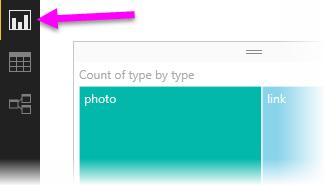

**Passaggio 2:** Creare un grafico a linee e un grafico a barre

Per creare una visualizzazione, è possibile trascinare i campi dall' **Elenco campi** e rilasciarli nell' **area di disegno report**.

1. Trascinare il campo **shares** nell' **area di disegno report** per creare un grafico a barre. Trascinare quindi created\_date nel grafico; Power BI Desktop cambierà la visualizzazione in un **grafico a linee**.
   
   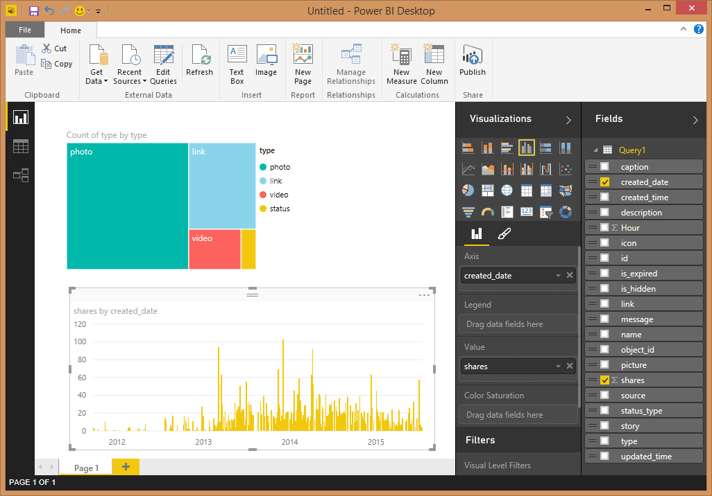
2. Trascinare poi il campo **shares** e rilasciarlo nell' **area di disegno report**. Trascinare il campo **Ora** nella sezione **Asse** sotto l'elenco **Campi**.
   
   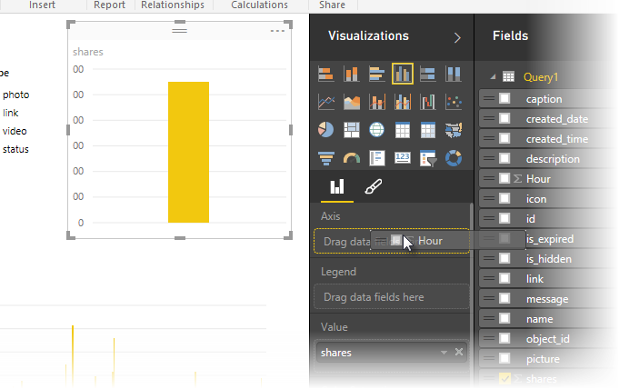
3. È possibile modificare con facilità il tipo di visualizzazione facendo clic su un'icona diversa nel riquadro **Visualizzazioni** . La freccia nell'immagine seguente indica l'icona **Grafico a barre** .
   
   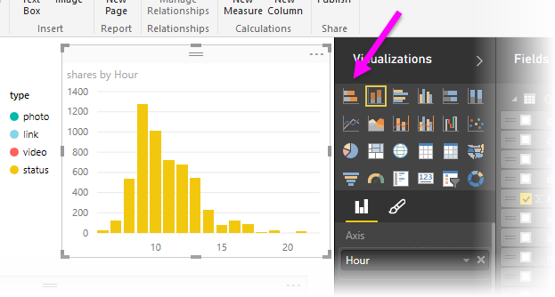
4. Modificare il tipo di visualizzazione in **Grafico a barre**.
5. Il **grafico a barre** viene creato, ma l'asse non è quello desiderato, perché deve essere ordinato nell'altra direzione (dall'alto al basso). Selezionare la freccia rivolta verso il basso accanto a **Asse Y** per espandere la sezione. È necessario modificare il tipo di asse da **Continuo** a **Categorie**in modo da ottenere l'ordinamento desiderato (l'immagine riportata di seguito mostra l'asse prima della selezione, mentre quella successiva mostra il risultato desiderato).

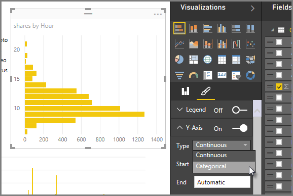

Questo risultato è più appropriato. Saranno ora disponibili tre visualizzazioni nella pagina, che è possibile ridimensionare per riempire la pagina del report.

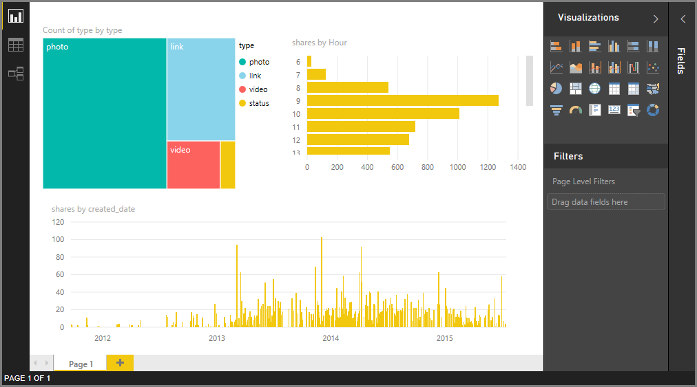

Come si può notare, è facile personalizzare le visualizzazioni nel report per presentare i dati nel modo desiderato. Power BI Desktop offre un'esperienza end-to-end molto semplice, dal recupero di dati da una vasta gamma di origini dati, al data shaping per soddisfare le esigenze di analisi, fino alla visualizzazione dei dati in modi accattivanti e interattivi. Quando il report è pronto, è possibile [caricarlo in Power BI](desktop-upload-desktop-files.md) e creare dashboard basati sul report che potranno essere condivisi con altri utenti di Power BI.

È possibile scaricare il risultato finale di questa esercitazione [qui](http://download.microsoft.com/download/1/4/E/14EDED28-6C58-4055-A65C-23B4DA81C4DE/FacebookAnalytics.pbix).

### Altre informazioni
* [Altre esercitazioni su Power BI Desktop](http://go.microsoft.com/fwlink/?LinkID=521937)
* [Video su Power BI Desktop](http://go.microsoft.com/fwlink/?LinkID=519322)
* [Forum di Power BI](http://go.microsoft.com/fwlink/?LinkID=519326)
* [Blog su Power BI](http://go.microsoft.com/fwlink/?LinkID=519327)

