# Esercitazione: Analisi di Facebook con Power BI Desktop

Questa esercitazione illustra come importare dati da Facebook e usarli in Power BI Desktop. Verranno descritte le procedure per connettersi alla pagina Facebook di Power BI e importare i dati da tale pagina, applicare trasformazioni ai dati importati e usare i dati nelle visualizzazioni di report.

> [!WARNING]
> A causa delle restrizioni delle autorizzazioni dell'app Facebook, le funzionalità del connettore descritte in questo articolo attualmente non funzionano correttamente. Microsoft sta collaborando con Facebook per ripristinare le funzionalità il prima possibile.

## Connettersi a una pagina di Facebook

In questa esercitazione vengono usati dati dalla [pagina Facebook di Microsoft Power BI](https://www.facebook.com/microsoftbi) ( *https://www.facebook.com/microsoftbi* ). Non sono necessarie credenziali speciali per connettersi a questa pagina e importare dati, ad eccezione di un account Facebook personale.

1. Aprire Power BI Desktop e selezionare **Recupera dati** nella finestra di dialogo **Attività iniziali** oppure nella scheda **Home** della barra multifunzione, selezionare **Recupera dati** e quindi selezionare **Altro**.
   
2. Nella finestra di dialogo **Recupera dati** selezionare **Facebook** nel gruppo **Servizi online** e quindi selezionare **Connetti**.
   
   
   
   Verrà visualizzata una finestra di dialogo che avvisa in merito ai rischi legati all'uso di un servizio di terze parti.
   
   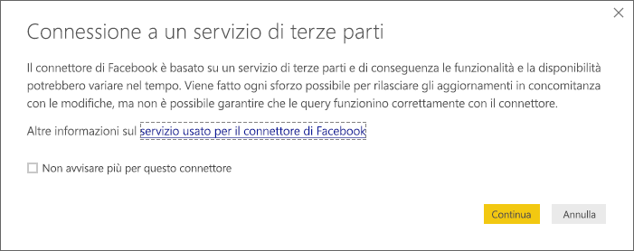
   
3. Selezionare **Continua**. Verrà visualizzata la finestra di dialogo **Facebook**.
   
4. Digitare o incollare il nome della pagina **microsoftbi** nella casella di testo **Nome utente** e selezionare **Post** dal menu a discesa **Connessione**, quindi selezionare **OK**.
   
   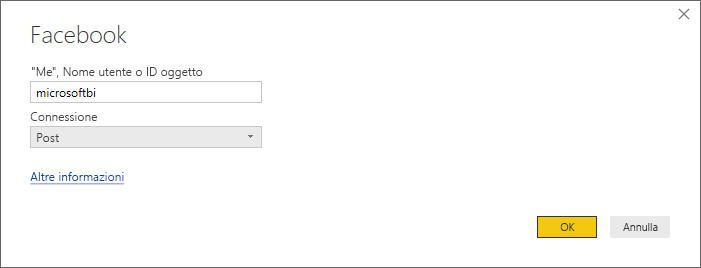
   
5. Alla richiesta di credenziali, accedere all'account Facebook e consentire l'accesso di Power BI attraverso il proprio account.
   
   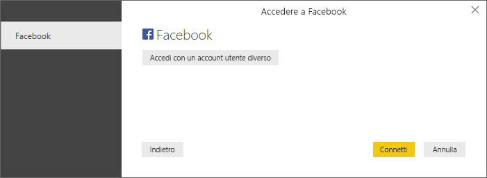

   Dopo la connessione alla pagina Facebook di Power BI, viene visualizzata un'anteprima dei dati **Post** della pagina. 
   
   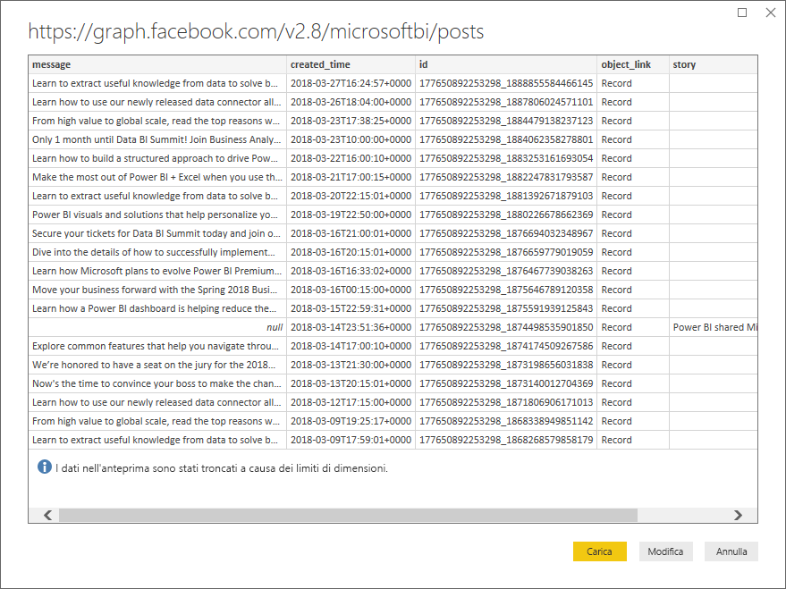
   
## Modellare e trasformare i dati importati

Si vogliono individuare e visualizzare i post con più commenti nel corso del tempo, ma nell'anteprima dei dati **Post** si nota che i dati **created_time** sono difficili da leggere e comprendere e che non sono disponibili dati sui commenti. È necessario eseguire alcune operazioni di data shaping e pulizia dei dati per ottenere il massimo da queste informazioni. È possibile usare l'**editor di Power Query** di Power BI Desktop per modificare i dati, prima o dopo l'importazione in Power BI Desktop. 

### Suddividere la colonna data/ora

Prima di tutto, separare i valori di data e ora nella colonna **created_time** per renderli più leggibili. 

1. Nell'anteprima dei dati di Facebook selezionare **Modifica**. 
   
   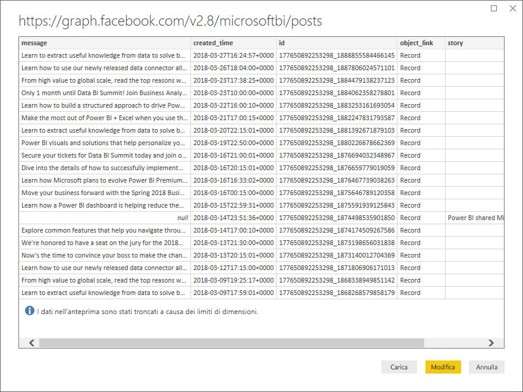
   
   L'**editor di Power Query** di Power BI Desktop si apre in una nuova finestra e visualizza l'anteprima dei dati dalla pagina Facebook di Power BI. 
   
   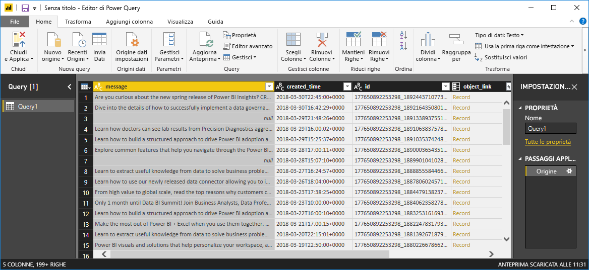
   
2. Selezionare la colonna **created_time**. Si noti che il tipo di dati della colonna è attualmente Testo, come indicato dall'icona **ABC** nell'intestazione di colonna. Fare clic con il pulsante destro del mouse sull'intestazione e scegliere **Dividi colonna > In base al delimitatore** nel menu a discesa oppure selezionare **Dividi colonna > In base al delimitatore** nel gruppo **Trasforma** nella scheda Home della barra multifunzione.  
   
   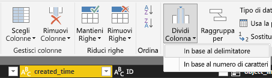
   
3. Nella finestra di dialogo **Suddividi colonna in base al delimitatore** selezionare **Personalizzato** nell'elenco a discesa, immettere **T** (il carattere che inizia la parte relativa all'ora dei valori di created_time) nel campo di input e quindi selezionare **OK**. 
   
   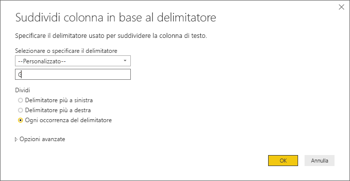
   
   La colonna viene divisa in due colonne che contengono le stringhe prima e dopo il delimitatore **T** e sono denominate rispettivamente **created_time.1** e **created_time.2**. Si noti che Power BI ha rilevato e modificato automaticamente i tipi di dati in **Date** per la prima colonna e **Time** per la seconda colonna, quindi ha formattato i valori di data e ora per renderli più leggibili.
   
4. Rinominare le colonne facendo doppio clic su ogni intestazione di colonna. In alternativa, selezionare ogni colonna e selezionare **Rinomina** nel gruppo **Qualsiasi colonna** della scheda **Trasforma** sulla barra multifunzione, quindi digitare rispettivamente le nuove intestazioni di colonna **created_date** e **created_time**.
   
   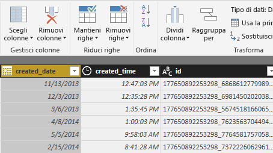
   
### Espandere la colonna annidata

Ora che i dati di data e ora hanno la forma desiderata, verranno esposti i dati sui commenti espandendo una colonna annidata. 

1. Selezionare la colonna **object_link** e quindi selezionare l' per aprire la finestra di dialogo **Espandi/aggrega**. Selezionare **connections** e quindi selezionare **OK**. 
   
   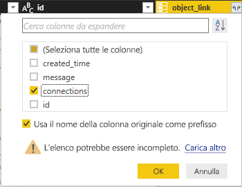
   
   L'intestazione di colonna diventa **object_link.connections**.
2. Selezionare di nuovo l' nella parte superiore della colonna **object_link.connections**, selezionare **comments** e quindi selezionare **OK**. L'intestazione di colonna diventa **object_link.connections.comments**.
   
3. Selezionare l' nella parte superiore della colonna **object_link.connections.comments** e questa volta selezionare **Aggrega** invece di Espandi nella finestra di dialogo. Selezionare **# Conteggio di id** e quindi selezionare **OK**. 
   
   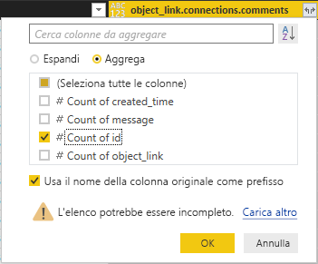
   
   La colonna visualizza ora il numero dei commenti per ogni messaggio. 
   
4. Rinominare la colonna **Conteggio di object_link.connections.comments.id** in **Numero di commenti**.
   
5. Selezionare la freccia verso il basso accanto all'intestazione **Numero di commenti** e selezionare **Ordinamento decrescente** per vedere i post ordinati in base al numero di commenti in ordine decrescente. 
   
   
   
### Rivedere i passaggi della query

Durante il data shaping e la trasformazione dei dati nell'**editor di Power Query**, ogni passaggio viene registrato nell'area **Passaggi applicati** del riquadro **Impostazioni query** sul lato destro della finestra dell'editor di Power Query. È possibile riesaminare i singoli passaggi applicati per vedere esattamente quali modifiche sono state effettuate ed eventualmente modificarle, eliminarle o riordinarle, anche se ciò può essere rischioso, perché la modifica di passaggi precedenti può invalidare passaggi successivi. 

Dopo aver applicato le trasformazioni dei dati finora eseguite, i passaggi applicati dovrebbero essere simili ai seguenti:
   
   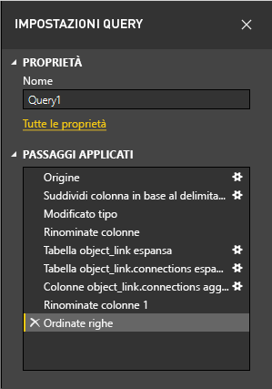
   
   >[!TIP]
   >Per ogni passaggio applicato vi sono le formule sottostanti scritte nel **linguaggio Power Query**, noto anche come linguaggio **M**. Per visualizzare e modificare le formule, selezionare **Editor avanzato** nel gruppo **Query** della scheda Home della barra multifunzione. 

### Importare i dati trasformati

Quando si è soddisfatti dei dati, selezionare **Chiudi e applica** > **Chiudi e applica** nella scheda Home della barra multifunzione per importarli in Power BI Desktop. 
   
   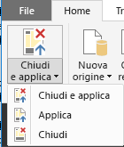
   
   Verrà visualizzata una finestra di dialogo che indica lo stato di avanzamento del caricamento dei dati nel modello di dati di Power BI Desktop. 
   
   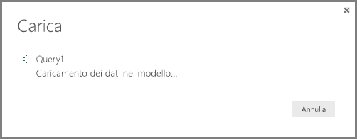
   
   Al termine del caricamento, i dati compaiono nella visualizzazione Report come nuova Query nell'elenco Campi.
   
   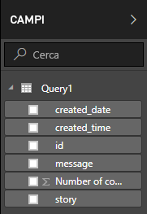
   
## Usare i dati nelle visualizzazioni dei report 

Dopo aver importato i dati dalla pagina Facebook, è possibile ricavare in maniera rapida e semplice informazioni approfondite sui dati usando le visualizzazioni. Creare una visualizzazione è semplice: basta selezionare un campo o trascinarlo dall'elenco **Campi** nell'area di disegno report.

### Creare un grafico a barre

1. Nella visualizzazione Report di Power BI Desktop, selezionare **message** dall'elenco dei campi oppure trascinarlo nell'area di disegno. Verrà visualizzata una tabella che mostra tutti i messaggi dei post nell'area di disegno. 
   
   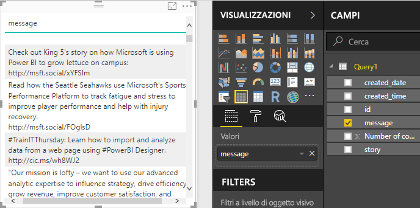
   
2. Con la tabella selezionata, selezionare anche **Numero di commenti** nell'elenco Campi oppure trascinarlo nella tabella. 
   
3. Selezionare l'icona **Grafico a barre in pila** nel riquadro Visualizzazioni. La tabella diventa un grafico a barre che mostra il numero di commenti per ogni post. 
   
   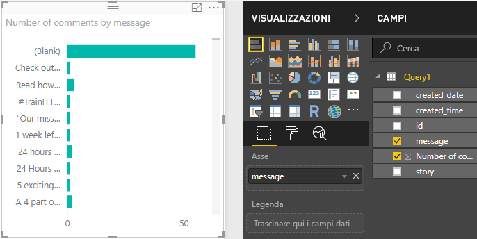
   
4. Selezionare i puntini di sospensione (...) nell'angolo superiore destro della visualizzazione e quindi selezionare **Ordina per Numero di commenti** per disporre la tabella in ordine decrescente in base al numero di commenti. 
   
   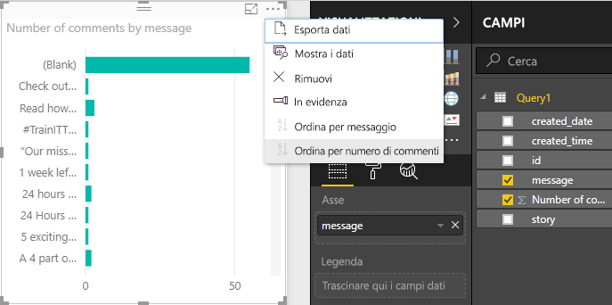
   
5. Si noti che la maggior parte dei commenti è stata associata allo stato **Vuoto**, ovvero senza messaggi, ma questi post potrebbero include storie, collegamenti, video o altri contenuti non testuali. Per escludere la riga Vuoto, selezionare **message (tutto)** in **Filtri** nella parte inferiore del riquadro Visualizzazioni, selezionare **Seleziona tutto** e quindi selezionare **Vuoto** per deselezionare questa opzione. La voce Filtri diventa **message non è (Vuoto)** e la riga Vuoto scompare dalla visualizzazione del grafico. 
   
   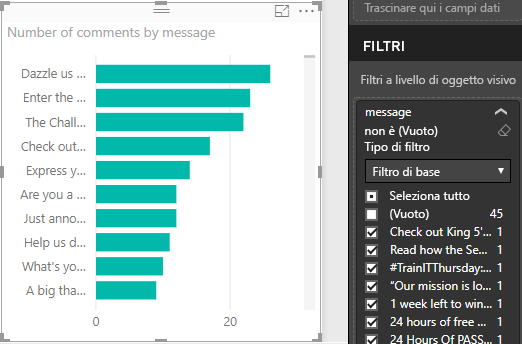
   
### Formattare il grafico

La visualizzazione è ora più interessante, ma non è possibile visualizzare gran parte del testo dei post nel grafico. Per visualizzare più testo dei post:

1. Usare i punti di controllo nella visualizzazione del grafico per ridimensionare il grafico in modo che diventi il più grande possibile. 
   
2. Con il grafico selezionato selezionare l'**icona Formato** (a forma di rullo per vernice) nel riquadro Visualizzazioni.
   
3. Selezionare la freccia verso il basso accanto ad **Asse y** e trascinare il dispositivo di scorrimento accanto a **Dimensioni massime** del tutto verso destra (50%). 
4. Ridurre anche **Dimensioni testo** a **10** in modo da visualizzare più testo.
   
   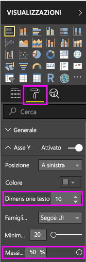
   
   Nel grafico viene ora visualizzato più contenuto dei post. 
   
   
   
L'asse X (numero di commenti) del grafico non mostra valori esatti ed è poco visibile nella parte inferiore del grafico. Per questo motivo, si decide di sostituirlo con etichette dei dati. 

1. Selezionare l'icona Formato e quindi selezionare il dispositivo di scorrimento accanto ad **Asse X** per impostarlo su **Disattiva**. 
   
2. Selezionare il dispositivo di scorrimento accanto a **Etichette dati** per impostarlo su **Attiva**. Il grafico mostra ora il numero esatto di commenti per ogni post.
   
   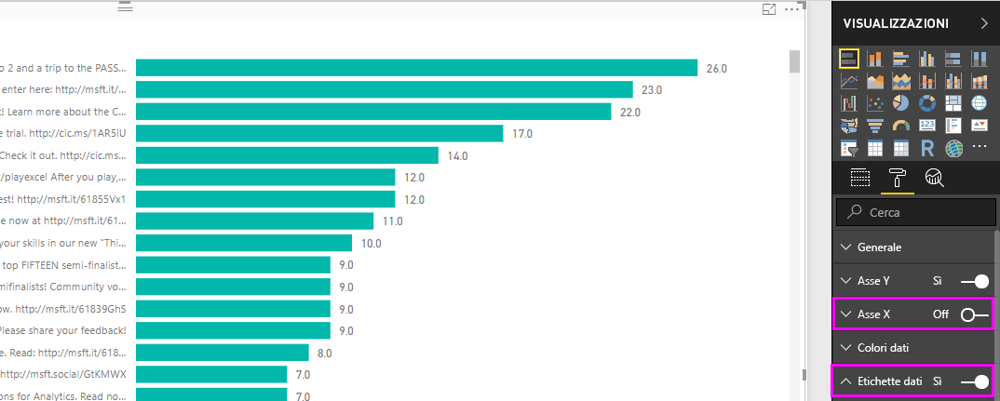
   
### Modificare il tipo di dati

La visualizzazione è migliore, ma tutte le etichette dei dati hanno la cifra decimale **.0**, che risulta un elemento di distrazione oltre a essere fuorviante, dato che **Numero di commenti** deve essere un numero intero. È necessario modificare il tipo di dati della colonna **Numero di commenti** impostando Numero intero.

1. Per modificare il tipo di dati, fare clic con il pulsante destro del mouse su **Query1** nell'elenco Campi o passare il mouse sul campo e selezionare i puntini di sospensione **Altre opzioni** (...), quindi selezionare **Modifica query**. È anche possibile selezionare **Modifica query** dall'area **Dati esterni** della scheda Home nella barra multifunzione e quindi selezionare **Modifica query** nell'elenco a discesa. L'**editor di Power Query** di Power BI Desktop viene aperto in una finestra separata.
   
   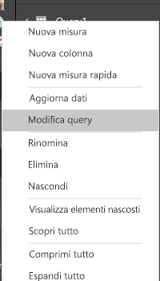     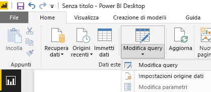
   
2. Nell'editor di Power Query selezionare la colonna **Numero di commenti** e impostare il tipo di dati su **Numero intero** come segue: 
   - Selezionare l'icona **1.2** accanto all'intestazione di colonna **Numero di commenti** e scegliere **Numero intero** nell'elenco a discesa, oppure
   - Fare clic con il pulsante destro del mouse sull'intestazione di colonna e quindi scegliere **Modifica tipo > Numero intero**, oppure
   - Selezionare **Tipo di dati: Numero decimale** nel gruppo **Trasforma** della scheda Home oppure nel gruppo **Qualsiasi colonna** della scheda **Trasforma** e selezionare **Numero intero**.
   
   L'icona nell'intestazione di colonna diventa **123**, che indica il tipo di dati Numero intero.
   
   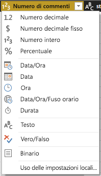
   
3. Selezionare **Chiudi e applica** o semplicemente **Applica** per applicare le modifiche, mantenendo aperta la finestra dell'editor di Power Query. Dopo aver caricato le modifiche, le etichette dei dati nel grafico diventano numeri interi. 
   
   
   
### Creare un filtro dei dati

Si vuole visualizzare il numero di commenti per i post nel corso del tempo. È possibile creare una visualizzazione filtro dei dati per filtrare i dati del grafico in base a intervalli di tempo diversi. 

1. Fare clic su un'area vuota dell'area di disegno e quindi selezionare l'**icona Filtro dei dati** nel riquadro Visualizzazioni. Verrà visualizzata una visualizzazione filtro dei dati vuota. 
   
   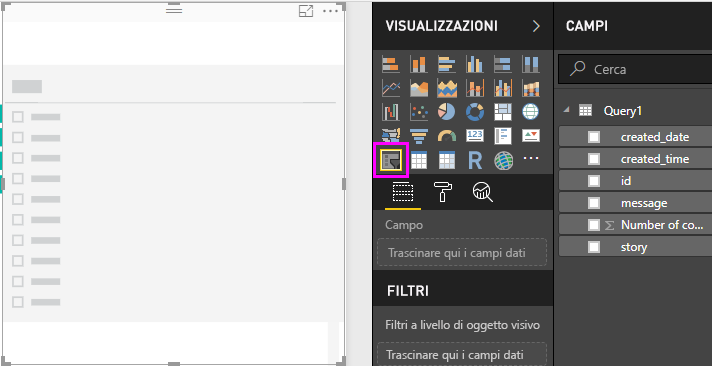
   
2. Selezionare il campo **created_date** nell'elenco Campi oppure trascinarlo nel nuovo filtro dei dati. Il filtro dei dati diventa un dispositivo di scorrimento dell'intervallo di date, basato sul tipo di dati Data del campo.
   
   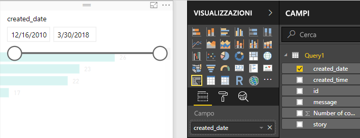
   
3. Spostare i punti di controllo del dispositivo di scorrimento per selezionare diversi intervalli di date e notare come vengono filtrati di conseguenza i dati del grafico. È anche possibile selezionare i campi di data nel filtro dei dati e digitare date specifiche o sceglierle da un calendario popup.
    
   
   
### Formattare le visualizzazioni

Si decide di assegnare al grafico un titolo più descrittivo e interessante. 

1. Con il grafico selezionato, selezionare l'icona **Formato** e selezionare la freccia in giù per espandere **Titolo**.
2. Specificare **Commenti per post** in **Testo titolo**. 
3. Selezionare la freccia in giù accanto a **Colore carattere** e selezionare un colore verde abbinato alle barre verdi della visualizzazione.
4. Aumentare **Dimensioni testo** a **10** e impostare **Famiglia di caratteri** su **Segoe (grassetto)** .

Sperimentare altre opzioni e impostazioni di formattazione per modificare l'aspetto delle visualizzazioni. 

## Creare altre visualizzazioni

Come si può notare, è facile personalizzare le visualizzazioni nel report per presentare i dati nel modo desiderato. Ad esempio, provare a usare i dati di Facebook importati per creare questo grafico a linee che mostra il numero di commenti nel corso del tempo.

Power BI Desktop offre un'esperienza end-to-end molto semplice, dal recupero di dati da una vasta gamma di origini dati, al data shaping per soddisfare le esigenze di analisi, fino alla visualizzazione dei dati in modi accattivanti e interattivi. Quando il report è pronto, è possibile [caricarlo nel servizio Power BI](desktop-upload-desktop-files.md) e creare dashboard basati sul report che potranno essere condivisi con altri utenti di Power BI.

## Passaggi successivi
* [Altre esercitazioni su Power BI Desktop](http://go.microsoft.com/fwlink/?LinkID=521937)
* [Video su Power BI Desktop](http://go.microsoft.com/fwlink/?LinkID=519322)
* [Forum di Power BI](http://go.microsoft.com/fwlink/?LinkID=519326)
* [Blog su Power BI](http://go.microsoft.com/fwlink/?LinkID=519327)

