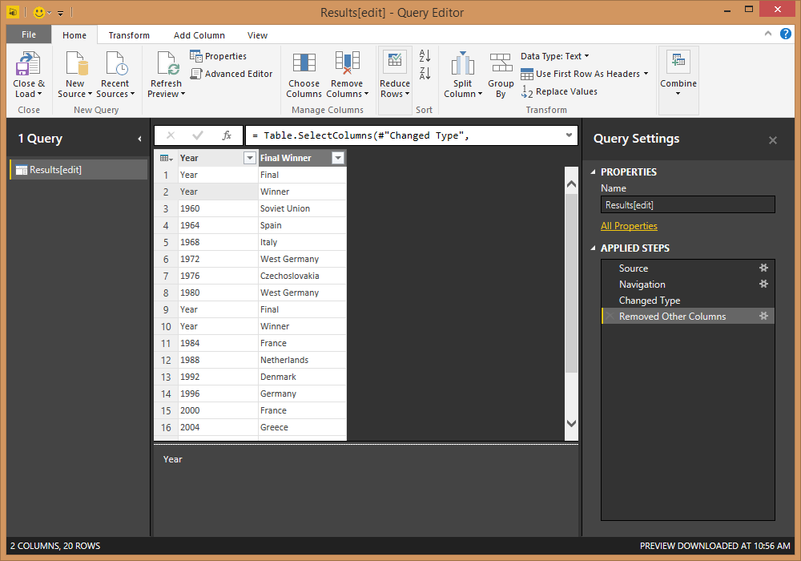
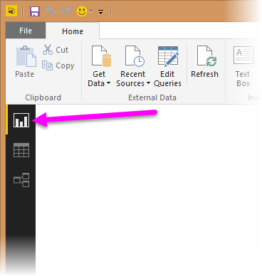
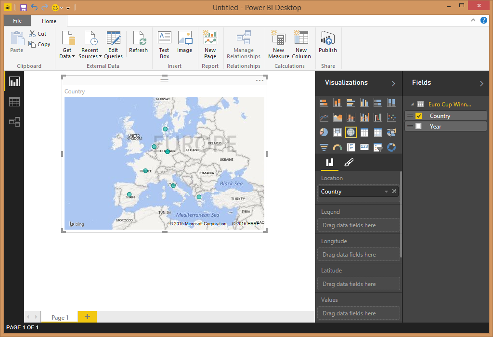
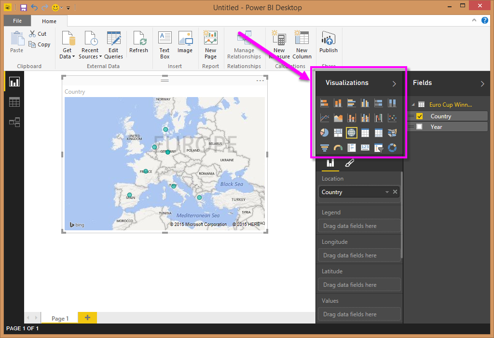

# Analisi dei dati della pagina Web usando Power BI Desktop (esercitazione)
Questa esercitazione illustra come importare una tabella di dati da una pagina Web e creare un report per visualizzare i dati. Come parte di questo processo, spostarsi tra le tabelle disponibili in una pagina Web e applicare passaggi di trasformazione dei dati per definire una nuova forma per la tabella.

 Contenuto dell'articolo:

* **Attività 1:** Connettersi a un'origine dati Web
* **Attività 2:** Effettuare operazioni di data shaping nella visualizzazione Query
  * Passaggio 1: Rimuovere altre colonne per visualizzare solo le colonne rilevanti
  * Passaggio 2: Sostituire i valori per pulire i valori in una colonna selezionata
  * Passaggio 3: Filtrare i valori in una colonna
  * Passaggio 4: Rinominare una colonna
  * Passaggio 5: Filtrare i valori Null in una colonna
  * Passaggio 6: Specificare un nome per una query
  * Passaggi della query creati
* **Attività 3:** Creare visualizzazioni con la visualizzazione Report
  * Passaggio 1: Caricare la query nel report
  * Passaggio 2: Creare una visualizzazione mappa

## Attività 1: Connettersi a un'origine dati Web
 Nell'attività 1 viene importata una tabella di riepilogo dei tornei dalla pagina di Wikipedia relativa alla coppa UEFA all'indirizzo http://en.wikipedia.org/wiki/UEFA\_European\_Football\_Championship

### Aggiungere un'origine dati di tipo pagina di Wikipedia
1. Nella finestra di dialogo **Attività iniziali** o nella scheda **Home** della barra multifunzione selezionare **Recupera dati**.
2. Verrà visualizzata la finestra di dialogo **Recupera dati** , in cui è possibile scegliere tra una vasta gamma di origini dati per importare dati in Power BI Desktop. Selezionare **Web** , disponibile nel gruppo **Tutte** o **Altro** .
3. Nella finestra di dialogo **Contenuto Web**, nella casella di testo **URL**, incollare l'URL di Wikipedia (http://en.wikipedia.org/wiki/UEFA\_European\_Football\_Championship).
4. Fare clic su **OK**.

Dopo avere stabilito una connessione alla pagina Web, nella finestra di dialogo **Strumento di navigazione** verrà visualizzato un elenco di tabelle disponibili in questa pagina di Wikipedia. È possibile fare un clic su ogni tabella per visualizzare l'anteprima dei dati.

Nel riquadro sinistro dello **Strumento di navigazione** selezionare la tabella **Results[edit]** per i risultati di Tournament Summary oppure selezionare la tabella **Results[edit]** e selezionare **Modifica**. Ciò permetterà di definire una nuova forma per la tabella prima di caricarla nel Report, perché la forma dei dati non corrisponde a quella necessaria per l'analisi.

Verrà visualizzata un'anteprima della tabella nella visualizzazione Query, in cui è possibile applicare un insieme di passaggi di trasformazione per pulire i dati.

## Attività 2: Definire una forma per i dati nella tabella in base all'argomento
Dopo la selezione della tabella in base all'argomento per la query di dati, verrà illustrato come eseguire diversi passaggi di data shaping e di pulizia dei dati.

**Passaggio 1:** Rimuovere altre colonne per visualizzare solo le colonne rilevanti

In questo passaggio vengono rimosse tutte le colonne ad eccezione di **Year** e **Final Winners**.

1. Nella griglia di **anteprima query**, selezionare le colonne **Year** e **Final Winners** (con **CTRL** + **clic**).
2. Fare clic con il pulsante destro del mouse su un'intestazione di colonna nella griglia **Anteprima query** , quindi scegliere **Rimuovi altre colonne** per rimuovere le colonne non selezionate. Si noti che questa operazione è disponibile anche nel gruppo **Gestisci colonne** della scheda della barra multifunzione **Home** .

**Passaggio 2:** Sostituire i valori per pulirli in una colonna selezionata

In questo passaggio viene sostituito il suffisso Details nella colonna **Year** . Si noti che questo suffisso si trova su una nuova riga, quindi non è visibile nell'anteprima della tabella. Se tuttavia si fa clic su una delle celle con un valore numerico nella colonna Year, nella visualizzazione dettagliata verrà visualizzato il valore completo.

1. Selezionare la colonna **Year** .
2. Sulla barra multifunzione **Visualizzazione Query** fare clic su **Sostituisci valori** nella scheda **Home** oppure fare clic con il pulsante destro del mouse sulla colonna **Year** , quindi scegliere **Sostituisci valori** per sostituire Details con testo vuoto.
3. Nella finestra di dialogo **Sostituisci valori** digitare Details nel casella di testo **Valore da trovare** e lasciare vuota la casella di testo **Sostituisci con** .
4. Fare clic su **OK**.

 **Passaggio 3:** Filtrare i valori in una colonna

In questo passaggio la colonna **Year** viene filtrata per visualizzare le righe che non contengono "Year".

1. Fare clic sulla freccia a discesa del filtro nella colonna **Year** .
2. Nell'elenco a discesa **Filtro** deselezionare l'opzione **Year** .
3. Fare clic su **OK**.

**Passaggio 4:** Rinominare una colonna

Dopo la pulizia dei dati nella colonna **Year** è possibile passare alla colonna **Final Winner** .

Dal momento che si sta esaminando solo l'elenco dei vincitori, è possibile rinominare questa colonna come **Country**.

1. Selezionare la colonna **Final Winner** nell'anteprima della query.
2. Sulla barra multifunzione **Visualizzazione Query** , nella scheda **Trasforma** e nel gruppo **Qualsiasi colonna** , è disponibile **Rinomina**.
3. In questo modo la colonna viene resa modificabile. La colonna verrà rinominata **Country**.

**Passaggio 5:** Escludere i valori Null in una colonna con un filtro

È anche necessario escludere tramite filtro i valori Null della colonna **Country** . Per ottenere questo risultato, è possibile usare il menu Filtro, come illustrato nel Passaggio 3, oppure è possibile eseguire la procedura seguente:

1. Fare clic con il pulsante destro del mouse su una delle celle della colonna **Country** che includono un valore Null.
2. Scegliere **Filtri per testo -\> Diverso da** nel menu di scelta rapida.
3. Verrà creato un nuovo passaggio di filtro per rimuovere le righe contenenti valori Null della colonna **Country** .

**Passaggio 6:** Specificare un nome per una query

In questo passaggio viene assegnato il nome **Euro Cup Winners**alla query finale.

1. Nella casella di testo **Nome** del riquadro **Impostazioni query** immettere **Euro Cup Winners**.
   
   

## Attività 3: Creare visualizzazioni con la visualizzazione Report
Dopo la conversione dei dati nella forma necessaria per l'analisi, è possibile caricare la tabella risultante nel report e creare alcune visualizzazioni.

**Passaggio 1:** Caricare la query nel report

Per caricare i risultati della query in Power BI Desktop e creare un report, selezionare **Chiudi e carica** dalla barra multifunzione **Home**.

Verrà attivata la valutazione della query e l'output della tabella verrà caricato nel report. In Power BI Desktop selezionare l'icona **Report** per Power BI Desktop in visualizzazione Report.

È possibile visualizzare i campi della tabella risultante nel riquadro **Campi** a destra della **Visualizzazione Report**.

**Passaggio 2:** Creare una visualizzazione mappa

Per creare una visualizzazione, è possibile trascinare i campi dall' **Elenco campi** e rilasciarli nell' **area di disegno report**.

1. Trascinare il campo **Country** e rilasciarlo nell' **area di disegno report**. Verrà creata una nuova visualizzazione nell' **area di disegno report**. In questo caso, dal momento che è disponibile un elenco di paesi, verrà creata una **visualizzazione Mappa**.
   
   
2. È possibile modificare con facilità il tipo di visualizzazione facendo clic su un'icona diversa nel riquadro **Visualizzazioni** .
   
   
3. Verrà lasciato il tipo di visualizzazione **mappa**. È anche possibile ridimensionare la visualizzazione trascinando uno degli angoli fino alle dimensioni desiderate.
   
   
4. Si noti che attualmente tutti i punti della mappa hanno la stessa dimensione. È possibile modificarli, in modo che i paesi che hanno vinto un numero maggiore di Coppe UEFA siano rappresentati da un punto di dimensioni maggiori sulla mappa. Per ottenere questo risultato, è possibile trascinare il campo **Year** dell' **Elenco campi** nella casella **Valori** nella parte inferiore del **riquadro Campi**.
   
   

Come si può notare, è molto semplice personalizzare le visualizzazioni nel report per presentare i dati nel modo desiderato. Power BI Desktop offre un'esperienza end-to-end molto semplice, dal recupero di dati da una vasta gamma di origini dati, al data shaping per soddisfare le esigenze di analisi, fino alla visualizzazione dei dati in modi accattivanti e interattivi. Quando il report è pronto, è possibile [caricarlo in Power BI](desktop-upload-desktop-files.md) e creare dashboard basati sul report che potranno essere condivisi con altri utenti di Power BI.

Questa operazione conclude l'esercitazione **Importazione di dati dal Web** . Il file di Power BI Desktop completato è disponibile per il download [qui](http://download.microsoft.com/download/1/4/E/14EDED28-6C58-4055-A65C-23B4DA81C4DE/Analyzing_Data_From_The_Web.pbix).

## Altre informazioni
* [Altre esercitazioni su Power BI Desktop](http://go.microsoft.com/fwlink/?LinkID=521937)
* [Video su Power BI Desktop](http://go.microsoft.com/fwlink/?LinkID=519322)
* [Forum di Power BI](http://go.microsoft.com/fwlink/?LinkID=519326)
* [Blog su Power BI](http://go.microsoft.com/fwlink/?LinkID=519327)

