# Esercitazione: Analizzare i dati di una pagina Web con Power BI Desktop

Si supponga di voler creare un report sui vincitori delle diverse edizioni della Coppa UEFA. Con Power BI Desktop, è possibile importare questi dati da una pagina Web in un report e creare le relative visualizzazioni. In questa esercitazione viene illustrato come usare Power BI Desktop per:

- Connettersi a un'origine dati Web e spostarsi tra le tabelle disponibili
- Definire una nuova forma e trasformare i dati nell'**Editor di Power Query**
- Assegnare un nome a una query e importarla in un report di Power BI Desktop e 
- Creare e personalizzare una mappa e una visualizzazione grafico a torta.

## Connettersi a un'origine dati Web

I dati sui vincitori della Coppa UEFA sono disponibili nella tabella dei risultati nella pagina di Wikipedia sulla Coppa UEFA all'indirizzo http://en.wikipedia.org/wiki/UEFA_European_Football_Championship. 

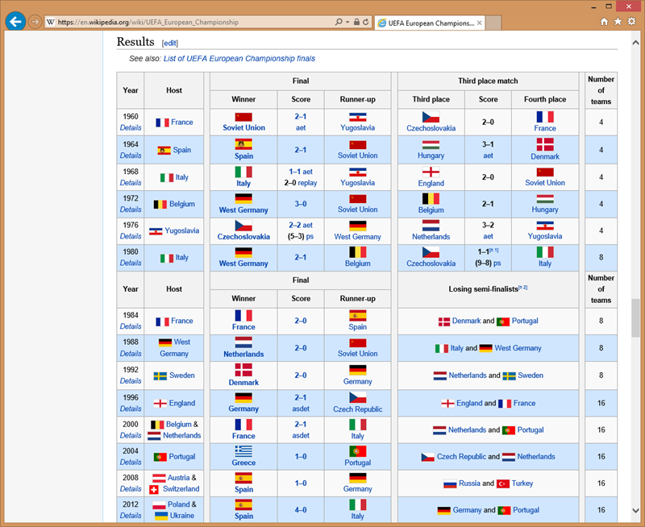

Si noti che le connessioni Web vengono stabilite solo mediante l'autenticazione di base. I siti Web che richiedono l'autenticazione potrebbero non funzionare correttamente con il connettore Web.

Per importare i dati:

1. Nella scheda **Home** della barra multifunzione di Power BI Desktop fare clic sul menu a discesa **Dati** e quindi selezionare **Web**.
   
   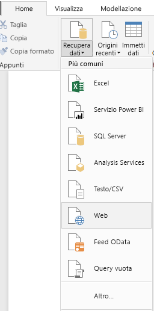 
   
   >[!NOTE]
   >È possibile selezionare direttamente la voce **Dati** oppure selezionare **Recupera dati** nella finestra di dialogo **Attività iniziali** di Power BI, quindi selezionare **Web** nella sezione **Tutto** o **Altro** della finestra di dialogo **Recupera dati** e infine scegliere **Connetti**.
   
2. Nella finestra di dialogo **Da Web** incollare l'URL `http://en.wikipedia.org/wiki/UEFA_European_Football_Championship` nella casella di testo **URL** e quindi scegliere **OK**.
   
    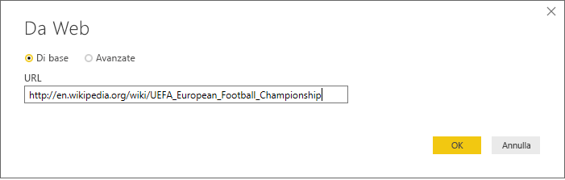
   
   Dopo la connessione alla pagina web di Wikipedia, la finestra di dialogo **Strumento di navigazione** di Power BI mostra un elenco delle tabelle disponibili nella pagina. È possibile selezionare uno qualsiasi dei nomi di tabella per visualizzare l'anteprima dei dati. La tabella **Results[edit]** contiene i dati richiesti, anche se non sono esattamente nella forma desiderata. Sarà possibile definire una nuova forma per la tabella e pulire i dati prima di caricarli nel report. 
   
   
   
   >[!NOTE]
   >Il riquadro **Anteprima** mostra la tabella più recente selezionata, ma tutte le tabelle selezionate verranno caricate nell'**Editor di Power Query** quando si sceglie **Modifica** o **Carica**. 
   
3. Selezionare la tabella **Results[edit]** nell'elenco di **Strumento di navigazione** e quindi scegliere **Modifica**. 
   
   Un'anteprima della tabella verrà aperta nell'**Editor di Power Query**, in cui è possibile applicare trasformazioni per pulire i dati. 
   
   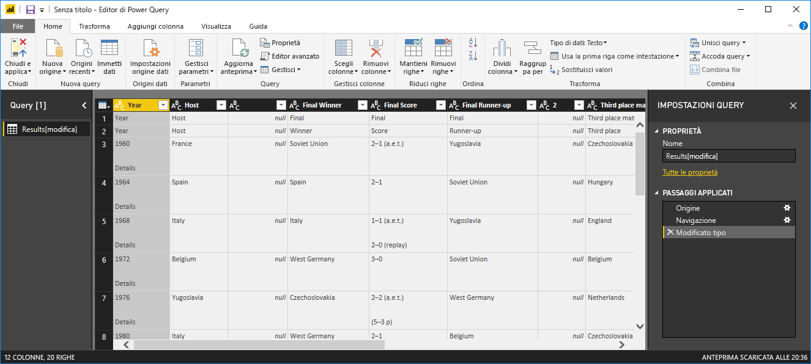
   
## Definire una forma per i dati nell'Editor di Power Query

È possibile rendere i dati più semplici da analizzare visualizzando solo gli anni e i paesi che hanno vinto. È possibile usare l'**Editor di Power Query** per eseguire questi passaggi per la modifica della forma dei dati e la relativa pulizia.

Per prima cosa, rimuovere dalla tabella tutte le colonne ad eccezione di **Year** e **Final Winners**.

1. Nella griglia dell'**Editor di Power Query** selezionare le colonne **Year** e **Final Winners** (tenendo premuto **CTRL** per selezionare più elementi).
   
2. Fare clic con il pulsante destro del mouse e scegliere **Rimuovi altre colonne** dall'elenco a discesa oppure selezionare **Rimuovi colonne** > **Rimuovi altre colonne** nel gruppo **Gestisci colonne** nella scheda **Home** della barra multifunzione per rimuovere tutte le altre colonne dalla tabella. 
   
   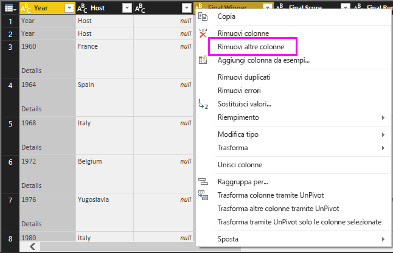 oppure 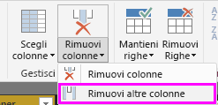

Successivamente, rimuovere la parola superflua **Details** dalle celle della colonna **Year**.

1. Selezionare la colonna **Year** .
   
2. Fare clic con il pulsante destro del mouse e scegliere **Sostituisci valori** dall'elenco a discesa oppure selezionare **Sostituisci valori** nel gruppo **Trasforma** della scheda **Home** della barra multifunzione (disponibile anche nel gruppo **Qualsiasi colonna** della scheda **Trasforma**). 
   
   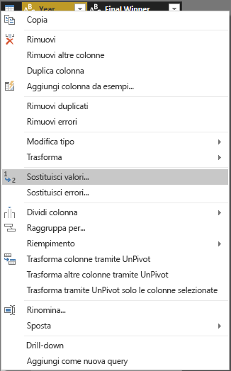 oppure 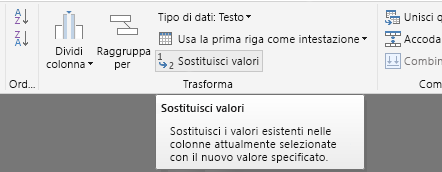
   
3. Nella finestra di dialogo **Sostituisci valori** digitare **Details** nella casella di testo **Valore da trovare**, lasciare vuota la casella di testo **Sostituisci con** e quindi scegliere **OK** per eliminare la parola "Details" dalle voci **Year**.
   
   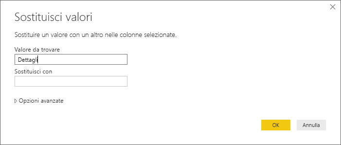

Alcune celle **Year** contengono solo la parola "Year" anziché i valori relativi agli anni. È possibile filtrare la colonna **Year** in modo da visualizzare solo le righe che non contengono la parola "Year". 

1. Selezionare la freccia a discesa del filtro nella colonna **Year**.
   
2. Nell'elenco a discesa scorrere verso il basso, deselezionare la casella di controllo accanto all'opzione **Year** e quindi scegliere **OK** per rimuovere le righe che hanno solo la parola "Year" nella colonna **Year**. 

   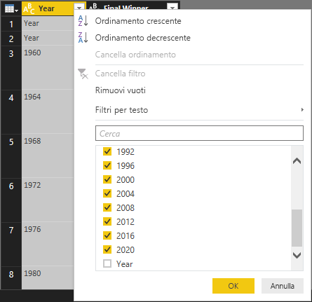

Dopo la pulizia dei dati nella colonna **Year** è possibile passare alla colonna **Final Winner**. Dal momento che si stanno esaminando solo i vincitori finali, è possibile rinominare questa colonna come **Country**. Per rinominare la colonna:

1. Fare doppio clic o toccare e tenere premuta l'intestazione di colonna **Final Winner** oppure 
   - Fare clic con il pulsante destro del mouse sull'intestazione di colonna **Final Winners** e selezionare **Rinomina** dall'elenco a discesa o 
   - Selezionare la colonna **Final Winners** e selezionare **Rinomina** nel gruppo **Qualsiasi colonna** nella scheda **Trasforma** della barra multifunzione. 
   
   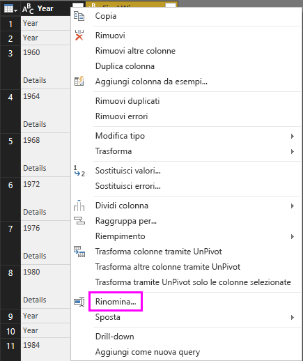 oppure 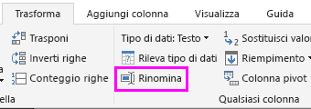
   
2. Digitare **Country** nell'intestazione e premere **INVIO** per rinominare la colonna.

È anche necessario escludere tramite filtro le righe come "2020" che contengono valori Null nella colonna **Country**. È possibile usare il menu Filtro come è stato fatto con i valori **Year** oppure è possibile:

1. Fare clic con il pulsante destro del mouse sulla cella **Country** nella riga **2020**, che contiene un valore *Null*. 
2. Scegliere **Filtri per testo** > **Diverso da** dal menu di scelta rapida per rimuovere tutte le righe contenenti tale valore nella cella.
   
   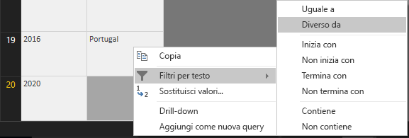
   
## Importare la query in visualizzazione Report

Dopo la conversione dei dati nella forma richiesta, è il momento di assegnare il nome "Euro Cup Winners" alla query e importarla nel report.

1. Nella casella di testo **Nome** del riquadro **Impostazioni query** digitare **Euro Cup Winners** e quindi premere **INVIO**.
   
   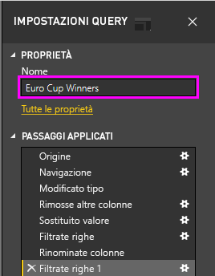

2. Selezionare **Chiudi e applica** > **Chiudi e applica** nella scheda **Home** della barra multifunzione.
   
   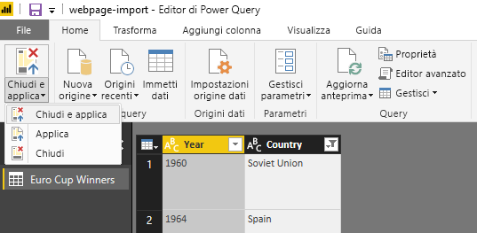
   
La query viene caricata in Power BI Desktop in **visualizzazione Report**, dove è possibile visualizzarla nel riquadro **Campi**. 
   
   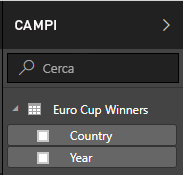
>[!TIP]
>È sempre possibile tornare all'**Editor di Power Query** per modificare e perfezionare la query come indicato di seguito:
>- Selezionare i puntini di sospensione ( **...** ) **Altre opzioni** accanto a **Euro Cup Winners** nel riquadro **Campi** e selezionare **Modifica query** dall'elenco a discesa oppure
>- Selezionare **Modifica query** > **Modifica query** nel gruppo **Dati esterni** della scheda **Home** della barra multifunzione in visualizzazione Report. 

## Creare una visualizzazione

Per creare una visualizzazione in base ai dati: 

1. Selezionare il campo **Country** nel riquadro **Campi** oppure trascinarlo nell'area di disegno del report. Power BI Desktop riconosce i dati come nomi di paesi e crea automaticamente una visualizzazione **Mappa**. 
   
   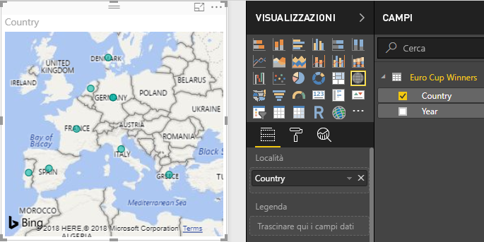
   
2. Aumentare le dimensioni della mappa trascinando i punti di controllo negli angoli in modo che tutti i nomi dei paesi vincitori siano visibili.  

   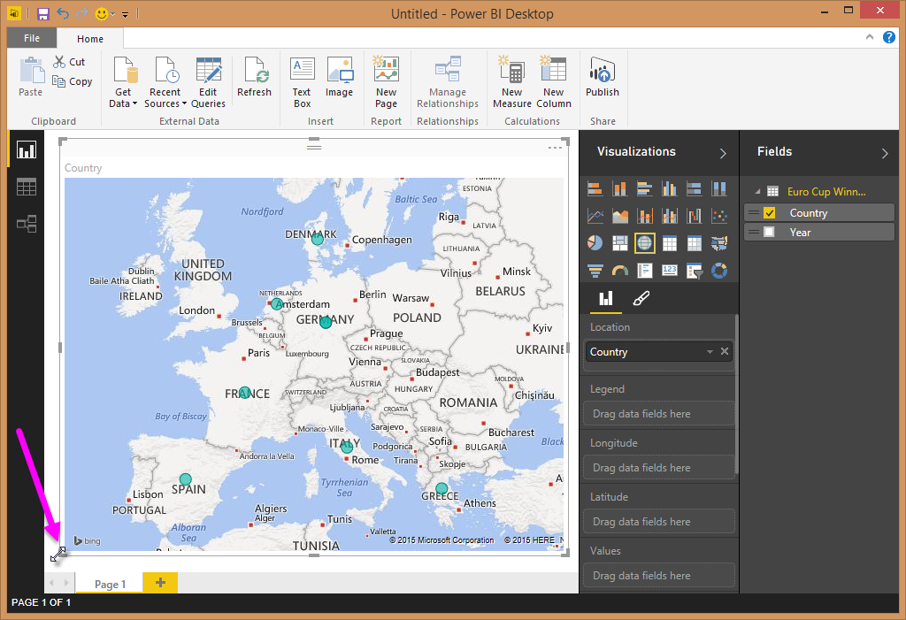
   
3. La mappa mostra punti dati identici per ogni paese che ha vinto un torneo nell'ambito della Coppa UEFA. Per fare in modo che le dimensioni di ogni punto dati rispecchi il numero di volte in cui quel paese ha vinto, trascinare il campo **Year** in **Trascinare qui i campi di dati** in **Dimensioni** nella parte inferiore del riquadro **Visualizzazioni**. Il campo viene automaticamente modificato in una misura **Count of Year** (Numero di anni) e la visualizzazione mappa mostra ora punti dati di dimensioni maggiori per i paesi che hanno vinto più tornei. 
   
   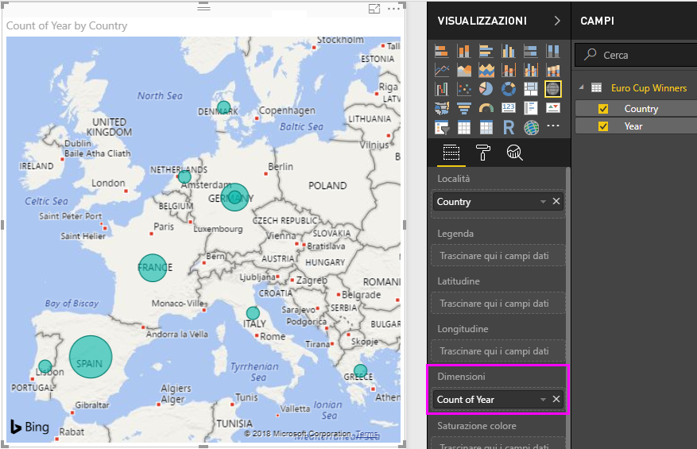
   

## Personalizzare la visualizzazione

Come si può notare, è molto facile creare visualizzazioni basate sui dati. È anche molto semplice personalizzare queste visualizzazioni per presentare meglio i dati nel modo desiderato. 

### Formattare la mappa
È possibile modificare l'aspetto di una visualizzazione selezionandola e quindi selezionando l'icona **Formato** (rullo) nel riquadro **Visualizzazioni**. Ad esempio, i punti dati relativi alla Germania riportati nella visualizzazione potrebbero essere fuorvianti, dal momento che la Germania Ovest ha vinto due coppe mentre la Germania ne ha vinta una e la mappa sovrappone i due punti anziché separarli o aggiungerli insieme. È possibile colorare questi due punti in modo differente per evidenziare questo aspetto. È anche possibile assegnare alla mappa un titolo più descrittivo e interessante. 

1. Con la visualizzazione selezionata, selezionare l'icona **Formato** e quindi selezionare **Colori dati** per espandere le opzioni di colore dei dati. 
   
   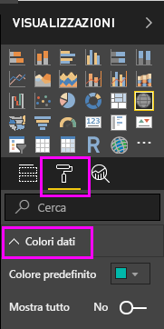
   
2. Impostare **Mostra tutto** su **Attivato** e quindi selezionare l'elenco a discesa accanto a **West Germany** e scegliere un colore giallo. 
   
   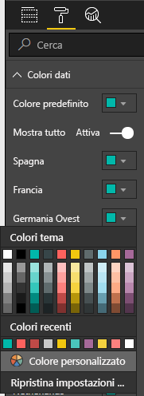
   
3. Selezionare **Titolo** per espandere le opzioni del titolo e nel campo **Testo titolo** digitare **Euro Cup Winners** al posto del titolo corrente. 
4. Impostare **Colore carattere** su rosso, **Dimensioni testo** su **12** e **Famiglia di caratteri** su **Segoe (grassetto)** . 
   
   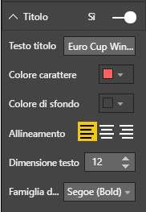
   

A questo punto la visualizzazione mappa è simile alla seguente:

   
### Modificare il tipo di visualizzazione
È possibile modificare il tipo di visualizzazione selezionandola e quindi selezionando un'icona diversa nella parte superiore del riquadro **Visualizzazioni**. Ad esempio, nella visualizzazione mappa non sono disponibili i dati per l'Unione Sovietica e la Cecoslovacchia, perché questi paesi non esistono più sul planisfero. Un altro tipo di visualizzazione, ad esempio una mappa ad albero o un grafico a torta, potrebbe essere più accurato dal momento che mostra tutti i valori. 

Per modificare la mappa in un grafico a torta, selezionare la mappa e quindi selezionare l'icona **Grafico a torta** nel riquadro **Visualizzazioni**. 
   
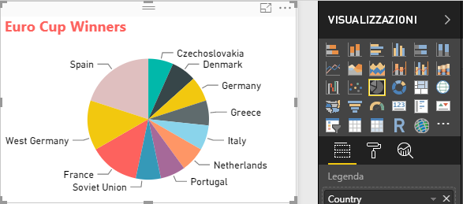

>[!TIP]
>- È possibile usare le opzioni di formattazione di **Colori dati** per assegnare lo stesso colore alla Germania e alla Germania Ovest. 
>- Per raggruppare i paesi che hanno ottenuto il maggior numero di vittorie nel grafico a torta, selezionare i puntini di sospensione ( **...** ) nella parte superiore destra della visualizzazione e quindi selezionare **Sort by Count of Year** (Ordina per numero di anni) dall'elenco a discesa. 

Power BI Desktop offre un'esperienza end-to-end molto semplice, dal recupero di dati da una vasta gamma di origini dati, al data shaping per soddisfare le esigenze di analisi, fino alla visualizzazione dei dati in modi accattivanti e interattivi. Quando il report è pronto, è possibile [caricarlo in Power BI](desktop-upload-desktop-files.md) e creare dashboard basati sul report che potranno essere condivisi con altri utenti di Power BI.

## Vedere anche
* [Altre esercitazioni su Power BI Desktop](http://go.microsoft.com/fwlink/?LinkID=521937)
* [Video su Power BI Desktop](http://go.microsoft.com/fwlink/?LinkID=519322)
* [Forum di Power BI](http://go.microsoft.com/fwlink/?LinkID=519326)
* [Blog su Power BI](http://go.microsoft.com/fwlink/?LinkID=519327)

