# <a name="dynamic-row-level-security-with-analysis-services-tabular-model"></a>Sicurezza a livello di riga dinamica con il modello tabulare di Analysis Services
Questa esercitazione illustra i passaggi necessari per implementare la **sicurezza a livello di riga** all'interno di un **modello tabulare di Analysis Services** e indica come usarlo in un report di Power BI. I passaggi descritti in questa esercitazione sono progettati per poter proseguire e apprendere i passaggi necessari per completare un set di dati di esempio.

Durante questa esercitazione viene fornita una descrizione dettagliata dei passaggi seguenti, utile per comprendere quali azioni occorre eseguire per implementare la sicurezza dinamica a livello di riga con un modello tabulare di Analysis Services:

* Creare una nuova tabella di sicurezza nel database **AdventureworksDW2012**
* Compilare il modello tabulare con tabelle dei fatti e delle dimensioni
* Definire i ruoli e le autorizzazioni per gli utenti
* Distribuire il modello in un'istanza **tabulare di Analysis Services**
* Usare Power BI Desktop per creare un report che visualizzi i dati corrispondenti all'utente che accede al report
* Distribuire il report nel **servizio Power BI**
* Creare un nuovo dashboard in base al report e, infine,
* Condividere il dashboard con i colleghi

Per seguire i passaggi di questa esercitazione è necessario il database **AdventureworksDW2012**, che si può scaricare dal **[repository](https://github.com/Microsoft/sql-server-samples/releases/tag/adventureworks)**.

## <a name="task-1-create-the-user-security-table-and-define-data-relationship"></a>Attività 1: Creare la tabella di sicurezza utente e definire le relazioni di dati
Sono disponibili molti articoli pubblicati che descrivono come definire la sicurezza dinamica livello di riga con il modello **tabulare SQL Server Analysis Services (SSAS)**. Per questo esempio si segue la lezione supplementare sull'[implementazione della sicurezza dinamica con i filtri di riga](https://msdn.microsoft.com/library/hh479759.aspx). I passaggi seguenti consentono di eseguire la prima attività dell'esercitazione:

1. Per l'esempio si userà il database relazionale **AdventureworksDW2012**. Nel database creare la tabella **DimUserSecurity**, come illustrato nell'immagine seguente. Per questo esempio verrà usato SQL Server Management Studio (SSMS) per creare la tabella.
   
   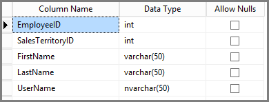
2. Dopo aver creato e salvato la tabella, è necessario creare la relazione tra la colonna **SalesTerritoryID** della tabella **DimUserSecurity** e la colonna **SalesTerritoryKey** della tabella **DimSalesTerritory**colonna, come illustrato nell'immagine seguente. Questa operazione può essere eseguita da **SSMS** facendo clic con il pulsante destro del mouse sulla tabella **DimUserSecurity** e selezionando **Progettazione**. Selezionare quindi **Progettazione tabelle -> Relazioni** dal menu.
   
   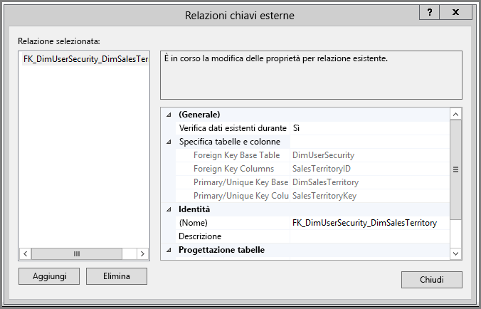
3. Salvare la tabella, quindi aggiungere alcune righe di informazioni utente nella tabella facendo nuovamente clic con il pulsante destro del mouse sulla tabella **DimUserSecurity** e quindi selezionando **Modifica le prime 200 righe**. Dopo aver aggiunto gli utenti, le righe della tabella **DimUserSecurity** avranno un aspetto simile a quello dell'immagine seguente:
   
   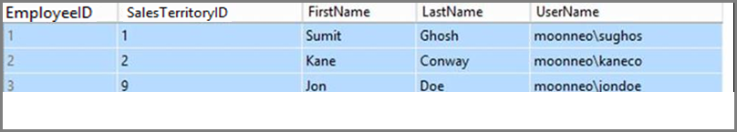
   
   Si tornerà a tali utenti nelle prossime attività.
4. Successivamente, viene eseguito un *inner join* con la tabella **DimSalesTerritory** che mostra i dettagli dell'area associati all'utente. Il codice seguente esegue l'*inner join* e l'immagine che segue illustra come viene visualizzata la tabella quando l' *inner join* viene eseguito correttamente.
   
       select b.SalesTerritoryCountry, b.SalesTerritoryRegion, a.EmployeeID, a.FirstName, a.LastName, a.UserName from [dbo].[DimUserSecurity] as a join  [dbo].[DimSalesTerritory] as b on a.[SalesTerritoryKey] = b.[SalesTerritoryID]
   
   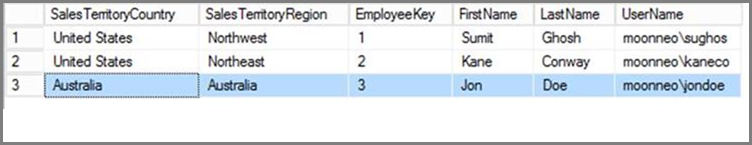
5. Si noti che l'immagine precedente mostra informazioni quali l'identità degli utenti responsabili di specifiche aree di vendita. Tali dati vengono visualizzati per effetto della relazione creata nel **passaggio 2**. Si noti anche che l'utente **Jon Doe fa parte dell'area di vendita Australia**. Gli aspetti correlati a Jon Doe saranno trattati nelle attività e nei passaggi che verranno eseguiti successivamente.

## <a name="task-2-create-the-tabular-model-with-facts-and-dimension-tables"></a>Attività 2: Compilare il modello tabulare con tabelle dei fatti e delle dimensioni
1. Dopo aver creato il data warehouse relazionale, è necessario definire il modello tabulare. Il modello può essere creato usando **SQL Server Data Tools (SSDT)**. Per altre informazioni su come definire un modello tabulare, vedere la [lezione relativa alla creazione di un modello tabulare](https://msdn.microsoft.com/library/hh231689.aspx).
2. Importare tutte le tabelle necessarie nel modello come illustrato di seguito.
   
    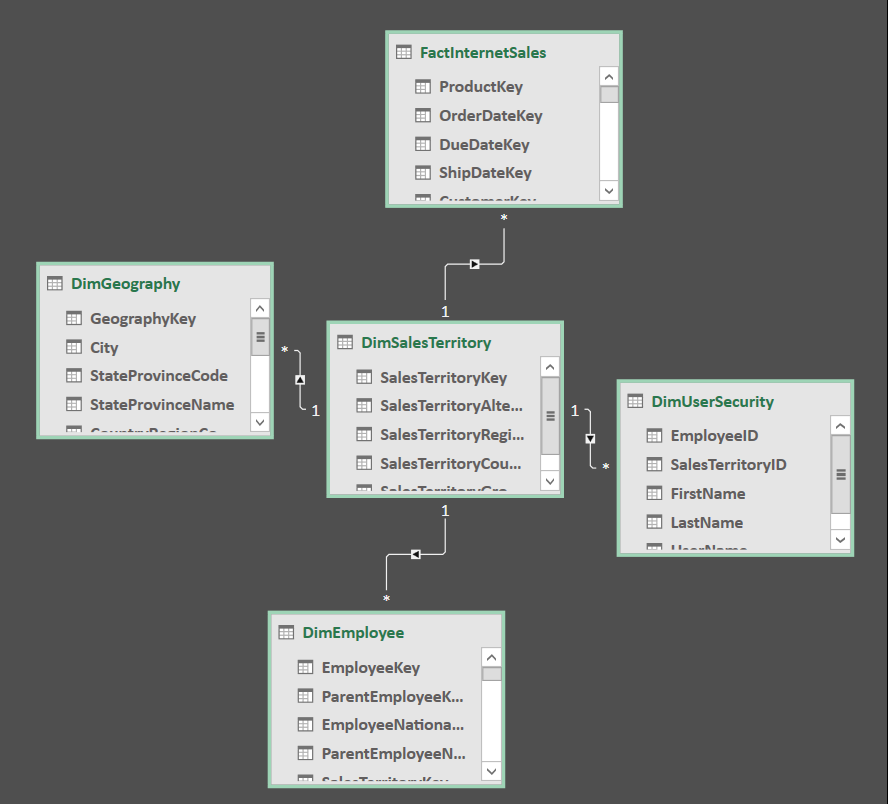
3. Dopo aver importato le tabelle necessarie, occorre definire un ruolo denominato **SalesTerritoryUsers** con autorizzazione di **lettura**. A questo scopo fare clic sul menu **Modello** in SQL Server Data Tools e quindi scegliere **Ruoli**. Nella finestra di dialogo **Gestione ruoli** fare clic su **Nuovo**.
4. Nella scheda **Membri** della finestra di dialogo **Gestione ruoli** aggiungere gli utenti definiti nella tabella **DimUserSecurity** al **passaggio 3 dell'attività 1**.
   
    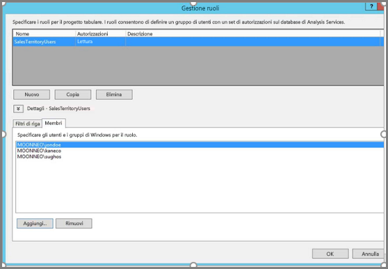
5. Successivamente, aggiungere le funzioni appropriate per le tabelle **DimSalesTerritory** e **DimUserSecurity**, come illustrato di seguito nella scheda **Filtri di riga**.
   
    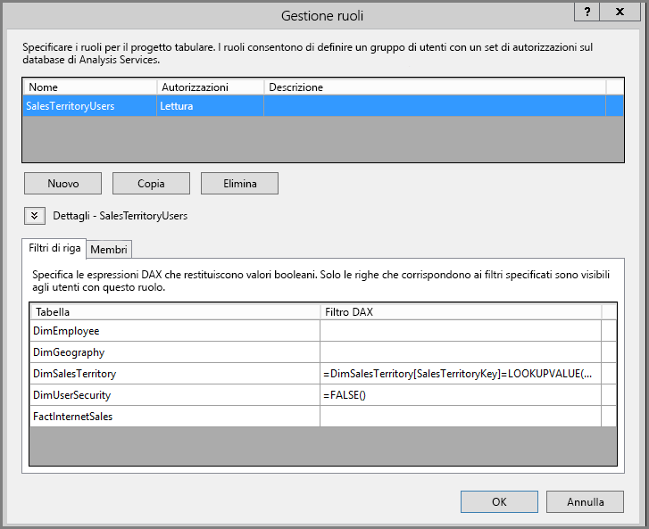
6. In questo passaggio verrà usata la funzione **LOOKUPVALUE** per restituire i valori per una colonna in cui il nome utente di Windows è uguale a quello restituito dalla funzione **USERNAME**. È possibile, quindi, limitare le query quando i valori restituiti da **LOOKUPVALUE** corrispondono ai valori nella stessa tabella o nella tabella correlata. Nella colonna **Filtro DAX** digitare la formula seguente:
   
       =DimSalesTerritory[SalesTerritoryKey]=LOOKUPVALUE(DimUserSecurity[SalesTerritoryID], DimUserSecurity[UserName], USERNAME(), DimUserSecurity[SalesTerritoryID], DimSalesTerritory[SalesTerritoryKey])
    In questa formula la funzione **LOOKUPVALUE** restituisce tutti i valori per la colonna **DimUserSecurity [SalesTerritoryID]**, dove **DimUserSecurity [UserName]** è uguale al nome utente di Windows connesso e **DimUserSecurity [SalesTerritoryID]** è uguale a **DimSalesTerritory [SalesTerritoryKey]**.
   
   Il set di Sales SalesTerritoryKey restituito da **LOOKUPVALUE** viene quindi usato per limitare le righe visualizzate in **DimSalesTerritory**. Vengono visualizzate solo le righe in cui **SalesTerritoryKey** per la riga si trova nel set di ID restituiti dalla funzione **LOOKUPVALUE**.
8. Per la tabella **DimUserSecurity**, digitare la formula seguente nella colonna **Filtro DAX**:
   
       =FALSE()

    Questa formula specifica che tutte le colonne vengono risolte nella condizione booleana false, quindi non è possibile eseguire query nelle colonne della tabella **DimUserSecurity**.
1. A questo punto è necessario elaborare e distribuire il modello. Per assistenza sulla distribuzione del modello, fare riferimento all'[articolo sulla distribuzione](https://msdn.microsoft.com/library/hh231693.aspx).

## <a name="task-3-adding-data-sources-within-your-on-premises-data-gateway"></a>Attività 3: Aggiunta di origini dati all'interno del gateway dati locale
1. Quando il modello tabulare è stato distribuito ed è pronto per l'uso, è necessario aggiungere una connessione origine dati al server tabulare di Analysis Services locale nel portale di Power BI.
2. Per consentire al **servizio Power BI** di accedere all'istanza di Analysis Services locale, è necessario che nell'ambiente sia installato e configurato un **[gateway dati locale](service-gateway-onprem.md)**.
3. Dopo aver configurato correttamente il gateway, è necessario creare una connessione all'origine dati per l'istanza tabulare di **Analysis Services**. Questo articolo descrive come [aggiungere un'origine dati nel portale di Power BI](service-gateway-enterprise-manage-ssas.md).
   
   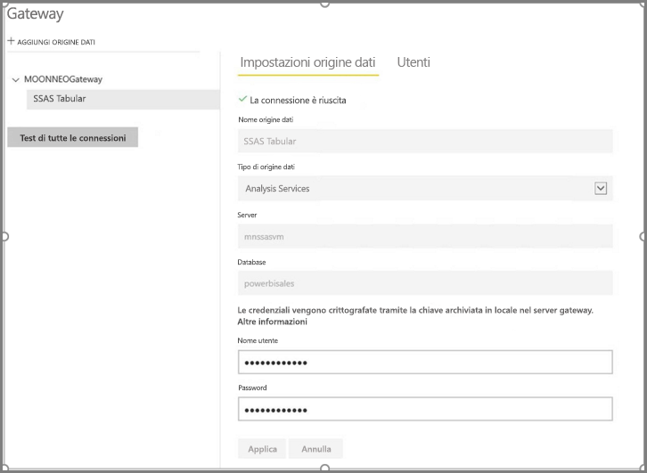
4. Dopo aver completato il passaggio precedente, il gateway è configurato e pronto per interagire con l'origine dati di **Analysis Services** locale.

## <a name="task-4-creating-report-based-on-analysis-services-tabular-model-using-power-bi-desktop"></a>Attività 4: Creazione di un report basato sul modello tabulare di Analysis Services usando Power BI Desktop
1. Avviare **Power BI Desktop** e selezionare **Recupera dati > Database**.
2. Dall'elenco delle origini dati selezionare **Database di SQL Server Analysis Services** e quindi **Connetti**.
   
   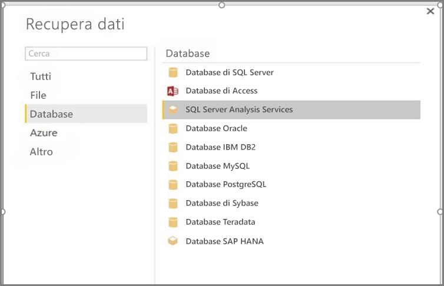
3. Inserire i dettagli dell'istanza tabulare di **Analysis Services** e selezionare **Connessione in tempo reale**. Selezionare **OK**. In **Power BI** la sicurezza dinamica funziona solo se si seleziona l'opzione **Connessione dinamica**.
   
   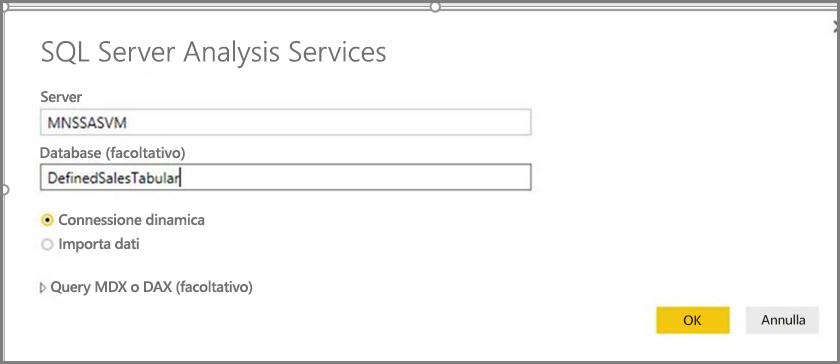
4. Si noterà che il modello distribuito si trova nell'istanza di **Analysis Services**. Selezionare il modello corrispondente, quindi selezionare **OK**.
   
   
5. In **Power BI Desktop** ora sono visualizzati tutti i campi disponibili, a destra dell'area di disegno nel riquadro **Campi**.
6. Nel riquadro **Campi** a destra selezionare la misura **SalesAmount** dalla tabella **FactInternetSales** e la dimensione **SalesTerritoryRegion** dalla tabella **SalesTerritory**.
7. Per mantenere la semplicità del report, al momento non verranno aggiunte altre colonne. Per una rappresentazione più significativa dei dati, la visualizzazione verrà impostata su **Grafico ad anello**.
   
   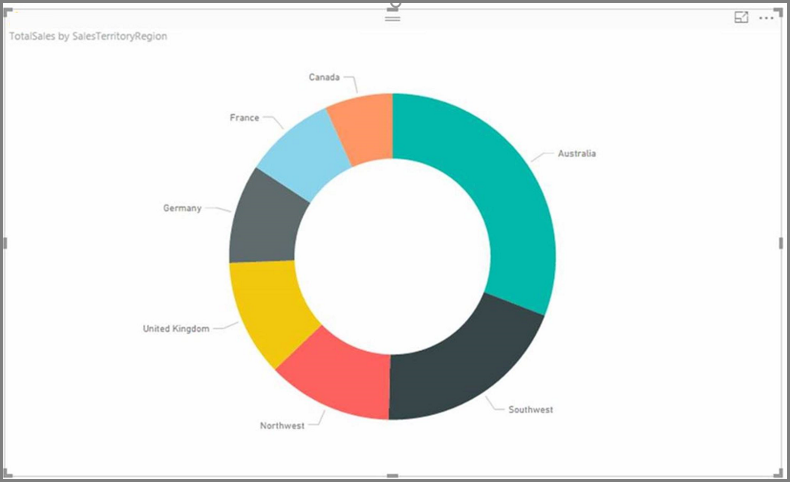
8. Quando il report è pronto, è possibile pubblicarlo direttamente nel portale di Power BI. Dalla barra multifunzione **Home** in **Power BI Desktop** selezionare **Pubblica**.

## <a name="task-5-creating-and-sharing-a-dashboard"></a>Attività 5: Creazione e condivisione di un dashboard
1. Dopo aver creato il report e fatto clic su **Pubblica** in **Power BI Desktop**, il report viene pubblicato nel servizio **Power BI**. Ora che è incluso nel servizio, è possibile fornire una dimostrazione di questo scenario di sicurezza del modello usando l'esempio creato nei passaggi precedenti.
   
   Nel suo ruolo, il **responsabile vendite - Sumit** può visualizzare i dati da tutte le varie aree di vendita. Quindi, crea il report (il report creato nei precedenti passaggi delle attività) e lo pubblica nel servizio Power BI.
   
   Dopo aver pubblicato il report, nel servizio Power BI crea un dashboard denominato **TabularDynamicSec** basato su tale report. Nell'immagine seguente si può notare che il responsabile vendite (Sumit) può visualizzare i dati corrispondenti a tutta l'area di vendita.
   
   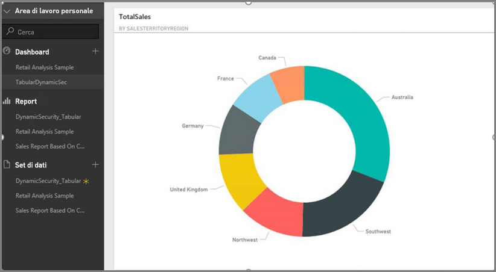
2. Ora Sumit condivide il dashboard con un collega, Jon Doe, responsabile delle vendite nell'area Australia.
   
   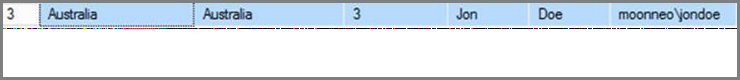
   
   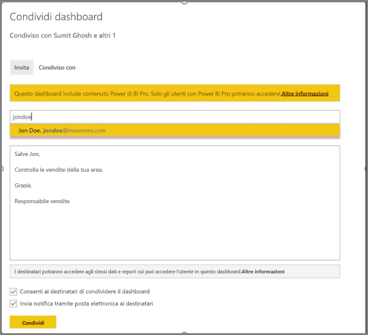
3. Quando Jon Doe accede al servizio **Power BI** e visualizza il dashboard condiviso creato da Sumit, dovrebbe vedere **solo** le vendite dall'area di cui è responsabile. Quindi Jon Doe effettua l'accesso, accede al dashboard che Sumit condivide con lui e vede **solo** le vendite dell'area Australia.
   
   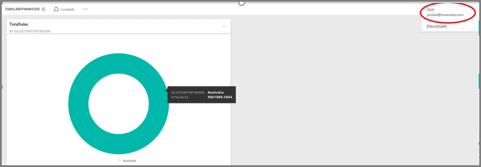
4. Congratulazioni! La sicurezza dinamica a livello di riga definita nel modello tabulare **Analysis Services** locale è stata correttamente applicata e rispettata nel servizio **Power BI**. Power BI usa la proprietà **effectiveusername** per inviare le credenziali dell'utente di Power BI corrente all'origine dati locale per eseguire le query.

## <a name="task-6-understanding-what-happens-behind-the-scenes"></a>Attività 6: Comprensione di ciò che accade "dietro le quinte"
1. Questa attività presuppone che si abbia familiarità con SQL Profiler perché è necessario acquisire una traccia di SQL Server Profiler nell'istanza tabulare di SSAS locale.
2. La sessione verrà inizializzata non appena l'utente (in questo caso, Jon Doe) accede al dashboard nel servizio Power BI. È possibile notare che il ruolo **salesterritoryusers** avrà effetto immediato con il nome utente effettivo **<EffectiveUserName>jondoe@moonneo.com</EffectiveUserName>**
   
       <PropertyList><Catalog>DefinedSalesTabular</Catalog><Timeout>600</Timeout><Content>SchemaData</Content><Format>Tabular</Format><AxisFormat>TupleFormat</AxisFormat><BeginRange>-1</BeginRange><EndRange>-1</EndRange><ShowHiddenCubes>false</ShowHiddenCubes><VisualMode>0</VisualMode><DbpropMsmdFlattened2>true</DbpropMsmdFlattened2><SspropInitAppName>PowerBI</SspropInitAppName><SecuredCellValue>0</SecuredCellValue><ImpactAnalysis>false</ImpactAnalysis><SQLQueryMode>Calculated</SQLQueryMode><ClientProcessID>6408</ClientProcessID><Cube>Model</Cube><ReturnCellProperties>true</ReturnCellProperties><CommitTimeout>0</CommitTimeout><ForceCommitTimeout>0</ForceCommitTimeout><ExecutionMode>Execute</ExecutionMode><RealTimeOlap>false</RealTimeOlap><MdxMissingMemberMode>Default</MdxMissingMemberMode><DisablePrefetchFacts>false</DisablePrefetchFacts><UpdateIsolationLevel>2</UpdateIsolationLevel><DbpropMsmdOptimizeResponse>0</DbpropMsmdOptimizeResponse><ResponseEncoding>Default</ResponseEncoding><DirectQueryMode>Default</DirectQueryMode><DbpropMsmdActivityID>4ea2a372-dd2f-4edd-a8ca-1b909b4165b5</DbpropMsmdActivityID><DbpropMsmdRequestID>2313cf77-b881-015d-e6da-eda9846d42db</DbpropMsmdRequestID><LocaleIdentifier>1033</LocaleIdentifier><EffectiveUserName>jondoe@moonneo.com</EffectiveUserName></PropertyList>
3. In base alla richiesta del nome utente effettivo, Analysis Services converte la richiesta nella credenziale moonneo\jondoe effettiva dopo l'esecuzione di query nell'istanza di Active Directory locale. Quando **Analysis Services** ottiene la credenziale effettiva da Active Directory, in base alle autorizzazioni dell'utente per l'accesso ai dati, **Analysis Services** restituisce solo i dati per cui l'utente ha l'autorizzazione.
4. Se si verificano altre attività con il dashboard, ad esempio se Jon Doe passa dal dashboard al report sottostante, in SQL Profiler si noterà una query specifica che viene nuovamente inviata al modello tabulare di Analysis Services come query DAX.
   
   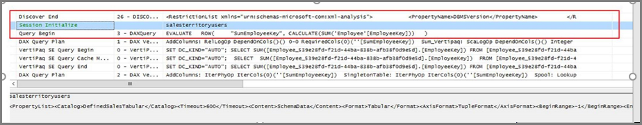
5. È anche possibile vedere di seguito la query DAX che viene eseguita per popolare i dati per il report.
   
   ```
   EVALUATE
     ROW(
       "SumEmployeeKey", CALCULATE(SUM(Employee[EmployeeKey]))
     )
   
   <PropertyList xmlns="urn:schemas-microsoft-com:xml-analysis">``
             <Catalog>DefinedSalesTabular</Catalog>
             <Cube>Model</Cube>
             <SspropInitAppName>PowerBI</SspropInitAppName>
             <EffectiveUserName>jondoe@moonneo.com</EffectiveUserName>
             <LocaleIdentifier>1033</LocaleIdentifier>
             <ClientProcessID>6408</ClientProcessID>
             <Format>Tabular</Format>
             <Content>SchemaData</Content>
             <Timeout>600</Timeout>
             <DbpropMsmdRequestID>8510d758-f07b-a025-8fb3-a0540189ff79</DbpropMsmdRequestID>
             <DbPropMsmdActivityID>f2dbe8a3-ef51-4d70-a879-5f02a502b2c3</DbPropMsmdActivityID>
             <ReturnCellProperties>true</ReturnCellProperties>
             <DbpropMsmdFlattened2>true</DbpropMsmdFlattened2>
             <DbpropMsmdActivityID>f2dbe8a3-ef51-4d70-a879-5f02a502b2c3</DbpropMsmdActivityID>
           </PropertyList>
   ```

## <a name="considerations"></a>Considerazioni
Quando si lavora con la sicurezza a livello di riga, SSAS e Power BI è necessario tenere presenti alcune considerazioni:

1. La sicurezza a livello di riga locale in Power BI è disponibile solo con la connessione dinamica.
2. Le eventuali modifiche apportate ai dati dopo l'elaborazione del modello saranno immediatamente disponibili per gli utenti che accedono al report con la **connessione dinamica** del servizio Power BI.

