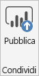
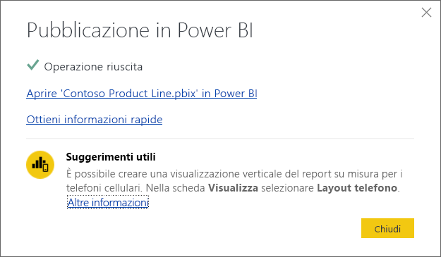

# Pubblicare set di dati e report da Power BI Desktop
Quando si pubblica un file di Power BI Desktop nel servizio Power BI, si pubblicano i dati del modello nell'area di lavoro di Power BI. Lo stesso accade per i report creati nella visualizzazione **Report**. Viene visualizzato un nuovo set di dati con lo stesso nome e tutti i report nello strumento di navigazione dell'area di lavoro.

La pubblicazione da Power BI Desktop consente di raggiungere lo stesso risultato di **Recupera dati** in Power BI per connettersi e caricare il file di Power BI Desktop.

> [!NOTE]
> Le modifiche apportate al report in Power BI non verranno salvate anche nel file originale di Power BI Desktop, nemmeno se si aggiungono, eliminano o modificano le visualizzazioni nei report.
> 
> 

## Per pubblicare un set di dati e i report di Power BI Desktop
1. In Power BI Desktop scegliere **File** \> **Pubblica** \> **Pubblica in Power BI** oppure scegliere **Pubblica** nella barra multifunzione.  

   

2. Accedere a Power BI.
3. Selezionare la destinazione.

   

Al termine del processo di pubblicazione, viene visualizzato un collegamento al report. Selezionare il collegamento per aprire il report nel sito di Power BI.

## Ripubblicare o sostituire un set di dati pubblicato da Power BI Desktop
Il set di dati e i report creati in Power BI Desktop vengono caricati nel sito Power BI quando si pubblica un file di Power BI Desktop. Quando si ripubblica il file di Power BI Desktop, il set di dati nel sito Power BI viene sostituito con il set di dati caricato dal file di Power BI Desktop.

Il processo è semplice, ma è necessario tenere presenti alcuni aspetti:

* Due o più set di dati in Power BI con lo stesso nome del file di Power BI Desktop potrebbero causare un errore nella pubblicazione. Verificare che in Power BI sia presente solo un set di dati con lo stesso nome. È anche possibile rinominare il file e pubblicarlo, creando un nuovo set di dati con lo stesso nome del file.
* Se si rinomina o si elimina una colonna o una misura, le visualizzazioni già presenti in Power BI che contengono questo campo potrebbero essere interrotte. 
* Power BI ignora alcune modifiche al formato delle colonne esistenti, ad esempio quando si modifica il formato di una colonna da 0,25% a 25%.
* Si supponga di avere una pianificazione dell'aggiornamento configurata per il set di dati esistente in Power BI. Quando si aggiungono nuove origini dati al file e quindi lo si pubblica nuovamente, è necessario accedervi prima del successivo aggiornamento pianificato.
* Quando si ripubblica un set di dati pubblicato da Power BI Desktop ed esiste una pianificazione di aggiornamento definita, viene avviato un aggiornamento del set di dati non appena si esegue la ripubblicazione. 

