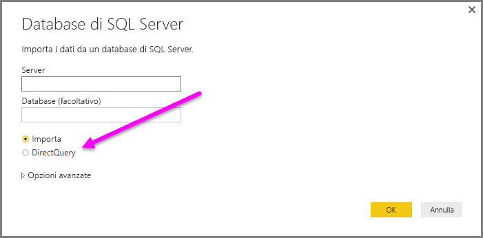
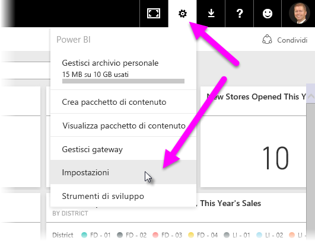
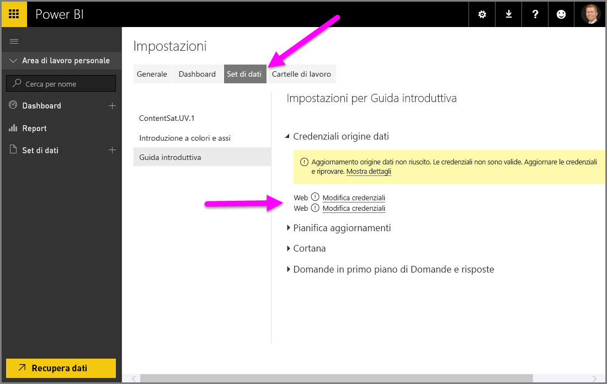

# Usare DirectQuery in Power BI Desktop
Con **Power BI Desktop**, quando ci si connette all'origine dati, è sempre possibile importare una copia dei dati in **Power BI Desktop**. Per alcune origini dati è disponibile un approccio alternativo: connettersi direttamente all'origine dati usando **DirectQuery**.

## Origini dati supportate
Per un elenco completo dei dati che supportano le origini dati **DirectQuery**, vedere [Origini dati supportate da DirectQuery](desktop-directquery-data-sources.md).

## Come connettersi con DirectQuery
Quando si usa **Recupera dati** per connettersi a un'origine dati supportata da **DirectQuery**, la finestra di connessione consente di selezionare la modalità di connessione.  

Le differenze tra la selezione di **Importa** e **DirectQuery** sono le seguenti:

**Importa** : le tabelle e le colonne selezionate vengono importate in **Power BI Desktop**. Quando si crea o si interagisce con una visualizzazione, **Power BI Desktop** usa i dati importati. È necessario aggiornare i dati, operazione che ripete l'importazione del set di dati completo, per visualizzare eventuali modifiche apportate ai dati sottostanti dopo l'importazione iniziale o l'aggiornamento più recente.

**DirectQuery**: nessun dato viene importato o copiato in **Power BI Desktop**. Per le origini relazionali, le tabelle e le colonne selezionate vengono visualizzate nell'elenco **Campi**. Per origini multidimensionali, ad esempio SAP Business Warehouse, le dimensioni e misure del cubo selezionato vengono visualizzate nell'elenco **Campi**. Quando si crea o si interagisce con una visualizzazione, **Power BI Desktop** esegue una query sull'origine dati sottostante, quindi i dati visualizzati sono sempre correnti.

Quando si usa **DirectQuery**sono disponibili molte modellazioni e trasformazioni dei dati, nonostante con alcune limitazioni. Durante la creazione o l'interazione con una visualizzazione, è necessario eseguire query sull'origine sottostante e il tempo necessario per aggiornare la visualizzazione dipende dalle prestazioni dell'origine dati sottostante. Quando i dati necessari per soddisfare la richiesta sono stati richiesti di recente, Power BI Desktop usa dati recenti per ridurre il tempo necessario per visualizzare la visualizzazione. Selezionare **Aggiorna** dalla barra multifunzione **Home** per garantire che tutte le visualizzazioni vengano aggiornate con i dati correnti.

L'articolo [Power BI e DirectQuery](desktop-directquery-about.md) descrive **DirectQuery** nel dettaglio. Vedere anche le sezioni seguenti per altre informazioni su vantaggi, limitazioni e considerazioni importanti relative all'uso di **DirectQuery**.

## Vantaggi dell'uso di DirectQuery
L'uso di **DirectQuery** comporta alcuni vantaggi:

* **DirectQuery** consente di creare visualizzazioni su set di dati molto grandi, in cui in caso contrario non sarebbe fattibile importare prima tutti i dati con la pre-aggregazione
* Le modifiche ai dati sottostanti possono richiedere un aggiornamento dei dati e, per alcuni report, la necessità di visualizzare i dati correnti può richiedere trasferimenti di dati di grandi dimensioni, rendendo impraticabile reimportare i dati. Al contrario, i report di **DirectQuery** usano sempre dati aggiornati
* La limitazione del set di dati da 1 GB *non* si applica a **DirectQuery**

## Limitazioni di DirectQuery
Esistono attualmente alcune limitazioni all'uso di **DirectQuery**:

* Tutte le tabelle devono provenire da un database singolo.
* Se la query dell'**editor di query** è eccessivamente complessa, si verifica un errore. Per risolvere l'errore è necessario eliminare il passaggio problematico nell'**Editor di query** o *importare* i dati invece di usare **DirectQuery**. Per origini multidimensionali, ad esempio SAP Business Warehouse, non è disponibile alcun **Editor di query**
* Il filtro delle relazioni è limitato a un'unica direzione, invece di includere entrambe le direzioni (benché sia possibile abilitare il filtro incrociato in entrambe le direzioni per **DirectQuery** come Funzionalità di anteprima). Per origini multidimensionali, ad esempio SAP Business Warehouse, non vengono definite relazioni nel modello
* Le funzionalità di Business Intelligence per le gerarchie temporali non sono disponibili in **DirectQuery**. Ad esempio, la gestione speciale delle colonne di date (anno, trimestre, mese, giorno e così via) non è supportata in modalità **DirectQuery**.
* Per impostazione predefinita, le limitazioni vengono inserite in espressioni DAX consentite nelle misurazioni. Per altre informazioni, vedere il paragrafo seguente (dopo questo elenco puntato).
* È previsto un limite di 1 milione di righe per la restituzione di dati quando si usa **DirectQuery**. Questo limite non influenza le aggregazioni o i calcoli usati per creare il set di dati restituiti usando **DirectQuery**, ma solo le righe restituite. Ad esempio, è possibile aggregare 10 milioni di righe con la query eseguita sull'origine dati e restituire in modo accurato i risultati di tale aggregazione a Power BI usando **DirectQuery** purché i dati restituiti a Power BI siano inferiori a 1 milione di righe. Se **DirectQuery** restituisce oltre 1 milione di righe, Power BI restituisce un errore.

Per assicurarsi che le prestazioni delle query inviate all'origine dati sottostante siano accettabili, vengono imposte limitazioni alle misure per impostazione predefinita. Gli utenti avanzati possono scegliere di ignorare questa limitazione selezionando **File > Opzioni e impostazioni > Opzioni**, quindi **DirectQuery** e infine l'opzione *Consenti misure senza limitazioni in modalità DirectQuery*. Quando questa opzione è selezionata, è possibile usare un'espressione DAX valida per una misura. Gli utenti, tuttavia, devono tenere presente che alcune espressioni, che hanno prestazioni molto elevate quando i dati vengono importati, possono restituire query molto lente nell'origine back-end quando sono in modalità DirectQuery.

## Considerazioni importanti relative all'utilizzo di DirectQuery
I tre punti seguenti devono essere presi in considerazione quando si usa **DirectQuery**:

* **Prestazioni e carico**: tutte le richieste di **DirectQuery** vengono inviate al database di origine, quindi il tempo necessario per aggiornare un oggetto visivo dipende dal tempo impiegato dell'origine back-end per fornire i risultati di una o più query. L'utilizzo di **DirectQuery** è consigliato se tempo di risposta per gli oggetti visivi, che include la restituzione dei dati richiesti, è inferiore a cinque secondi, con un tempo di risposta massimo per la restituzione dei risultati di 30 secondi. Tempi più lunghi renderebbero l'esperienza dell'utente che usa il report del tutto insoddisfacente. Inoltre, dopo aver pubblicato un report nel servizio Power BI, l'utente riceverà un errore di timeout per tutte le query che richiedono più di qualche minuto per l'esecuzione.
  
  È necessario prendere in considerazione anche il carico sul database di origine, in base al numero di utenti di Power BI che utilizzerà il report pubblicato. Anche l'utilizzo della *sicurezza a livello di riga* (RLS) può influire in modo significativo. Un riquadro del dashboard non RLS condiviso da più utenti produce una sola query al database, mentre se si usa RLS in un riquadro del dashboard, quando questo viene aggiornato in genere viene richiesta una singola query *per ogni utente*, il che aumenta in modo significativo il carico sul database di origine e, potenzialmente, può avere ripercussioni negative sulle prestazioni.
  
  Power BI crea query il più efficaci possibile. In determinate situazioni, tuttavia, la query generata potrebbe non essere abbastanza efficace da evitare un aggiornamento che non riesce. Ad esempio, quando una query generata recupera un numero eccessivamente elevato di righe, ossia oltre un milione, dall'origine dati back-end, si verifica l'errore seguente:
  
      The resultset of a query to external data source has exceeded
      the maximum allowed size of '1000000' rows.
  
  Questa situazione può verificarsi con un grafico semplice che include una colonna di cardinalità molto elevata, con l'opzione di aggregazione impostata su *Non riepilogare*. L'oggetto visivo deve contenere solo colonne con una cardinalità inferiore a un milione o deve avere i filtri appropriati applicati.
* **Sicurezza**: tutti gli utenti che utilizzano un report pubblicato si connettono all'origine dati back-end con le credenziali immesse dopo la pubblicazione del servizio Power BI. Si tratta della stessa situazione che si verifica quando si importano i dati: tutti gli utenti vedono gli stessi dati, indipendentemente dalle eventuali regole di sicurezza definite nell'origine back-end. I clienti che vogliono implementare la sicurezza per ogni utente con origini DirectQuery devono usare la sicurezza a livello di riga. [Altre informazioni sulla sicurezza a livello di riga](service-admin-rls.md).
* **Funzionalità supportate**: non tutte le funzionalità in **Power BI Desktop** sono supportate in modalità **DirectQuery** oppure presentano alcune limitazioni. Nel servizio Power BI sono disponibili anche alcune funzionalità, ad esempio *Informazioni rapide*, che non possono essere usate nei set di dati con **DirectQuery**. Di conseguenza, se si usa **DirectQuery** è necessario tenere presente la limitazione di queste funzionalità per decidere se usare o meno **DirectQuery**.   

## Pubblicare nel servizio Power BI
I report creati con **DirectQuery** potranno successivamente essere pubblicati nel servizio Power BI.

Se l'origine dati usata non necessita del **gateway dati locale** (**database SQL di Azure**, **Azure SQL Data Warehouse** o **Redshift**), è necessario specificare le credenziali prima che venga visualizzato il report pubblicato nel servizio Power BI.

È possibile fornire credenziali selezionando l'icona dell'ingranaggio **Impostazioni** in Power BI, quindi **Impostazioni**.

Power BI visualizza la finestra **Impostazioni** . Da qui, selezionare la scheda **Set di dati** e scegliere il set di dati che usa **DirectQuery**, quindi selezionare **Modifica credenziali**.

Fino a quando non vengono fornite credenziali, l'apertura di un report pubblicato o l'esplorazione di un set di dati creato con una connessione **DirectQuery** a tali origini dati genererà un errore.

Per le origini dati diverse dal **database SQL di Azure**, da **Azure SQL Data Warehouse** o da **Redshift** che usano DirectQuery, è necessario installare il **gateway dati locale** e l'origine dati deve essere registrata per stabilire una connessione dati. Sono disponibili [altre informazioni sul gateway dati locale](http://go.microsoft.com/fwlink/p/?LinkID=627094).

## Passaggi successivi
Per altre informazioni su **DirectQuery**, vedere le risorse seguenti:

* [DirectQuery in Power BI](desktop-directquery-about.md)
* [Data sources supported by DirectQuery](desktop-directquery-data-sources.md) (Origini dati supportate da DirectQuery)
* [DirectQuery e SAP BW](desktop-directquery-sap-bw.md)
* [DirectQuery and SAP HANA](desktop-directquery-sap-hana.md) (DirectQuery e SAP HANA)
* [Gateway dati locale](service-gateway-onprem.md)

