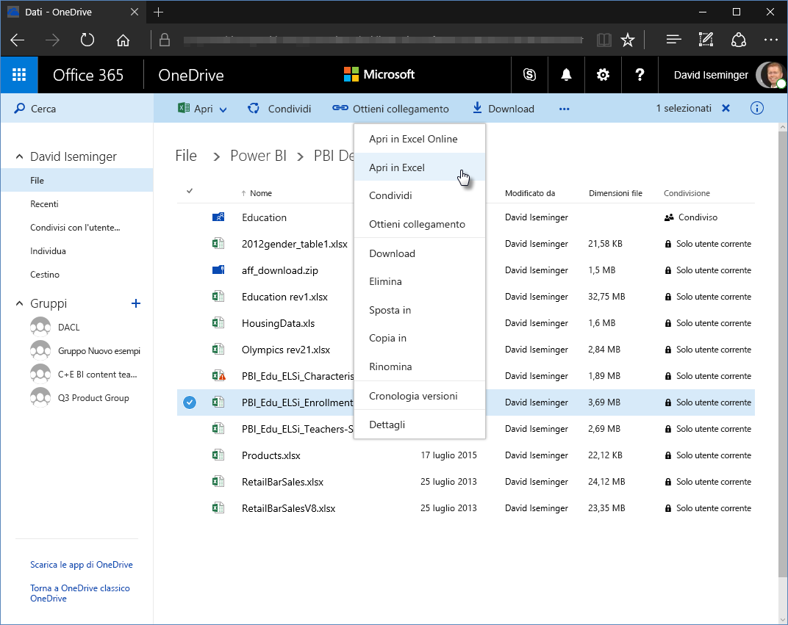
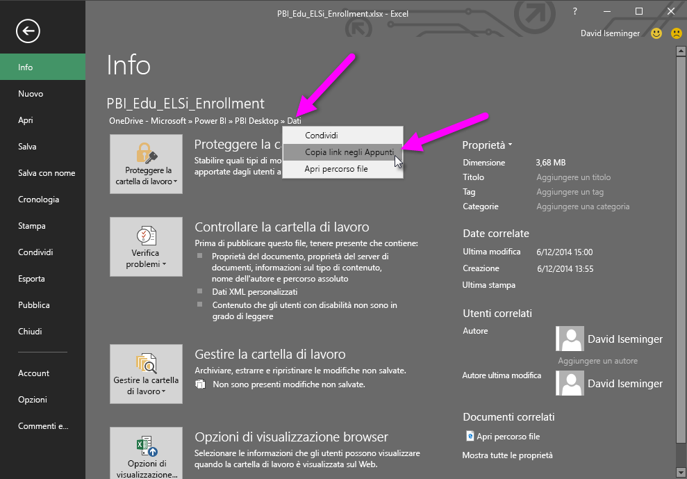
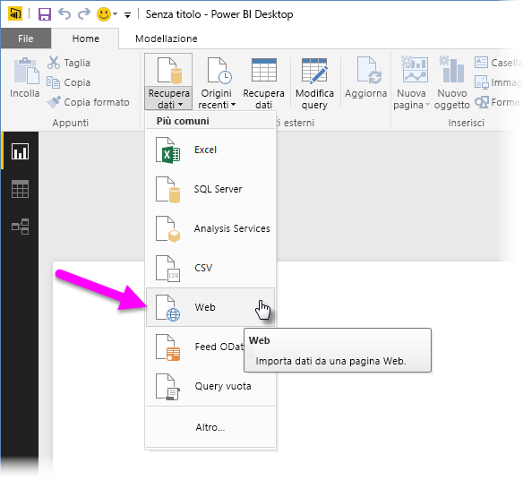
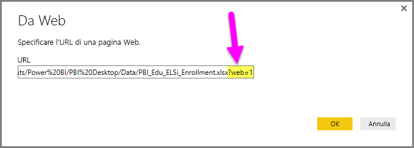
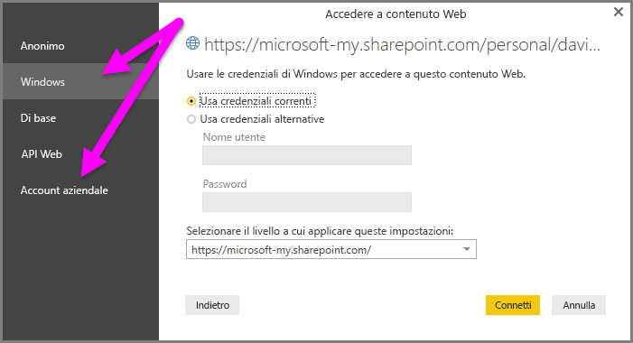

# Usare collegamenti OneDrive for Business in Power BI Desktop
Molti utenti archiviano le cartelle di lavoro di Excel nell'unità OneDrive for Business, ottima per l'uso con Power BI Desktop. Con **Power BI Desktop** è possibile usare collegamenti online per file **Excel** archiviati in **OneDrive for Business** per creare report e oggetti visivi. È possibile usare un account di gruppo di **OneDrive for Business** oppure il proprio account **OneDrive for Business** personale.

Per ottenere un collegamento online da **OneDrive for Business** sono necessari alcuni passaggi specifici. Le sezioni seguenti illustrano i passaggi che consentono di condividere il collegamento del file tra gruppi, tra computer e con i colleghi.

## Ottenere un collegamento da Excel, iniziando nel browser
1. Passare a OneDrive for Business usando un browser. Fare clic con il pulsante destro del mouse sul file da usare e quindi scegliere **Apri in Excel**.
   
   > [!NOTE]
> L'interfaccia del browser potrebbe non apparire esattamente come nell'immagine seguente. Esistono diversi modi per selezionare **Apri in Excel** per i file nell'interfaccia del browser di **OneDrive for Business**. È possibile usare qualsiasi opzione che consenta di aprire il file in Excel.
   > 
   > 
   
   
2. In **Excel** selezionare **File > Informazioni** e quindi selezionare il collegamento sopra il pulsante **Proteggi cartella di lavoro**. Selezionare **Copia link negli Appunti**. È possibile che nella versione in uso venga visualizzato **Copia percorso negli Appunti**.
   
   

## Usare il collegamento in Power BI Desktop
In Power BI Desktop è possibile usare il collegamento che è stato appena copiato negli Appunti. Eseguire queste operazioni:

1. In Power BI Desktop selezionare **Recupera dati > Web**.
   
   
2. Incollare il collegamento nella finestra di dialogo **Da Web**. **Non** selezionare ancora OK.
   
    
3. Si noti la stringa *?web=1* alla fine del collegamento. È necessario *rimuovere quella parte della stringa dell'URL Web* **prima** di selezionare **OK** per far sì che **Power BI Desktop** passi al file.
4. Se **Power BI Desktop** richiede le credenziali, scegliere **Windows** per i siti SharePoint locali o **Account aziendale** per i siti Office 365 o OneDrive for Business.
   
   

Verrà visualizzata la finestra **Strumento di navigazione** che consente di selezionare dall'elenco di tabelle, fogli e intervalli disponibili nella cartella di lavoro di Excel. Da qui è possibile usare il file di OneDrive for Business come qualsiasi altro file di Excel, creare report e usarli nei set di dati come con qualsiasi altra origine dati.

> [!NOTE]
> Per usare un file di **OneDrive for Business** come origine dati nel servizio Power BI, con l'**aggiornamento del servizio** abilitato per tale file, assicurarsi di selezionare **OAuth2** come **metodo di autenticazione** quando si configurano le impostazioni di aggiornamento. In caso contrario è possibile riscontrare un errore (ad esempio *L'aggiornamento delle credenziali dell'origine dati non è riuscito.*) quando si prova a connettersi o ad aggiornare. Selezionare **OAuth2** come metodo di autenticazione per risolvere l'errore delle credenziali.
> 
> 

