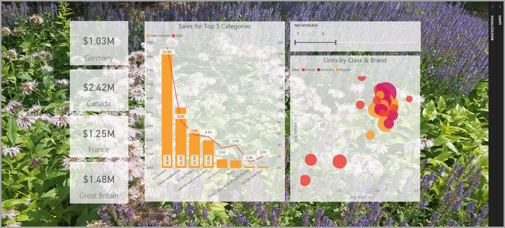
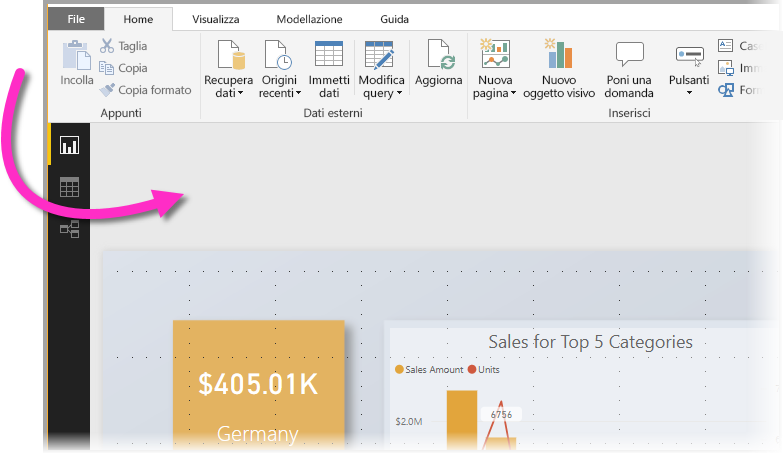
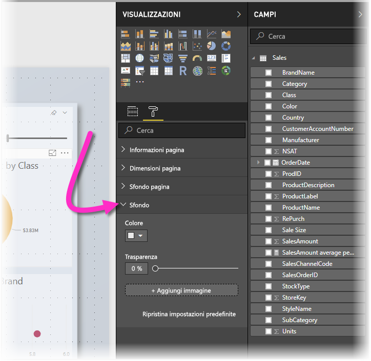
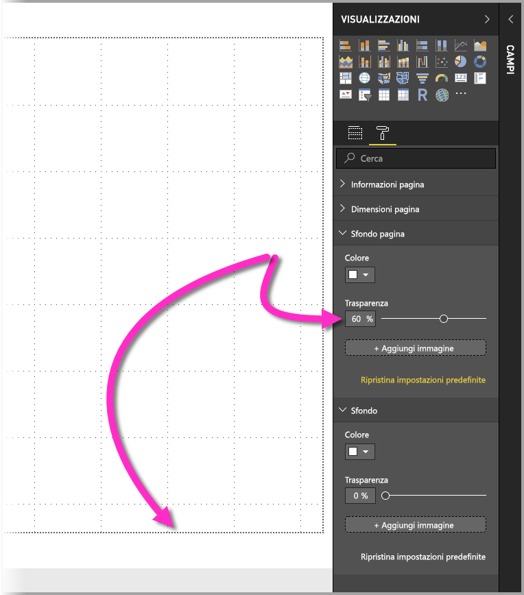
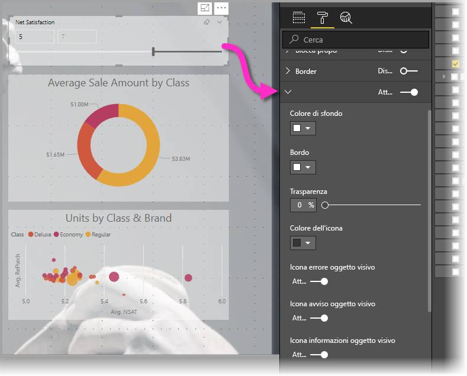
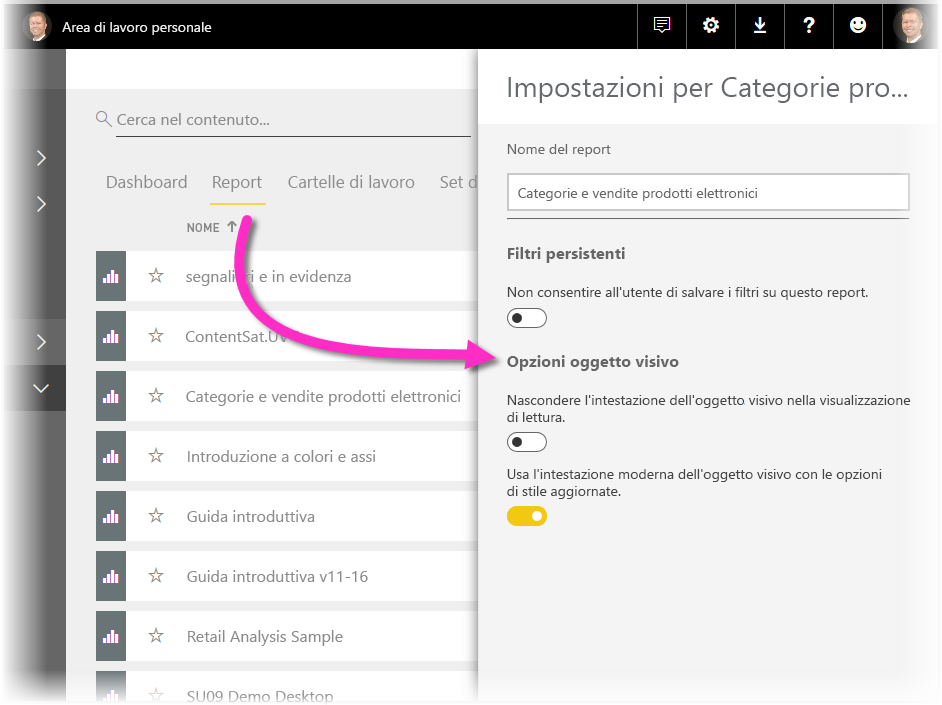
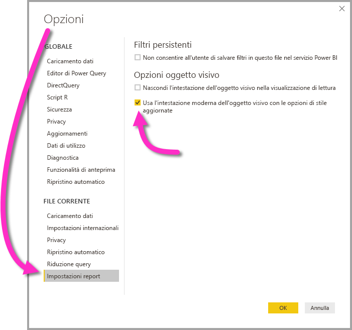

# Usare gli elementi visivi per migliorare i report di Power BI

Con **Power BI Desktop** è possibile usare elementi visivi, ad esempio lo sfondo e le intestazioni degli oggetti visivi migliorate, per ottimizzare l'aspetto dei report.

A partire dalla versione di luglio 2018 di **Power BI Desktop**, è possibile usare miglioramenti nei report e rendere ancora più interessanti le analisi e i report. I miglioramenti descritti in questo articolo includono i seguenti: 

* Applicare uno **sfondo** ai report in modo da migliorare o mettere in risalto gli elementi della storia che si vuole raccontare con i dati
* Usare **intestazioni degli oggetti visivi** migliorate per le singole visualizzazioni per creare oggetti visivi perfettamente allineati nell'area di disegno report. 

Le sezioni seguenti descrivono come usare questi miglioramenti e come applicarli ai report.

## Uso dello sfondo nei report di Power BI

È possibile formattare l'area grigia all'esterno nella pagina del report con uno **sfondo**. L'immagine seguente include una freccia che chiarisce la posizione dell'area di applicazione dello sfondo. 

È possibile impostare lo sfondo per le singole pagine del report o usare lo stesso sfondo per tutte le pagine. Per impostare lo sfondo in uso, toccare o fare clic sull'icona **Formattazione** senza oggetti visivi selezionati nel report. Nel riquadro verrà visualizzata la scheda **Sfondo**.

È possibile scegliere un colore da applicare come **sfondo** selezionando l'elenco a discesa **Colore** oppure è possibile selezionare il pulsante **Aggiungi immagine** per selezionare un'immagine da applicare come sfondo. È anche possibile applicare la trasparenza allo sfondo, sia per un colore che per un'immagine, usando il dispositivo di scorrimento **Trasparenza**.

È utile tenere presenti le definizioni seguenti che riguardano lo **sfondo**:

* L'area grigia all'esterno dell'area del report è l'area dello **sfondo**
* La parte dell'area di disegno in cui è possibile posizionare gli oggetti visivi è nota come **pagina** del report e può essere modificata nel **riquadro Formato** tramite l'elenco a discesa **Sfondo della pagina**.

La **pagina** del report si trova sempre in primo piano (rispetto allo sfondo), mentre lo **sfondo** è dietro e rappresenta l'elemento più in secondo piano nella pagina del report. Quando si applica la trasparenza alla pagina, questa viene applicata anche agli oggetti visivi nel report e in questo modo lo sfondo risulta visibile anche attraverso gli oggetti visivi.

Per tutti i nuovi report, le impostazioni predefinite sono le seguenti:

* Per la **pagina** del report è impostato il colore **bianco** e la relativa trasparenza è impostata su **100%**
* Per lo **sfondo** è impostato il colore **bianco** e la trasparenza è impostata su **% 0**

Quando si imposta lo sfondo della pagina su una trasparenza maggiore del 50%, viene visualizzato un bordo punteggiato mentre si crea o si modifica un report, in modo da visualizzare il limite del bordo dell'area di disegno report. 

È importante notare che il contorno punteggiato viene visualizzato *solo* durante la modifica del report e *non* è visibile per gli utenti che visualizzano il report pubblicato, ad esempio quando viene visualizzato nel **servizio Power BI**.

> [!NOTE]
> Se si usano sfondi di colore scuro e si imposta il colore del testo su bianco o su un colore molto chiaro, tenere presente che la funzionalità **Esporta in PDF** non include lo sfondo, quindi qualsiasi esportazione con caratteri bianchi sarà quasi invisibile nel file PDF esportato. Vedere [Esportare in formato PDF](desktop-export-to-pdf.md) per altre informazioni sulla funzionalità **Esporta in PDF**.

## Uso delle intestazioni degli oggetti visivi migliorate nei report di Power BI

A partire dalla versione di luglio 2018 di **Power BI Desktop**, le intestazioni per gli oggetti visivi nei report sono state migliorate significativamente. I principali miglioramenti sono che l'intestazione è stata scollegata dall'oggetto visivo e quindi la posizione può essere regolata in base alle proprie preferenze di layout e posizionamento e l'intestazione viene ora visualizzata all'interno dell'oggetto visivo anziché essere mobile al di sopra di esso. 

Per impostazione predefinita, l'intestazione viene visualizzata all'interno dell'oggetto visivo allineata con il titolo. Nell'immagine seguente, è possibile visualizzare l'intestazione (icona di aggiunta, icona di espansione e icona puntini di sospensione) all'interno dell'oggetto visivo e allineata a destra, lungo la stessa posizione orizzontale del titolo dell'oggetto visivo.

Se l'oggetto visivo non ha un titolo, l'intestazione è mobile sopra la parte superiore dell'oggetto visivo allineata a destra, come illustrato nell'immagine seguente. 

Se l'oggetti visivo è posizionato nella parte più in alto del report, l'intestazione dell'oggetto visivo viene invece bloccata nella parte inferiore dell'oggetto visivo. 

Ogni oggetto visivo include anche una scheda nella sezione **Formattazione** del riquadro **Visualizzazioni** denominata **Intestazione oggetto visivo**. In tale scheda è possibile modificare tutti i tipi di caratteristiche dell'intestazione dell'oggetto visivo

> [!NOTE]
> La visibilità degli interruttori non influisce sul report durante la creazione o la modifica del report. È necessario pubblicare il report e visualizzarlo in modalità di lettura per vedere l'effetto. Questo comportamento assicura che siano disponibili le numerose opzioni offerte per le intestazioni degli oggetti visivi e importanti durante la modifica, in particolare le icone di avviso che segnalano problemi durante la modifica.

Per i report visualizzati solo nel **servizio Power BI**, è possibile regolare l'uso delle intestazioni degli oggetti visivi in **Area di lavoro personale > Report** selezionando l'icona **Impostazioni**. In questa posizione vengono visualizzate le impostazioni per il report per cui sono state selezionate **Impostazioni** ed è possibile modificarle da questa posizione, come illustrato nell'immagine seguente.

### Abilitazione delle intestazioni degli oggetti visivi migliorate per i report esistenti

La nuova intestazione dell'oggetto visivo è il comportamento predefinito per tutti i nuovi report. Per i report esistenti, è necessario abilitare questo comportamento in **Power BI Desktop** passando a **File > Opzioni e impostazioni > Opzioni** e quindi nella sezione **Impostazioni report** selezionare la casella di controllo **Usa l'intestazione moderna dell'oggetto visivo con le opzioni di stile aggiornate**.

## Passaggi successivi
Per altre informazioni su **Power BI Desktop** e su come iniziare, vedere gli articoli seguenti.

* [Che cos'è Power BI Desktop?](desktop-what-is-desktop.md)
* [Panoramica delle query con Power BI Desktop](desktop-query-overview.md)
* [Origini dati in Power BI Desktop](desktop-data-sources.md)
* [Connettersi ai dati in Power BI Desktop](desktop-connect-to-data.md)
* [Effettuare il data shaping e combinare i dati con Power BI Desktop](desktop-shape-and-combine-data.md)
* [Attività di query comuni in Power BI Desktop](desktop-common-query-tasks.md)   

