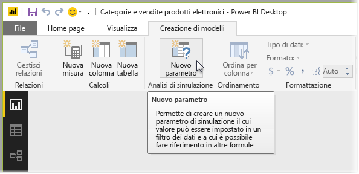
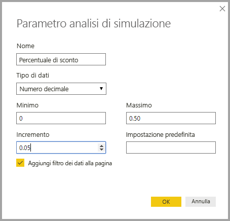
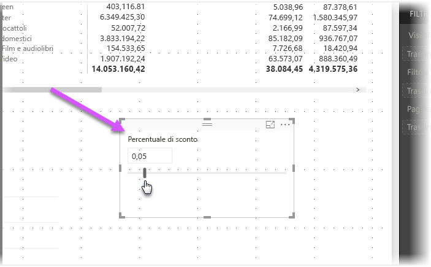
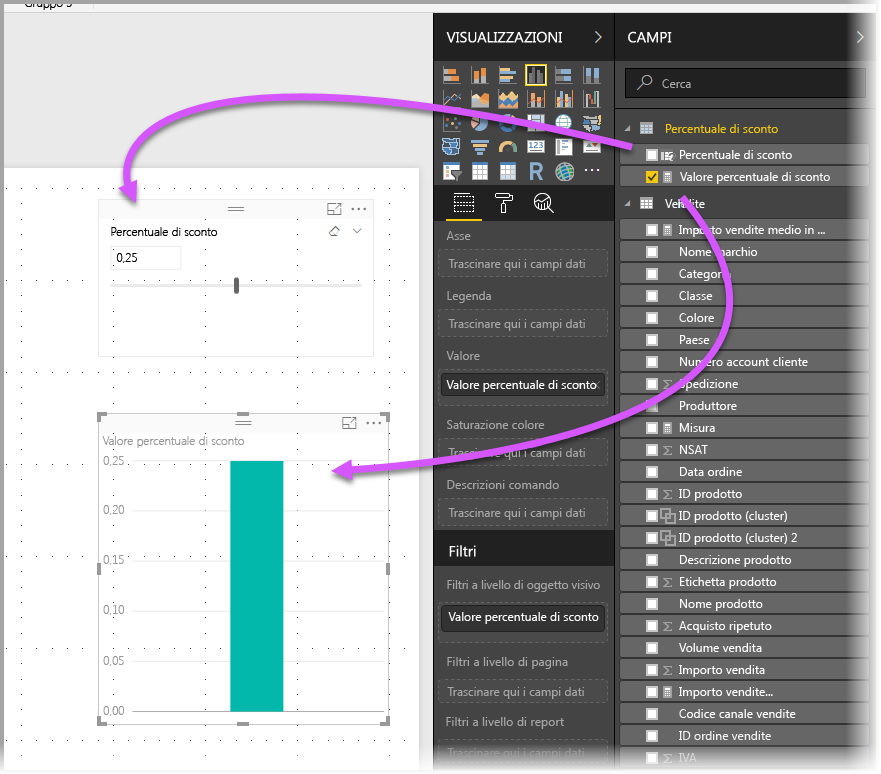
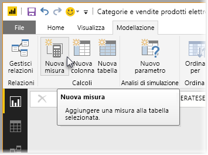
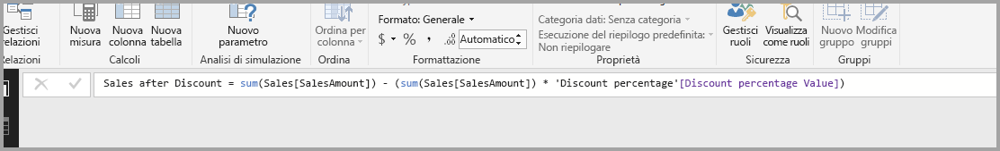
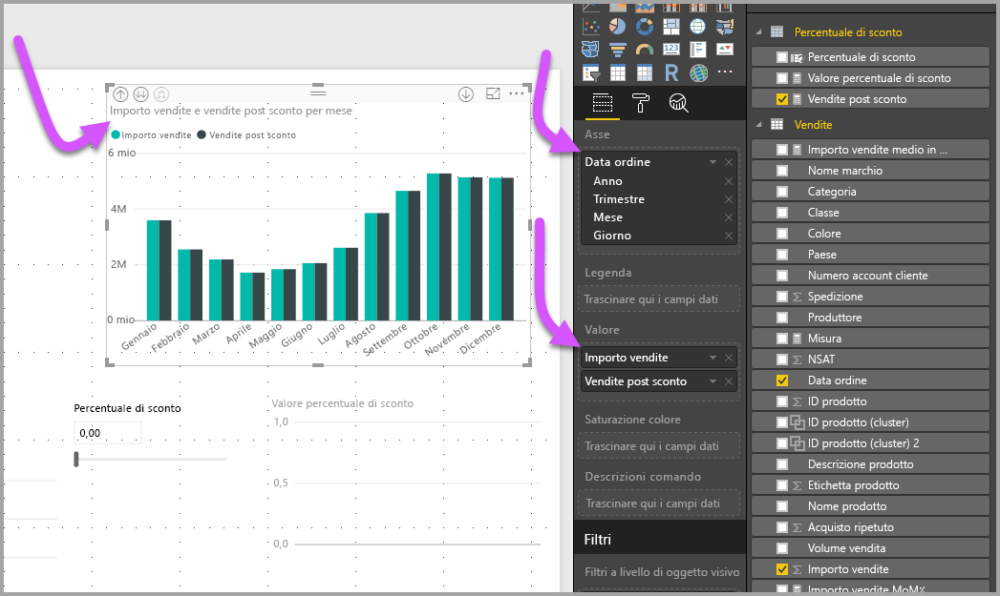
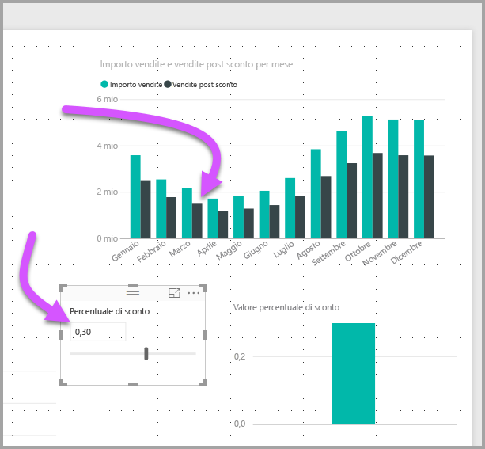

# Creare e usare un parametro analisi di simulazione per visualizzare le variabili in Power BI Desktop
A partire dalla versione di **Power BI Desktop** di agosto 2017, è possibile creare variabili di **analisi di simulazione** per i report, interagire con la variabile come filtro dei dati e quindi visualizzare e quantificare diversi valori principali nei report.

Il parametro **Analisi di simulazione** è disponibile nella scheda **Creazione di modelli** in **Power BI Desktop**. Dopo averlo selezionato, viene visualizzata una finestra di dialogo in cui è possibile configurare il parametro.

## Creazione di un parametro Analisi di simulazione
Per creare un parametro **Analisi di simulazione**, selezionare il pulsante **Analisi di simulazione** nella scheda **Creazione di modelli** in **Power BI Desktop**. Nell'immagine seguente è stato creato un parametro denominato *Discount percentage* con il tipo di dati impostato su *Numero decimale.* Il valore *Minimo* è zero e il valore *Massimo* è 0,50 (50%). L'*Incremento* è stato impostato su 0,05, ovvero il 5%. Si tratta dei valori in base a cui verrà regolato il parametro quando si interagisce con esso in un report.

> [!NOTE]
> Per i numeri decimali, assicurarsi di aggiungere lo zero iniziale come in 0,50 anziché lasciare solo ,50. In caso contrario, il numero non verrà convalidato e non sarà possibile selezionare il pulsante **OK**.
> 
> 

Per praticità, la casella di controllo **Aggiungi filtro dei dati alla pagina** aggiunge automaticamente un filtro dei dati con il parametro **Analisi di simulazione** nella pagina del report corrente.

Oltre a creare il parametro stesso, quando si crea un parametro **Analisi di simulazione** viene creata anche una misura che è possibile usare per visualizzare il valore corrente del parametro **Analisi di simulazione**.

È importante notare che una volta creato un parametro **Analisi di simulazione**, sia il parametro sia la misura diventano parte del modello. Saranno quindi disponibili in tutto il report e potranno essere usati anche in altre pagine del report. Inoltre, dal momento che fanno parte del modello, è possibile eliminare il filtro dei dati dalla pagina del report. Se lo si vuole ripristinare in seguito, sarà sufficiente riprendere il parametro **Analisi di simulazione** dall'elenco **Campi** e trascinarlo nel canvas, modificando l'oggetto visivo in filtro dei dati, per rendere di nuovo disponibile il parametro nel report.

## Utilizzo di un parametro Analisi di simulazione
Verrà ora creato un semplice esempio di utilizzo di un parametro **Analisi di simulazione**. Nella sezione precedente è stato creato il parametro **Analisi di simulazione**. Per osservare come funziona verrà creata una nuova misura il cui valore viene regolato con il dispositivo di scorrimento. Per eseguire questa operazione, verrà creata una nuova misura.

La nuova misura rappresenta l'importo totale delle vendite a cui è applicata la percentuale di sconto. È possibile creare misure complesse e interessanti per consentire agli utenti dei report di visualizzare la variabile del parametro **Analisi di simulazione**. Ad esempio, si può creare un report che permette al personale delle vendite di visualizzare i propri compensi in caso di raggiungimento di determinati obiettivi o percentuali di vendite o per visualizzare l'incidenza dell'aumento delle vendite su sconti più elevati.

Dopo aver digitato la formula della misura nella barra della formula e assegnato il nome **Sales after Discount**, viene visualizzato il risultato:

Viene quindi creato un oggetto visivo colonna con *OrderDate* sull'asse e *SalesAmount* e la misura *Sales after Discount* appena creata come valori.

A questo punto, man mano che si sposta il dispositivo di scorrimento, è possibile visualizzare che la colonna *Sales after Discount* riflette l'importo delle vendite scontato.

Non sono richieste altre operazioni. È possibile usare i parametri **Analisi di simulazione** in qualsiasi situazione, per permettere agli utenti dei report di interagire con i diversi scenari creati nei report.

