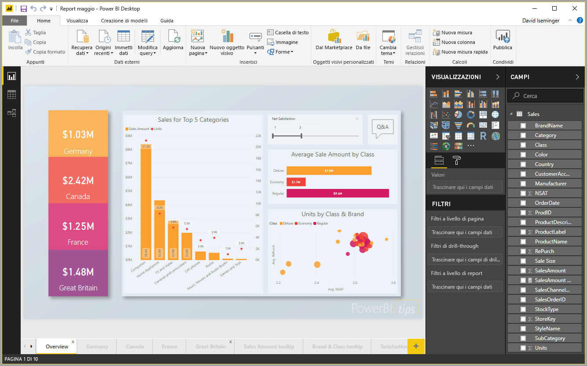
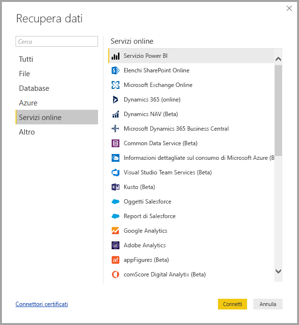
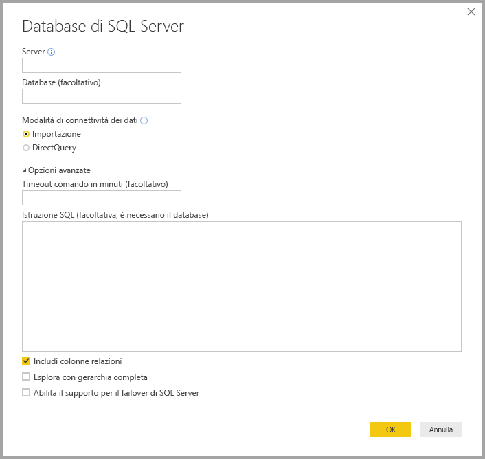
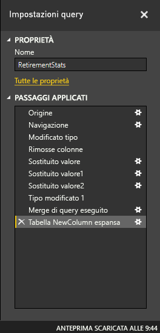
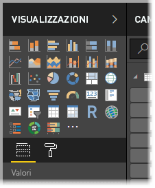
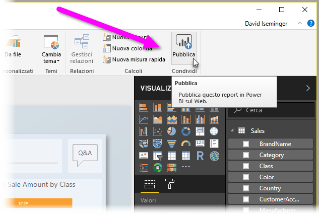

# Che cos'è Power BI Desktop?

**Power BI Desktop** è un'applicazione gratuita che può essere installata nel computer locale e che consente di connettersi ai dati, trasformandoli e visualizzandoli. Con **Power BI Desktop**, è possibile connettersi a più origini dati diverse e combinarle (modellazione) in un modello di dati che consente di creare oggetti visivi e raccolte di oggetti visivi condivisibili come report con altri utenti all'interno dell'organizzazione. La maggior parte degli utenti che lavora a progetti di business intelligence usa **Power BI Desktop** per creare report e quindi usa il **servizio Power BI** per condividere tali report con altri utenti.

Gli usi più comuni di **Power BI Desktop** sono i seguenti:

* Connettersi ai dati
* Trasformare e pulire i dati per creare un modello di dati
* Creare oggetti visivi, come grafici o grafi, che forniscono rappresentazioni visive dei dati
* Creare report che raccolgono gli oggetti visivi in una o più pagine di report
* Condividere i report con altri utenti tramite il **servizio Power BI**

Gli utenti che si occupano di queste attività spesso sono chiamati *analisti di dati* (a volte semplicemente *analisti*) o professionisti di Business Intelligence (spesso chiamati anche *creatori di report*). Tuttavia, molte persone che non si considerano analisti né creatori di report usano **Power BI Desktop** per creare report efficaci o per eseguire il pull dei dati da origini diverse e creare modelli di dati condivisibili con i colleghi e le organizzazioni.

Con **Power BI Desktop** è possibile creare report complessi e visivamente dettagliati usando dati provenienti da più origini, in un unico report che è possibile condividere con altri utenti nell'organizzazione. 

## Connettersi ai dati
Per iniziare a usare **Power BI Desktop**, il primo passaggio consiste nel connettersi ai dati. È possibile connettersi a molte origini dati diverse da **Power BI Desktop**. Per connettersi ai dati, selezionare semplicemente la barra multifunzione **Home** e quindi selezionare **Dati > Altro**. La figura seguente mostra la finestra **Recupera dati** che viene visualizzata e che mostra le diverse categorie a cui Power BI Desktop può connettersi.

Quando si seleziona un tipo di dati, vengono chieste alcune informazioni, ad esempio l'URL e le credenziali, necessarie per la connessione all'origine dati da Power BI Desktop.

Dopo essersi connessi a una o più origini dati, è possibile trasformare tali dati in modo che siano utili per l'utente.

## Trasformare e pulire i dati e creare un modello

In Power BI Desktop è possibile pulire e trasformare i dati usando l'**Editor di query** predefinito. L'Editor di query consente di apportare modifiche ai dati, ad esempio modificando un tipo di dati, rimuovendo colonne o combinando i dati da più origini. È possibile partire da un blocco di dati di grandi dimensioni e rimuovere o aggiungere porzioni di dati in base alle necessità, finché i dati non ottengono esattamente la forma desiderata. 

Ogni passaggio messo in atto durante la trasformazione dei dati (ad esempio rinominare una tabella, trasformare un tipo di dati o eliminare colonne) viene registrato dall'**Editor di query** ed eseguito ogni volta che questa query si connette all'origine dati, in modo che i dati abbiano sempre la forma specificata.

La figura seguente mostra il riquadro **Impostazioni query** per una query per cui è stata definita la forma e che è stata quindi trasformata in un modello.

 

Quando i dati hanno l'aspetto desiderato, è possibile creare oggetti visivi. 

## Creare oggetti visivi 

Dopo avere creato un modello di dati, è possibile trascinare i *campi* nell'area di disegno del report per creare *oggetti visivi*. Un *oggetto visivo* è una rappresentazione grafica dei dati nel modello. L'oggetto visivo seguente mostra un semplice istogramma. 

Esistono molti tipi diversi di oggetti visivi tra cui scegliere in Power BI Desktop. Per creare o modificare un oggetto visivo, è sufficiente selezionare la relativa icona nel riquadro **Visualizzazioni**. Se nell'area di disegno del report è già stato selezionato un oggetto visivo, verrà modificato nel tipo selezionato. Se non è stato selezionato alcun oggetto visivo, ne verrà creato uno nuovo in base alla selezione.

## Creare report

In alcuni casi è necessario creare una raccolta di oggetti visivi che illustrano i vari aspetti dei dati usati per creare il modello in Power BI Desktop. Una raccolta di oggetti visivi, in un file di Power BI Desktop, viene chiamata *report*. Un report può avere una o più pagine, proprio come un file di Excel può avere uno o più fogli di lavoro. Nella figura seguente viene visualizzata la prima pagina di un report di Power BI Desktop, denominata Overview (è possibile visualizzare la scheda nella parte inferiore dell'immagine). In questo report ci sono dieci pagine.

## Condividere i report

Una volta che un report è pronto per essere condiviso con altri utenti, è possibile usare il comando **Pubblica** per pubblicare il report nel **servizio Power BI** e renderlo disponibile agli altri utenti dell'organizzazione che dispongono di una licenza per Power BI. Per pubblicare un report di Power BI Desktop, scegliere il pulsante **Pubblica** nella barra multifunzione **Home** in Power BI Desktop.

Dopo avere selezionato **Pubblica**, Power BI Desktop si connette al **servizio Power BI** tramite l'account Power BI e quindi chiede di selezionare la posizione nel servizio Power BI in cui si vuole condividere il report, ad esempio l'area di lavoro dell'utente, un'area di lavoro per il team o un'altra posizione nel servizio Power BI. È necessario disporre una licenza per Power BI per condividere i report nel servizio Power BI.

## Passaggi successivi

Per iniziare a usare **Power BI Desktop**, per prima cosa occorre scaricare e installare l'applicazione. Esistono due modi per ottenere **Power BI Desktop**:

* [Scaricare Power BI Desktop dal Web](desktop-get-the-desktop.md)
* [Ottenere Power BI Desktop da Windows Store](http://aka.ms/pbidesktopstore)
