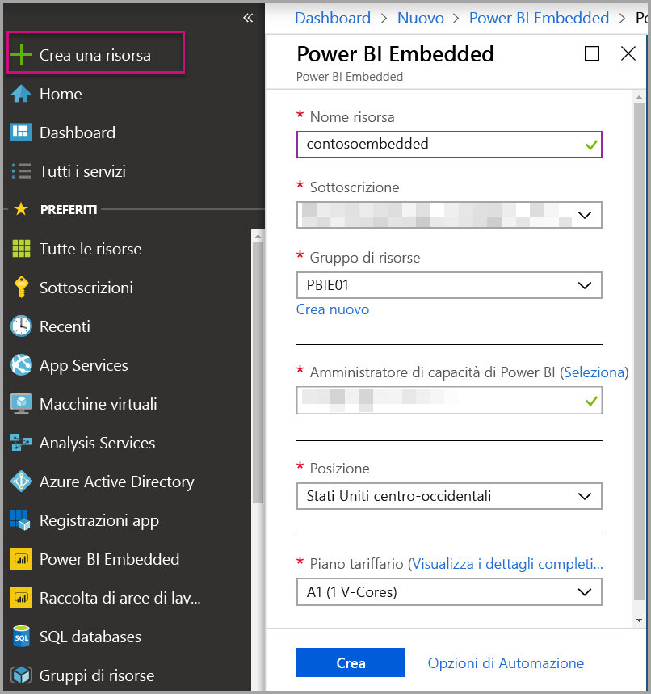
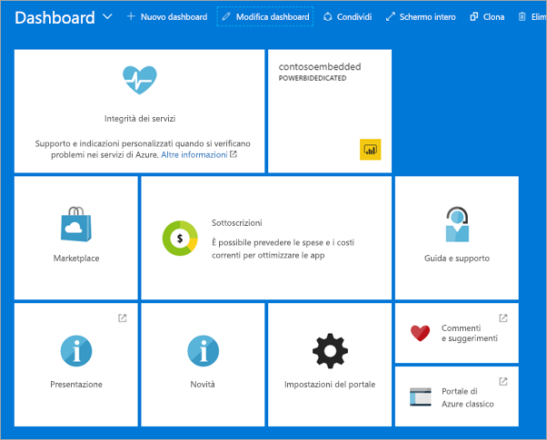

# Creare capacità di Power BI Embedded nel portale di Azure

Questo articolo descrive in dettaglio come creare capacità di [Power BI Embedded](azure-pbie-what-is-power-bi-embedded.md) in Microsoft Azure. Power BI Embedded semplifica le funzionalità di Power BI grazie alla possibilità di aggiungere rapidamente oggetti visivi, report e dashboard straordinari alle app,

Se non si ha una sottoscrizione di Azure, prima di iniziare creare un [account gratuito](https://azure.microsoft.com/free/).

> [!VIDEO https://www.youtube.com/embed/aXrvFfg_iSk]

## Prima di iniziare

Per completare questa guida introduttiva, è necessario quanto segue:

* **Sottoscrizione di Azure:** visitare la pagina [Versione di prova gratuita di Azure](https://azure.microsoft.com/free/) per creare un account.
* **Azure Active Directory:** la sottoscrizione deve essere associata a un tenant di Azure Active Directory (AAD). È anche ***necessario accedere ad Azure con un account di tale tenant***. Gli account Microsoft non sono supportati. Per altre informazioni, vedere [Autenticazione e autorizzazioni utente](https://docs.microsoft.com/azure/analysis-services/analysis-services-manage-users).
* **Tenant di Power BI:** almeno un account nel tenant di AAD deve essere iscritto a Power BI.
* **Gruppo di risorse:** usare un gruppo di risorse già disponibile oppure [crearne uno nuovo](https://docs.microsoft.com/azure/azure-resource-manager/resource-group-overview).

## Creare una capacità

1. Accedere al [portale di Azure](https://portal.azure.com/).

2. Nella casella di ricerca cercare *Power BI Embedded*.

3. All'interno di Power BI Embedded, selezionare **Crea**.

4. Immettere le informazioni richieste e quindi selezionare **Crea**.

    

    |Impostazione |Descrizione |
    |---------|---------|
    |**Nome risorsa**|Nome per l'identificazione della capacità. Oltre che nel portale di Azure, il nome della risorsa viene visualizzato all'interno del portale di amministrazione di Power BI.|
    |**Sottoscrizione**|Sottoscrizione per la quale si vuole creare la capacità.|
    |**Gruppo di risorse**|Gruppo di risorse che contiene la nuova capacità. Scegliere un gruppo di risorse esistente oppure crearne un altro. Per altre informazioni, vedere [Panoramica di Azure Resource Manager](https://docs.microsoft.com/azure/azure-resource-manager/resource-group-overview).|
    |**Amministratore di capacità di Power BI**|Gli amministratori di capacità di Power BI possono visualizzare la capacità nel portale di amministrazione di Power BI e concedere autorizzazioni di assegnazione ad altri utenti. Per impostazione predefinita, l'amministratore di capacità è l'account dell'utente. L'amministratore di capacità deve trovarsi all'interno del tenant di Power BI.|
    |**Località**|La località in cui Power BI è ospitato per il tenant. La località predefinita corrisponde all'area iniziale, ma è possibile modificare la località con le [opzioni per più aree geografiche](embedded-multi-geo.md).
    |**Piano tariffario**|Selezionare lo SKU (numero di memorie centrali virtuali e dimensioni della memoria) che soddisfa le proprie esigenze.  Per i dettagli, vedere [Calcolatore dei prezzi di Power BI Embedded](https://azure.microsoft.com/pricing/details/power-bi-embedded/)|

È possibile vedere se la capacità è pronta passando a **Tutti i servizi** > **Power BI Embedded**. In alternativa, è possibile selezionare **Aggiungi al dashboard** dalla sezione delle notifiche o dall'interno del pannello, per passare al dashboard e visualizzare la nuova capacità.

## Passaggi successivi

Per usare la nuova capacità di Power BI Embedded, passare al portale di amministrazione di Power BI e assegnare le aree di lavoro. Per altre informazioni, vedere [Gestire capacità all'interno di Power BI Premium e Power BI Embedded](https://powerbi.microsoft.com/documentation/powerbi-admin-premium-manage/).

Se non è necessario usare questa capacità, è possibile sospenderla per interromperne l'addebito. Per altre informazioni, vedere [Sospendere e avviare la capacità di Power BI Embedded nel portale di Azure](azure-pbie-pause-start.md).

Per iniziare a incorporare contenuto di Power BI all'interno dell'applicazione, vedere [Come incorporare dashboard, report e riquadri di Power BI](https://powerbi.microsoft.com/documentation/powerbi-developer-embedding-content/).

Altre domande? [Provare a rivolgersi alla community di Power BI](http://community.powerbi.com/)