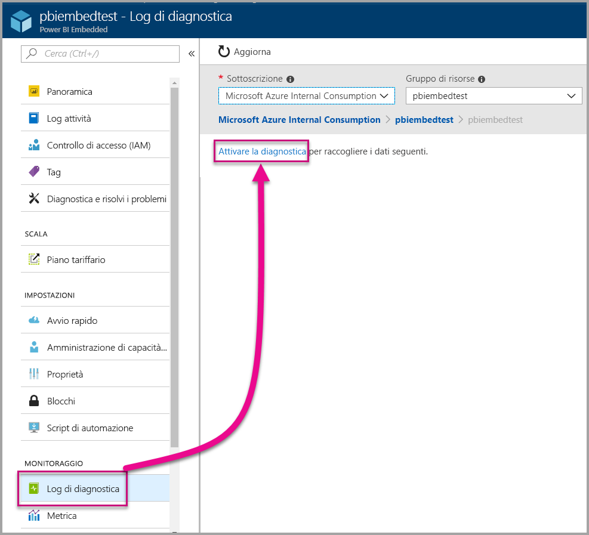
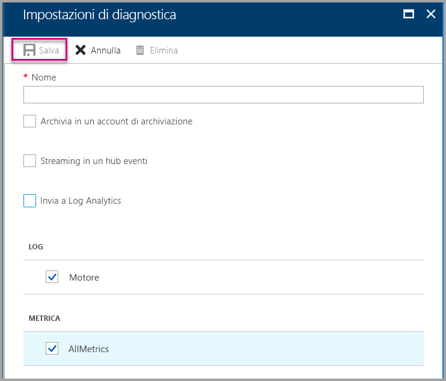
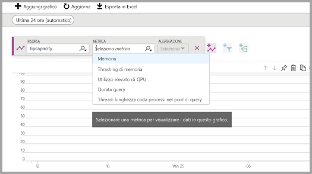
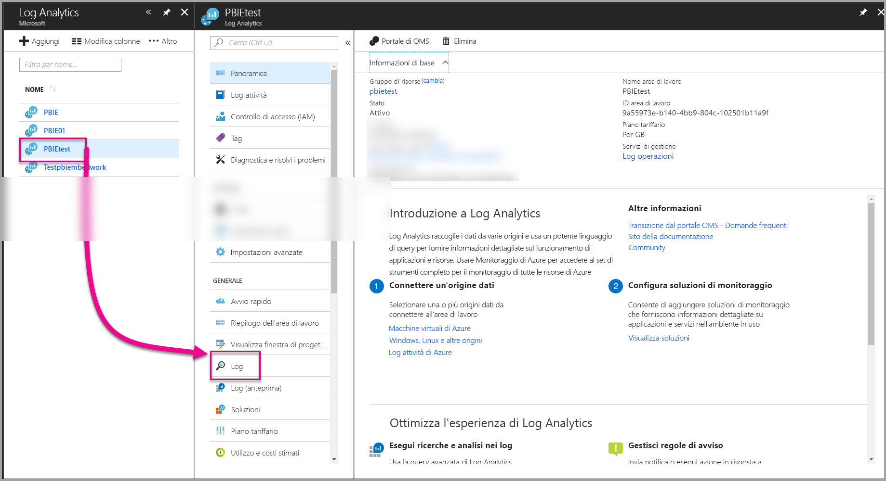
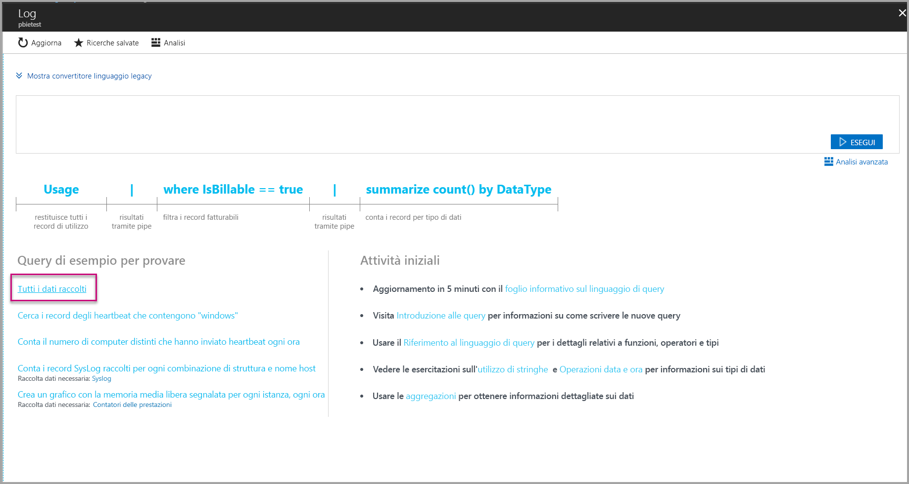
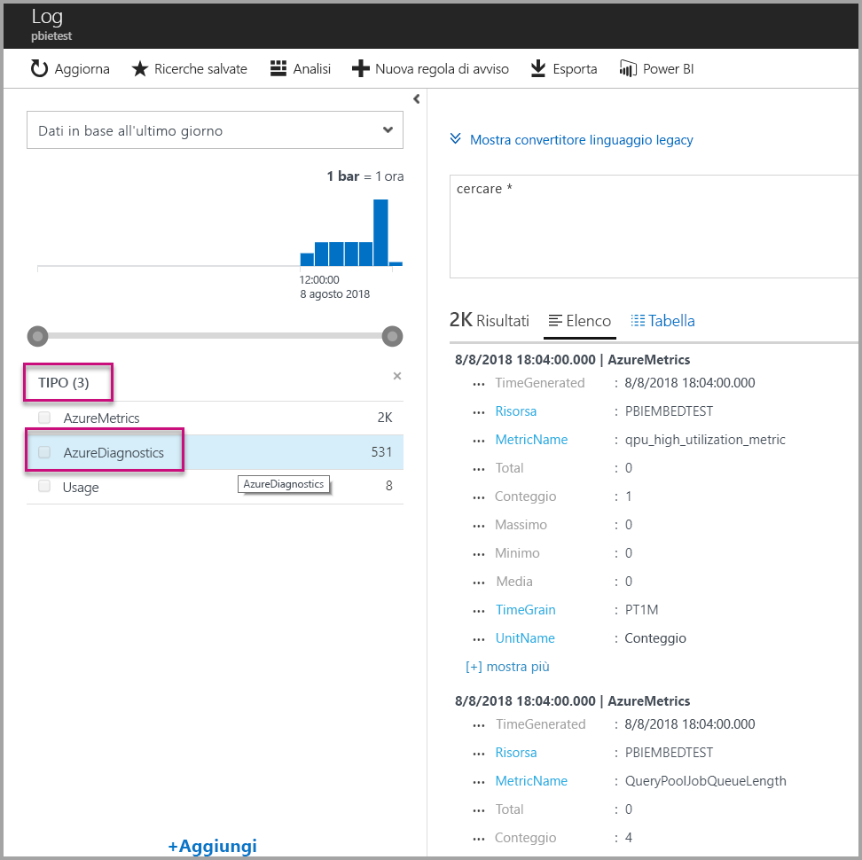
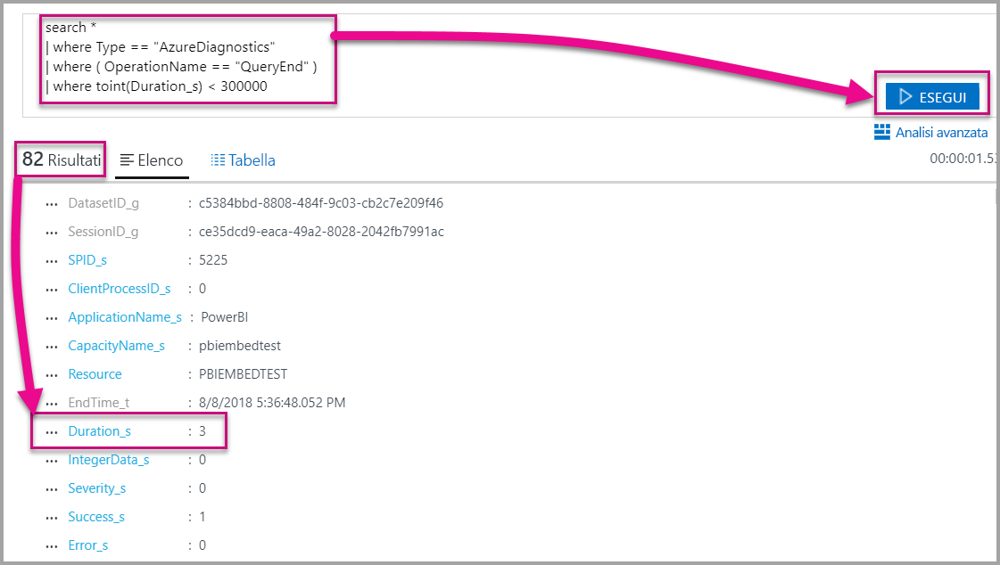
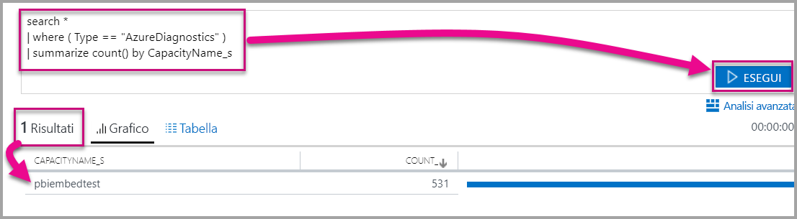

# <a name="diagnostic-logging-for-power-bi-embedded-in-azure"></a>Registrazione diagnostica per Power BI Embedded in Azure

Con i [log di diagnostica per le risorse di Azure](https://docs.microsoft.com/azure/monitoring-and-diagnostics/monitoring-overview-of-diagnostic-logs), è possibile registrare molti eventi dalla capacità, farli confluire in uno strumento di analisi e ottenere informazioni dettagliate sul comportamento della risorsa.

L'uso della diagnostica può essere di aiuto in vari scenari, ad esempio:

* Rilevamento delle query con esecuzione prolungata o problematiche.
* Derivazione di [metriche della capacità](https://powerbi.microsoft.com/blog/power-bi-developer-community-april-update/).
* Monitoraggio dell'utilizzo di set di dati specifici.

## <a name="set-up-diagnostics-logging"></a>Configurare la registrazione diagnostica

### <a name="azure-portal"></a>Portale di Azure

1. Nel [portale di Azure](https://portal.azure.com) > risorsa Power BI Embedded selezionare **Log di diagnostica** nel riquadro di spostamento e quindi selezionare **Abilita diagnostica**.

    

2. In **Impostazioni di diagnostica** specificare le opzioni seguenti:

    * **Nome** -Immettere un nome per l'impostazione di diagnostica da creare.

    * **Archivia in un account di archiviazione** - Per usare questa opzione, è necessario connettersi a un account di archiviazione esistente. Vedere [Creare un account di archiviazione](https://docs.microsoft.com/azure/storage/common/storage-create-storage-account) e seguire le istruzioni per creare un account di archiviazione. Selezionare quindi l'account di archiviazione tornando a questa pagina nel portale. Potrebbero occorrere alcuni minuti prima che gli account di archiviazione appena creati vengano visualizzati nel menu a discesa. Il file di log viene archiviato in JSON.
    * **Streaming in un hub eventi** - Per usare questa opzione, è necessario connettersi a un hub eventi e a uno spazio dei nomi di Hub eventi esistenti. Per altre informazioni, vedere [Creare uno spazio dei nomi di Hub eventi di Azure e un hub eventi usando il Portale di Azure](https://docs.microsoft.com/azure/event-hubs/event-hubs-create).
    * **Invia a Log Analytics** - Per usare questa opzione, usare un'area di lavoro esistente o creare una nuova area di lavoro di Log Analytics seguendo i passaggi per [creare una nuova area di lavoro](https://docs.microsoft.com/azure/log-analytics/log-analytics-quick-collect-azurevm#create-a-workspace) nel portale. Questa soluzione consente di sfruttare [Azure Log Analytics](https://docs.microsoft.com/azure/log-analytics/log-analytics-overview), che offre funzionalità predefinite di analisi, creazione di dashboard e notifica. È possibile usare Log Analytics per connettere più dati da altre risorse e ottenere un'unica visualizzazione completa dei dati per tutte le risorse dell'applicazione. È anche possibile connetterlo a [Power BI con un solo clic](https://docs.microsoft.com/azure/log-analytics/log-analytics-powerbi).
    Per altre informazioni sulla visualizzazione dei log in Log Analytics, vedere [Visualizzare i log in Log Analytics](https://docs.microsoft.com/azure/log-analytics/log-analytics-activity).
    * **Motore** - Selezionare questa opzione per registrare il set di [eventi del motore](#whats-logged) elencati di seguito.
    * **AllMetrics** - Selezionare questa opzione per archiviare i dati dettagliati nelle [metriche](https://docs.microsoft.com/azure/analysis-services/analysis-services-monitor#server-metrics). Per archiviare in un account di archiviazione, è possibile selezionare il periodo di conservazione per i log di diagnostica. I log verranno automaticamente eliminati alla scadenza del periodo di conservazione.

3. Selezionare **Salva**.

    Per modificare il modo in cui vengono salvati i log di diagnostica, è possibile tornare a questa pagina per modificare le impostazioni.

    

### <a name="using-powershell-to-enable-diagnostics"></a>Uso di PowerShell per abilitare la diagnostica

Per abilitare le metriche e la registrazione diagnostica con PowerShell, usare i comandi seguenti:

* Per abilitare l'archiviazione dei log di diagnostica in un account di archiviazione, usare questo comando:

    ```powershell
    Set-AzureRmDiagnosticSetting -ResourceId [your resource id] -StorageAccountId [your storage account id] -Enabled $true
    ```
    L'ID dell'account di archiviazione è l'ID di risorsa per l'account di archiviazione a cui si vogliono inviare i log.

* Per abilitare lo streaming dei log di diagnostica a un hub eventi, usare questo comando:

    ```powershell
    Set-AzureRmDiagnosticSetting -ResourceId [your resource id] -ServiceBusRuleId [your service bus rule id] -Enabled $true
    ```
* L'ID regola del bus di servizio di Azure è una stringa con questo formato:

    ```powershell
    {service bus resource ID}/authorizationrules/{key name}
    ```

* Per abilitare l'invio dei log di diagnostica a un'area di lavoro di Log Analytics, usare questo comando:

    ```powershell
        Set-AzureRmDiagnosticSetting -ResourceId [your resource id] -WorkspaceId [resource id of the log analytics workspace] -Enabled $true
    ```

* È possibile ottenere l'ID di risorsa dell'area di lavoro di Log Analytics usando il comando seguente:

    ```powershell
    (Get-AzureRmOperationalInsightsWorkspace).ResourceId
    ```

È possibile combinare questi parametri per abilitare più opzioni di output.

### <a name="rest-api"></a>API REST

Informazioni su come [modificare le impostazioni di diagnostica usando l'API REST di Monitoraggio di Azure](https://docs.microsoft.com/rest/api/monitor/). 

### <a name="resource-manager-template"></a>Modello di Resource Manager

Informazioni su come [abilitare le impostazioni di diagnostica durante la creazione di risorse usando un modello di Resource Manager](https://docs.microsoft.com/azure/monitoring-and-diagnostics/monitoring-enable-diagnostic-logs-using-template).

## <a name="whats-logged"></a>Cosa viene registrato?

È possibile selezionare le categorie **Motore** e/o **AllMetrics**.

### <a name="engine"></a>Motore

La categoria Motore indica alla risorsa di registrare gli eventi seguenti e per ognuno degli eventi esistono proprietà:

|     Nome evento     |     Descrizione evento     |
|----------------------------|----------------------------------------------------------------------------------|
|    Audit Login    |    Registra tutti gli eventi di nuove connessioni al motore dall'avvio della traccia.    |
|    Session Initialize    |    Registra tutti gli eventi di inizializzazione di sessione dall'avvio della traccia.    |
|    Vertipaq Query Begin    |    Registra tutti gli eventi di avvio di query VertiPaq SE dall'avvio della traccia.    |
|    Query Begin    |    Registra tutti gli eventi di avvio di query dall'avvio della traccia.    |
|    Query End    |    Registra tutti gli eventi di fine di query dall'avvio della traccia.    |
|    Vertipaq Query End    |    Registra tutti gli eventi di fine di query VertiPaq SE dall'avvio della traccia.    |
|    Audit Logout    |    Registra tutte gli eventi di disconnessione dal motore dall'avvio della traccia.    |
|    Errore    |    Registra tutti gli eventi di errore del motore dall'avvio della traccia.    |

<br>
<br>

| Nome proprietà | Esempio di Vertipaq Query End | Descrizione della proprietà |
|-------------------|---------------------------------------------------------------------------------------------------------------------------------------------------------------------------------------------------------|--------------------------------------------------------------------------------------------------------------------------|
| EventClass | XM_SEQUERY_END | La classe di evento viene usata per suddividere gli eventi in categorie. |
| EventSubclass | 0 | La sottoclasse di evento fornisce informazioni aggiuntive su ogni classe di evento. (ad esempio, 0: Analisi VertiPaq) |
| RootActivityId | ff217fd2-611d-43c0-9c12-19e202a94f70 | ID attività radice. |
| CurrentTime | 2018-04-06T18:30:11.9137358Z | Ora di inizio dell'evento, se disponibile. |
| StartTime | 2018-04-06T18:30:11.9137358Z | Ora di inizio dell'evento, se disponibile. |
| JobID | 0 | ID processo per l'individuazione dello stato. |
| ObjectID | 464 | ID oggetto |
| ObjectType | 802012 | ObjectType |
| EndTime | 2018-04-06T18:30:11.9137358Z | Ora di fine dell'evento. |
| Durata | 0 | Quantità di tempo (in millisecondi) richiesta dall'evento. |
| SessionType | Utente | Tipo di sessione. Indica l'entità che ha causato l'operazione. |
| ProgressTotal | 0 | Stato complessivo. |
| IntegerData | 0 | Dati integer. |
| Severity | 0 | Livello di gravità di un'eccezione. |
| Success | 1 | 1 = esito positivo. 0 = esito negativo (ad esempio, il valore 1 indica che il controllo delle autorizzazioni ha avuto esito positivo e il valore 0 che tale controllo ha avuto esito negativo). |
| Errore | 0 | Numero di errore di un evento specifico. |
| ConnectionID | 3 | ID connessione univoco. |
| DatasetID | 5eaa550e-06ac-4adf-aba9-dbf0e8fd1527 | ID del set di dati in cui è in esecuzione l'istruzione dell'utente. |
| SessionID | 3D063F66-A111-48EE-B960-141DEBDA8951 | GUID della sessione. |
| SPID | 180 | ID processo server. Identifica in modo univoco una sessione utente. Corrisponde direttamente al GUID di sessione usato da XML/A. |
| ClientProcessID | null | ID processo dell'applicazione client. |
| ApplicationName | null | Nome dell'applicazione client che ha creato la connessione al server. |
| CapacityName | pbi641fb41260f84aa2b778a85891ae2d97 | Nome della risorsa capacità Power BI Embedded. |


### <a name="allmetrics"></a>AllMetrics

Selezionando l'opzione **AllMetrics** vengono registrati i dati di tutte le metriche che è possibile usare con una risorsa Power BI Embedded.

   

## <a name="manage-your-logs"></a>Gestire i log

I log sono in genere disponibili entro un paio di ore dopo aver configurato la registrazione. Spetta all'utente la gestione dei log nell'account di archiviazione:

* Usare i metodi di controllo di accesso standard di Azure per proteggere i log limitandone l'accesso.
* Eliminare i log che non si desidera più mantenere nell'account di archiviazione.
* Assicurarsi di impostare un periodo di conservazione, in modo che i log meno recenti vengano eliminati dall'account di archiviazione.

## <a name="view-logs-in-log-analytics"></a>Visualizzare i log in Log Analytics

Le metriche e gli eventi del server sono integrati con xEvents in Log Analytics per un'analisi affiancata. È anche possibile configurare Log Analytics per ricevere eventi da altri servizi di Azure che offrono una visione olistica dei dati di registrazione diagnostica in tutta l'architettura.

Per visualizzare i dati di diagnostica in Log Analytics, aprire la pagina **Log** dal menu a sinistra o nell'area Gestione, come illustrato di seguito.



Dopo che aver abilitato la raccolta dei dati, in **Log** selezionare **Tutti i dati raccolti**.



In **Tipo** selezionare **AzureDiagnostics** e quindi selezionare **Applica**. AzureDiagnostics include eventi della categoria Motore. Si noti che viene creata una query di Log Analytics in tempo reale.



Selezionare **EventClass\_s** o uno dei nomi degli eventi. Log Analytics prosegue con la creazione di una query. Assicurarsi di salvare le query per riutilizzarle in un secondo momento.

Assicurarsi di visitare [Log Analytics](https://docs.microsoft.com/azure/log-analytics/), che offre un sito Web con funzionalità avanzate per query, dashboard e avvisi sui dati raccolti.

### <a name="queries"></a>Query

Sono disponibili centinaia di query che è possibile usare. Di seguito ne sono riportate alcune per iniziare. Per altre informazioni sull'uso del nuovo linguaggio di query per le ricerche log, vedere [Informazioni sulle ricerche log in Log Analytics](https://docs.microsoft.com/azure/log-analytics/log-analytics-log-search).

* Restituzione delle query il cui completamento ha richiesto meno di cinque minuti (300.000 millisecondi).

    ```
    search *
    | where Type == "AzureDiagnostics"
    | where ( OperationName == "QueryEnd" )
    | where toint(Duration_s) < 300000
    ```

    

* Identificare i nomi di capacità.

    ```
    search *
    | where ( Type == "AzureDiagnostics" )
    | summarize count() by CapacityName_s 
    ```

    

## <a name="next-steps"></a>Passaggi successivi

Sono disponibili ulteriori informazioni sulla registrazione diagnostica per le risorse di Azure.

> [!div class="nextstepaction"]
> [Raccogliere e usare i dati dei log dalle risorse di Azure](https://docs.microsoft.com/azure/monitoring-and-diagnostics/monitoring-overview-of-diagnostic-logs)

> [!div class="nextstepaction"]
> [Set-AzureRmDiagnosticSetting](https://docs.microsoft.com/powershell/module/azurerm.insights/Set-AzureRmDiagnosticSetting)
