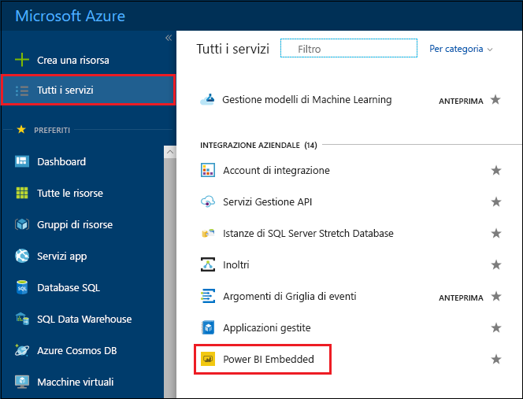
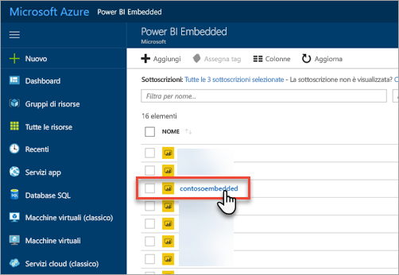
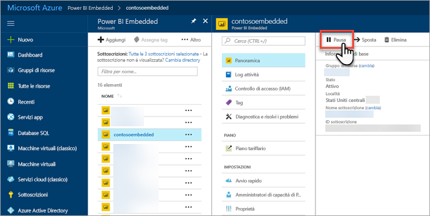
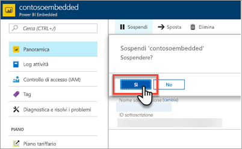
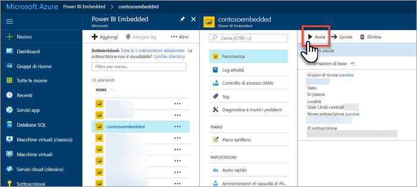
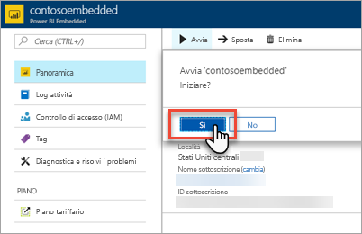

# Sospendere e avviare la capacità di Power BI Embedded nel portale di Azure

Questo articolo descrive in dettaglio come sospendere e avviare capacità di Power BI Embedded in Microsoft Azure. Questa operazione presuppone che sia stata creata capacità di Power BI Embedded. Se non è stata creata alcuna capacità, vedere [Creare capacità di Power BI Embedded nel portale di Azure](azure-pbie-create-capacity.md).

Se non si ha una sottoscrizione di Azure, prima di iniziare creare un [account gratuito](https://azure.microsoft.com/free/).

## Sospendere la capacità

La sospensione della capacità evita gli addebiti legati all'uso di questa. Questa operazione è molto utile se non è necessario usare la capacità per un certo periodo di tempo. Per sospendere la capacità, eseguire i passaggi seguenti.

> [!NOTE]
> La sospensione di una capacità può impedire la disponibilità di contenuto all'interno di Power BI. Assicurarsi di annullare l'assegnazione delle aree di lavoro della capacità prima della sospensione per evitare interruzioni.

1. Accedere al [portale di Azure](https://portal.azure.com/).

2. Per visualizzare le capacità, selezionare **Tutti i servizi** > **Power BI Embedded**.

    

3. Selezionare la capacità che si vuole sospendere.

    

4. Selezionare **Sospendi** all'interno dei dettagli della capacità.

    

5. Selezionare **Sì** per confermare la sospensione della capacità.

    

## Avviare la capacità

Per riprendere l'utilizzo della capacità, avviarla. Con l'avvio della capacità riprende anche la fatturazione.

1. Accedere al [portale di Azure](https://portal.azure.com/).

2. Per visualizzare le capacità, selezionare **Tutti i servizi** > **Power BI Embedded**.

    

3. Selezionare la capacità da avviare.

    

4. Selezionare **Avvia** all'interno dei dettagli della capacità.

    

5. Selezionare **Sì** per confermare l'avvio della capacità.

    

Dopo l'avvio della capacità, eventuale contenuto assegnato a questa è disponibile.

## Passaggi successivi

Se si vuole ridimensionare la capacità verso l'alto o verso il basso, vedere [Ridimensionare la capacità di Power BI Embedded](azure-pbie-scale-capacity.md).

Per iniziare a incorporare contenuto di Power BI all'interno dell'applicazione, vedere [Come incorporare dashboard, report e riquadri di Power BI](https://powerbi.microsoft.com/documentation/powerbi-developer-embedding-content/).

Altre domande? [Provare a rivolgersi alla community di Power BI](https://community.powerbi.com/)