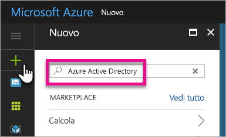
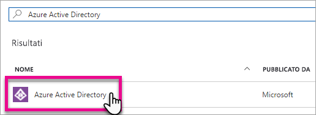
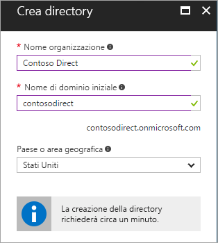
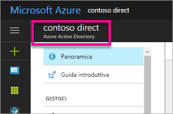
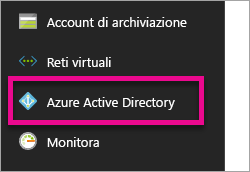
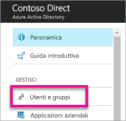
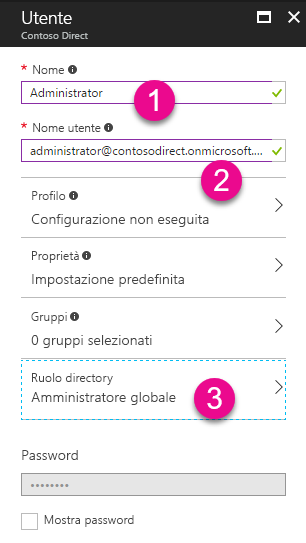
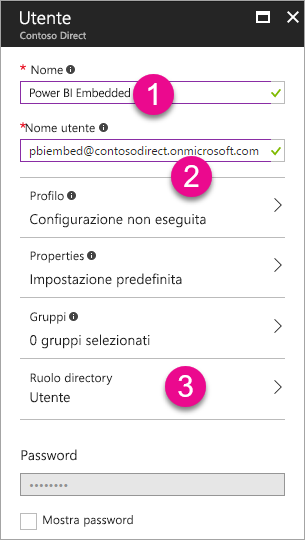
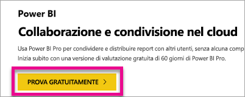

# Creare un tenant di Azure Active Directory da usare con Power BI

Informazioni su come creare un nuovo tenant di Azure Active Directory (Azure AD) per un'applicazione personalizzata che chiama le [API REST di Power BI](rest-api-reference.md).

Un tenant rappresenta un'organizzazione in Azure Active Directory. È un'istanza del servizio Azure AD dedicata che un'organizzazione riceve e possiede quando esegue l'iscrizione a un servizio cloud di Microsoft, ad esempio Azure, Microsoft Intune oppure Office 365. Ogni tenant di Azure AD è distinto e separato dagli altri tenant di Azure AD.

Dopo aver creato un tenant di Azure AD, è possibile definire un'applicazione e assegnare le autorizzazioni in modo che l'applicazione possa usare le [API REST di Power BI](rest-api-reference.md).

È possibile che l'organizzazione disponga già di un tenant di Azure AD da usare per l'applicazione. È anche possibile creare un nuovo tenant specifico per l'applicazione. In questo articolo viene descritto come creare un nuovo tenant.

## Creare un tenant di Azure Active Directory

Per integrare Power BI nell'applicazione personalizzata, è necessario definire un'applicazione all'interno di Azure AD. Per eseguire questa operazione, è necessaria una directory Azure AD. Questa directory è il *tenant*. Se l'organizzazione non ha ancora un tenant perché non usa Power BI o Office 365, [è necessario creare un ambiente di sviluppo](https://docs.microsoft.com/azure/active-directory/develop/active-directory-howto-tenant). È necessario creare un ambiente di sviluppo anche se non si vuole che l'applicazione si combini con il tenant dell'organizzazione, in modo da tenere le cose separate. In alternativa, è possibile creare un tenant a scopo di test.

Per creare un nuovo tenant di Azure AD:

1. Aprire il [portale di Azure](https://portal.azure.com) e accedere con un account che disponga di una sottoscrizione di Azure.

2. Selezionare l'**icona più (+)** e cercare **Azure Active Directory**.

    

3. Selezionare **Azure Active Directory** nei risultati della ricerca.

    

4. Selezionare **Crea**.

5. Specificare un **Nome organizzazione** e un **Nome di dominio iniziale**. Quindi selezionare **Crea** La directory è stata creata.

    

   > [!NOTE]
   > Il dominio iniziale fa parte di onmicrosoft.com. È possibile aggiungere altri nomi di dominio in un secondo momento. Alla directory di un tenant possono essere assegnati più domini.

6. Dopo aver completato la creazione della directory, selezionare la casella di informazioni per gestire la nuova directory.

A questo punto è possibile aggiungere gli utenti del tenant.

## Creare gli utenti del tenant di Azure Active Directory

Ora che la directory è disponibile, è necessario creare almeno due utenti. Uno è un amministratore globale del tenant, l'altro è un utente master per l'incorporamento. Quest'ultimo può essere considerato un account di servizio.

1. Nel portale di Azure assicurarsi di essere nel menu a comparsa di Azure Active Directory.

    

    Se non è così, selezionare l'icona di Azure Active Directory nel menu dei servizi a sinistra.

    

2. In **Gestisci** selezionare **Utenti**.

    

3. Selezionare **Tutti gli utenti** e quindi scegliere **+ Nuovo utente**.

4. Specificare un **Nome** e un **Nome utente** per l'amministratore globale del tenant. Modificare il **Ruolo directory** in **Amministratore globale**. È anche possibile visualizzare la password temporanea. Al termine, selezionare **Crea**.

    

5. Eseguire la stessa operazione per un utente di tenant normale. È possibile usare questo account per l'account master di incorporamento. Questa volta, per **Ruolo directory** lasciare **Utente**. Prendere nota della password e selezionare **Crea**.

    

6. Iscriversi a Power BI con l'account utente creato nel passaggio 5. Passare a [powerbi.com](https://powerbi.microsoft.com/get-started/) e selezionare **Prova gratuitamente** in **Power BI - Cloud collaboration and sharing** (Power BI - Collaborazione e condivisione nel cloud).

    

    Al momento dell'iscrizione, viene richiesto di provare Power BI Pro gratuitamente per 60 giorni. È possibile scegliere questa opzione per diventare un utente Pro e avere la possibilità di [iniziare a sviluppare una soluzione incorporata](embedding-content.md).

   > [!NOTE]
   > Assicurarsi di eseguire l'iscrizione usando l'indirizzo di posta elettronica dell'account utente.

## Passaggi successivi

Dopo aver creato un tenant di Azure AD, è possibile usarlo per testare gli elementi all'interno di Power BI. È anche possibile incorporare dashboard e report di Power BI nell'applicazione. Per altre informazioni, vedere [Come incorporare dashboard, report e riquadri di Power BI](embedding-content.md).

[Informazioni su Azure Active Directory](https://docs.microsoft.com/azure/active-directory/active-directory-whatis) 
 
[Avvio rapido: Configurare un ambiente di sviluppo](https://docs.microsoft.com/azure/active-directory/develop/active-directory-howto-tenant)  

Altre domande? [Provare a rivolgersi alla community di Power BI](https://community.powerbi.com/)
