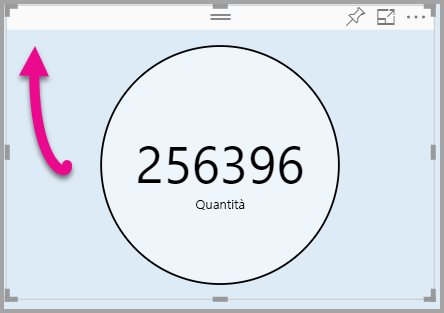

# <a name="tutorial-adding-formatting-options-to-a-power-bi-custom-visual"></a>Esercitazione: Aggiunta di opzioni di formattazione a un oggetto visivo di Power BI

In questa esercitazione verrà illustrato come aggiungere proprietà comuni all'oggetto visivo.

In questa esercitazione viene illustrato come:
> [!div class="checklist"]
> * Aggiungere proprietà all'oggetto visivo.
> * Creare un pacchetto dell'oggetto visivo.
> * Importare l'oggetto visivo personalizzato in un report di Power BI Desktop.

## <a name="adding-formatting-options"></a>Aggiunta di opzioni di formattazione

1. In **Power BI** selezionare la **pagina Formato**.

    Verrà visualizzato il messaggio *Le opzioni di formattazione non sono disponibili per questo oggetto visivo.*

    

2. In **Visual Studio Code** aprire il file *capabilities.json*.

3. Prima della matrice **dataViewMappings** aggiungere **objects** (dopo la riga 8).

    ```json
    "objects": {},
    ```
    

4. Salvare il file **capabilities.json**.

5. In **Power BI** accedere di nuovo alle opzioni di formattazione.

    > [!Note]
    > Se le opzioni di formattazione non sono ancora visualizzate selezionare **Ricarica oggetto visivo personalizzato**.

    

6. Impostare l'opzione **Titolo** su *No*. Si noti che l'oggetto visivo non mostra più il nome della misura nell'angolo superiore sinistro.

    

    

### <a name="adding-custom-formatting-options"></a>Aggiunta di opzioni di formattazione personalizzate

È possibile aggiungere proprietà personalizzate per consentire la configurazione del colore del cerchio e anche dello spessore del bordo.

1. In PowerShell arrestare l'oggetto visivo personalizzato.

2. In Visual Studio Code, nel file **capabilities.json**, inserire il frammento JSON seguente nell'oggetto con etichetta **objects**.

    ```json
    "circle": {
     "displayName": "Circle",
     "properties": {
         "circleColor": {
             "displayName": "Color",
             "description": "The fill color of the circle.",
             "type": {
                 "fill": {
                     "solid": {
                         "color": true
                     }
                 }
             }
         },
         "circleThickness": {
             "displayName": "Thickness",
             "description": "The circle thickness.",
             "type": {
                 "numeric": true
                 }
             }
         }
     },
    ```

    Il frammento JSON descrive un gruppo denominato circle, costituito da due opzioni denominate circleColor e circleThickness.

   

3. Salvare il file **capabilities.json**.

4. Nel **riquadro Esplora risorse**, all'interno della cartella **src** selezionare **settings.ts**. *Questo file rappresenta le impostazioni per l'oggetto visivo di partenza*.

5. Nel file **settings.ts** sostituire le due classi con il codice seguente.

    ```typescript
    export class CircleSettings {
     public circleColor: string = "white";
     public circleThickness: number = 2;
    }
    export class VisualSettings extends DataViewObjectsParser {
     public circle: CircleSettings = new CircleSettings();
    }
    ```

    

    Questo modulo definisce le due classi. La classe **CircleSettings** definisce due proprietà con nomi che corrispondono a oggetti definiti nel file **capabilities.json** (**circleColor** e  **circleThickness**) e imposta anche i valori predefiniti. La classe **VisualSettings** eredita la classe **DataViewObjectParser** e aggiunge una proprietà denominata **circle**, che corrisponde all'oggetto definito nel file  *capabilities.json* e restituisce un'istanza di **CircleSettings**.

6. Salvare il file **settings.ts**.

7. Aprire il file **visual.ts**.

8. Nella classe **Visual** aggiungere la proprietà seguente.

    ```typescript
    private visualSettings: VisualSettings;
    ```
    Questa proprietà archivia un riferimento all'oggetto **VisualSettings**, che descrive le impostazioni dell'oggetto visivo.

    

9. Nella classe **Visual** aggiungere il metodo seguente prima del metodo **update**. Questo metodo viene usato per popolare le opzioni di formattazione.

    ```typescript
    public enumerateObjectInstances(options: EnumerateVisualObjectInstancesOptions): VisualObjectInstanceEnumeration {
     const settings: VisualSettings = this.visualSettings ||
    VisualSettings.getDefault() as VisualSettings;
     return VisualSettings.enumerateObjectInstances(settings, options);
    }
    ```
    Questo metodo viene usato per popolare le opzioni di formattazione.

    

10. Nel metodo **update** aggiungere il codice seguente dopo la dichiarazione della variabile **radius**.

    ```typescript
    this.visualSettings = VisualSettings.parse<VisualSettings>(dataView);

    this.visualSettings.circle.circleThickness = Math.max(0, this.visualSettings.circle.circleThickness);

    this.visualSettings.circle.circleThickness = Math.min(10, this.visualSettings.circle.circleThickness);
    ```
    Questo codice recupera le opzioni di formattazione. Modifica qualsiasi valore passato nella proprietà **circleThickness**, convertendolo in 0 se è negativo o 10 se si tratta di un valore maggiore di 10.

    

11. Per l'**elemento circle**, modificare il valore passato per **style fill** impostandolo sull'espressione seguente.

    ```typescript
    this.visualSettings.circle.circleColor
    ```

    

12. Per l'**elemento circle**, modificare il valore passato per **style stroke-width** impostandolo sull'espressione seguente.

    ```typescript
    this.visualSettings.circle.circleThickness
    ```

    

13. Salvare il file visual.ts.

14. In PowerShell avviare l'oggetto visivo.

    ```powershell
    pbiviz start
    ```

15. In **Power BI**, sulla barra degli strumenti mobile sopra l'oggetto visivo, selezionare **Attiva/Disattiva ricaricamento automatico**.

16. Nelle opzioni di **formattazione dell'oggetto visivo** espandere **Circle**.

    

    Modificare le opzioni **Colore** e **Spessore**.

    Per l'opzione **Spessore** impostare un valore minore di zero e maggiore di 10. Si noti quindi che l'oggetto visivo aggiorna il valore su un valore minimo o massimo tollerabile.

## <a name="packaging-the-custom-visual"></a>Creazione del pacchetto per l'oggetto visivo personalizzato

Immettere i valori delle proprietà per il progetto di oggetto visivo personalizzato, aggiornare il file dell'icona e quindi creare il pacchetto per l'oggetto visivo personalizzato.

1. In **PowerShell** arrestare l'oggetto visivo personalizzato.

2. Aprire il file **pbiviz.json** in **Visual Studio Code**.

3. Nell'oggetto **visual** modificare la proprietà **displayName** e impostarla su *Circle Card*.

    Nel riquadro **Visualizzazioni** il nome visualizzato viene mostrato al passaggio del mouse sull'icona.

    

4. Per la proprietà **description** immettere il testo seguente.

    *Displays a formatted measure value inside a circle* (Visualizza un valore di misura formattato all'interno di un cerchio)

5. Facoltativamente, immettere i dettagli personali nell'oggetto **author**.

6. Salvare il file **pbiviz.json**.

7. Nell'oggetto **assets** si noti che il documento definisce un percorso per un'icona. L'icona è l'immagine visualizzata nel riquadro **_Visualizzazioni_** . Deve essere un file **PNG** con dimensioni di *20 pixel per 20 pixel*.

8. In Esplora risorse copiare il file icon.png e quindi incollarlo per sostituire il file predefinito che si trova nella cartella assets.

9. In Visual Studio Code, nel riquadro Esplora risorse, espandere la cartella assets e quindi selezionare il file icon.png.

10. Esaminare l'icona.

    

11. In Visual Studio Code assicurarsi che tutti i file vengano salvati.

12. Per creare un pacchetto per l'oggetto visivo personalizzato, in PowerShell immettere il comando seguente.

    ```powershell
    pbiviz package
    ```

    

Il pacchetto viene creato nella cartella **dist** del progetto. Il pacchetto contiene tutto il necessario per importare l'oggetto visivo personalizzato nel servizio Power BI o in un report di Power BI Desktop. L'oggetto visivo personalizzato è ora incluso in un pacchetto ed è pronto per l'uso.

## <a name="importing-the-custom-visual"></a>Importazione dell'oggetto visivo personalizzato

A questo punto è possibile aprire il report di Power BI Desktop e importare l'oggetto visivo personalizzato Circle Card.

1. Aprire **Power BI Desktop** e creare un nuovo report con qualsiasi *set di dati di esempio*

2. Nel riquadro **_Visualizzazioni_** selezionare i **puntini di sospensione** e quindi selezionare **Importa da file**.

    

3. Nella finestra **Importa** selezionare **Importa**.

4. Nella finestra Apri passare alla cartella **dist** nella directory del progetto.

5. Selezionare il file **circleCard.pbiviz** e quindi selezionare **Apri**.

6. Al termine dell'importazione dell'oggetto visivo selezionare **OK**.

7. Verificare che l'oggetto visivo sia stato aggiunto al riquadro **_Visualizzazioni_** .

    

8. Passare il mouse sull'icona **Circle Card** e notare la descrizione comando visualizzata.

## <a name="debugging"></a>Debug

Per suggerimenti sul debug dell'oggetto visivo personalizzato, vedere la [guida al debug](https://microsoft.github.io/PowerBI-visuals/docs/how-to-guide/how-to-debug/).

## <a name="next-steps"></a>Passaggi successivi

È possibile elencare l'oggetto visivo di recente sviluppo per consentirne l'uso da parte di altri utenti inviandolo ad **AppSource**. Per altre informazioni su questo processo, fare riferimento a [Pubblicare oggetti visivi personalizzati in AppSource](office-store.md).