# <a name="tutorial-developing-a-power-bi-visual"></a>Esercitazione: Sviluppo di un oggetto visivo di Power BI

Gli sviluppatori possono aggiungere in modo semplice oggetti visivi di Power BI a Power BI, per l'uso in dashboard e report. Per iniziare, abbiamo pubblicato il codice di tutte le nostre visualizzazioni su GitHub.

Oltre al framework di visualizzazione sono stati resi disponibili gruppi di test e strumenti, per aiutare la community a creare oggetti visivi di Power BI di alta qualità per Power BI.

Questa esercitazione illustra come sviluppare un oggetto visivo personalizzato di Power BI denominato Circle Card per visualizzare un valore di misura formattato all'interno di un cerchio. L'oggetto visivo Circle Card supporta la personalizzazione del colore di riempimento e dello spessore del contorno.

Nel report di Power BI Desktop le schede vengono modificate per diventare schede circolari.

  

In questa esercitazione viene illustrato come:
> [!div class="checklist"]
> * Creare un oggetto visivo personalizzato di Power BI.
> * Sviluppare l'oggetto visivo personalizzato con elementi visivi D3.
> * Configurare l'associazione dati con gli oggetti visivi.
> * Formattare i valori dei dati.

## <a name="prerequisites"></a>Prerequisiti

* Se non si è ancora iscritti a **Power BI Pro**, [iscriversi per ottenere una versione di prova gratuita](https://powerbi.microsoft.com/pricing/) prima di iniziare.
* [Visual Studio Code](https://www.visualstudio.com/) installato.
* È richiesto [Windows PowerShell](https://docs.microsoft.com/powershell/scripting/setup/installing-windows-powershell?view=powershell-6) versione 4 o versioni successive per gli utenti di Windows o il [Terminal](https://macpaw.com/how-to/use-terminal-on-mac) per gli utenti OSX.

## <a name="setting-up-the-developer-environment"></a>Configurazione dell'ambiente di sviluppo

Oltre ai prerequisiti, è necessario installare alcuni altri strumenti.

### <a name="installing-nodejs"></a>Installazione di Node.js

1. Per installare Node.js, in un Web browser passare a [Node.js](https://nodejs.org).

2. Scaricare il programma di installazione MSI della funzionalità più recente.

3. Eseguire il programma di installazione e quindi seguire le istruzioni per l'installazione. Accettare le condizioni del contratto di licenza e tutte le impostazioni predefinite.

   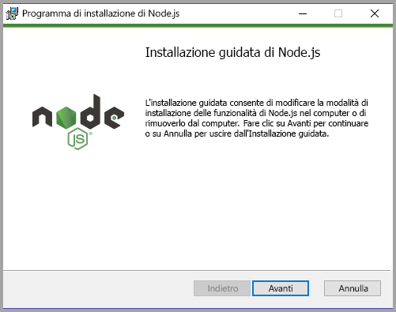

4. Riavviare il computer.

### <a name="installing-packages"></a>Installazione dei pacchetti

A questo punto è necessario installare il pacchetto **pbiviz**.

1. Aprire Windows PowerShell dopo il riavvio del computer.

2. Per installare pbiviz, immettere il comando seguente.

    ```powershell
    npm i -g powerbi-visuals-tools
    ```

### <a name="creating-and-installing-a-certificate"></a>Creazione e installazione di un certificato

#### <a name="windows"></a>Windows

1. Per creare e installare un certificato, immettere il comando seguente.

    ```powershell
    pbiviz --install-cert
    ```

    Restituisce un risultato che produce una *passphrase*. In questo caso, la *passphrase* è **_15105661266553327_** . Viene anche avviata la procedura guidata di importazione del certificato.

    

2. In Importazione guidata certificati verificare che la posizione dell'archivio sia impostata su Utente corrente. Selezionare quindi *Avanti*.

      

3. Nel passaggio **File da importare** selezionare *Avanti*.

4. Nel passaggio **Protezione della chiave privata** incollare la passphrase ricevuta con la creazione del certificato nella casella Password.  In questo caso è di nuovo **_15105661266553327_** .

      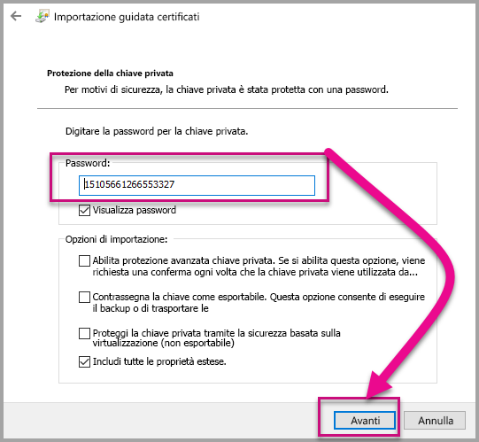

5. Nel passaggio **Archivio certificati** selezionare l'opzione **Colloca tutti i certificati nel seguente archivio**. Selezionare quindi *Sfoglia*.

      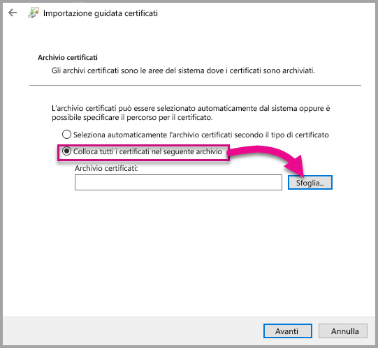

6. Nella finestra **Selezione archivio certificati** selezionare **Autorità di certificazione radice attendibili** e quindi selezionare *OK*. Selezionare quindi *Avanti* nella schermata **Archivio certificati**.

      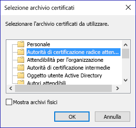

7. Per completare l'importazione, selezionare **Fine**.

8. Se viene visualizzato un avviso di sicurezza, selezionare **Sì**.

    

9. Quando si riceve notifica del completamento dell'importazione, selezionare **OK**.

    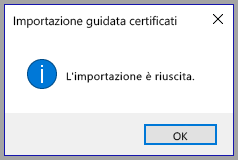

> [!Important]
> Non chiudere la sessione di Windows PowerShell.

#### <a name="osx"></a>OSX

1. Se il lucchetto in alto a sinistra è bloccato, selezionarlo per sbloccarlo. Cercare *localhost* e fare doppio clic sul certificato.

    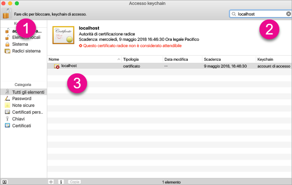

2. Selezionare **Considera sempre attendibile** e chiudere la finestra.

    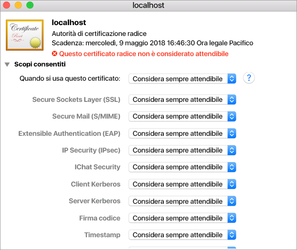

3. Immettere il nome utente e password. Selezionare **Impostazioni aggiornamento**.

    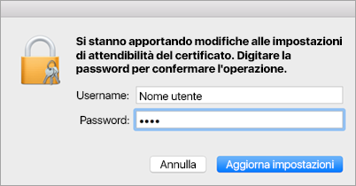

4. Chiudere qualsiasi browser aperto.

> [!NOTE]
> Se il certificato non viene riconosciuto, potrebbe essere necessario riavviare il computer.

## <a name="creating-a-custom-visual"></a>Creazione di un oggetto visivo personalizzato

Ora che è stato configurato l'ambiente, è possibile procedere con la creazione dell'oggetto visivo personalizzato.

È possibile [scaricare](https://github.com/Microsoft/PowerBI-visuals-circlecard) il codice sorgente completo per questa esercitazione.

1. Verificare che sia installato il pacchetto degli strumenti per oggetti visivi di Power BI.

    ```powershell
    pbiviz
    ```
    Si otterrà l'output della guida.

    <pre><code>
        +syyso+/
    oms/+osyhdhyso/
    ym/       /+oshddhys+/
    ym/              /+oyhddhyo+/
    ym/                     /osyhdho
    ym/                           sm+
    ym/               yddy        om+
    ym/         shho /mmmm/       om+
        /    oys/ +mmmm /mmmm/       om+
    oso  ommmh +mmmm /mmmm/       om+
    ymmmy smmmh +mmmm /mmmm/       om+
    ymmmy smmmh +mmmm /mmmm/       om+
    ymmmy smmmh +mmmm /mmmm/       om+
    +dmd+ smmmh +mmmm /mmmm/       om+
            /hmdo +mmmm /mmmm/ /so+//ym/
                /dmmh /mmmm/ /osyhhy/
                    //   dmmd
                        ++

        PowerBI Custom Visual Tool

    Usage: pbiviz [options] [command]

    Commands:

    new [name]        Create a new visual
    info              Display info about the current visual
    start             Start the current visual
    package           Package the current visual into a pbiviz file
    update [version]  Updates the api definitions and schemas in the current visual. Changes the version if specified
    help [cmd]        display help for [cmd]

    Options:

    -h, --help      output usage information
    -V, --version   output the version number
    --install-cert  Install localhost certificate
    </code></pre>

    <a name="ssl-setup"></a>

2. Esaminare l'output, incluso l'elenco dei comandi supportati.

     

3. Per creare un progetto per oggetto visivo personalizzato, immettere il comando seguente. **CircleCard** è il nome del progetto.

    ```PowerShell
    pbiviz new CircleCard
    ```
    

    > [!Note]
    > Il nuovo progetto viene creato nella posizione corrente del prompt.

4. Passare alla cartella del progetto.

    ```powershell
    cd CircleCard
    ```
5. Avviare l'oggetto visivo personalizzato. L'oggetto visivo CircleCard è ora in esecuzione mentre è ospitato nel computer in uso.

    ```powershell
    pbiviz start
    ```

    

> [!Important]
> Non chiudere la sessione di Windows PowerShell.

### <a name="testing-the-custom-visual"></a>Test dell'oggetto visivo personalizzato

In questa sezione l'oggetto visivo personalizzato CircleCard verrà testato caricando un report di Power BI Desktop e quindi modificando il report per visualizzare l'oggetto visivo personalizzato.

1. Accedere a [PowerBI.com](https://powerbi.microsoft.com/), passare all'**icona a forma di ingranaggio** e quindi selezionare **Impostazioni**.

      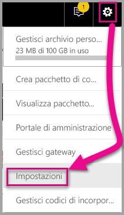

2. Selezionare **Sviluppatore** e quindi selezionare la casella di controllo **Abilita oggetto visivo per sviluppatori per il test**.

    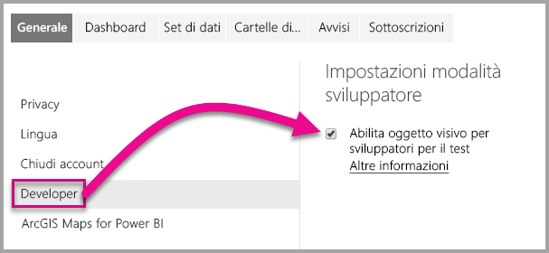

3. Caricare un report di Power BI Desktop.  

    Recupera dati > File > File locale.

    È possibile [scaricare](https://microsoft.github.io/PowerBI-visuals/docs/step-by-step-lab/images/US_Sales_Analysis.pbix) un report di esempio di Power BI Desktop, se non ne è già stato creato uno.

    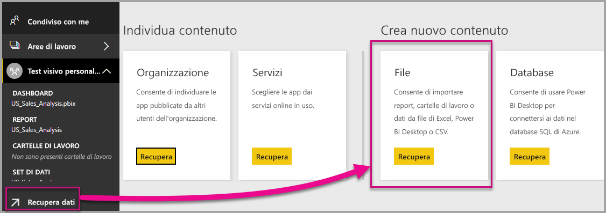 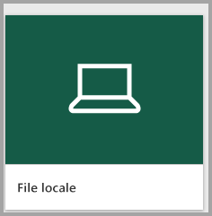

    A questo punto, per visualizzare il report, selezionare **US_Sales_Analysis** nella sezione **Report** nel riquadro di spostamento a sinistra.

    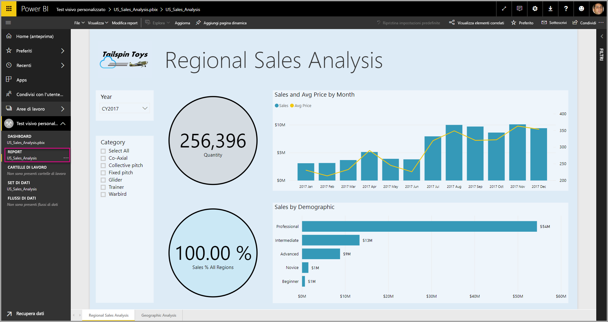

4. A questo punto è necessario modificare il report nel servizio Power BI.

    Passare a **Modifica report**.

    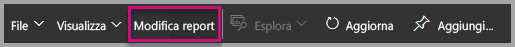

5. Selezionare **Oggetto visivo della modalità sviluppatore** nel riquadro **Visualizzazioni**.

    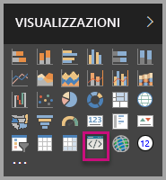

    > [!Note]
    > Questa visualizzazione rappresenta l'oggetto visivo personalizzato avviato nel computer. È disponibile solo quando sono state abilitate le impostazioni per la modalità sviluppatore.

6. Si noti che è stata aggiunta una visualizzazione all'area di disegno report.

    

    > [!Note]
    > Si tratta di un oggetto visivo molto semplice che visualizza il numero di volte in cui è stato chiamato il metodo Update. In questa fase, l'oggetto visivo non recupera ancora alcun dato.

7. Con il nuovo oggetto visivo selezionato nel report, passare al riquadro Campi, espandere Sales e quindi selezionare Quantity.

    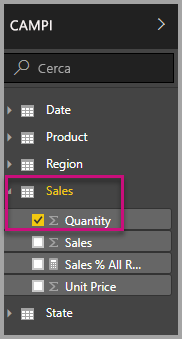

8. Per testare il nuovo oggetto visivo, ridimensionare l'oggetto visivo e quindi osservare gli incrementi del valore.

    

Per interrompere l'esecuzione dell'oggetto visivo personalizzato in PowerShell, premere CTRL+C. Quando viene richiesto di interrompere il processo batch, immettere Y e quindi premere INVIO.

## <a name="adding-visual-elements"></a>Aggiunta di elementi visivi

A questo punto è necessario installare la **libreria JavaScript D3**. D3 è una libreria JavaScript per la creazione di visualizzazioni dei dati dinamiche e interattive nei Web browser, che usa gli standard di ampia diffusione HTML5 SVG e CSS.

A questo punto è possibile sviluppare l'oggetto visivo personalizzato per visualizzare un cerchio con il testo.

> [!Note]
> Molte voci di testo in questa esercitazione possono essere copiate da [qui](https://github.com/Microsoft/powerbi-visuals-circlecard).

1. Per installare la **libreria D3** in PowerShell immettere il comando seguente.

    ```powershell
    npm i d3@3.5.5 --save
    ```

    

2. Per installare le definizioni di tipo per la **libreria D3**, immettere il comando seguente.

    ```powershell
    npm i @types/d3@3.5
    ```

    

    Questo comando installa le definizioni TypeScript basate sui file JavaScript, consentendo lo sviluppo dell'oggetto visivo personalizzato in TypeScript (un superset di JavaScript). Visual Studio Code è un IDE ottimale per lo sviluppo di applicazioni TypeScript.

3. Avviare [Visual Studio Code](https://code.visualstudio.com/).

    È possibile avviare **Visual Studio Code** da PowerShell usando il comando seguente.

    ```powershell
    code .
    ```

4. Nel **riquadro Esplora risorse** espandere la cartella **node_modules** per verificare che la **libreria d3** sia stata installata.

    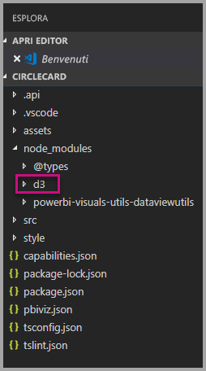

5. Si noti il file TypeScript, **index.d.ts**, espandendo node_modules > @types > d3 nel **riquadro Esplora risorse**.

    

6. Selezionare il file **pbiviz.json**.

7. Per registrare la **libreria d3**, immettere il seguente riferimento al file nella matrice externalJS. Assicurarsi di aggiungere una *virgola* tra il riferimento al file esistente e il nuovo riferimento al file.

    ```javascript
    "node_modules/d3/d3.min.js"
    ```
    

8. Salvare le modifiche al file **pbiviz.json**.

### <a name="developing-the-visual-elements"></a>Sviluppo degli elementi visivi

Si vedrà ora come sviluppare l'oggetto visivo personalizzato per visualizzare un cerchio e testo di esempio.

1. Nel **riquadro Esplora risorse** espandere la cartella **src** e quindi selezionare **visual.ts**.

    > [!Note]
    > Notare i commenti nella parte superiore del file **visual.ts**. L'autorizzazione a usare i pacchetti di oggetti visivi personalizzati di Power BI viene concessa gratuitamente in base alle condizioni della licenza MIT. Come parte del contratto, è necessario lasciare i commenti nella parte superiore del file.

2. Rimuovere la logica predefinita per l'oggetto visivo personalizzato seguente dalla classe Visual.
    * Le quattro dichiarazioni di variabili private a livello di classe.
    * Tutte le righe di codice dal costruttore.
    * Tutte le righe di codice dal metodo update.
    * Tutte le righe rimanenti all'interno del modulo, inclusi i metodi parseSettings ed enumerateObjectInstances.

    Verificare che il codice del modulo sia simile al seguente.

    ```typescript
    module powerbi.extensibility.visual {
    "use strict";
    export class Visual implements IVisual {

        constructor(options: VisualConstructorOptions) {

        }

        public update(options: VisualUpdateOptions) {

            }
        }
    }
    ```

3. Sotto la dichiarazione della classe *Visual* inserire le proprietà a livello di classe seguenti.

    ```typescript
     private host: IVisualHost;
     private svg: d3.Selection<SVGElement>;
     private container: d3.Selection<SVGElement>;
     private circle: d3.Selection<SVGElement>;
     private textValue: d3.Selection<SVGElement>;
     private textLabel: d3.Selection<SVGElement>; 
    ```

    

4. Aggiungere il codice seguente al *costruttore*.

    ```typescript
    this.svg = d3.select(options.element)
                 .append('svg')
                 .classed('circleCard', true);
    this.container = this.svg.append("g")
                         .classed('container', true);
    this.circle = this.container.append("circle")
                             .classed('circle', true);
    this.textValue = this.container.append("text")
                                 .classed("textValue", true);
    this.textLabel = this.container.append("text")
                                 .classed("textLabel", true);
    ```

    Questo codice aggiunge un gruppo SVG all'interno dell'oggetto visivo e quindi aggiunge tre forme: un cerchio e due elementi di testo.

    Per formattare il codice nel documento, fare clic con il pulsante destro del mouse in qualsiasi punto nel **documento di Visual Studio Code** e quindi scegliere **Formatta documento**.

      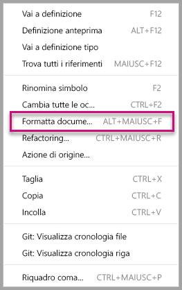

    Per migliorare la leggibilità, è consigliabile formattare il documento ogni volta che si incollano frammenti di codice.

5. Aggiungere il codice seguente nel metodo *update*.

    ```typescript
    let width: number = options.viewport.width;
    let height: number = options.viewport.height;
    this.svg.attr({
     width: width,
     height: height
    });
    let radius: number = Math.min(width, height) / 2.2;
    this.circle
     .style("fill", "white")
     .style("fill-opacity", 0.5)
     .style("stroke", "black")
     .style("stroke-width", 2)
    .attr({
     r: radius,
     cx: width / 2,
     cy: height / 2
    });
    let fontSizeValue: number = Math.min(width, height) / 5;
    this.textValue
     .text("Value")
     .attr({
         x: "50%",
         y: "50%",
         dy: "0.35em",
         "text-anchor": "middle"
     }).style("font-size", fontSizeValue + "px");
    let fontSizeLabel: number = fontSizeValue / 4;
    this.textLabel
     .text("Label")
     .attr({
         x: "50%",
         y: height / 2,
         dy: fontSizeValue / 1.2,
         "text-anchor": "middle"
     })
     .style("font-size", fontSizeLabel + "px");
    ```

    *Questo codice imposta la larghezza e l'altezza dell'oggetto visivo, quindi inizializza gli attributi e gli stili degli elementi visivi.*

6. Salvare il file **visual.ts**.

7. Selezionare il file **capabilities.json**.

    Nella riga 14, rimuovere l'intero elemento objects (righe da 14 a 60).

8. Salvare il file **capabilities.json**.

9. In PowerShell avviare l'oggetto visivo personalizzato.

    ```powershell
    pbiviz start
    ```

### <a name="toggle-auto-reload"></a>Attiva/Disattiva ricaricamento automatico

1. Tornare al report di Power BI.
2. Sulla barra degli strumenti mobile sopra l'oggetto visivo per sviluppatori, selezionare **Attiva/Disattiva ricaricamento automatico**.

    

    Questa opzione assicura che l'oggetto visivo venga ricaricato automaticamente ogni volta che si salvano le modifiche del progetto.

3. Dal **riquadro Campi** trascinare il campo **Quantity** nell'oggetto visivo per sviluppatori.

4. Verificare che l'oggetto visivo abbia un aspetto simile al seguente.

    

5. Ridimensionare l'oggetto visivo.

    Si noti che il cerchio e il valore di testo vengono ridimensionati per adattarsi alla dimensione disponibile dell'oggetto visivo.

    Il metodo update viene chiamato continuamente durante il ridimensionamento dell'oggetto visivo e ciò consente il ridimensionamento fluido degli elementi visivi.

    Lo sviluppo degli elementi visivi è a questo punto completo.

6. Continuare a eseguire l'oggetto visivo.

## <a name="configuring-data-binding"></a>Configurazione dell'associazione dati

Definire i ruoli dati e i mapping di vista dati, quindi modificare la logica dell'oggetto visivo personalizzato per visualizzare il valore e il nome visualizzato di una misura.

### <a name="configuring-the-capabilities"></a>Configurazione delle funzionalità

Modificare il file **capabilities.json** per definire il ruolo dati e i mapping di vista dati.

1. In Visual Studio Code, nel file **capabilities.json**, rimuovere tutto il contenuto all'interno della matrice **dataRoles** (righe 3-12).

2. All'interno della matrice **dataRoles** inserire il codice seguente.

    ```json
    {
     "displayName": "Measure",
     "name": "measure",
     "kind": "Measure"
    }
    ```
    La matrice **dataRoles** definisce ora un singolo ruolo dati di tipo **measure**, denominato **measure** e visualizzato come **Measure**. Questo ruolo dati consente il passaggio di un campo di misura o di un campo riepilogato.

3. All'interno della matrice **dataViewMappings**, rimuovere tutto il contenuto (righe 10-31).

4. All'interno della matrice **dataViewMappings** inserire il contenuto seguente.

    ```json
            {
            "conditions": [
                { "measure": { "max": 1 } }
            ],
            "single": {
                "role": "measure"
            }
           }
    ```
    La matrice **dataViewMappings** definisce ora un campo che può essere passato al ruolo dati denominato **measure**.

5. Salvare il file **capabilities.json**.

6. In Power BI, si noti che l'oggetto visivo può ora essere configurato con **Measure**.

    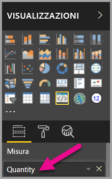

    > [!Note]
    > Il progetto dell'oggetto visivo non include ancora logica di associazione dati.

### <a name="exploring-the-dataview"></a>Esplorazione della vista dati

1. Sulla barra degli strumenti mobile sopra l'oggetto visivo, selezionare **Mostra vista dati**.

    

2. Espandere verso il basso fino a **single** e notare il valore.

    

3. Espandere verso il basso fino **metadata** e poi nella matrice **columns** e notare in particolare i valori **format** e **displayName**.

    

4. Per attivare nuovamente l'oggetto visivo, sulla barra degli strumenti mobile sopra l'oggetto visivo selezionare **Mostra vista dati**.

    

### <a name="configuring-data-binding"></a>Configurazione dell'associazione dati

1. In **Visual Studio Code**, nel file **visual.ts**, aggiungere l'istruzione seguente come prima istruzione del metodo update.

    ```typescript
    let dataView: DataView = options.dataViews[0];
    ```
    

    Questa istruzione assegna *dataView* a una variabile per semplificare l'accesso e dichiara la variabile in modo che faccia riferimento all'oggetto *dataView*.

2. Nel metodo **update** sostituire **.text("Value")** con il codice seguente.

    ```typescript
    .text(dataView.single.value as string)
    ```
    

3. Nel metodo **update** sostituire **.text("Label")** con il codice seguente.

    ```typescript
    .text(dataView.metadata.columns[0].displayName)
    ```
    

4. Salvare il file **visual.ts**.

5. In **Power BI**, esaminare l'oggetto visivo, che ora mostra il valore e il nome visualizzato.

A questo punto sono stati configurati i ruoli dati e l'oggetto visivo è stato associato alla vista dati.

Nella prossima esercitazione si vedrà come aggiungere opzioni di formattazione all'oggetto visivo personalizzato.

## <a name="debugging"></a>Debug

Per suggerimenti sul debug dell'oggetto visivo personalizzato, vedere la [guida al debug](https://microsoft.github.io/PowerBI-visuals/docs/how-to-guide/how-to-debug/).

## <a name="next-steps"></a>Passaggi successivi

> [!div class="nextstepaction"]
> [Aggiunta di opzioni di formattazione](custom-visual-develop-tutorial-format-options.md)
