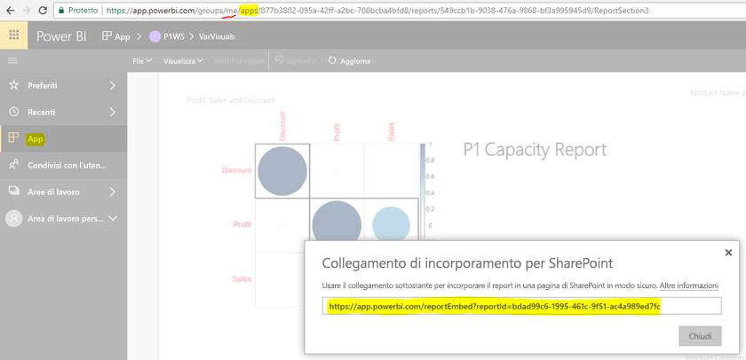

# Incorporare report o dashboard dalle app

In Power BI, è possibile creare app per riunire dashboard e report correlati, tutti in un'unica posizione. Quindi vengono pubblicate in ampi gruppi di persone all'interno dell'organizzazione. L'utilizzo di tali app è pertinente quando tutti gli utenti sono utenti di Power BI. Pertanto, è possibile condividere contenuto con loro usando le app di Power BI. In questo articolo sono riportati alcuni rapidi passaggi per incorporare contenuti in un'applicazione di terze parti da un'app di Power BI pubblicata.

## Catturare un URL di incorporamento di report per l'incorporamento

1. Creare un'istanza di applicazione in un'area di lavoro utente, **Area di lavoro personale**. Condividere per il proprio utilizzo o guidare un altro utente a passare attraverso questo flusso.

2. Aprire il report desiderato nel servizio Power BI.

3. Passare a **File** > **Incorpora In SharePoint Online** e individuare l'URL di incorporamento di report. Un esempio di URL di incorporamento è illustrato nello screenshot seguente. In alternativa, chiamare l'API REST GetReports/GetReport ed estrarre il campo dell'URL di incorporamento di report corrispondente dalla risposta. La chiamata REST non deve avere un identificatore di area di lavoro come componente dell'URL perché è stata creata un'istanza dell'app nell'area di lavoro dell'utente.

    

4. Usare l'URL di incorporamento recuperato nel passaggio 3 con JavaScript SDK.

## Catturare un URL di incorporamento di dashboard per l'incorporamento

1. Creare un'istanza di applicazione in un'area di lavoro utente, **Area di lavoro personale**. Condividere per il proprio utilizzo o guidare un altro utente a passare attraverso questo flusso.

2. Chiamare l'API REST GetDashboards ed estrarre il campo URL di incorporamento di dashboard corrispondente dalla risposta. La chiamata REST non deve avere un identificatore di area di lavoro come componente dell'URL perché è stata creata un'istanza dell'app nell'area di lavoro dell'utente.

3. Usare l'URL di incorporamento recuperato nel passaggio 2 con JavaScript SDK.

## Passaggi successivi

Vedere le procedure di incorporamento dalle aree di lavoro per le app per i clienti di terze parti e l'organizzazione:

> [!div class="nextstepaction"]
>[Incorporare contenuto per i clienti di terze parti](embed-sample-for-customers.md)

> [!div class="nextstepaction"]
>[Incorporare contenuto per l'organizzazione](embed-sample-for-your-organization.md)
