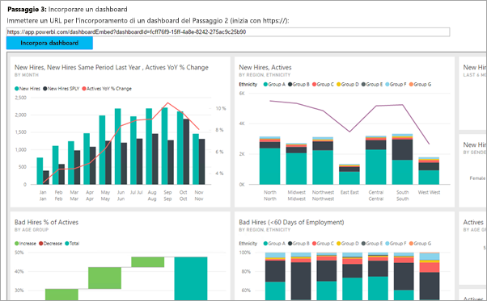

# <a name="embed-a-power-bi-dashboard-tile-or-report-into-your-application-for-sovereign-clouds"></a>Incorporare un dashboard, un riquadro o un report di Power BI nell'applicazione per cloud sovrani
Informazioni su come integrare o incorporare un dashboard, un riquadro o un report in un'app Web tramite Power BI .NET SDK insieme all'API JavaScript di Power BI durante l'incorporamento per i clienti. Questo è in genere lo scenario relativo a ISV.

Power BI supporta anche cloud sovrani (privati). Ogni cloud sovrano ha un'affiliazione propria. I cloud sovrani diversi sono:

* U.S. Government Community Cloud (GCC) (Cloud della community per enti pubblici)

* U. S. Military Contractors (DoDCON) (Contractor militari - DoDCON)

* U. S. Military (DoD) (Esercito -DoD)

* Power BI per il cloud Germania



Per eseguire questa procedura dettagliata, è necessario un account **Power BI**. Se non è disponibile un account, a seconda del tipo di ente pubblico, è possibile [iscriversi per un account di Power BI per il Governo degli Stati Uniti](../service-govus-signup.md) oppure [un account di Power BI per il cloud Germania](https://powerbi.microsoft.com/power-bi-germany/?ru=https%3A%2F%2Fapp.powerbi.de%2F%3FnoSignUpCheck%3D1).

> [!NOTE]
> Se invece si vuole incorporare un dashboard per l'organizzazione, vedere [Integrare un dashboard in un'app per l'organizzazione](integrate-dashboard.md).
>

Per integrare un dashboard in un'app Web, occorre usare l'API **Power BI** e un **token di accesso** di autorizzazione di Azure Active Directory (AD) per ottenere un dashboard. Caricare quindi il dashboard tramite un token di incorporamento. L'API **Power BI** fornisce l'accesso a livello di codice a determinate risorse di **Power BI**. Per altre informazioni, vedere [Panoramica dell'API REST di Power BI](https://msdn.microsoft.com/library/dn877544.aspx), [Power BI .NET SDK](https://github.com/Microsoft/PowerBI-CSharp) e [Power BI JavaScript API](https://github.com/Microsoft/PowerBI-JavaScript) (API JavaScript di Power BI).

## <a name="download-the-sample"></a>Scaricare l'esempio
Questo articolo mostra il codice usato nell'[esempio di incorporamento per il cliente](https://github.com/Microsoft/PowerBI-Developer-Samples/tree/master/App%20Owns%20Data/PowerBIEmbedded_AppOwnsData) su GitHub. Per proseguire con questa procedura dettagliata, è possibile scaricare l'esempio.

* Government Community Cloud (GCC) (Cloud della community per enti pubblici):
    1. Sovrascrivere il file Cloud.config con il contenuto di GCCCloud.config.
    2. Aggiornare clientid (ID client dell'app nativa), groupid, user (utente master) e password nel file Web.config.
    3. Aggiungere i parametri GCC nel file web.config come segue.

```xml
<add key="authorityUrl" value="https://login.windows.net/common/oauth2/authorize/" />

<add key="resourceUrl" value="https://analysis.usgovcloudapi.net/powerbi/api" />

<add key="apiUrl" value="https://api.powerbigov.us/" />

<add key="embedUrlBase" value="https://app.powerbigov.us" />
```

* Military Contractors (DoDCON) (Contractor militari - DoDCON):
    1. Sovrascrivere il file Cloud.config con il contenuto di TBCloud.config.
    2. Aggiornare clientid (ID client dell'app nativa), groupid, user (utente master) e password nel file Web.config.
    3. Aggiungere i parametri DoDCON nel file web.config come segue.

```xml
<add key="authorityUrl" value="https://login.windows.net/common/oauth2/authorize/" />

<add key="resourceUrl" value="https://high.analysis.usgovcloudapi.net/powerbi/api" />

<add key="apiUrl" value="https://api.high.powerbigov.us/" />

<add key="embedUrlBase" value="https://app.high.powerbigov.us" />
```

* Military (DoD) (Esercito -DoD):
    1. Sovrascrivere il file Cloud.config con il contenuto di PFCloud.config.
    2. Aggiornare clientid (ID client dell'app nativa), groupid, user (utente master) e password nel file Web.config.
    3. Aggiungere i parametri DoDCON nel file web.config come segue.

```xml
<add key="authorityUrl" value="https://login.windows.net/common/oauth2/authorize/" />

<add key="resourceUrl" value="https://mil.analysis.usgovcloudapi.net/powerbi/api" />

<add key="apiUrl" value="https://api.mil.powerbigov.us/" />

<add key="embedUrlBase" value="https://app.mil.powerbigov.us" />
```

* Parametri di Power BI per il cloud Germania
    1. Sovrascrivere il file Cloud.config con il contenuto di Power BI per il cloud Germania.
    2. Aggiornare clientid (ID client dell'app nativa), groupid, user (utente master) e password nel file Web.config.
    3. Aggiungere i parametri di Power BI per il cloud Germania nel file web.config come segue.

```xml
<add key="authorityUrl" value=https://login.microsoftonline.de/common/oauth2/authorize/" />

<add key="resourceUrl" value="https://analysis.cloudapi.de/powerbi/api" />

<add key="apiUrl" value="https://api.powerbi.de/" />

<add key="embedUrlBase" value="https://app.powerbi.de" />
```

## <a name="step-1---register-an-app-in-azure-ad"></a>Passaggio 1: Registrare un'app in Azure AD
È necessario registrare l'applicazione in Azure AD per effettuare chiamate all'API REST. Per altre informazioni, vedere [Registrare un'app di Azure AD per incorporare il contenuto di Power BI](register-app.md). Dato che sono presenti affiliazioni per cloud sovrani diversi, esistono URL distinti per registrare l'applicazione.

* Government Community Cloud (GCC) (Cloud della community per enti pubblici) - https://app.powerbigov.us/apps 

* Military Contractors (DoDCON) (Contractor militari - DoDCON) - https://app.high.powerbigov.us/apps 

* Military (DoD) (Esercito - DoD)- https://app.mil.powerbigov.us/apps

* Power BI per il cloud Germania - https://app.powerbi.de/apps

Se è stato scaricato l'[esempio di incorporamento per il cliente](https://github.com/Microsoft/PowerBI-Developer-Samples/tree/master/App%20Owns%20Data), usare l'**ID client** ottenuto dopo la registrazione, in modo che l'esempio possa eseguire l'autenticazione in Azure AD. Per configurare l'esempio, modificare il valore **clientId** nel file *web.config*.


## <a name="step-2---get-an-access-token-from-azure-ad"></a>Passaggio 2: Ottenere un token di accesso da Azure AD
Nell'applicazione è prima di tutto necessario ottenere un **token di accesso** da Azure AD prima di effettuare chiamate all'API REST di Power BI. Per altre informazioni, vedere [Autenticare gli utenti e ottenere un token di accesso di Azure AD per l'app Power BI](get-azuread-access-token.md). Dato che sono presenti affiliazioni per cloud sovrani diversi, esistono URL distinti per ottenere un token di accesso per l'applicazione.

* Government Community Cloud (GCC) (Cloud della community per enti pubblici) - https://login.microsoftonline.com

* Military Contractors (DoDCON) (Contractor militari - DoDCON) - http://login.microsoftonline.us

* Military (DoD) (Esercito - DoD)- https://login.microsoftonline.us

* Power BI per il cloud Germania - https://login.microsoftonline.de

Per esempi specifici in ogni attività di elemento di contenuto, vedere il file **Controllers\HomeController.cs**.

## <a name="step-3---get-a-content-item"></a>Passaggio 3: Ottenere un elemento di contenuto
Per incorporare contenuti di Power BI, è necessario eseguire alcune operazioni per assicurare l'incorporamento corretto. Anche se è possibile eseguire tutti i passaggi direttamente nell'API REST, l'applicazione di esempio e gli esempi in questo articolo sono basati su .NET SDK.

### <a name="create-the-power-bi-client-with-your-access-token"></a>Creare il client Power BI con il token di accesso
Con il token di accesso è consigliabile creare l'oggetto client Power BI, che consentirà di interagire con le API di Power BI. A questo scopo, eseguire il wrapping di AccessToken in un oggetto *Microsoft.Rest.TokenCredentials*.

```csharp
using Microsoft.IdentityModel.Clients.ActiveDirectory;
using Microsoft.Rest;
using Microsoft.PowerBI.Api.V2;

var tokenCredentials = new TokenCredentials(authenticationResult.AccessToken, "Bearer");

// Create a Power BI Client object. It will be used to call Power BI APIs.
using (var client = new PowerBIClient(new Uri(ApiUrl), tokenCredentials))
{
    // Your code to embed items.
}
```

### <a name="get-the-content-item-you-want-to-embed"></a>Ottenere l'elemento di contenuto da incorporare
Usare l'oggetto client Power BI per recuperare un riferimento all'elemento da incorporare. È possibile incorporare dashboard, riquadri o report. Ecco un esempio della procedura per recuperare il primo dashboard, riquadro o report da un'area di lavoro specifica.

Un esempio di questa procedura è disponibile in **Controllers\HomeController.cs** di [App Owns Data sample](https://github.com/Microsoft/PowerBI-Developer-Samples/tree/master/App%20Owns%20Data) (Esempio "App Owns Data").

**Dashboard**

```csharp
using Microsoft.PowerBI.Api.V2;
using Microsoft.PowerBI.Api.V2.Models;

// You will need to provide the GroupID where the dashboard resides.
ODataResponseListDashboard dashboards = client.Dashboards.GetDashboardsInGroup(GroupId);

// Get the first report in the group.
Dashboard dashboard = dashboards.Value.FirstOrDefault();
```

**Riquadro**

```csharp
using Microsoft.PowerBI.Api.V2;
using Microsoft.PowerBI.Api.V2.Models;

// To retrieve the tile, you first need to retrieve the dashboard.

// You will need to provide the GroupID where the dashboard resides.
ODataResponseListDashboard dashboards = client.Dashboards.GetDashboardsInGroup(GroupId);

// Get the first report in the group.
Dashboard dashboard = dashboards.Value.FirstOrDefault();

// Get a list of tiles from a specific dashboard
ODataResponseListTile tiles = client.Dashboards.GetTilesInGroup(GroupId, dashboard.Id);

// Get the first tile in the group.
Tile tile = tiles.Value.FirstOrDefault();
```

**Report**

```csharp
using Microsoft.PowerBI.Api.V2;
using Microsoft.PowerBI.Api.V2.Models;

// You will need to provide the GroupID where the dashboard resides.
ODataResponseListReport reports = client.Reports.GetReportsInGroupAsync(GroupId);

// Get the first report in the group.
Report report = reports.Value.FirstOrDefault();
```

### <a name="create-the-embed-token"></a>Creare il token di incorporamento
È necessario generare un token di incorporamento che possa essere usato dall'API JavaScript. Il token di incorporamento sarà specifico per l'elemento da incorporare. Ogni volta che si incorpora una parte di contenuto di Power BI è quindi necessario creare un nuovo token di incorporamento specifico. Per altre informazioni, incluso il valore **accessLevel** da usare, vedere [GenerateToken API](https://msdn.microsoft.com/library/mt784614.aspx) (API GenerateToken).

> [!IMPORTANT]
> Dato che i token di incorporamento sono destinati solo alle attività di sviluppo e test, un account master Power BI può generare un numero di token di incorporamento limitato. È necessario [acquistare una capacità](https://docs.microsoft.com/power-bi/developer/embedded-faq#technical) per gli scenari di incorporamento della produzione. Dopo l'acquisto della capacità è possibile generare un numero illimitato di token di incorporamento.

Un esempio di questa procedura è disponibile in **Controllers\HomeController.cs** dell'[esempio di incorporamento per l'organizzazione](https://github.com/Microsoft/PowerBI-Developer-Samples/tree/master/App%20Owns%20Data).

Si presuppone che venga creata una classe per **EmbedConfig** e **TileEmbedConfig**. Esempi specifici sono disponibili in **Models\EmbedConfig.cs** e **Models\TileEmbedConfig.cs**.

**Dashboard**

```csharp
using Microsoft.PowerBI.Api.V2;
using Microsoft.PowerBI.Api.V2.Models;

// Generate Embed Token.
var generateTokenRequestParameters = new GenerateTokenRequest(accessLevel: "view");
EmbedToken tokenResponse = client.Dashboards.GenerateTokenInGroup(GroupId, dashboard.Id, generateTokenRequestParameters);

// Generate Embed Configuration.
var embedConfig = new EmbedConfig()
{
    EmbedToken = tokenResponse,
    EmbedUrl = dashboard.EmbedUrl,
    Id = dashboard.Id
};
```

**Riquadro**

```csharp
using Microsoft.PowerBI.Api.V2;
using Microsoft.PowerBI.Api.V2.Models;

// Generate Embed Token for a tile.
var generateTokenRequestParameters = new GenerateTokenRequest(accessLevel: "view");
EmbedToken tokenResponse = client.Tiles.GenerateTokenInGroup(GroupId, dashboard.Id, tile.Id, generateTokenRequestParameters);

// Generate Embed Configuration.
var embedConfig = new TileEmbedConfig()
{
    EmbedToken = tokenResponse,
    EmbedUrl = tile.EmbedUrl,
    Id = tile.Id,
    dashboardId = dashboard.Id
};
```

**Report**

```csharp
using Microsoft.PowerBI.Api.V2;
using Microsoft.PowerBI.Api.V2.Models;

// Generate Embed Token.
var generateTokenRequestParameters = new GenerateTokenRequest(accessLevel: "view");
EmbedToken tokenResponse = client.Reports.GenerateTokenInGroup(GroupId, report.Id, generateTokenRequestParameters);

// Generate Embed Configuration.
var embedConfig = new EmbedConfig()
{
    EmbedToken = tokenResponse,
    EmbedUrl = report.EmbedUrl,
    Id = report.Id
};
```
## <a name="step-4---load-an-item-using-javascript"></a>Passaggio 4: Caricare un elemento con JavaScript
È possibile usare JavaScript per caricare un dashboard in un elemento div nella pagina Web. L'esempio usa un modello EmbedConfig/TileEmbedConfig insieme a visualizzazioni per un dashboard, un riquadro o un report. Per un esempio completo dell'uso dell'API JavaScript, vedere [Microsoft Power BI Embedded Sample](https://microsoft.github.io/PowerBI-JavaScript/demo) (Esempio di Microsoft Power BI Embedded).

Un'applicazione di esempio è disponibile nell'[esempio di incorporamento per l'organizzazione](https://github.com/Microsoft/PowerBI-Developer-Samples/tree/master/App%20Owns%20Data).

**Views\Home\EmbedDashboard.cshtml**

```csharp
<script src="~/scripts/powerbi.js"></script>
<div id="dashboardContainer"></div>
<script>
    // Read embed application token from Model
    var accessToken = "@Model.EmbedToken.Token";

    // Read embed URL from Model
    var embedUrl = "@Html.Raw(Model.EmbedUrl)";

    // Read dashboard Id from Model
    var embedDashboardId = "@Model.Id";

    // Get models. models contains enums that can be used.
    var models = window['powerbi-client'].models;

    // Embed configuration used to describe the what and how to embed.
    // This object is used when calling powerbi.embed.
    // This also includes settings and options such as filters.
    // You can find more information at https://github.com/Microsoft/PowerBI-JavaScript/wiki/Embed-Configuration-Details.
    var config = {
        type: 'dashboard',
        tokenType: models.TokenType.Embed,
        accessToken: accessToken,
        embedUrl: embedUrl,
        id: embedDashboardId
    };

    // Get a reference to the embedded dashboard HTML element
    var dashboardContainer = $('#dashboardContainer')[0];

    // Embed the dashboard and display it within the div container.
    var dashboard = powerbi.embed(dashboardContainer, config);
</script>
```

**Views\Home\EmbedTile.cshtml**

```csharp
<script src="~/scripts/powerbi.js"></script>
<div id="tileContainer"></div>
<script>
    // Read embed application token from Model
    var accessToken = "@Model.EmbedToken.Token";

    // Read embed URL from Model
    var embedUrl = "@Html.Raw(Model.EmbedUrl)";

    // Read tile Id from Model
    var embedTileId = "@Model.Id";

    // Read dashboard Id from Model
    var embedDashboardeId = "@Model.dashboardId";

    // Get models. models contains enums that can be used.
    var models = window['powerbi-client'].models;

    // Embed configuration used to describe the what and how to embed.
    // This object is used when calling powerbi.embed.
    // This also includes settings and options such as filters.
    // You can find more information at https://github.com/Microsoft/PowerBI-JavaScript/wiki/Embed-Configuration-Details.
    var config = {
        type: 'tile',
        tokenType: models.TokenType.Embed,
        accessToken: accessToken,
        embedUrl: embedUrl,
        id: embedTileId,
        dashboardId: embedDashboardeId
    };

    // Get a reference to the embedded tile HTML element
    var tileContainer = $('#tileContainer')[0];

    // Embed the tile and display it within the div container.
    var tile = powerbi.embed(tileContainer, config);
</script>
```

**Views\Home\EmbedReport.cshtml**

```csharp
<script src="~/scripts/powerbi.js"></script>
<div id="reportContainer"></div>
<script>
    // Read embed application token from Model
    var accessToken = "@Model.EmbedToken.Token";

    // Read embed URL from Model
    var embedUrl = "@Html.Raw(Model.EmbedUrl)";

    // Read report Id from Model
    var embedReportId = "@Model.Id";

    // Get models. models contains enums that can be used.
    var models = window['powerbi-client'].models;

    // Embed configuration used to describe the what and how to embed.
    // This object is used when calling powerbi.embed.
    // This also includes settings and options such as filters.
    // You can find more information at https://github.com/Microsoft/PowerBI-JavaScript/wiki/Embed-Configuration-Details.
    var config = {
        type: 'report',
        tokenType: models.TokenType.Embed,
        accessToken: accessToken,
        embedUrl: embedUrl,
        id: embedReportId,
        permissions: models.Permissions.All,
        settings: {
            filterPaneEnabled: true,
            navContentPaneEnabled: true
        }
    };

    // Get a reference to the embedded report HTML element
    var reportContainer = $('#reportContainer')[0];

    // Embed the report and display it within the div container.
    var report = powerbi.embed(reportContainer, config);
</script>
```

## <a name="next-steps"></a>Passaggi successivi

* Un'applicazione di esempio è disponibile su GitHub per gli utenti. Gli esempi precedenti sono basati su di essa. Per altre informazioni, vedere l'[esempio di incorporamento per l'organizzazione](https://github.com/Microsoft/PowerBI-Developer-Samples/tree/master/App%20Owns%20Data).
* Per altre informazioni sulle API JavaScript, vedere [API JavaScript di Power BI](https://github.com/Microsoft/PowerBI-JavaScript).
* Per altre informazioni per Power BI per il cloud Germania, vedere [Domande frequenti per Power BI per i clienti di Cloud Germania](https://docs.microsoft.com/power-bi/service-govde-faq).
* [Come eseguire la migrazione del contenuto della raccolta di aree di lavoro di Power BI in Power BI](migrate-from-powerbi-embedded.md)

Limitazioni e considerazioni
* Gli account GCC attualmente supportano solo le capacità P ed EM

Altre domande? [Provare a rivolgersi alla community di Power BI](http://community.powerbi.com/)
