# <a name="tutorial-embed-a-power-bi-report-dashboard-or-tile-into-an-application-for-your-customers"></a>Esercitazione: Incorporare un report, un dashboard o un riquadro di Power BI in un'applicazione per i clienti
Con **Power BI Embedded in Azure**, è possibile incorporare report, dashboard o riquadri in un'applicazione usando **dati di proprietà dell'app**. **I dati di proprietà dell'app** consistono nel disporre di un'applicazione che usa Power BI come piattaforma di analisi incorporata. Si tratta in genere di uno scenario **ISV developer**. In qualità di **ISV developer** è possibile creare contenuti Power BI che visualizzano report, dashboard o riquadri in un'applicazione completamente integrata e interattiva, senza richiedere agli utenti dell'applicazione di disporre di una licenza Power BI o di essere a conoscenza del fatto che è presente Power BI. Questa esercitazione illustra come integrare un report in un'applicazione tramite .NET SDK di **Power BI** insieme all'API JavaScript di **Power BI** quando si usa **Power BI Embedded in Azure**  per i clienti che usano **dati di proprietà dell'app**.

In questa esercitazione viene illustrato come:
>[!div class="checklist"]
>* Registrare un'applicazione in Azure.
>* Incorporare un report di Power BI in un'applicazione.

## <a name="prerequisites"></a>Prerequisiti
Per iniziare, è necessario un account **Power BI Pro**, che costituirà il proprio **account master** e una sottoscrizione **Microsoft Azure**.

* Se non si è ancora iscritti a **Power BI Pro**, [iscriversi per ottenere una versione di prova gratuita](https://powerbi.microsoft.com/en-us/pricing/) prima di iniziare.
* Se non si ha una sottoscrizione di Azure, [creare un account gratuito](https://azure.microsoft.com/free/?WT.mc_id=A261C142F) prima di iniziare.
* È necessario disporre del proprio [tenant di Azure Active Directory](create-an-azure-active-directory-tenant.md) configurato.
* È richiesta l'installazione di [Visual Studio](https://www.visualstudio.com/) (versione 2013 o successive).

## <a name="setup-your-embedded-analytics-development-environment"></a>Configurare l'ambiente di sviluppo di analisi incorporata

Prima di iniziare a incorporare report, dashboard o riquadri in un'applicazione, è necessario assicurarsi che l'ambiente sia configurato per consentire l'incorporamento. La configurazione include le operazioni seguenti.

È possibile usare lo [strumento esperienza di onboarding](https://aka.ms/embedsetup/AppOwnsData) per iniziare rapidamente scaricando un'applicazione di esempio che facilita l'esecuzione della procedura di creazione di un ambiente e di incorporamento di un report.

Se tuttavia si sceglie di configurare l'ambiente manualmente, è possibile continuare con le istruzioni che seguono.
### <a name="register-an-application-in-azure-active-directory-azure-ad"></a>Registrare un'applicazione in Azure Active Directory (Azure AD)

La registrazione dell'applicazione in Azure Active Directory consente all'applicazione di accedere alle API REST di Power BI. Ciò permette di stabilire un'identità per l'applicazione e di specificare le autorizzazioni per accedere alle risorse REST di Power BI.

1. Accettare le [condizioni relative all'API di Microsoft Power BI](https://powerbi.microsoft.com/api-terms).

2. Accedere al [portale di Azure](https://portal.azure.com).
 
    

3. Nel riquadro di spostamento a sinistra scegliere **Tutti i servizi**, selezionare **Registrazioni per l'app** e quindi scegliere **Registrazione nuova applicazione**.
   
    </br>
    

4. Seguire le istruzioni e creare una nuova applicazione. Per i dati di proprietà delle app è necessario usare **Nativa** per il tipo di applicazione. È anche necessario specificare un **URI di reindirizzamento**, che verrà usato da **Azure AD** per restituire le risposte del token. Immettere un valore specifico per l'applicazione (ad esempio: `http://localhost:13526/redirect`).

    

### <a name="apply-permissions-to-your-application-within-azure-active-directory"></a>Applicare le autorizzazioni all'applicazione in Azure Active Directory

È necessario abilitare autorizzazioni aggiuntive per l'applicazione oltre a quelle fornite nella pagina di registrazione dell'app. È necessario accedere con l'account *master*, usato per l'incorporamento, che deve essere un account di amministratore globale.

### <a name="use-the-azure-active-directory-portal"></a>Usare il portale di Azure Active Directory

1. Passare a [Registrazioni per l'app](https://portal.azure.com/#blade/Microsoft_AAD_IAM/ApplicationsListBlade) nel portale di Azure e selezionare l'app che si usa per l'incorporamento.
   
    

2. Selezionare **Impostazioni** e quindi in **Accesso all'API** selezionare **Autorizzazioni necessarie**.
   
    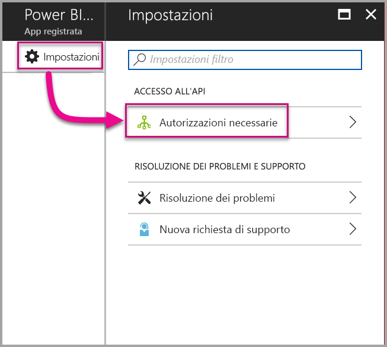

3. Selezionare **Microsoft Azure Active Directory** e quindi accertarsi che l'opzione **Accede alla directory come utente registrato** sia selezionata. Selezionare **Salva**.
   
    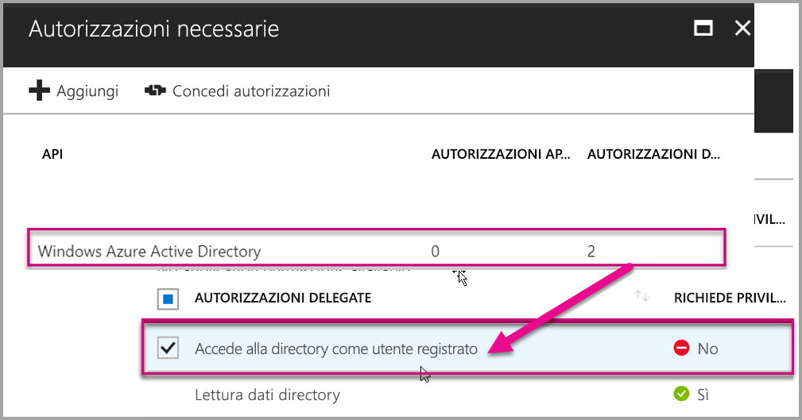

4. Selezionare **Aggiungi**.

    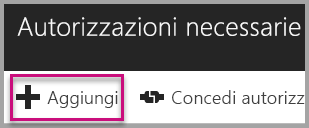

5. Fare clic su **Selezionare un'API**.

    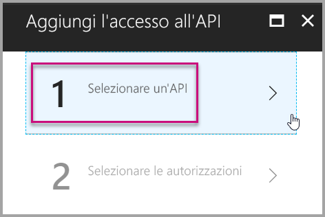

6. Selezionare **Servizio Power BI** e quindi **Seleziona**.

    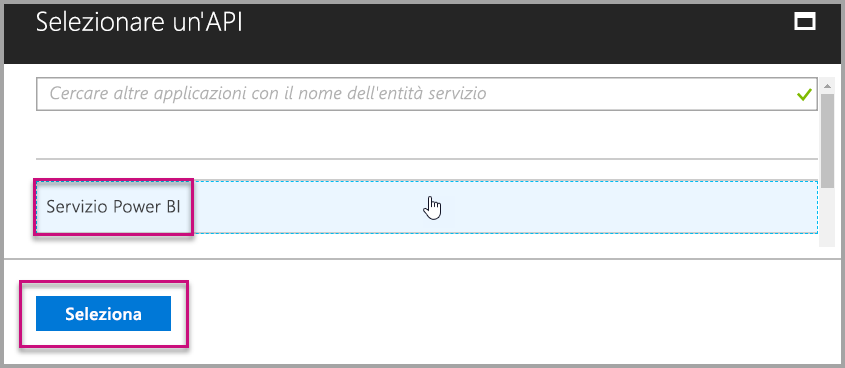

7. Selezionare tutte le autorizzazioni in **Autorizzazioni delegate**. Per salvare le selezioni è necessario selezionarle una alla volta. Al termine, selezionare **Salva**.
   
    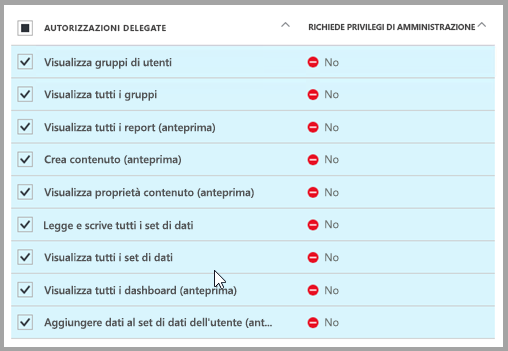

8. In **Autorizzazioni necessarie** selezionare **Concedi autorizzazioni**.
   
    Per l'azione **Concedi autorizzazioni** è necessaria la presenza dell'*account master* per evitare che venga richiesto il consenso da Azure AD. Se l'account che esegue questa azione è un amministratore globale, è necessario concedere autorizzazioni per questa applicazione a tutti gli utenti dell'organizzazione. Se l'account che esegue questa azione è l'*account master* e non un amministratore globale, è necessario concedere autorizzazioni per questa applicazione solo all'*account master*.
   
    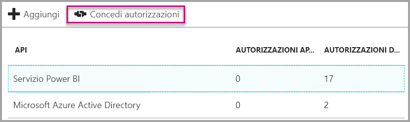

## <a name="setup-your-power-bi-environment"></a>Configurare l'ambiente di Power BI

### <a name="create-an-app-workspace"></a>Crea area di lavoro per le app

Se si incorporano report, dashboard o riquadri per i clienti, è necessario inserire il contenuto all'interno di un'area di lavoro per le app. L'account *master* deve essere un amministratore dell'area di lavoro per le app.

1. Iniziare creando l'area di lavoro. Selezionare **Aree di lavoro** > **Creare un'area di lavoro per le app**. Questa è la posizione in cui inserire il contenuto a cui l'applicazione deve accedere.

    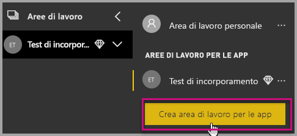

2. Assegnare un nome all'area di lavoro. Se il corrispondente **ID area di lavoro** non è disponibile, modificarlo in modo da ottenere un ID univoco. Questo dovrà anche essere il nome dell'app.

    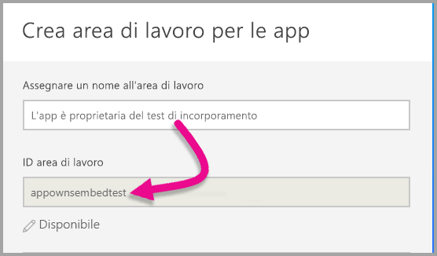

3. Ci sono alcune opzioni da impostare. Se si sceglie **Pubblica**, chiunque nell'organizzazione potrà visualizzare il contenuto dell'area di lavoro. **Privata**, d'altra parte, significa che solo i membri dell'area di lavoro potranno visualizzarne il contenuto.

    

    Dopo aver creato il gruppo, non è possibile modificare l'impostazione di gruppo pubblico o privato.

4. È anche possibile scegliere se i membri possono **modificare** o avere l'accesso di **sola visualizzazione**.

    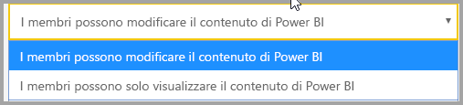

5. Aggiungere gli indirizzi di posta elettronica delle persone che avranno accesso all'area di lavoro e selezionare **Aggiungi**. Non è possibile aggiungere alias di gruppo, soli singoli utenti.

6. Decidere se ogni persona è un membro o un amministratore. Gli amministratori possono modificare l'area di lavoro stessa, inclusa l'aggiunta di altri membri. I membri possono modificare il contenuto nell'area di lavoro, a meno che non abbiano accesso in sola visualizzazione. Sia gli amministratori che i membri possono pubblicare l'app.

    È ora possibile visualizzare la nuova area di lavoro. Power BI crea l'area di lavoro, che verrà aperta e visualizzata nell'elenco delle aree di lavoro di cui si è membri. Gli amministratori potranno a questo punto selezionare i puntini di sospensione (…) per tornare indietro e apportare modifiche, aggiungere nuovi membri o modificarne le autorizzazioni.

    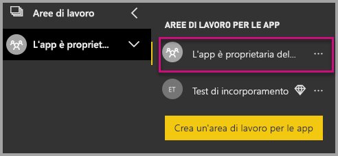

### <a name="create-and-publish-your-reports"></a>Creare e pubblicare i report

È possibile creare report e set di dati usando Power BI Desktop e quindi pubblicando tali report in un'area di lavoro per le app. Per poter pubblicare in un'area di lavoro dell'app, l'utente finale che pubblica report deve avere una licenza di Power BI Pro.

1. Scaricare l'esempio [Blog Demo](https://github.com/Microsoft/powerbi-desktop-samples) da GitHub.

    

2. Aprire il report di esempio con estensione pbix in **Power BI Desktop**.

   

3. Eseguire la pubblicazione nell'**area di lavoro per le app**.

   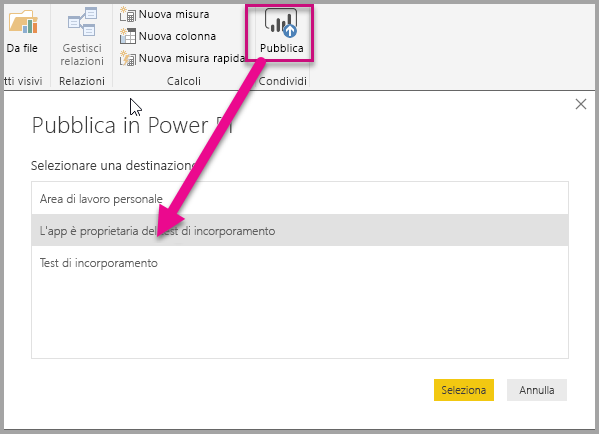

    È ora possibile visualizzare il report nel servizio Power BI online.

   

## <a name="embed-your-content-using-the-sample-application"></a>Incorporare il contenuto usando l'applicazione di esempio

Seguire questi passaggi per avviare l'incorporamento dei contenuti usando un'applicazione di esempio.

1. Scaricare l'esempio [App Owns Data](https://github.com/Microsoft/PowerBI-Developer-Samples) da GitHub per iniziare.

    

2. Aprire il file Web.config nell'applicazione di esempio. Ci sono 5 campi che è necessario compilare per eseguire correttamente l'applicazione: **clientId**, **groupId**, **reportId**, **pbiUsername** e **pbiPassword**.

    

    Compilare il campo **clientId** con l'**ID applicazione** di **Azure**. **clientId** viene usato dall'applicazione per identificare se stessa nei confronti degli utenti da cui si richiedono le autorizzazioni. Per ottenere il valore per il campo **clientId**, seguire questi passaggi:

    Accedere al [portale di Azure](https://portal.azure.com).

    

    Nel riquadro di spostamento a sinistra scegliere **Tutti i servizi** e selezionare **Registrazioni per l'app**.

     Selezionare l'applicazione per cui si vuole recuperare il valore **clientId**.

    

    Dovrebbe essere visualizzato un **ID applicazione** che viene elencato come GUID. Usare questo **ID applicazione** come **clientId** per l'applicazione.

    

    Compilare il campo **groupId** con il **GUID dell'area di lavoro per le app** di Power BI.

    

    Compilare il campo **reportId** con il **GUID del report** di Power BI.

    

    * Compilare il campo **pbiUsername** con l'account utente master Power BI.
    * Compilare il campo **pbiPassword** con la password per l'account utente master Power BI.

3. Eseguire l'applicazione.

    Per prima cosa, selezionare **Esegui** in **Visual Studio**.

    

    Selezionare quindi **Incorpora report**. A seconda del contenuto con cui si sceglie di eseguire il test (report, dashboard o riquadri), selezionare l'opzione corrispondente nell'applicazione.

    

    È ora possibile visualizzare il report nell'applicazione di esempio.

    

## <a name="embed-your-content-within-your-application"></a>Incorporare il contenuto all'interno dell'applicazione
Anche se la procedura per incorporare il contenuto può essere eseguita con le [API REST di Power BI](https://docs.microsoft.com/rest/api/power-bi/), i codici di esempio descritti in questo articolo vengono creati con il **.NET SDK**.

L'incorporamento per i clienti all'interno dell'applicazione richiede l'ottenimento di un **token di accesso** per l'account master da **Azure AD**. È necessario [ottenere un token di accesso di Azure AD](get-azuread-access-token.md#access-token-for-non-power-bi-users-app-owns-data) per l'applicazione Power BI usando **dati di proprietà dell'applicazione** prima di effettuare chiamate alle [API REST di Power BI](https://docs.microsoft.com/rest/api/power-bi/).

Per creare il client Power BI con il **token di accesso** è consigliabile creare l'oggetto client Power BI, che consentirà di interagire con le [API REST di Power BI](https://docs.microsoft.com/rest/api/power-bi/). A questo scopo, eseguire il wrapping di **AccessToken** in un oggetto ***Microsoft.Rest.TokenCredentials***.

```csharp
using Microsoft.IdentityModel.Clients.ActiveDirectory;
using Microsoft.Rest;
using Microsoft.PowerBI.Api.V2;

var tokenCredentials = new TokenCredentials(authenticationResult.AccessToken, "Bearer");

// Create a Power BI Client object. It is used to call Power BI APIs.
using (var client = new PowerBIClient(new Uri(ApiUrl), tokenCredentials))
{
    // Your code to embed items.
}
```

### <a name="get-the-content-item-you-want-to-embed"></a>Ottenere l'elemento di contenuto da incorporare
Usare l'oggetto client Power BI per recuperare un riferimento all'elemento da incorporare.

Ecco un esempio del codice per recuperare il primo report da un'area di lavoro specifica.

*Un esempio di come recuperare un elemento di contenuto da incorporare, che si tratti di un report, dashboard o riquadro, è disponibile all'interno del file Controllers\HomeController.cs nell'[applicazione di esempio](#embed-your-content-within-a-sample-application).*

```csharp
using Microsoft.PowerBI.Api.V2;
using Microsoft.PowerBI.Api.V2.Models;

// You need to provide the GroupID where the dashboard resides.
ODataResponseListReport reports = client.Reports.GetReportsInGroupAsync(GroupId);

// Get the first report in the group.
Report report = reports.Value.FirstOrDefault();
```

### <a name="create-the-embed-token"></a>Creare il token di incorporamento
È necessario generare un token di incorporamento che possa essere usato dall'API JavaScript. Il token di incorporamento è specifico per l'elemento da incorporare. Ogni volta che si incorpora una parte di contenuto di Power BI, è pertanto necessario creare un nuovo token di incorporamento specifico. Per altre informazioni, incluso il valore **accessLevel** da usare, vedere [GenerateToken API](https://msdn.microsoft.com/library/mt784614.aspx) (API GenerateToken).

Ecco un esempio di come aggiungere all'applicazione un token di incorporamento per un report.

*Un esempio di come creare un token di incorporamento per un report, dashboard o riquadro, è disponibile all'interno del file Controllers\HomeController.cs nell'[applicazione di esempio](#embed-your-content-within-a-sample-application).*

```csharp
using Microsoft.PowerBI.Api.V2;
using Microsoft.PowerBI.Api.V2.Models;

// Generate Embed Token.
var generateTokenRequestParameters = new GenerateTokenRequest(accessLevel: "view");
EmbedToken tokenResponse = client.Reports.GenerateTokenInGroup(GroupId, report.Id, generateTokenRequestParameters);

// Generate Embed Configuration.
var embedConfig = new EmbedConfig()
{
    EmbedToken = tokenResponse,
    EmbedUrl = report.EmbedUrl,
    Id = report.Id
};
```

Si presuppone che venga creata una classe per **EmbedConfig** e **TileEmbedConfig**. Esempi specifici sono disponibili nel file **Models\EmbedConfig.cs** e nel file **Models\TileEmbedConfig.cs**.

### <a name="load-an-item-using-javascript"></a>Caricare un elemento con JavaScript
È possibile usare JavaScript per caricare un report in un elemento div nella pagina Web. 

Segue un esempio che usa un modello **EmbedConfig** e un modello **TileEmbedConfig** insieme a visualizzazioni per un report.

*Un esempio di come aggiungere una visualizzazione per un report, dashboard o riquadro è disponibile nei file Views\Home\EmbedReport.cshtml, Views\Home\EmbedDashboard.cshtml o Views\Home\Embedtile.cshtml nell'[applicazione di esempio](#embed-your-content-within-a-sample-application).*

```javascript
<script src="~/scripts/powerbi.js"></script>
<div id="reportContainer"></div>
<script>
    // Read embed application token from Model
    var accessToken = "@Model.EmbedToken.Token";

    // Read embed URL from Model
    var embedUrl = "@Html.Raw(Model.EmbedUrl)";

    // Read report Id from Model
    var embedReportId = "@Model.Id";

    // Get models. models contains enums that can be used.
    var models = window['powerbi-client'].models;

    // Embed configuration used to describe the what and how to embed.
    // This object is used when calling powerbi.embed.
    // This also includes settings and options such as filters.
    // You can find more information at https://github.com/Microsoft/PowerBI-JavaScript/wiki/Embed-Configuration-Details.
    var config = {
        type: 'report',
        tokenType: models.TokenType.Embed,
        accessToken: accessToken,
        embedUrl: embedUrl,
        id: embedReportId,
        permissions: models.Permissions.All,
        settings: {
            filterPaneEnabled: true,
            navContentPaneEnabled: true
        }
    };

    // Get a reference to the embedded report HTML element
    var reportContainer = $('#reportContainer')[0];

    // Embed the report and display it within the div container.
    var report = powerbi.embed(reportContainer, config);
</script>
```

Per un esempio completo dell'uso dell'API JavaScript, è possibile usare lo [strumento Playground](https://microsoft.github.io/PowerBI-JavaScript/demo), che consente di riprodurre in modo rapido i diversi tipi di esempi di Power BI Embedded. È anche possibile ottenere maggiori informazioni sull'API JavaScript visitando la pagina del [wiki Power BI-JavaScript](https://github.com/Microsoft/powerbi-javascript/wiki).

## <a name="move-to-production"></a>Passare alla produzione

Una volta terminato lo sviluppo dell'applicazione, è necessario eseguire il backup dell'area di lavoro dell'app con una capacità dedicata. La capacità dedicata è necessaria per passare alla produzione.

### <a name="create-a-dedicated-capacity"></a>Creare una capacità dedicata
Tramite la creazione di una capacità dedicata è possibile trarre vantaggio dalla disponibilità di una risorsa dedicata destinata ai clienti. Le aree di lavoro a cui non è stata assegnata una capacità dedicata, dovranno disporre di una capacità condivisa. È possibile creare una capacità dedicata usando la soluzione di [capacità dedicata Power BI Embedded](https://docs.microsoft.com/azure/power-bi-embedded/create-capacity) di Azure.

I token di incorporamento con licenze Pro sono destinati al test dello sviluppo, pertanto il numero di token di incorporamento che un account master Power BI può generare è limitato. È necessario acquistare una capacità dedicata per l'incorporamento in un ambiente di produzione. Con una capacità dedicata è possibile generare un numero illimitato di token di incorporamento. Vedere [Available Features](https://docs.microsoft.com/rest/api/power-bi/availablefeatures/getavailablefeatures) (Funzionalità disponibili) per controllare il valore di utilizzo che indica l'attuale utilizzo incorporato espresso come percentuale. La quantità di utilizzo è calcolata per ogni account master.

### <a name="assign-an-app-workspace-to-a-dedicated-capacity"></a>Assegnare un'area di lavoro per le app a una capacità dedicata

Una volta creata la capacità dedicata, assegnare l'area di lavoro per le app alla capacità dedicata. Per eseguire questa operazione, seguire questi passaggi.

1. All'interno del **servizio Power BI** espandere le aree di lavoro e selezionare i puntini di sospensione relativi all'area di lavoro in cui incorporare il contenuto. Quindi selezionare **Edit workspaces** (Modifica aree di lavoro).

    

2. Espandere **Avanzate**, abilitare **Capacità dedicata** e quindi selezionare la capacità dedicata creata. Selezionare quindi **Salva**.

    

Per altre domande su Power BI Embedded, visitare la pagina [Domande frequenti](embedded-faq.md).  In caso di problemi con Power BI Embedded all'interno dell'applicazione, visitare la pagina [Risoluzione dei problemi](embedded-troubleshoot.md).

Altre domande? [Provare a rivolgersi alla community di Power BI](http://community.powerbi.com/)