# <a name="tutorial-embed-power-bi-content-into-an-application-for-your-customers"></a>Esercitazione: Incorporare contenuto di Power BI in un'applicazione per i clienti

Con **Power BI Embedded in Azure**, è possibile incorporare report, dashboard o riquadri in un'applicazione usando dati di proprietà dell'app. **I dati di proprietà dell'app** consistono nel disporre di un'applicazione che usa Power BI come piattaforma di analisi incorporata. Gli **sviluppatori ISV** possono creare contenuti Power BI che visualizzano report, dashboard o riquadri in un'applicazione completamente integrata e interattiva, senza richiedere agli utenti di disporre di una licenza Power BI. Questa esercitazione illustra come integrare un report in un'applicazione tramite .NET SDK di Power BI e l'API JavaScript di Power BI usando **Power BI Embedded in Azure** per i clienti.

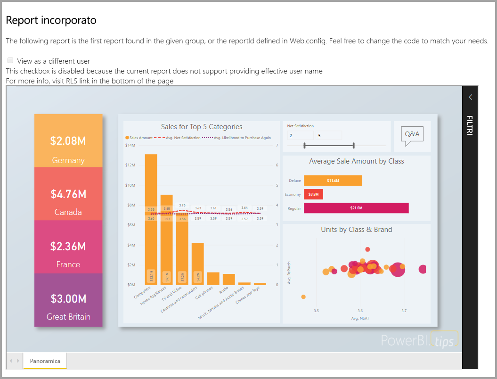

In questa esercitazione viene illustrato come:
> [!div class="checklist"]
> * Registrare un'applicazione in Azure.
> * Incorporare un report di Power BI in un'applicazione.

## <a name="prerequisites"></a>Prerequisiti

Per iniziare, è necessario avere:

* Un [account Power BI Pro](../service-self-service-signup-for-power-bi.md) (un account master con nome utente e password per accedere all'account Power BI Pro,) o un'[entità servizio (token solo app)](embed-service-principal.md).
* Una sottoscrizione di [Microsoft Azure](https://azure.microsoft.com/).
* È necessario aver configurato un [tenant di Azure Active Directory](create-an-azure-active-directory-tenant.md).

Se non si è ancora iscritti a **Power BI Pro**, [iscriversi per ottenere una versione di prova gratuita](https://powerbi.microsoft.com/pricing/) prima di iniziare.

Se non si ha una sottoscrizione di Azure, [creare un account gratuito](https://azure.microsoft.com/free/?WT.mc_id=A261C142F) prima di iniziare.

## <a name="set-up-your-embedded-analytics-development-environment"></a>Configurare l'ambiente di sviluppo di analisi incorporata

Prima di iniziare a incorporare report, dashboard o riquadri in un'applicazione, è necessario assicurarsi che l'ambiente consenta l'incorporamento con Power BI.

È possibile usare lo [strumento di installazione dell'incorporamento](https://aka.ms/embedsetup/AppOwnsData) per iniziare rapidamente e scaricare un'applicazione di esempio che facilita la creazione di un ambiente e l'incorporamento di un report.

Se tuttavia si sceglie di configurare l'ambiente manualmente, è possibile continuare con le istruzioni che seguono.

### <a name="register-an-application-in-azure-active-directory-azure-ad"></a>Registrare un'applicazione in Azure Active Directory (Azure AD)

[Registrare l'applicazione](register-app.md) in Azure Active Directory per consentire all'applicazione di accedere alle [API REST di Power BI](https://docs.microsoft.com/rest/api/power-bi/). La registrazione consente di definire un'identità per l'applicazione e di specificare le autorizzazioni per accedere alle risorse REST di Power BI. A seconda che si voglia usare un account master oppure un'[entità servizio](embed-service-principal.md), la registrazione di un'applicazione varia.

Il metodo scelto influisce sul tipo di applicazione da registrare in Azure.

Se si usa account master, procedere con la registrazione di un'app **nativa**. Si sceglie un'app nativa in quanto l'accesso in uso non è interattivo.

Se invece si usa l'entità servizio, è necessario procedere con la registrazione di un'**applicazione Web sul lato server**. Si registra un'applicazione Web sul lato server per creare un segreto dell'applicazione.

## <a name="set-up-your-power-bi-environment"></a>Configurare l'ambiente di Power BI

### <a name="create-an-app-workspace"></a>Crea area di lavoro per le app

Se si incorporano report, dashboard o riquadri per i clienti, è necessario inserire il contenuto all'interno di un'area di lavoro per le app. Esistono diversi tipi di aree di lavoro configurabili: le [aree di lavoro tradizionali](../service-create-workspaces.md) o le [nuove aree di lavoro](../service-create-the-new-workspaces.md). Se si usa un account *master*, non è importante il tipo di area di lavoro usato. Se invece si usa l' *[entità servizio](embed-service-principal.md)* per accedere all'applicazione, è necessario usare le nuove aree di lavoro. In entrambi gli scenari sia l'account *master* sia l'*entità servizio* deve essere amministratore delle aree di lavoro per le app interessate dall'applicazione.

### <a name="create-and-publish-your-reports"></a>Creare e pubblicare i report

È possibile creare report e set di dati usando Power BI Desktop e quindi pubblicando tali report in un'area di lavoro per le app. Esistono due modi per eseguire questa attività. Un utente finale può pubblicare i report in un'area di lavoro per le app tradizionale usando un account master (licenza di Power BI Pro). Se si usa l'entità servizio, è possibile pubblicare i report nelle nuove aree di lavoro usando le [API REST di Power BI](https://docs.microsoft.com/rest/api/power-bi/imports/postimportingroup).

La procedura seguente illustra come pubblicare il report in formato PBIX nell'area di lavoro di Power BI.

1. Scaricare l'esempio [Blog Demo](https://github.com/Microsoft/powerbi-desktop-samples) da GitHub.

    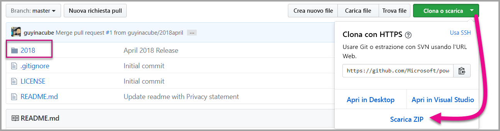

2. Aprire il report in formato PBIX di esempio in **Power BI Desktop**.

   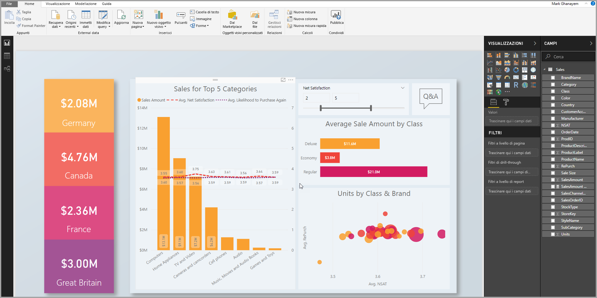

3. Pubblicare nelle **aree di lavoro per le app**. Questo processo varia a seconda che si stia usando un account master (licenza di Power Pro) oppure un'entità servizio. Se si usa un account master, è possibile pubblicare il report tramite Power BI Desktop.  Se si usa l'entità servizio, è necessario usare le API REST di Power BI.

## <a name="embed-content-using-the-sample-application"></a>Incorporare il contenuto usando l'applicazione di esempio

Questo esempio è volutamente semplice per scopo dimostrativo. Sarà l'utente o lo sviluppatore a scegliere se proteggere il segreto dell'applicazione o le credenziali dell'account master.

Seguire questa procedura per avviare l'incorporamento del contenuto usando l'applicazione di esempio.

1. Scaricare [Visual Studio](https://www.visualstudio.com/) (2013 o versione successiva). Assicurarsi di scaricare la versione più recente [del pacchetto NuGet](https://www.nuget.org/profiles/powerbi).

2. Scaricare l'esempio [App Owns Data](https://github.com/Microsoft/PowerBI-Developer-Samples) da GitHub per iniziare.

    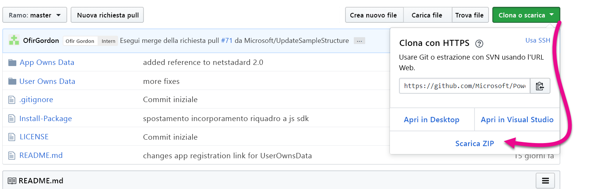

3. Aprire il file **Web.config** nell'applicazione di esempio. Per eseguire l'applicazione, è necessario compilare alcuni campi. È possibile scegliere **MasterUser** oppure **ServicePrincipal** per **AuthenticationType**. A seconda del tipo di metodo di autenticazione scelto, è necessario compilare campi diversi.

    > [!Note]
    > Il valore predefinito per **AuthenticationType** in questo esempio è MasterUser.

    <center>

    | **MasterUser** <br> (licenza di Power BI Pro) | **ServicePrincipal** <br> (token solo app)|
    |---------------|-------------------|
    | [applicationId](#application-id) | [applicationId](#application-id) |
    | [workspaceId](#workspace-id) | [workspaceId](#workspace-id) |
    | [reportId](#report-id) | [reportId](#report-id) |
    | [pbiUsername](#power-bi-username-and-password) |  |
    | [pbiPassword](#power-bi-username-and-password) |  |
    |  | [applicationsecret](#application-secret) |
    |  | [tenant](#tenant) |

   </center>

    

### <a name="application-id"></a>ID applicazione

Questo attributo è necessario per entrambe le opzioni di AuthenticationTypes (account master ed [entità servizio](embed-service-principal.md)).

In **applicationId** inserire il valore di **ID applicazione** di **Azure**. Il valore **applicationId** viene usato per l'identificazione dell'applicazione per gli utenti ai quali si richiedono le autorizzazioni.

Per ottenere il valore **applicationId** seguire questa procedura:

1. Accedere al [portale di Azure](https://portal.azure.com).

2. Nel riquadro di spostamento a sinistra, scegliere **Tutti i servizi** e selezionare **Registrazioni app**.

    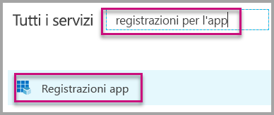

3. Selezionare l'applicazione che deve usare il valore **applicationId**.

    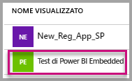

4. Viene visualizzato un **ID applicazione** che viene elencato come GUID. Usare questo **ID applicazione** come **applicationId** per l'applicazione.

    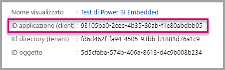

### <a name="workspace-id"></a>ID area di lavoro

Questo attributo è necessario per entrambe le opzioni di AuthenticationTypes (account master ed [entità servizio](embed-service-principal.md)).

Compilare il campo **workspaceId** con il GUID (gruppo) dell'area di lavoro per le app di Power BI. È possibile ottenere queste informazioni dall'URL di accesso al servizio Power BI o usando Powershell.

URL <br>

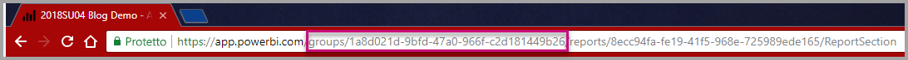

PowerShell <br>

```powershell
Get-PowerBIworkspace -name "App Owns Embed Test"
```

   

### <a name="report-id"></a>ID del report

Questo attributo è necessario per entrambe le opzioni di AuthenticationTypes (account master ed [entità servizio](embed-service-principal.md)).

Compilare il campo **reportId** con il GUID del report di Power BI. È possibile ottenere queste informazioni dall'URL di accesso al servizio Power BI o usando Powershell.

URL<br>


PowerShell <br>

```powershell
Get-PowerBIworkspace -name "App Owns Embed Test" | Get-PowerBIReport
```


### <a name="power-bi-username-and-password"></a>Nome utente e password di Power BI

Questi attributi sono necessari solo se per AuthenticationType si usa l'account master.

Se si usa l'[entità servizio](embed-service-principal.md) per eseguire l'autenticazione, non è necessario specificare gli attributi di nome utente o password.

* Compilare il campo **pbiUsername** con l'account master Power BI.
* Compilare il campo **pbiPassword** con la password per l'account master Power BI.

### <a name="application-secret"></a>Segreto dell'applicazione

Questo attributo è necessario solo se per AuthenticationType si usa l'opzione [entità servizio](embed-service-principal.md).

Specificare le informazioni per **ApplicationSecret** dalla sezione **Chiavi** in **Registrazioni app** in **Azure**.  Questo attributo si usa con l'[entità servizio](embed-service-principal.md).

Per ottenere il valore **ApplicationSecret**, seguire questa procedura:

1. Accedere al [portale di Azure](https://portal.azure.com).

2. Nel riquadro di spostamento a sinistra scegliere **Tutti i servizi** e selezionare **Registrazioni per l'app**.

    

3. Selezionare l'applicazione che deve usare il valore **ApplicationSecret**.

    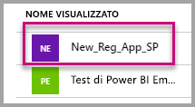

4. Selezionare **certificati e i segreti** sotto **Gestisci**.

5. Selezionare **nuovi segreti client**.

6. Immettere un nome nella casella **Descrizione** e selezionare una durata. Quindi selezionare **Salva** per ottenere il **Valore** per l'applicazione. Chiudendo il riquadro **Chiavi** dopo aver salvato il valore della chiave, il campo del valore viene visualizzato solo come nascosto. A questo punto, non è possibile recuperare il valore della chiave. Se il valore della chiave viene perso, crearne uno nuovo all'interno del portale di Azure.

    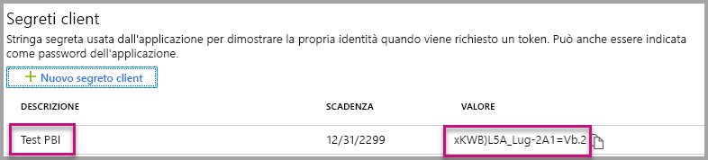

### <a name="tenant"></a>Tenant

Questo attributo è necessario solo se per AuthenticationType si usa l'opzione [entità servizio](embed-service-principal.md).

Compilare il campo **tenant** con l'ID tenant di Azure. È possibile ottenere queste informazioni dall'[interfaccia di amministrazione di Azure AD](/onedrive/find-your-office-365-tenant-id) quando si accede al servizio Power BI o tramite PowerShell.

### <a name="run-the-application"></a>Eseguire l'applicazione

1. Selezionare **Esegui** in **Visual Studio**.

    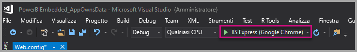

2. Selezionare quindi **Incorpora report**. A seconda del contenuto con cui si sceglie di eseguire il test (report, dashboard o riquadri), selezionare l'opzione corrispondente nell'applicazione.

    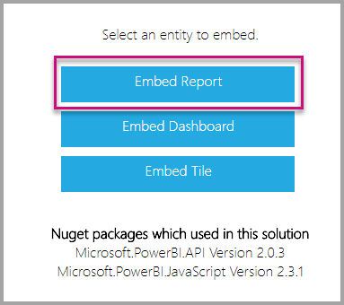

3. È ora possibile visualizzare il report nell'applicazione di esempio.

    

## <a name="embed-content-within-your-application"></a>Incorporare il contenuto all'interno dell'applicazione

Anche se la procedura per incorporare il contenuto viene eseguita con le [API REST di Power BI](https://docs.microsoft.com/rest/api/power-bi/), i codici di esempio descritti in questo articolo vengono creati con **.NET SDK**.

L'incorporamento per i clienti all'interno dell'applicazione richiede l'ottenimento di un **token di accesso** per l'account master o l'[entità servizio](embed-service-principal.md) di **Azure AD**. È necessario ottenere un [token di accesso di Azure AD](get-azuread-access-token.md#access-token-for-non-power-bi-users-app-owns-data) per l'applicazione Power BI usando prima di effettuare chiamate alle [API REST di Power BI](https://docs.microsoft.com/rest/api/power-bi/).

Per creare il client Power BI con il **token di accesso** è consigliabile creare l'oggetto client Power BI, che consente di interagire con le [API REST di Power BI](https://docs.microsoft.com/rest/api/power-bi/). L'oggetto client Power BI viene creato eseguendo il wrapping di **AccessToken** in un oggetto ***Microsoft.Rest.TokenCredentials***.

```csharp
using Microsoft.IdentityModel.Clients.ActiveDirectory;
using Microsoft.Rest;
using Microsoft.PowerBI.Api.V2;

var tokenCredentials = new TokenCredentials(authenticationResult.AccessToken, "Bearer");

// Create a Power BI Client object. it's used to call Power BI APIs.
using (var client = new PowerBIClient(new Uri(ApiUrl), tokenCredentials))
{
    // Your code to embed items.
}
```

### <a name="get-the-content-item-you-want-to-embed"></a>Ottenere l'elemento di contenuto da incorporare

Usare l'oggetto client Power BI per recuperare un riferimento all'elemento da incorporare.

Ecco un esempio del codice per recuperare il primo report da un'area di lavoro specifica.

*Un esempio di come recuperare un elemento di contenuto da incorporare, che si tratti di un report, dashboard o riquadro, è disponibile all'interno del file Services\EmbedService.cs nell'[applicazione di esempio](https://github.com/Microsoft/PowerBI-Developer-Samples).*

```csharp
using Microsoft.PowerBI.Api.V2;
using Microsoft.PowerBI.Api.V2.Models;

// You need to provide the workspaceId where the dashboard resides.
ODataResponseListReport reports = await client.Reports.GetReportsInGroupAsync(workspaceId);

// Get the first report in the group.
Report report = reports.Value.FirstOrDefault();
```

### <a name="create-the-embed-token"></a>Creare il token di incorporamento

Generare un token di incorporamento che possa essere usato dall'API JavaScript. Il token di incorporamento è specifico per l'elemento da incorporare. Ogni volta che si incorpora una parte di contenuto di Power BI, è pertanto necessario creare un nuovo token di incorporamento specifico. Per altre informazioni, incluso il valore **accessLevel** da usare, vedere [GenerateToken API](https://msdn.microsoft.com/library/mt784614.aspx) (API GenerateToken).

*Un esempio di come creare un token di incorporamento per un report da incorporare, che si tratti di un report, dashboard o riquadro, è disponibile all'interno del file Services\EmbedService.cs nell'[applicazione di esempio](https://github.com/Microsoft/PowerBI-Developer-Samples).*

```csharp
using Microsoft.PowerBI.Api.V2;
using Microsoft.PowerBI.Api.V2.Models;

// Generate Embed Token.
var generateTokenRequestParameters = new GenerateTokenRequest(accessLevel: "view");
EmbedToken tokenResponse = client.Reports.GenerateTokenInGroup(workspaceId, report.Id, generateTokenRequestParameters);

// Generate Embed Configuration.
var embedConfig = new EmbedConfig()
{
    EmbedToken = tokenResponse,
    EmbedUrl = report.EmbedUrl,
    Id = report.Id
};
```

Viene creata una classe per **EmbedConfig** e **TileEmbedConfig**. Un esempio è disponibile nel file **Models\EmbedConfig.cs** e nel file **Models\TileEmbedConfig.cs**.

### <a name="load-an-item-using-javascript"></a>Caricare un elemento con JavaScript

È possibile usare JavaScript per caricare un report in un elemento div nella pagina Web.

Per un esempio completo dell'uso dell'API JavaScript, è possibile usare lo [strumento Playground](https://microsoft.github.io/PowerBI-JavaScript/demo), Lo strumento Playground consente di riprodurre in modo rapido esempi di Power BI Embedded di tipo diverso. È anche possibile ottenere maggiori informazioni sull'API JavaScript visitando la pagina del [wiki Power BI-JavaScript](https://github.com/Microsoft/powerbi-javascript/wiki).

Segue un esempio che usa un modello **EmbedConfig** e un modello **TileEmbedConfig** insieme a visualizzazioni per un report.

*Un esempio di come aggiungere una visualizzazione per un report, dashboard o riquadro è disponibile nei file Views\Home\EmbedReport.cshtml, Views\Home\EmbedDashboard.cshtml o Views\Home\Embedtile.cshtml nell'[applicazione di esempio](#embed-content-using-the-sample-application).*

```javascript
<script src="~/scripts/powerbi.js"></script>
<div id="reportContainer"></div>
<script>
    // Read embed application token from Model
    var accessToken = "@Model.EmbedToken.Token";

    // Read embed URL from Model
    var embedUrl = "@Html.Raw(Model.EmbedUrl)";

    // Read report Id from Model
    var embedReportId = "@Model.Id";

    // Get models. models contains enums that can be used.
    var models = window['powerbi-client'].models;

    // Embed configuration used to describe what and how to embed.
    // This object is used when calling powerbi.embed.
    // This also includes settings and options such as filters.
    // You can find more information at https://github.com/Microsoft/PowerBI-JavaScript/wiki/Embed-Configuration-Details.
    var config = {
        type: 'report',
        tokenType: models.TokenType.Embed,
        accessToken: accessToken,
        embedUrl: embedUrl,
        id: embedReportId,
        permissions: models.Permissions.All,
        settings: {
            filterPaneEnabled: true,
            navContentPaneEnabled: true
        }
    };

    // Get a reference to the embedded report HTML element
    var reportContainer = $('#reportContainer')[0];

    // Embed the report and display it within the div container.
    var report = powerbi.embed(reportContainer, config);
</script>
```

## <a name="move-to-production"></a>Passare alla produzione

Dopo aver terminato lo sviluppo dell'applicazione, è necessario eseguire il backup dell'area di lavoro dell'app con una capacità dedicata. 

> [!Important]
> La capacità dedicata è necessaria per passare alla produzione.

### <a name="create-a-dedicated-capacity"></a>Creare una capacità dedicata

Tramite la creazione di una capacità dedicata è possibile trarre vantaggio dalla disponibilità di una risorsa dedicata destinata ai clienti. È possibile acquistare una capacità dedicata all'interno del [portale di Microsoft Azure](https://portal.azure.com). Per informazioni dettagliate su come creare una capacità per Power BI Embedded, vedere [Create Power BI Embedded capacity in the Azure portal](azure-pbie-create-capacity.md) (Creare capacità per Power BI Embedded nel portale di Azure).

Usare la tabella seguente per individuare la capacità di Power BI Embedded più adatta alle proprie esigenze.

| Nodo della capacità | Totale core<br/>*(Back-end + front-end)* | Core di back-end | Core di front-end | Limiti di connessione dinamica/DirectQuery|
| --- | --- | --- | --- | --- | --- |
| A1 |1 vCore |0,5 core, 3 GB RAM |0,5 core |0-5 al secondo |
| A2 |2 vCore |1 core, 5 GB RAM |1 core | 10 al secondo |
| A3 |4 vCore |2 core, 10 GB RAM |2 core | 15 al secondo |
| A4 |8 vCore |4 core, 25 GB RAM |4 core |30 al secondo |
| A5 |16 vCore |8 core, 50 GB RAM |8 core |60 al secondo |
| A6 |32 vCore |16 core, 100 GB RAM |16 core |120 al secondo |

**_Con gli SKU A, non è possibile accedere al contenuto di Power BI con una licenza di Power BI gratuita._**

I token di incorporamento con licenza Pro sono destinati al test dello sviluppo, pertanto il numero di token di incorporamento che un account master Power BI o un'entità servizio può generare è limitato. È richiesta una capacità dedicata per l'incorporamento in un ambiente di produzione. Con una capacità dedicata è possibile generare un numero illimitato di token di incorporamento. Vedere [Available Features](https://docs.microsoft.com/rest/api/power-bi/availablefeatures/getavailablefeatures) (Funzionalità disponibili) per controllare il valore di utilizzo che indica l'attuale utilizzo incorporato espresso come percentuale. La quantità di utilizzo è calcolata per ogni account master.

Per altre informazioni, vedere [Embedded analytics capacity planning whitepaper](https://aka.ms/pbiewhitepaper) (White paper sulla pianificazione della capacità di analisi incorporata).

### <a name="assign-an-app-workspace-to-a-dedicated-capacity"></a>Assegnare un'area di lavoro per le app a una capacità dedicata

Dopo aver creato una capacità dedicata, è possibile assegnare l'area di lavoro dell'app alla capacità dedicata.

Per assegnare una capacità dedicata a un'area di lavoro con un'[entità servizio](embed-service-principal.md), usare l'[API REST di Power BI](https://docs.microsoft.com/rest/api/power-bi/capacities/groups_assigntocapacity). Quando si usano le API REST di Power BI, assicurarsi di usare l'[ID oggetto dell'entità servizio](embed-service-principal.md#how-to-get-the-service-principal-object-id).

Seguire questa procedura per assegnare una capacità dedicata a un'area di lavoro usando un **account master**.

1. All'interno del **servizio Power BI** espandere le aree di lavoro e selezionare i puntini di sospensione relativi all'area di lavoro in cui incorporare il contenuto. Quindi selezionare **Edit workspaces** (Modifica aree di lavoro).

    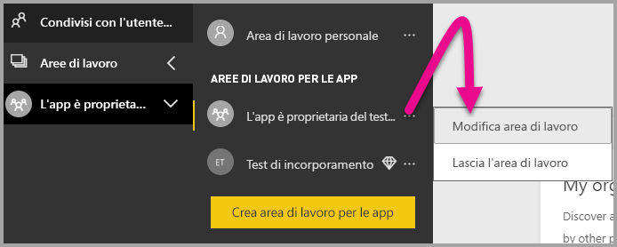

2. Espandere **Avanzate**, abilitare **Capacità dedicata** e quindi selezionare la capacità dedicata creata. Selezionare quindi **Salva**.

    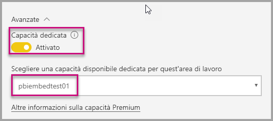

3. Dopo aver selezionato **Salva** viene visualizzato un **rombo** accanto al nome dell'area di lavoro dell'app.

    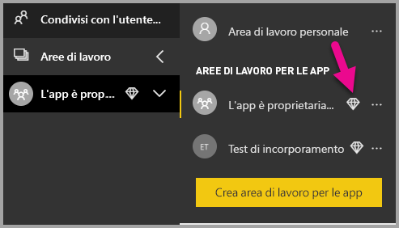

## <a name="next-steps"></a>Passaggi successivi

In questa esercitazione è stato descritto come incorporare il contenuto di Power BI in un'applicazione per i clienti. È anche possibile provare a incorporare il contenuto di Power BI per l'organizzazione.

> [!div class="nextstepaction"]
>[Incorporare contenuto per l'organizzazione](embed-sample-for-your-organization.md)

Altre domande? [Provare a rivolgersi alla community di Power BI](http://community.powerbi.com/)
