# <a name="tutorial-embed-a-power-bi-report-dashboard-or-tile-into-an-application-for-your-organization"></a>Esercitazione: Incorporare un report, un dashboard o un riquadro di Power BI in un'applicazione per l'organizzazione
Questa esercitazione illustra come integrare un report in un'applicazione usando l'**SDK .NET di Power BI** con l'**API JavaScript di Power BI** durante l'incorporamento di **Power BI** in un'applicazione per l'organizzazione. **Power BI** consente di incorporare report, dashboard o riquadri in un'applicazione usando**dati di proprietà dell'utente**. I **dati di proprietà dell'utente** consentono all'applicazione di estendere il servizio Power BI.


In questa esercitazione viene illustrato come:
>[!div class="checklist"]
>* Registrare un'applicazione in Azure.
>* Incorporare un report di Power BI in un'applicazione.

## <a name="prerequisites"></a>Prerequisiti
Per iniziare, è necessario un account **Power BI Pro** e una sottoscrizione **Microsoft Azure**.

* Se non si è ancora iscritti a **Power BI Pro**, [iscriversi per ottenere una versione di prova gratuita](https://powerbi.microsoft.com/en-us/pricing/) prima di iniziare.
* Se non si ha una sottoscrizione di Azure, [creare un account gratuito](https://azure.microsoft.com/free/?WT.mc_id=A261C142F) prima di iniziare.
* È necessario disporre del proprio [tenant di Azure Active Directory](create-an-azure-active-directory-tenant.md) configurato.
* È richiesta l'installazione di [Visual Studio](https://www.visualstudio.com/) (versione 2013 o successive).

## <a name="setup-your-embedded-analytics-development-environment"></a>Configurare l'ambiente di sviluppo di analisi incorporata

Prima di iniziare a incorporare report, dashboard o riquadri in un'applicazione, è necessario assicurarsi che l'ambiente sia configurato per consentire l'incorporamento. La configurazione include le operazioni seguenti.

È possibile usare lo [strumento esperienza di onboarding](https://aka.ms/embedsetup/UserOwnsData) per iniziare rapidamente scaricando un'applicazione di esempio che facilita l'esecuzione della procedura di creazione di un ambiente e di incorporamento di un report.

Se tuttavia si sceglie di configurare l'ambiente manualmente, è possibile continuare con le istruzioni che seguono.
### <a name="register-an-application-in-azure-active-directory-azure-ad"></a>Registrare un'applicazione in Azure Active Directory (Azure AD)

La registrazione dell'applicazione in Azure Active Directory consente all'applicazione di accedere alle API REST di Power BI. Ciò permette di stabilire un'identità per l'applicazione e di specificare le autorizzazioni per accedere alle risorse REST di Power BI.

1. Accettare le [condizioni relative all'API di Microsoft Power BI](https://powerbi.microsoft.com/api-terms).

2. Accedere al [portale di Azure](https://portal.azure.com).

    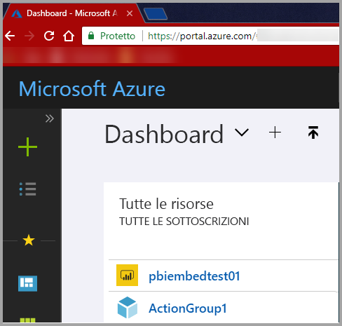

3. Nel riquadro di spostamento a sinistra scegliere **Tutti i servizi**, selezionare **Registrazioni per l'app** e quindi scegliere **Registrazione nuova applicazione**.

    </br>
    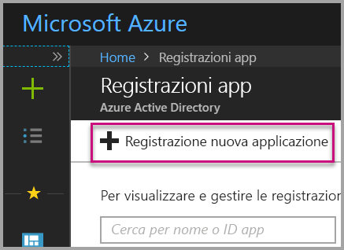

4. Seguire le istruzioni e creare una nuova applicazione. Per i **dati di proprietà dell'utente** è necessario usare un'**app Web o un'API** per il tipo di applicazione. È necessario specificare anche un **URL accesso** che viene usato da **Azure AD** per restituire le risposte del token. Immettere un valore specifico per l'applicazione, ad esempio http://localhost:13526/).

    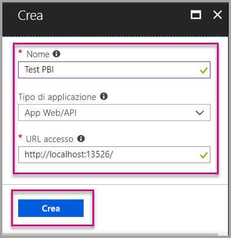

### <a name="apply-permissions-to-your-application-within-azure-active-directory"></a>Applicare le autorizzazioni all'applicazione in Azure Active Directory

È necessario abilitare autorizzazioni aggiuntive per l'applicazione oltre a quelle fornite nella pagina di registrazione dell'app. Per abilitare le autorizzazioni, è necessario aver eseguito l'accesso con un account di *amministratore globale*.

### <a name="use-the-azure-active-directory-portal"></a>Usare il portale di Azure Active Directory

1. Passare a [Registrazioni per l'app](https://portal.azure.com/#blade/Microsoft_AAD_IAM/ApplicationsListBlade) nel portale di Azure e selezionare l'app che si usa per l'incorporamento.

    

2. Selezionare **Impostazioni** e quindi in **Accesso all'API** selezionare **Autorizzazioni necessarie**.

    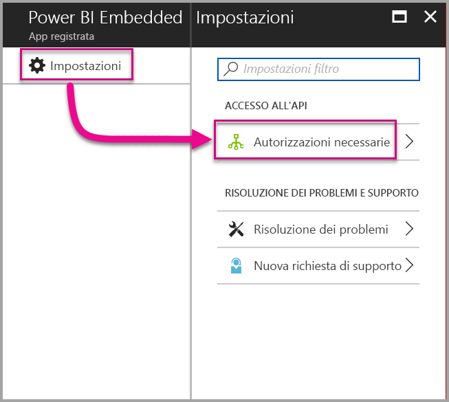

3. Selezionare **Microsoft Azure Active Directory** e quindi accertarsi che l'opzione **Accede alla directory come utente registrato** sia selezionata. Selezionare **Salva**.

    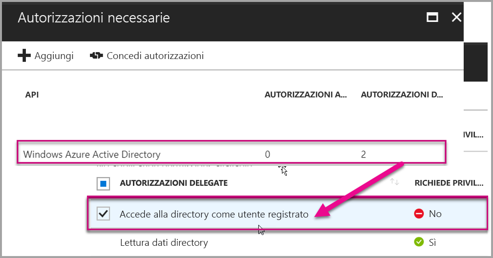

4. Selezionare **Aggiungi**.

    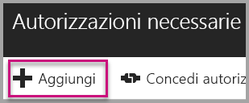

5. Fare clic su **Selezionare un'API**.

    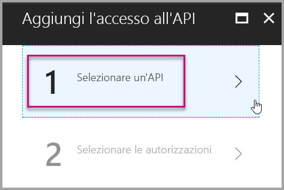

6. Selezionare **Servizio Power BI** e quindi **Seleziona**.

    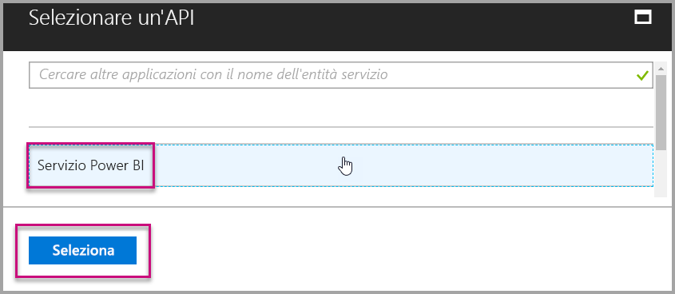

7. Selezionare tutte le autorizzazioni in **Autorizzazioni delegate**. Per salvare le selezioni è necessario selezionarle una alla volta. Al termine, selezionare **Salva**.

    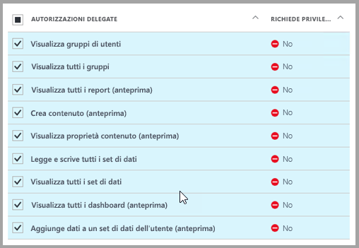

## <a name="setup-your-power-bi-environment"></a>Configurare l'ambiente di Power BI

### <a name="create-an-app-workspace"></a>Crea area di lavoro per le app

Se si incorporano report, dashboard o riquadri per i clienti, è necessario inserire il contenuto all'interno di un'area di lavoro per le app.

1. Iniziare creando l'area di lavoro. Selezionare **Aree di lavoro** > **Creare un'area di lavoro per le app**. Questa è la posizione in cui inserire il contenuto a cui l'applicazione deve accedere.

    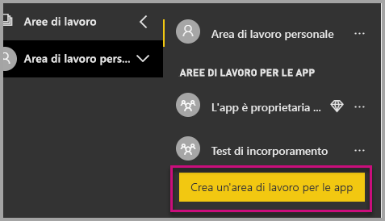

2. Assegnare un nome all'area di lavoro. Se il corrispondente **ID area di lavoro** non è disponibile, modificarlo in modo da ottenere un ID univoco. Questo dovrà anche essere il nome dell'app.

    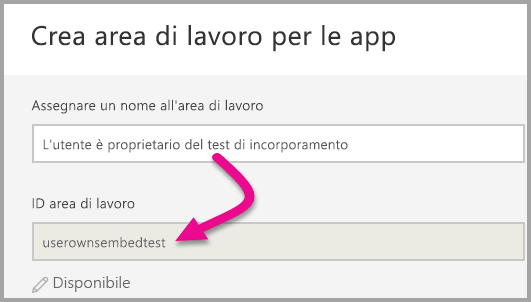

3. Ci sono alcune opzioni da impostare. Se si sceglie **Pubblica**, chiunque nell'organizzazione potrà visualizzare il contenuto dell'area di lavoro. **Privata**, d'altra parte, significa che solo i membri dell'area di lavoro potranno visualizzarne il contenuto.

    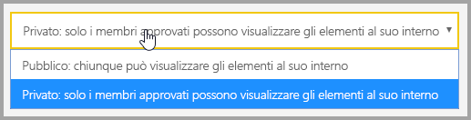

    Dopo aver creato il gruppo, non è possibile modificare l'impostazione di gruppo pubblico o privato.

4. È anche possibile scegliere se i membri possono **modificare** o avere l'accesso di **sola visualizzazione**.

    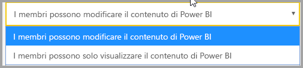

5. Aggiungere gli indirizzi di posta elettronica delle persone che avranno accesso all'area di lavoro e selezionare **Aggiungi**. Non è possibile aggiungere alias di gruppo, soli singoli utenti.

6. Decidere se ogni persona è un membro o un amministratore. Gli amministratori possono modificare l'area di lavoro stessa, inclusa l'aggiunta di altri membri. I membri possono modificare il contenuto nell'area di lavoro, a meno che non abbiano accesso in sola visualizzazione. Sia gli amministratori che i membri possono pubblicare l'app.

    È ora possibile visualizzare la nuova area di lavoro. Power BI crea l'area di lavoro, che verrà aperta e visualizzata nell'elenco delle aree di lavoro di cui si è membri. Gli amministratori potranno a questo punto selezionare i puntini di sospensione (…) per tornare indietro e apportare modifiche, aggiungere nuovi membri o modificarne le autorizzazioni.

    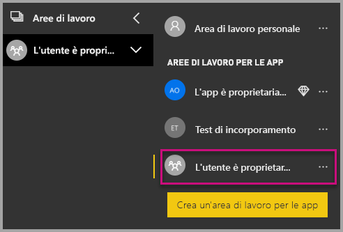

### <a name="create-and-publish-your-reports"></a>Creare e pubblicare i report

È possibile creare report e set di dati usando Power BI Desktop e quindi pubblicando tali report in un'area di lavoro per le app. Per poter pubblicare in un'area di lavoro dell'app, l'utente finale che pubblica report deve avere una licenza di Power BI Pro.

1. Scaricare l'esempio [Blog Demo](https://github.com/Microsoft/powerbi-desktop-samples) da GitHub.

    

2. Aprire il report di esempio con estensione pbix in **Power BI Desktop**.

   

3. Eseguire la pubblicazione nell'**area di lavoro per le app**.

   

    È ora possibile visualizzare il report nel servizio Power BI online.

   

## <a name="embed-your-content-using-the-sample-application"></a>Incorporare il contenuto usando l'applicazione di esempio

Seguire questi passaggi per avviare l'incorporamento dei contenuti usando un'applicazione di esempio.

1. Scaricare l'[esempio App Owns Data](https://github.com/Microsoft/PowerBI-Developer-Samples) (Dati di proprietà dell'app) da GitHub per iniziare.  Sono disponibili tre diverse applicazioni di esempio, una per i [report](https://github.com/Microsoft/PowerBI-Developer-Samples/tree/master/User%20Owns%20Data/integrate-report-web-app), una per i [dashboard](https://github.com/Microsoft/PowerBI-Developer-Samples/tree/master/User%20Owns%20Data/integrate-dashboard-web-app) e una per i [riquadri](https://github.com/Microsoft/PowerBI-Developer-Samples/tree/master/User%20Owns%20Data/integrate-tile-web-app).  Nei passaggi descritti in questo articolo viene fatto riferimento all'applicazione per i **report**.

    

2. Aprire il file Cloud.config nell'applicazione di esempio. Per eseguire correttamente l'applicazione è necessario compilare alcuni campi: **ClientID** e **ClientSecret**.

    

    Specificare le informazioni **ClientID** con l'**ID applicazione** di **Azure**. Il valore **ClientID** viene usato per l'identificazione dell'applicazione per gli utenti da cui si richiedono le autorizzazioni.

    Per ottenere il valore **ClientID**, seguire questa procedura:

    Accedere al [portale di Azure](https://portal.azure.com).

    

    Nel riquadro di spostamento a sinistra scegliere **Tutti i servizi** e selezionare **Registrazioni per l'app**.

    

    Selezionare l'applicazione che deve usare il valore **ClientID**.

    

    Dovrebbe essere visualizzato un **ID applicazione** che viene elencato come GUID. Usare questo **ID applicazione** come **ClientID** per l'applicazione.

    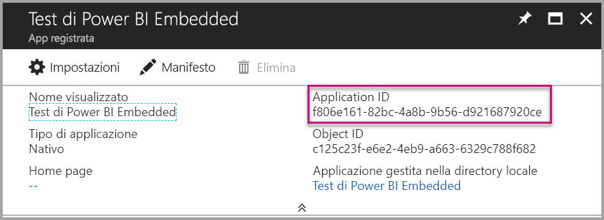

    Specificare le informazioni **ClientSecret** dalla sezione **Chiavi** in **Registrazioni per l'app** in **Azure**.

    Per ottenere il valore **ClientSecret**, seguire questa procedura:

    Accedere al [portale di Azure](https://portal.azure.com).

    

    Nel riquadro di spostamento a sinistra scegliere **Tutti i servizi** e selezionare **Registrazioni per l'app**.

    

    Selezionare l'applicazione che deve usare il valore **ClientSecret**.

    

    Selezionare **Impostazioni**.

    

    Selezionare **Chiavi**.

    

    Immettere la **Descrizione** con un nome e selezionare una **Durata**, quindi selezionare **Salva** per ottenere il **Valore** per l'applicazione. Dopo aver chiuso il pannello **Chiavi** e aver salvato il **valore della chiave**, il campo del valore viene visualizzato solo come **_Nascosto_** e non sarà possibile recuperare il **valore della chiave**. Se il **valore della chiave** viene perso, è necessario crearne uno nuovo all'interno del **portale di Azure**.

    

     Compilare il campo **groupId** con il **GUID dell'area di lavoro per le app** di Power BI.

    

    Compilare il campo **reportId** con il **GUID del report** di Power BI.

    

3. Eseguire l'applicazione.

    Per prima cosa, selezionare **Esegui** in **Visual Studio**.

    

    Quindi selezionare **Scarica il report**.

    

    È ora possibile visualizzare il report nell'applicazione di esempio.

    

## <a name="embed-your-content-within-your-application"></a>Incorporare il contenuto all'interno dell'applicazione
Anche se la procedura per incorporare il contenuto può essere eseguita con le [API REST di Power BI](https://docs.microsoft.com/rest/api/power-bi/), i codici di esempio descritti in questo articolo vengono creati con il **.NET SDK**.

Per integrare un report in un'app Web, usare l'**API REST di Power BI** o **Power BI C# SDK** e un **token di accesso** di un'autorizzazione di Azure Active Directory (AD) per ottenere un report. Caricare quindi il report usando lo stesso **token di accesso**. L'**API Rest di Power BI** offre l'accesso a livello di codice a specifiche risorse di **Power BI**. Per altre informazioni, vedere [Power BI REST API](https://docs.microsoft.com/rest/api/power-bi/) (API REST di Power BI) e [Power BI JavaScript API](https://github.com/Microsoft/PowerBI-JavaScript) (API JavaScript di Power BI).

### <a name="get-an-access-token-from-azure-ad"></a>Ottenere un token di accesso da Azure AD
All'interno dell'applicazione è necessario innanzitutto ottenere un **token di accesso** da Azure AD per poter effettuare chiamate all'API REST di Power BI. Per altre informazioni, vedere [Autenticare gli utenti e ottenere un token di accesso di Azure AD per l'app Power BI](get-azuread-access-token.md).

### <a name="get-a-report"></a>Ottenere un report
Per ottenere un report di **Power BI**, usare l'operazione [Get Reports](https://docs.microsoft.com/rest/api/power-bi/reports/getreports) che recupera un elenco di report di **Power BI**. Dall'elenco dei report è possibile ottenere un ID report.

### <a name="get-reports-using-an-access-token"></a>Ottenere i report usando un token di accesso
L'operazione [Get Reports](https://docs.microsoft.com/rest/api/power-bi/reports/getreports) restituisce un elenco di report. È possibile ottenere un singolo report dall'elenco di report.

Per effettuare la chiamata all'API REST, è necessario includere un'intestazione *Authorization* con formato *Bearer {token di accesso}*.

#### <a name="get-reports-with-the-rest-api"></a>Ottenere report con l'API REST

Di seguito è riportato un esempio di codice per recuperare i report con l'**API REST**.

*Un esempio di recupero di un elemento del contenuto da incorporare (report, dashboard o riquadro) è disponibile nel file **_Default.aspx.cs_** nell'[applicazione di esempio](#embed-your-content-using-the-sample-application).*

```csharp
using Newtonsoft.Json;

//Get a Report. In this sample, you get the first Report.
protected void GetReport(int index)
{
    //Configure Reports request
    System.Net.WebRequest request = System.Net.WebRequest.Create(
        String.Format("{0}/Reports",
        baseUri)) as System.Net.HttpWebRequest;

    request.Method = "GET";
    request.ContentLength = 0;
    request.Headers.Add("Authorization", String.Format("Bearer {0}", accessToken.Value));

    //Get Reports response from request.GetResponse()
    using (var response = request.GetResponse() as System.Net.HttpWebResponse)
    {
        //Get reader from response stream
        using (var reader = new System.IO.StreamReader(response.GetResponseStream()))
        {
            //Deserialize JSON string
            PBIReports Reports = JsonConvert.DeserializeObject<PBIReports>(reader.ReadToEnd());

            //Sample assumes at least one Report.
            //You could write an app that lists all Reports
            if (Reports.value.Length > 0)
            {
                var report = Reports.value[index];

                txtEmbedUrl.Text = report.embedUrl;
                txtReportId.Text = report.id;
                txtReportName.Text = report.name;
            }
        }
    }
}

//Power BI Reports used to deserialize the Get Reports response.
public class PBIReports
{
    public PBIReport[] value { get; set; }
}
public class PBIReport
{
    public string id { get; set; }
    public string name { get; set; }
    public string webUrl { get; set; }
    public string embedUrl { get; set; }
}
```

#### <a name="get-reports-using-the-net-sdk"></a>Recuperare report con .NET SDK
È possibile usare .NET SDK per recuperare un elenco di report invece di chiamare direttamente l'API REST. Di seguito è riportato un esempio di codice per visualizzare un elenco di report.

```csharp
using Microsoft.IdentityModel.Clients.ActiveDirectory;
using Microsoft.PowerBI.Api.V2;
using Microsoft.PowerBI.Api.V2.Models;

var tokenCredentials = new TokenCredentials(<ACCESS TOKEN>, "Bearer");

// Create a Power BI Client object. It is used to call Power BI APIs.
using (var client = new PowerBIClient(new Uri(ApiUrl), tokenCredentials))
{
    // Get the first report all reports in that workspace
    ODataResponseListReport reports = client.Reports.GetReports();

    Report report = reports.Value.FirstOrDefault();

    var embedUrl = report.EmbedUrl;
}
```

### <a name="load-a-report-using-javascript"></a>Caricare un report con JavaScript
È possibile usare JavaScript per caricare un report in un elemento div nella pagina Web.

Di seguito è riportato un esempio di codice per recuperare un report da un'area di lavoro specifica.

*Un esempio di caricamento di un elemento del contenuto costituito da un report, un dashboard o un riquadro da incorporare è disponibile nel file **_Default.aspx_** nell'[applicazione di esempio](#embed-your-content-using-the-sample-application).*

```javascript
<!-- Embed Report-->
<div> 
    <asp:Panel ID="PanelEmbed" runat="server" Visible="true">
        <div>
            <div><b class="step">Step 3</b>: Embed a report</div>

            <div>Enter an embed url for a report from Step 2 (starts with https://):</div>
            <input type="text" id="tb_EmbedURL" style="width: 1024px;" />
            <br />
            <input type="button" id="bEmbedReportAction" value="Embed Report" />
        </div>

        <div id="reportContainer"></div>
    </asp:Panel>
</div>
```

**Site.master**

```javascript
window.onload = function () {
    // client side click to embed a selected report.
    var el = document.getElementById("bEmbedReportAction");
    if (el.addEventListener) {
        el.addEventListener("click", updateEmbedReporte, false);
    } else {
        el.attachEvent('onclick', updateEmbedReport);
    }

    // handle server side post backs, optimize for reload scenarios
    // show embedded report if all fields were filled in.
    var accessTokenElement = document.getElementById('MainContent_accessTokenTextbox');
    if (accessTokenElement !== null) {
        var accessToken = accessTokenElement.value;
        if (accessToken !== "")
            updateEmbedReport();
    }
};

// update embed report
function updateEmbedReport() {

    // check if the embed url was selected
    var embedUrl = document.getElementById('tb_EmbedURL').value;
    if (embedUrl === "")
        return;

    // get the access token.
    accessToken = document.getElementById('MainContent_accessTokenTextbox').value;

    // Embed configuration used to describe the what and how to embed.
    // This object is used when calling powerbi.embed.
    // You can find more information at https://github.com/Microsoft/PowerBI-JavaScript/wiki/Embed-Configuration-Details.
    var config = {
        type: 'report',
        accessToken: accessToken,
        embedUrl: embedUrl
    };

    // Grab the reference to the div HTML element that will host the report.
    var reportContainer = document.getElementById('reportContainer');

    // Embed the report and display it within the div container.
    var report = powerbi.embed(reportContainer, config);

    // report.on will add an event handler which prints to Log window.
    report.on("error", function (event) {
        var logView = document.getElementById('logView');
        logView.innerHTML = logView.innerHTML + "Error<br/>";
        logView.innerHTML = logView.innerHTML + JSON.stringify(event.detail, null, "  ") + "<br/>";
        logView.innerHTML = logView.innerHTML + "---------<br/>";
    }
  );
}
```

## <a name="using-a-power-bi-premium-dedicated-capacity"></a>Uso di una capacità Power BI Premium dedicata

Una volta terminato lo sviluppo dell'applicazione, è necessario eseguire il backup dell'area di lavoro dell'app con una capacità dedicata.

### <a name="create-a-dedicated-capacity"></a>Creare una capacità dedicata
Tramite la creazione di una capacità dedicata è possibile trarre vantaggio dalla disponibilità di una risorsa dedicata al contenuto dell'area di lavoro dell'app. Se un'area di lavoro non è assegnata a una capacità dedicata, viene considerata una capacità condivisa. È possibile creare una capacità dedicata usando [Power BI Premium ](../service-admin-premium-purchase.md).

### <a name="assign-an-app-workspace-to-a-dedicated-capacity"></a>Assegnare un'area di lavoro per le app a una capacità dedicata

Dopo aver creato una capacità dedicata, è possibile assegnare l'area di lavoro dell'app alla capacità dedicata. Per eseguire questa operazione, seguire questi passaggi.

1. All'interno del **servizio Power BI** espandere le aree di lavoro e selezionare i puntini di sospensione relativi all'area di lavoro in cui incorporare il contenuto. Quindi selezionare **Edit workspaces** (Modifica aree di lavoro).

    

2. Espandere **Avanzate**, abilitare **Capacità dedicata** e quindi selezionare la capacità dedicata creata. Selezionare quindi **Salva**.

    

3. Dopo aver selezionato **Salva** viene visualizzato un **rombo** accanto al nome dell'area di lavoro dell'app.

    

## <a name="next-steps"></a>Passaggi successivi
In questa esercitazione è stato descritto come incorporare il contenuto di Power BI in un'applicazione usando l'**account dell'organizzazione di Power BI**. È ora possibile provare a incorporare il contenuto di Power BI in un'applicazione usando le app.  È anche possibile provare a incorporare il contenuto di Power BI per i clienti di terze parti.

> [!div class="nextstepaction"]
> [Incorporare contenuti dalle app](embed-from-apps.md)

> [!div class="nextstepaction"]
>[Incorporare contenuto per i clienti di terze parti](embed-sample-for-customers.md)

Altre domande? [Provare a rivolgersi alla community di Power BI](http://community.powerbi.com/)
