# <a name="tutorial-embed-power-bi-content-into-an-application-for-your-organization"></a>Esercitazione: Incorporare contenuto di Power BI in un'applicazione per l'organizzazione

**Power BI** consente di incorporare report, dashboard o riquadri in un'applicazione usando dati di proprietà dell'utente. I **dati di proprietà dell'utente** consentono all'applicazione di estendere il servizio Power BI e poter così usare l'analisi incorporata. Questa esercitazione illustra come integrare un report in un'applicazione. Power BI .NET SDK può essere usato con l'API JavaScript di Power BI per incorporare Power BI in un'applicazione per l'organizzazione.

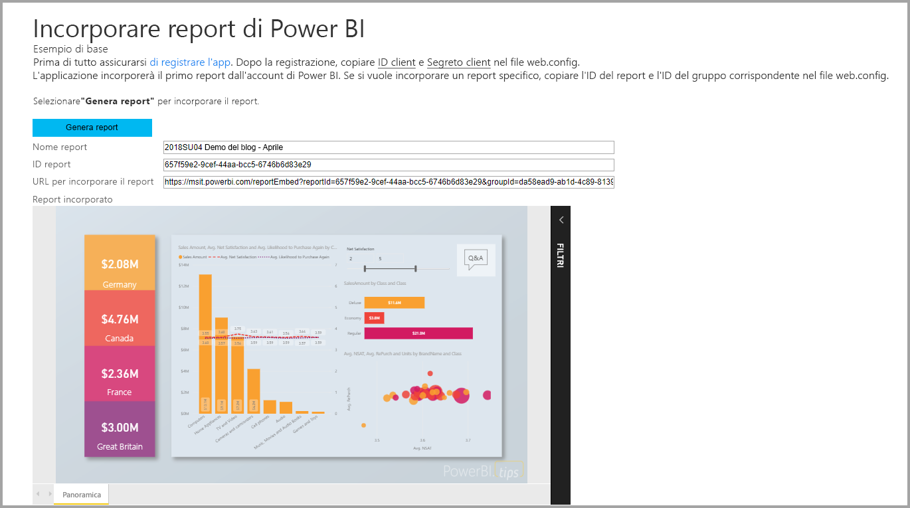

In questa esercitazione vengono apprese le attività seguenti:
> [!div class="checklist"]
> * Registrare un'applicazione in Azure.
> * Incorporare un report di Power BI in un'applicazione usando il tenant di Power BI.

## <a name="prerequisites"></a>Prerequisiti

Per iniziare, è necessario avere:

* Un [account di Power BI Pro](../service-self-service-signup-for-power-bi.md).
* Una sottoscrizione di [Microsoft Azure](https://azure.microsoft.com/).
* È necessario aver configurato un [tenant di Azure Active Directory](create-an-azure-active-directory-tenant.md).

Se non si è ancora iscritti a **Power BI Pro**, [iscriversi per ottenere una versione di prova gratuita](https://powerbi.microsoft.com/pricing/) prima di iniziare.

Se non si ha una sottoscrizione di Azure, [creare un account gratuito](https://azure.microsoft.com/free/?WT.mc_id=A261C142F) prima di iniziare.

## <a name="set-up-your-embedded-analytics-development-environment"></a>Configurare l'ambiente di sviluppo di analisi incorporata

Prima di iniziare a incorporare report, dashboard o riquadri in un'applicazione, è necessario assicurarsi che l'ambiente consenta l'incorporamento con Power BI.

È possibile usare lo [strumento di installazione dell'incorporamento](https://aka.ms/embedsetup/UserOwnsData) per iniziare rapidamente e scaricare un'applicazione di esempio che facilita la creazione di un ambiente e l'incorporamento di un report.

Se tuttavia si sceglie di configurare l'ambiente manualmente, è possibile continuare con le istruzioni che seguono.

### <a name="register-an-application-in-azure-active-directory"></a>Registrare un'applicazione in Azure Active Directory

[Registrare l'applicazione](register-app.md) in Azure Active Directory per consentire all'applicazione di accedere alle [API REST di Power BI](https://docs.microsoft.com/rest/api/power-bi/). La registrazione consente di definire un'identità per l'applicazione e di specificare le autorizzazioni per accedere alle risorse REST di Power BI.

È necessario procedere registrando un'**applicazione Web sul lato server**. Si registra un'applicazione Web sul lato server per creare un segreto dell'applicazione.

## <a name="set-up-your-power-bi-environment"></a>Configurare l'ambiente di Power BI

### <a name="create-an-app-workspace"></a>Crea area di lavoro per le app

Se si incorporano report, dashboard o riquadri per i clienti, è necessario inserire il contenuto all'interno di un'area di lavoro per le app. Esistono diversi tipi di aree di lavoro configurabili: le [aree di lavoro tradizionali](../service-create-workspaces.md) o le [nuove aree di lavoro](../service-create-the-new-workspaces.md).

### <a name="create-and-publish-your-reports"></a>Creare e pubblicare i report

È possibile creare i report e i set di dati con Power BI Desktop. È quindi possibile pubblicare tali report nell'area di lavoro di un'app. Per poter pubblicare in un'area di lavoro dell'app, l'utente finale che pubblica report deve avere una licenza di Power BI Pro.

1. Scaricare l'esempio [Demo](https://github.com/Microsoft/powerbi-desktop-samples) da GitHub.

    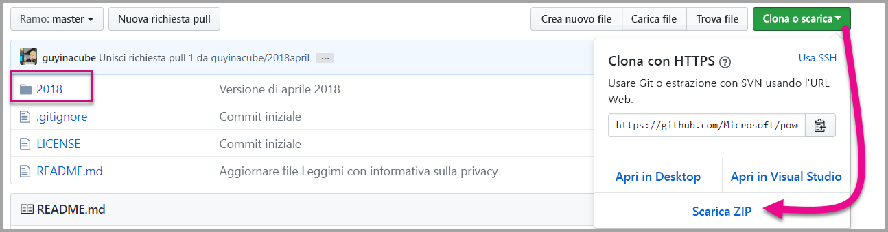

2. Aprire il report di esempio con estensione .pbix in Power BI Desktop.

   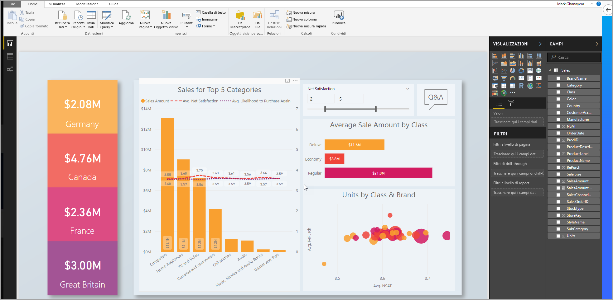

3. Eseguire la pubblicazione nell'area di lavoro per le app.

   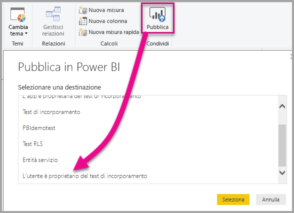

    È ora possibile visualizzare il report nel servizio Power BI online.

   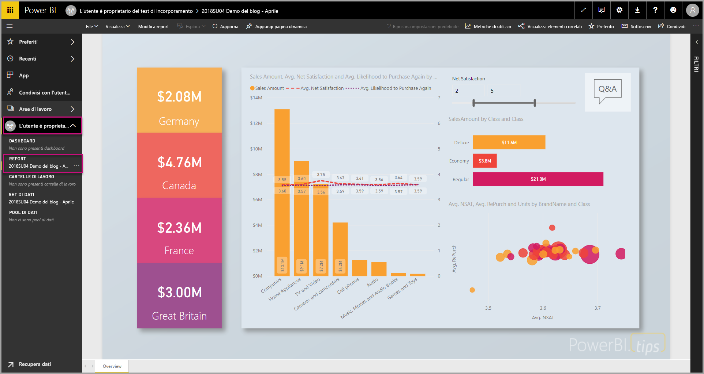

## <a name="embed-your-content-by-using-the-sample-application"></a>Incorporare il contenuto usando l'applicazione di esempio

Questo esempio è volutamente semplice per scopo dimostrativo.

Seguire questa procedura per avviare l'incorporamento del contenuto usando l'applicazione di esempio.

1. Scaricare [Visual Studio](https://www.visualstudio.com/) (2013 o versione successiva). Assicurarsi di scaricare la versione più recente [del pacchetto NuGet](https://www.nuget.org/profiles/powerbi).

2. Scaricare l'[esempio App Owns Data](https://github.com/Microsoft/PowerBI-Developer-Samples) (Dati di proprietà dell'app) da GitHub per iniziare.

    

3. Aprire il file **Cloud.config** nell'applicazione di esempio.

    Per eseguire l'applicazione, è necessario compilare alcuni campi.

    | Campo |
    |--------------------|
    | **[ID applicazione](#application-id)** |
    | **[Segreto dell'applicazione](#application-secret)** |
    | **[ID area di lavoro](#workspace-id)** |
    | **[ID report](#report-id)** |
    | **[AADAuthorityUrl](#aadauthorityurl)** |

    

### <a name="application-id"></a>ID applicazione

In **applicationId** inserire il valore di **ID applicazione** di **Azure**. Il valore **applicationId** viene usato per l'identificazione dell'applicazione per gli utenti ai quali si richiedono le autorizzazioni.

Per ottenere il valore **applicationId** seguire questa procedura:

1. Accedere al [portale di Azure](https://portal.azure.com).

2. Nel riquadro di spostamento a sinistra, scegliere **Tutti i servizi** e selezionare **Registrazioni app**.

    

3. Selezionare l'applicazione che deve usare il valore **applicationId**.

    

4. Viene visualizzato un **ID applicazione** che viene elencato come GUID. Usare questo **ID applicazione** come **applicationId** per l'applicazione.

    

### <a name="application-secret"></a>Segreto dell'applicazione

Specificare le informazioni per **ApplicationSecret** dalla sezione **Chiavi** in **Registrazioni app** in **Azure**.  Questo attributo si usa con l'[entità servizio](embed-service-principal.md).

Per ottenere il valore **ApplicationSecret**, seguire questa procedura:

1. Accedere al [portale di Azure](https://portal.azure.com).

2. Nel riquadro di spostamento a sinistra scegliere **Tutti i servizi** e selezionare **Registrazioni per l'app**.

    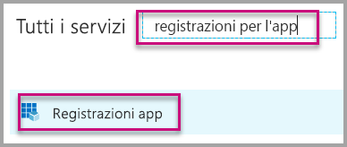

3. Selezionare l'applicazione che deve usare il valore **ApplicationSecret**.

    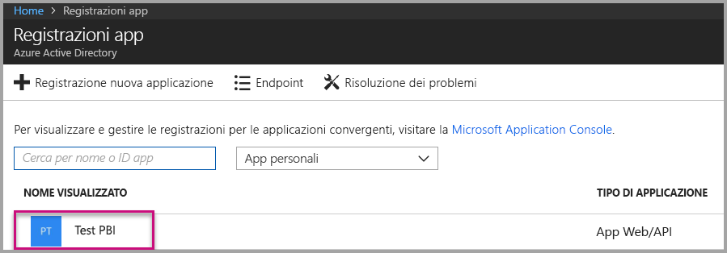

4. Selezionare **Impostazioni**.

    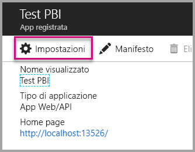

5. Selezionare **Chiavi**.

    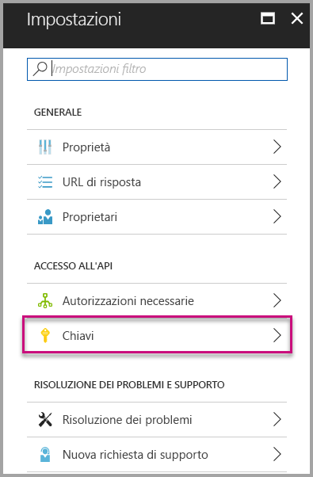

6. Immettere un nome nella casella **Descrizione** e selezionare una durata. Quindi selezionare **Salva** per ottenere il **Valore** per l'applicazione. Chiudendo il riquadro **Chiavi** dopo aver salvato il valore della chiave, il campo del valore viene visualizzato solo come nascosto. A questo punto, non è possibile recuperare il valore della chiave. Se il valore della chiave viene perso, crearne uno nuovo all'interno del portale di Azure.

    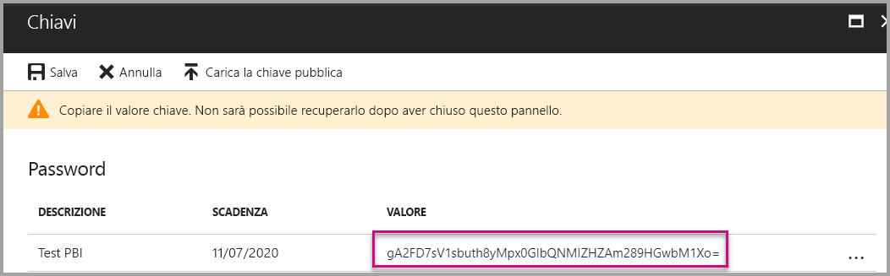

### <a name="workspace-id"></a>ID area di lavoro

Compilare il campo **workspaceId** con il GUID (gruppo) dell'area di lavoro per le app di Power BI. È possibile ottenere queste informazioni dall'URL di accesso al servizio Power BI o usando Powershell.

URL <br>


PowerShell <br>

```powershell
Get-PowerBIworkspace -name "User Owns Embed Test"
```

   

### <a name="report-id"></a>ID del report

Compilare il campo **reportId** con il GUID del report di Power BI. È possibile ottenere queste informazioni dall'URL di accesso al servizio Power BI o usando Powershell.

URL <br>


PowerShell <br>

```powershell
Get-PowerBIworkspace -name "User Owns Embed Test" | Get-PowerBIReport
```


### <a name="aadauthorityurl"></a>AADAuthorityUrl

Immettere le informazioni di **AADAuthorityUrl** specificando l'URL che consente l'incorporamento all'interno del tenant dell'organizzazione o l'incorporamento con un utente guest.

Per l'incorporamento con il tenant dell'organizzazione, usare l'URL *https://login.microsoftonline.com/common/oauth2/authorize*.

Per l'incorporamento con l'utente guest, usare l'URL *https://login.microsoftonline.com/report-owner-tenant-id*, in cui è possibile aggiungere l'ID tenant del proprietario del report in sostituzione a *report-owner-tenant-id*.

### <a name="run-the-application"></a>Eseguire l'applicazione

1. Selezionare **Esegui** in **Visual Studio**.

    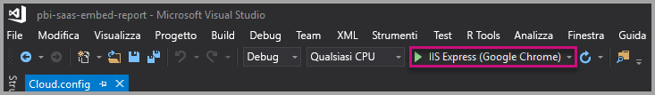

2. Selezionare quindi **Incorpora report**. A seconda del contenuto con cui si sceglie di eseguire il test (report, dashboard o riquadri), selezionare l'opzione corrispondente nell'applicazione.

    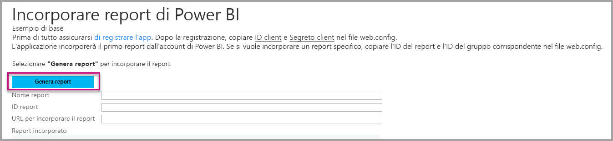

3. È ora possibile visualizzare il report nell'applicazione di esempio.

    

## <a name="embed-your-content-within-your-application"></a>Incorporare il contenuto all'interno dell'applicazione

Anche se la procedura per incorporare il contenuto può essere eseguita con le [API REST di Power BI](https://docs.microsoft.com/rest/api/power-bi/), i codici di esempio descritti in questo articolo vengono creati con il .NET SDK.

Per integrare un report in un'app web, usare l'API REST di Power BI o Power BI C# SDK. È anche possibile usare un token di accesso per l'autorizzazione di Azure Active Directory per ottenere un report. Caricare quindi il report usando lo stesso token di accesso. L'API Rest di Power BI offre l'accesso a livello di codice a specifiche risorse di Power BI. Per altre informazioni, vedere [Power BI REST APIs](https://docs.microsoft.com/rest/api/power-bi/) (API REST di Power BI) e [Power BI JavaScript API](https://github.com/Microsoft/PowerBI-JavaScript) (API JavaScript di Power BI).

### <a name="get-an-access-token-from-azure-ad"></a>Ottenere un token di accesso da Azure AD

All'interno dell'applicazione è necessario ottenere un token di accesso da Azure AD per poter effettuare chiamate all'API REST di Power BI. Per altre informazioni, vedere [Autenticare gli utenti e ottenere un token di accesso di Azure AD per l'app Power BI](get-azuread-access-token.md).

### <a name="get-a-report"></a>Ottenere un report

Per ottenere un report di Power BI, usare l'operazione [Get Reports](https://docs.microsoft.com/rest/api/power-bi/reports/getreports) che recupera un elenco di report di Power BI. Dall'elenco dei report è possibile ottenere un ID report.

### <a name="get-reports-by-using-an-access-token"></a>Ottenere i report usando un token di accesso

L'operazione [Get Reports](https://docs.microsoft.com/rest/api/power-bi/reports/getreports) restituisce un elenco di report. È possibile ottenere un singolo report dall'elenco di report.

Per effettuare la chiamata all'API REST, è necessario includere un'intestazione *Authorization* con formato *Bearer {token di accesso}*.

#### <a name="get-reports-with-the-rest-api"></a>Ottenere report con l'API REST

L'esempio di codice seguente illustra come recuperare i report con l'API REST:

> [!Note]
> Il file Default.aspx.cs nell'[applicazione di esempio](https://github.com/Microsoft/PowerBI-Developer-Samples) contiene un esempio per recuperare un elemento del contenuto da incorporare. Altri esempi sono un report, un dashboard o un riquadro.

```csharp
using Newtonsoft.Json;

//Get a Report. In this sample, you get the first Report.
protected void GetReport(int index)
{
    //Configure Reports request
    System.Net.WebRequest request = System.Net.WebRequest.Create(
        String.Format("{0}/Reports",
        baseUri)) as System.Net.HttpWebRequest;

    request.Method = "GET";
    request.ContentLength = 0;
    request.Headers.Add("Authorization", String.Format("Bearer {0}", accessToken.Value));

    //Get Reports response from request.GetResponse()
    using (var response = request.GetResponse() as System.Net.HttpWebResponse)
    {
        //Get reader from response stream
        using (var reader = new System.IO.StreamReader(response.GetResponseStream()))
        {
            //Deserialize JSON string
            PBIReports Reports = JsonConvert.DeserializeObject<PBIReports>(reader.ReadToEnd());

            //Sample assumes at least one Report.
            //You could write an app that lists all Reports
            if (Reports.value.Length > 0)
            {
                var report = Reports.value[index];

                txtEmbedUrl.Text = report.embedUrl;
                txtReportId.Text = report.id;
                txtReportName.Text = report.name;
            }
        }
    }
}

//Power BI Reports used to deserialize the Get Reports response.
public class PBIReports
{
    public PBIReport[] value { get; set; }
}
public class PBIReport
{
    public string id { get; set; }
    public string name { get; set; }
    public string webUrl { get; set; }
    public string embedUrl { get; set; }
}
```

#### <a name="get-reports-by-using-the-net-sdk"></a>Recuperare report con .NET SDK

È possibile usare .NET SDK per recuperare un elenco di report invece di chiamare direttamente l'API REST. Il codice di esempio seguente illustra come elencare i report:

```csharp
using Microsoft.IdentityModel.Clients.ActiveDirectory;
using Microsoft.PowerBI.Api.V2;
using Microsoft.PowerBI.Api.V2.Models;

var tokenCredentials = new TokenCredentials(<ACCESS TOKEN>, "Bearer");

// Create a Power BI Client object. It is used to call Power BI APIs.
using (var client = new PowerBIClient(new Uri(ApiUrl), tokenCredentials))
{
    // Get the first report all reports in that workspace
    ODataResponseListReport reports = client.Reports.GetReports();

    Report report = reports.Value.FirstOrDefault();

    var embedUrl = report.EmbedUrl;
}
```

### <a name="load-a-report-by-using-javascript"></a>Caricare un report con JavaScript

È possibile usare JavaScript per caricare un report in un elemento div nella pagina Web. L'esempio di codice seguente indica come recuperare un report da un'area di lavoro specifica:

> [!NOTE]  
> Un esempio di caricamento di un elemento del contenuto da incorporare è disponibile nel file **Default.aspx** nell'[applicazione di esempio](https://github.com/Microsoft/PowerBI-Developer-Samples).

```javascript
<!-- Embed Report-->
<div> 
    <asp:Panel ID="PanelEmbed" runat="server" Visible="true">
        <div>
            <div><b class="step">Step 3</b>: Embed a report</div>

            <div>Enter an embed url for a report from Step 2 (starts with https://):</div>
            <input type="text" id="tb_EmbedURL" style="width: 1024px;" />
            <br />
            <input type="button" id="bEmbedReportAction" value="Embed Report" />
        </div>

        <div id="reportContainer"></div>
    </asp:Panel>
</div>
```

#### <a name="sitemaster"></a>Site.master

```javascript
window.onload = function () {
    // client side click to embed a selected report.
    var el = document.getElementById("bEmbedReportAction");
    if (el.addEventListener) {
        el.addEventListener("click", updateEmbedReport, false);
    } else {
        el.attachEvent('onclick', updateEmbedReport);
    }

    // handle server side post backs, optimize for reload scenarios
    // show embedded report if all fields were filled in.
    var accessTokenElement = document.getElementById('MainContent_accessTokenTextbox');
    if (accessTokenElement !== null) {
        var accessToken = accessTokenElement.value;
        if (accessToken !== "")
            updateEmbedReport();
    }
};

// update embed report
function updateEmbedReport() {

    // check if the embed url was selected
    var embedUrl = document.getElementById('tb_EmbedURL').value;
    if (embedUrl === "")
        return;

    // get the access token.
    accessToken = document.getElementById('MainContent_accessTokenTextbox').value;

    // Embed configuration used to describe the what and how to embed.
    // This object is used when calling powerbi.embed.
    // You can find more information at https://github.com/Microsoft/PowerBI-JavaScript/wiki/Embed-Configuration-Details.
    var config = {
        type: 'report',
        accessToken: accessToken,
        embedUrl: embedUrl
    };

    // Grab the reference to the div HTML element that will host the report.
    var reportContainer = document.getElementById('reportContainer');

    // Embed the report and display it within the div container.
    var report = powerbi.embed(reportContainer, config);

    // report.on will add an event handler which prints to Log window.
    report.on("error", function (event) {
        var logView = document.getElementById('logView');
        logView.innerHTML = logView.innerHTML + "Error<br/>";
        logView.innerHTML = logView.innerHTML + JSON.stringify(event.detail, null, "  ") + "<br/>";
        logView.innerHTML = logView.innerHTML + "---------<br/>";
    }
  );
}
```

## <a name="using-a-power-bi-premium-dedicated-capacity"></a>Uso di una capacità Power BI Premium dedicata

Dopo aver terminato lo sviluppo dell'applicazione, è necessario eseguire il backup dell'area di lavoro dell'app con una capacità dedicata.

### <a name="create-a-dedicated-capacity"></a>Creare una capacità dedicata

Tramite la creazione di una capacità dedicata è possibile trarre vantaggio dalla disponibilità di una risorsa dedicata al contenuto dell'area di lavoro dell'app. È possibile creare una capacità dedicata usando [Power BI Premium ](../service-premium.md).

La tabella seguente elenca gli SKU di Power BI Premium disponibili in [Microsoft Office 365](../service-admin-premium-purchase.md):

| Nodo della capacità | Totale vCore<br/>(back-end + front-end) | vCore di back-end | vCore front-end | Limiti di connessione dinamica/DirectQuery |
| --- | --- | --- | --- | --- | --- |
| EM1 |1 vCore |0,5 vCore, 10 GB di RAM |0,5 vCore |3,75 al secondo |
| EM2 |2 vCore |1 vCore, 10 GB di RAM |1 vCore |7,5 al secondo |
| EM3 |4 vCore |2 vCore, 10 GB di RAM |2 vCore |15 al secondo |
| P1 |8 vCore |4 vCore, 25 GB di RAM |4 vCore |30 al secondo |
| P2 |16 vCore |8 vCore, 50 GB di RAM |8 vCore |60 al secondo |
| P3 |32 vCore |16 vCore, 100 GB di RAM |16 vCore |120 al secondo |
| P4 |64 vCore |32 vCore, 200 GB di RAM |32 vCore |240 al secondo |
| P5 |128 vCore |64 vCore, 400 GB di RAM |64 vCore |480 al secondo |

> [!NOTE]
> - Quando si tenta di incorporare le applicazioni di Microsoft Office, è possibile usare i codici di riferimento del prodotto MT per accedere al contenuto con una licenza Power BI gratuita. Tuttavia, non è possibile accedere al contenuto con una licenza di Power BI gratuita se si usa Powerbi.com o Power BI per dispositivi mobili.
> - Quando si tenta l'incorporamento tramite le app di Microsoft Office con Powerbi.com o Power BI per dispositivi mobili, è possibile accedere al contenuto con una licenza di Power BI gratuita.

### <a name="assign-an-app-workspace-to-a-dedicated-capacity"></a>Assegnare un'area di lavoro per le app a una capacità dedicata

Dopo aver creato una capacità dedicata, è possibile assegnare l'area di lavoro dell'app alla capacità dedicata. Per completare questo processo, seguire questi passaggi:

1. All'interno del servizio Power BI, espandere le aree di lavoro e selezionare i puntini di sospensione relativi all'area di lavoro in cui incorporare il contenuto. Quindi selezionare **Edit workspaces** (Modifica aree di lavoro).

    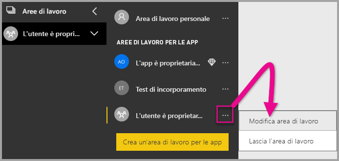

2. Espandere **Avanzata** e abilitare **Capacità dedicata**. Selezionare la capacità dedicata creata. Selezionare quindi **Salva**.

    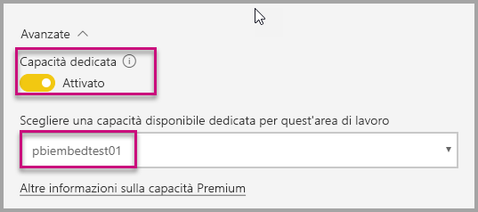

3. Dopo aver selezionato **Salva** viene visualizzato un rombo accanto al nome dell'area di lavoro dell'app.

    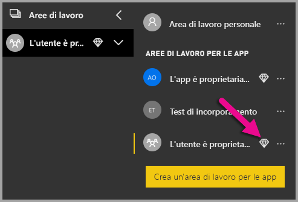

## <a name="admin-settings"></a>Impostazioni di amministrazione

Gli amministratori globali o gli amministratori del servizio Power BI possono attivare o disattivare la possibilità di usare le API REST per un tenant. Gli amministratori di Power BI possono configurare questa impostazione per l'intera organizzazione o per singoli gruppi di sicurezza. L'opzione è abilitata per l'intera organizzazione per impostazione predefinita. È possibile apportare queste modifiche nel [portale di amministrazione di Power BI](../service-admin-portal.md).

## <a name="next-steps"></a>Passaggi successivi

In questa esercitazione è stato descritto come incorporare il contenuto di Power BI in un'applicazione usando l'account dell'organizzazione di Power BI. È ora possibile provare a incorporare il contenuto di Power BI in un'applicazione usando le app. È anche possibile provare a incorporare il contenuto di Power BI per i clienti:

> [!div class="nextstepaction"]
> [Incorporare contenuti dalle app](embed-from-apps.md)

> [!div class="nextstepaction"]
>[Incorporamento per i clienti](embed-sample-for-customers.md)

Per altre domande, [provare a rivolgersi alla community di Power BI](http://community.powerbi.com/).
