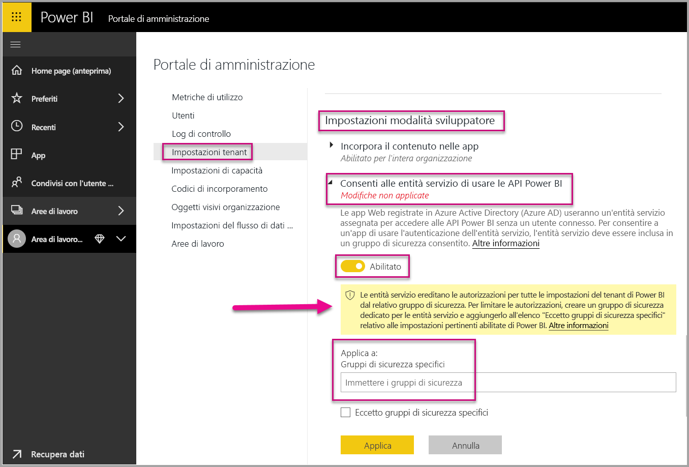
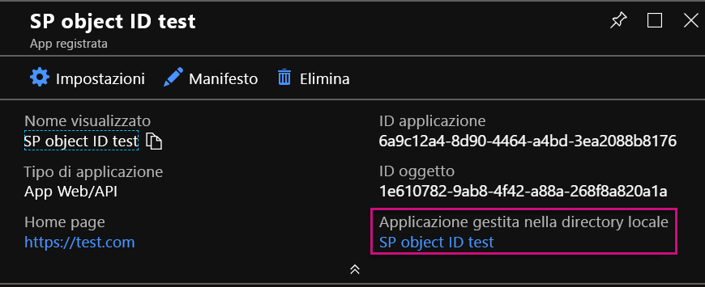
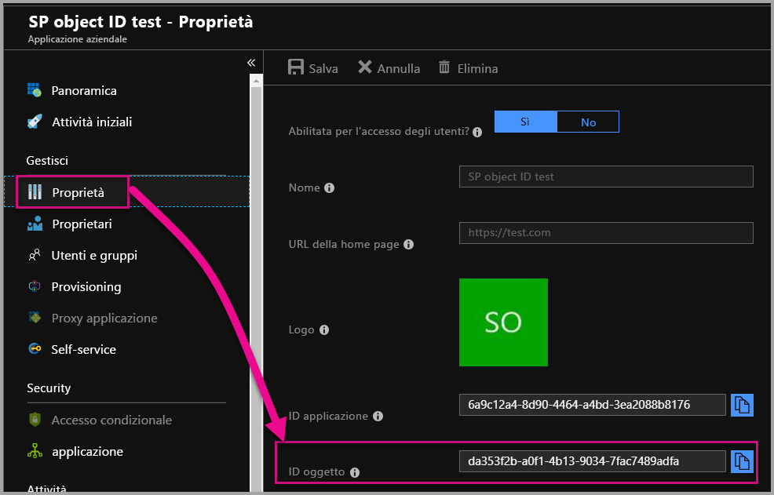

# <a name="service-principal-with-power-bi-preview"></a>Entità servizio con Power BI (anteprima)

Con l'**entità servizio** è possibile incorporare il contenuto di Power BI in un'applicazione e usare l'automazione con Power BI con un token **solo app**. L'entità servizio è utile quando si usa **Power BI Embedded** o durante l'**automatizzazione di processi e attività di Power BI**.

Power BI Embedded offre diversi vantaggi quando viene usata un'entità servizio. Uno dei vantaggi principali consiste nel fatto che non è necessario un account master (licenza Power BI Pro costituita da nome utente e password per l'accesso) per eseguire l'autenticazione nell'applicazione. L'entità servizio usa un ID applicazione e un segreto dell'applicazione per eseguire l'autenticazione dell'applicazione.

Quando si automatizzano le attività di Power BI, è anche possibile creare script per specificare come elaborare e gestire le entità servizio per la scalabilità.

## <a name="application-and-service-principal-relationship"></a>Relazione dell'applicazione e dell'entità servizio

Per accedere alle risorse che proteggono un tenant di Azure AD, l'entità che richiede l'accesso rappresenta un'entità di sicurezza. Questa azione è valida per gli utenti (entità utente) e le applicazioni (entità servizio).

L'entità di sicurezza definisce il criterio di accesso e le autorizzazioni per utenti e applicazioni nel tenant di Azure AD. Questo criterio di accesso abilita le funzionalità di base, ad esempio l'autenticazione di utenti e applicazioni durante l'accesso e l'autorizzazione durante l'accesso alle risorse. Per altre informazioni, fare riferimento a [Oggetti applicazione e oggetti entità servizio in Azure Active Directory](https://docs.microsoft.com/azure/active-directory/develop/app-objects-and-service-principals).

Quando si registra un'applicazione Azure AD nel portale di Azure, vengono creati due oggetti nel tenant di Azure AD:

* Un [oggetto applicazione](https://docs.microsoft.com/azure/active-directory/develop/app-objects-and-service-principals#application-object)
* Un [oggetto entità servizio](https://docs.microsoft.com/azure/active-directory/develop/app-objects-and-service-principals#service-principal-object)

Considerare l'oggetto applicazione come rappresentazione *globale* dell'applicazione da usare in tutti i tenant e l'oggetto entità servizio come rappresentazione *locale* da usare in un tenant specifico.

L'oggetto applicazione svolge la funzione di modello da cui *derivare* le proprietà comuni e predefinite da usare nella creazione degli oggetti entità servizio corrispondenti.

Per ogni tenant in cui viene usata l'applicazione è necessaria un'entità servizio che consente di definire un'identità per eseguire l'accesso e accedere alle risorse protette dal tenant. Un'applicazione a tenant singolo ha una sola entità servizio, nel tenant principale, creata e autorizzata per l'uso durante la registrazione dell'applicazione.

## <a name="service-principal-with-power-bi-embedded"></a>Entità servizio con Power BI Embedded

Con l'entità servizio è possibile mascherare le informazioni dell'account master nell'applicazione usando un ID applicazione e un segreto dell'applicazione. Non è più necessario impostare come hardcoded un account master nell'applicazione per eseguire l'autenticazione.

Poiché le **API di Power BI** e **Power BI .NET SDK** supportano ora le chiamate tramite un'entità servizio, è possibile usare le [API REST di Power BI](https://docs.microsoft.com/rest/api/power-bi/) con l'entità servizio. Ad esempio, è possibile apportare modifiche alle aree di lavoro creando aree di lavoro, aggiungendo o rimuovendo utenti dalle aree di lavoro e importando contenuto nelle aree di lavoro.

È possibile usare l'entità servizio solo se gli artefatti e le risorse di Power BI sono archiviati nelle [nuove aree di lavoro di Power BI](../service-create-the-new-workspaces.md).

## <a name="service-principal-vs-master-account"></a>Differenze tra entità servizio e account master

Esistono differenze tra l'uso di un'entità servizio e l'uso di un account master standard (licenza di Power BI Pro) per l'autenticazione. La tabella seguente evidenzia alcune differenze significative.

| personalizzata | Account utente master <br> (licenza di Power BI Pro) | Entità servizio <br> (token solo app) |
|------------------------------------------------------|---------------------|-------------------|
| Può accedere al servizio Power BI  | Sì | No |
| Abilitata nel portale di amministrazione di Power BI | No | Sì |
| [Può essere usata con le aree di lavoro dell'app (v1)](../service-create-workspaces.md) | Sì | No |
| [Può essere usata con le nuove aree di lavoro dell'app (v2)](../service-create-the-new-workspaces.md) | Sì | Sì |
| Richiede un amministratore dell'area di lavoro se usata con Power BI Embedded | Sì | Sì |
| Supporta le API REST di Power BI | Sì | Sì |
| Richiede un amministratore globale per la creazione | Sì | No |
| Supporta l'installazione e la gestione di un gateway dati locale | Sì | No |

## <a name="get-started-with-a-service-principal"></a>Introduzione a un'entità servizio

A differenza dell'utilizzo tradizionale di un account master, l'uso di un'entità servizio (token solo app) richiede la configurazione di alcuni componenti diversi. Per iniziare a usare un'entità servizio (token solo app), è necessario configurare l'ambiente appropriato.

1. [Registrare un'applicazione Web sul lato server](register-app.md) in Azure Active Directory (AAD) da usare con Power BI. Dopo aver registrato un'applicazione è possibile acquisire un ID applicazione, un segreto dell'applicazione e l'ID oggetto entità servizio per accedere al contenuto di Power BI. È possibile creare un'entità servizio con [PowerShell](https://docs.microsoft.com/powershell/azure/create-azure-service-principal-azureps?view=azps-1.1.0).

    Di seguito è riportato uno script di esempio per creare una nuova applicazione di Azure Active Directory.

    ```powershell
    # The app id - $app.appid
    # The service principal object id - $sp.objectId
    # The app key - $key.value

    # Sign in as a user that is allowed to create an app.
    Connect-AzureAD

    # Create a new AAD web application
    $app = New-AzureADApplication -DisplayName "testApp1" -Homepage "https://localhost:44322" -ReplyUrls "https://localhost:44322"

    # Creates a service principal
    $sp = New-AzureADServicePrincipal -AppId $app.AppId

    # Get the service principal key.
    $key = New-AzureADServicePrincipalPasswordCredential -ObjectId $sp.ObjectId
    ```

   > [!Important]
   > Dopo aver abilitato l'entità servizio da usare con Power BI, le autorizzazioni AD dell'applicazione non hanno più effetto. Le autorizzazioni dell'applicazione vengono quindi gestite dal portale di amministrazione di Power BI.

2. Creare un [gruppo di sicurezza in Azure Active Directory (AAD)](https://docs.microsoft.com/azure/active-directory/fundamentals/active-directory-groups-create-azure-portal) e aggiungere l'applicazione creata al gruppo di sicurezza. È possibile creare un gruppo di sicurezza AAD con [PowerShell](https://docs.microsoft.com/powershell/azure/create-azure-service-principal-azureps?view=azps-1.1.0).

    Di seguito è riportato uno script di esempio per creare un nuovo gruppo di sicurezza e aggiungere un'applicazione al gruppo di sicurezza.

    ```powershell
    # Required to sign in as a tenant admin
    Connect-AzureAD

    # Create an AAD security group
    $group = New-AzureADGroup -DisplayName <Group display name> -SecurityEnabled $true -MailEnabled $false -MailNickName notSet

    # Add the service principal to the group
    Add-AzureADGroupMember -ObjectId $($group.ObjectId) -RefObjectId $($sp.ObjectId)
    ```

3. L'amministratore di Power BI deve abilitare l'entità servizio in **Impostazioni modalità sviluppatore** nel portale di amministrazione di Power BI. Aggiungere il gruppo di sicurezza creato in Azure AD alla sezione **Gruppi di sicurezza specifici** in **Impostazioni modalità sviluppatore**.

   > [!Important]
   > Le entità servizio ereditano le autorizzazioni per tutte le impostazioni del tenant di Power BI dal relativo gruppo di sicurezza. Per limitare le autorizzazioni, creare un gruppo di sicurezza dedicato per le entità servizio e aggiungerlo all'elenco "Eccetto gruppi di sicurezza specifici" relativo alle impostazioni pertinenti abilitate di Power BI.

    

4. Configurare l'[ambiente di Power BI](embed-sample-for-customers.md#set-up-your-power-bi-environment).

5. Aggiungere l'entità servizio come **amministratore** alla nuova area di lavoro creata. È possibile gestire questa attività tramite le [API](https://docs.microsoft.com/rest/api/power-bi/groups/addgroupuser) o il servizio Power BI.

6. Scegliere se incorporare il contenuto all'interno di un'applicazione di esempio o all'interno della propria applicazione.

    * [Incorporare il contenuto usando l'applicazione di esempio](embed-sample-for-customers.md#embed-content-using-the-sample-application)
    * [Incorporare il contenuto all'interno dell'applicazione](embed-sample-for-customers.md#embed-content-within-your-application)

7. A questo punto è possibile [passare alla produzione](embed-sample-for-customers.md#move-to-production).

## <a name="migrate-to-service-principal"></a>Eseguire la migrazione all'entità servizio

È possibile eseguire la migrazione per usare l'entità servizio se si sta usando un account master con Power BI o Power BI Embedded.

Eseguire i primi tre passaggi della sezione [Introduzione a un'entità servizio](#get-started-with-a-service-principal) e quindi seguire le informazioni seguenti.

Se le [nuove aree di lavoro](../service-create-the-new-workspaces.md) sono già in uso in Power BI, aggiungere l'entità servizio come **amministratore** alle aree di lavoro con gli artefatti di Power BI. Se invece si usano le [aree di lavoro tradizionali](../service-create-workspaces.md), copiare o spostare gli artefatti e le risorse di Power BI nelle nuove aree di lavoro e quindi aggiungere l'entità servizio come **amministratore** alle aree di lavoro.

Poiché non è disponibile alcuna funzionalità dell'interfaccia utente per spostare gli artefatti e le risorse di Power BI da un'area di lavoro all'altra, è necessario usare le [API](https://powerbi.microsoft.com/pt-br/blog/duplicate-workspaces-using-the-power-bi-rest-apis-a-step-by-step-tutorial/) per eseguire questa attività. Quando si usano le API con l'entità servizio, è necessario avere l'ID oggetto entità servizio.

### <a name="how-to-get-the-service-principal-object-id"></a>Come ottenere l'ID oggetto entità servizio

Per assegnare un'entità servizio a una nuova area di lavoro dell'app, usare le [API REST di Power BI](https://docs.microsoft.com/rest/api/power-bi/groups/addgroupuser). Per fare riferimento a un'entità servizio per le operazioni o apportare modifiche, usare l'**ID oggetto entità servizio**, applicando ad esempio un'entità servizio come amministratore a un'area di lavoro.

Di seguito è riportata la procedura per ottenere l'ID oggetto entità servizio dal portale di Azure.

1. Creare una nuova registrazione dell'app nel portale di Azure.  

2. Quindi in **Applicazione gestita nella directory locale** selezionare il nome dell'applicazione creata.

   

    > [!Note]
    > L'ID oggetto nell'immagine non corrisponde all'ID usato con l'entità servizio.

3. Selezionare **Proprietà** per visualizzare l'ID oggetto.

    

Di seguito è riportato uno script di esempio per recuperare l'ID oggetto entità servizio con PowerShell.

   ```powershell
   Get-AzureADServicePrincipal -Filter "DisplayName eq '<application name>'"
   ```

## <a name="considerations-and-limitations"></a>Considerazioni e limitazioni

* L'entità servizio funziona solo con [nuove aree di lavoro dell'app](../service-create-the-new-workspaces.md).
* L'**area di lavoro personale** non è supportata durante l'uso dell'entità servizio.
* La capacità Premium dedicata è necessaria per passare alla produzione.
* Non è possibile accedere al portale di Power BI usando l'entità servizio.
* Per abilitare l'entità servizio nelle impostazioni sviluppatore all'interno del portale di amministrazione di Power BI sono necessari i diritti di amministratore di Power BI.
* Non è possibile installare o gestire un gateway dati locale usando l'entità servizio.
* Le applicazioni [incorporate per l'organizzazione](embed-sample-for-your-organization.md) non sono in grado di usare l'entità servizio.
* La gestione dei [flussi di dati](../service-dataflows-overview.md) non è supportata.

## <a name="next-steps"></a>Passaggi successivi

* [Registrare un'app](register-app.md)
* [Power BI Embedded per i clienti](embed-sample-for-customers.md)
* [Oggetti applicazione e oggetti entità servizio in Azure Active Directory](https://docs.microsoft.com/azure/active-directory/develop/app-objects-and-service-principals)
