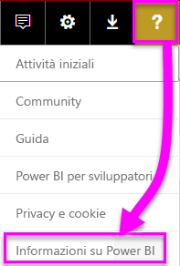
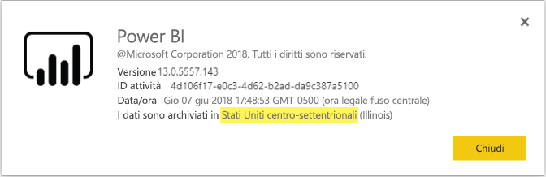

# <a name="frequently-asked-questions-about-power-bi-embedded"></a>Domande frequenti su Power BI Embedded

* Per altre domande, [provare a rivolgersi alla community di Power BI](http://community.powerbi.com/).
* Ci sono ancora problemi? Visitare la [pagina del supporto tecnico di Power BI](https://powerbi.microsoft.com/support/).

## <a name="general"></a>Generale

### <a name="what-is-power-bi-embedded"></a>Che cos'è Power BI Embedded?

Microsoft Power BI Embedded consente agli sviluppatori di applicazioni di incorporare straordinari riquadri, dashboard e report completamente interattivi nelle applicazioni evitando i tempi e i costi derivanti dalla creazione di controlli e visualizzazioni dei dati da zero.

### <a name="who-is-the-target-audience-for-power-bi-embedded"></a>A chi è destinato Power BI Embedded?

A sviluppatori e aziende di sviluppo software che creano applicazioni personalizzate, anche denominate fornitori di software indipendenti (ISV).

### <a name="how-is-power-bi-embedded-different-from-power-bi-the-service"></a>Qual è la differenza tra Power BI Embedded e il servizio Power BI?

Power BI Embedded è destinato a ISV o sviluppatori che creano applicazioni e che vogliono incorporare oggetti visivi in tali applicazioni per consentire ai clienti di prendere decisioni senza dover creare una soluzione di analisi da zero. Le analisi incorporate permettono agli utenti aziendali di accedere ai dati aziendali ed eseguire query per generare informazioni dettagliate basate sui dati all'interno dell'applicazione.

Power BI, invece, è una soluzione di analisi distribuita come servizio che offre alle organizzazioni una visualizzazione centralizzata dei dati aziendali più strategici.

### <a name="what-is-the-difference-between-power-bi-premium-and-power-bi-embedded"></a>Qual è la differenza tra Power BI Premium e Power BI Embedded?

Power BI Premium garantisce una capacità destinata alle aziende che necessitano di una soluzione di business intelligence completa che offra una visualizzazione centralizzata dell'organizzazione stessa, dei partner, dei clienti e dei fornitori. Power BI Premium semplifica il processo decisionale dell'organizzazione. Power BI Premium è un prodotto SaaS e permette agli utenti di fruire del contenuto tramite il portale di Power BI, l'app per dispositivi mobili e app sviluppate internamente.

Power BI Embedded è destinato a ISV o sviluppatori che creano applicazioni e che vogliono incorporare oggetti visivi in tali applicazioni. Power BI Embedded agevola i processi decisionali dei clienti e poiché è progettato per gli sviluppatori di applicazioni, i clienti di queste applicazioni possono fruire del contenuto archiviato nella capacità di Power BI Embedded, che si trovino all'interno o all'esterno dell'organizzazione. Il contenuto della capacità di Power BI Embedded non può essere condiviso tramite pubblicazione con un clic sul Web o su SharePoint e non supporta i report SSRS.

### <a name="what-is-the-microsoft-recommendation-for-when-a-customer-should-buy-power-bi-premium-vs-power-bi-embedded"></a>Quali sono le indicazioni di Microsoft per scegliere tra Power BI Premium e Power BI Embedded?

Secondo le indicazioni di Microsoft, le aziende dovrebbero acquistare Power BI Premium, una soluzione di business intelligence cloud self-service di livello aziendale, mentre gli ISV dovrebbero acquistare Power BI Embedded, ovvero componenti di analisi incorporati basati sul cloud. Non esistono tuttavia restrizioni in merito al prodotto che un cliente può acquistare.

In alcuni casi, un ISV (in genere di grandi dimensioni) avrà la necessità di usare uno SKU P per usufruire dei vantaggi aggiuntivi offerti dal servizio Power BI preconfezionato all'interno dell'organizzazione, nonché di incorporare gli oggetti visivi nelle applicazioni che sviluppa. Allo stesso modo, un'azienda può decidere di usare SKU A in Azure, se è interessata solo a creare applicazioni line-of-business incorporandovi le analisi e non necessita del servizio Power BI preconfezionato.

### <a name="how-many-embed-tokens-can-i-create"></a>Quanti token di incorporamento è possibile creare?

I token di incorporamento con licenza Pro sono destinati al test dello sviluppo, pertanto il numero di token di incorporamento che un account master Power BI può generare è limitato. È necessario [acquistare una capacità](#technical) per l'incorporamento in un ambiente di produzione. Dopo l'acquisto della capacità è possibile generare un numero illimitato di token di incorporamento. Vedere [Available Features](https://docs.microsoft.com/rest/api/power-bi/availablefeatures) (Funzionalità disponibili) per controllare il valore di utilizzo che indica l'attuale utilizzo incorporato espresso come percentuale.

## <a name="technical"></a>Informazioni tecniche

### <a name="what-is-the-difference-between-the-a-skus-in-azure-and-the-em-skus-in-office-365"></a>Qual è la differenza tra gli SKU A in Azure e gli SKU EM in Office 365?

PowerBI.com è una soluzione aziendale che include molte funzionalità, come la collaborazione tramite social network, la sottoscrizione dei messaggi di posta elettronica e così via, in un'offerta SaaS (software distribuito come servizio)

Power BI Embedded è un set di API per sviluppatori che consente di creare una soluzione di analisi incorporata in un'offerta PaaS (piattaforma distribuita come servizio). Per lo scenario di analisi incorporata, è necessario usare PowerBI.com per semplificare a ISV e sviluppatori la gestione del contenuto della soluzione di analisi incorporata e delle impostazioni a livello del tenant.

Di seguito è riportato un elenco parziale con le differenze che è possibile usare con ognuno di essi.

|Funzionalità  |Power BI Embedded<br>(SKU A) |Capacità Power BI Premium<br>(SKU EM)  | 
|---------|---------|---------|
|Incorporamento di elementi dalle aree di lavoro dell'app Power BI     |Capacità di Azure |Capacità di Office 365 |
|Licenza di Power BI necessaria per utilizzare i report |No  |Sì |
|Utilizzo dei report di Power BI in un'applicazione incorporata |Sì  |Sì |
|Utilizzo dei report di Power BI in SharePoint |No |Sì |
|Utilizzo dei report di Power BI in Microsoft Teams |No |Sì |

### <a name="power-bi-now-offers-three-skus-for-embedding-a-skus-em-skus-and-p-skus-which-one-should-i-purchase-for-my-scenario"></a>Ora Power BI offre tre SKU per l'incorporamento, gli SKU A, gli SKU EM e gli SKU P. Quale devo acquistare per il mio scenario?

|  |SKU A (Power BI Embedded)  |SKU EM (Power BI Premium)  |SKU P (Power BI Premium)  |
|---------|---------|---------|---------|
|Acquisto     |Portale di Azure |Office |Office |
|Casi d'uso |* Incorporamento di contenuto in un'applicazione personalizzata |* Incorporamento di contenuto in un'applicazione personalizzata<br>* Incorporamento di contenuto in altre applicazioni SaaS ([SharePoint](https://powerbi.microsoft.com/blog/integrate-power-bi-reports-in-sharepoint-online/), [Teams](https://powerbi.microsoft.com/blog/power-bi-teams-up-with-microsoft-teams/), [Dynamics 365](https://docs.microsoft.com/en-us/dynamics365/customer-engagement/basics/add-edit-power-bi-visualizations-dashboard)) |* Incorporamento di contenuto in un'applicazione personalizzata<br>* Incorporamento di contenuto in altre applicazioni SaaS ([SharePoint](https://powerbi.microsoft.com/blog/integrate-power-bi-reports-in-sharepoint-online/), [Teams](https://powerbi.microsoft.com/blog/power-bi-teams-up-with-microsoft-teams/), [Dynamics 365](https://docs.microsoft.com/en-us/dynamics365/customer-engagement/basics/add-edit-power-bi-visualizations-dashboard))<br>* Condivisione di contenuto con gli utenti di Power BI tramite il [servizio Power BI](https://powerbi.microsoft.com/en-us/)  |
|Fatturazione |Ogni ora |Ogni mese |Mensile |
|Impegno  |Nessun impegno |Annuale  |Mensile/Annuale |
|Differenze |Elasticità completa: aumento/riduzione delle prestazioni, sospensione/ripresa delle risorse nel portale di Azure o tramite l'API  |Consente di incorporare contenuto in SharePoint Online e Microsoft Teams |Combina l'incorporamento nelle applicazioni e usa il servizio Power BI nella stessa capacità |

### <a name="what-are-the-prerequisites-to-create-a-pbie-capacity-in-azure"></a>Quali sono i prerequisiti per creare una capacità PBIE in Azure?

- È necessario accedere alla directory dell'organizzazione (gli account MSA non sono supportati).
- È necessario avere un tenant di Power BI, ovvero è necessario che almeno un utente nella directory abbia effettuato l'iscrizione a Power BI. 
- È necessario avere una sottoscrizione di Azure nella directory dell'organizzazione.

### <a name="how-can-i-monitor-capacity-consumption"></a>Come si può monitorare l'utilizzo della capacità?

Il monitoraggio tramite Azure sarà implementato nel breve termine. La risorsa di Azure, Power BI Embedded, includerà indicatori KPI che mostreranno l'integrità e l'utilizzo.

### <a name="will-my-capacity-scale-automatically-to-adjust-to-the-consumption-of-my-app"></a>La capacità si ridimensiona automaticamente in base all'utilizzo dell'app?

Al momento il ridimensionamento automatico non è disponibile, ma è possibile ridimensionare le API in qualsiasi momento.

### <a name="why-creatingscalingresuming-a-capacity-results-in-putting-the-capacity-into-a-suspended-state"></a>Per quale motivo la creazione, il ridimensionamento o la ripresa di una capacità ne comporta l'inserimento in uno stato sospeso?

Il provisioning di una capacità (ridimensionamento, ripresa o creazione) potrebbe non riuscire. Il chiamante della chiamata al provisioning deve controllare l'oggetto ProvisioningState della capacità usando l'API per il recupero dei dettagli: [Capacities - Get Details](https://docs.microsoft.com/rest/api/power-bi-embedded/capacities/getdetails) (Funzionalità - Ottieni dettagli).

### <a name="why-can-i-only-create-pbie-in-a-specific-region"></a>Perché è possibile creare PBIE solo in un'area specifica?

È possibile creare capacità PBIE solo per la propria area del tenant PBI.

### <a name="how-can-i-find-what-is-my-pbi-tenant-region"></a>Come si reperisce la propria area del tenant PBI?

È possibile usare il portale PBI per risalire alla propria area del tenant PBI.

https://app.powerbi.com/ > ? > Informazioni su Power BI




### <a name="what-is-supported-with-the-communicating-sequential-processes-csp-channel"></a>Che cos'è supportato con il canale CSP?

* Con la sottoscrizione di tipo CSP è possibile creare PBIE per il proprio tenant
* L'account partner può accedere al tenant del cliente, acquistare PBIE per il tenant del cliente e specificare l'utente del tenant del cliente come amministratore della capacità Power BI

### <a name="why-do-i-get-an-unsupported-account-message"></a>Perché viene visualizzato il messaggio di account non è supportato?

Power BI richiede l'iscrizione con un account aziendale. L'iscrizione a Power BI usando un account del servizio gestito (account Microsoft) non è supportato.

### <a name="can-i-use-apis-to-create--manage-azure-capacities"></a>È possibile usare le API per creare e gestire le capacità di Azure?

Sì, esistono API ARM e cmdlet di Powershell che è possibile usare per creare e gestire le risorse PBIE.

* API REST - https://docs.microsoft.com/rest/api/power-bi-embedded/
* Cmdlet di PowerShell - https://docs.microsoft.com/powershell/module/azurerm.powerbiembedded/

### <a name="what-is-the-pbi-embedded-dedicated-capacity-role-in-a-pbi-embedded-solution"></a>Che cos'è il ruolo della capacità dedicata Power PBI Embedded in una soluzione Power PBI Embedded?

Al fine di [Alzare di livello della soluzione alla produzione](https://docs.microsoft.com/en-us/power-bi/developer/embedding-content#step-3-promote-your-solution-to-production), è necessario disporre del contenuto di Power BI (area di lavoro dell'applicazione da assegnare a una capacità dedicata.

### <a name="what-are-the-azure-regions-pbi-embedded-is-available"></a>Quali sono le aree di Azure in cui Power PBI Embedded è disponibile?

[PAM](https://ecosystemmanager.azurewebsites.net/home) (EcoManager): vedere Privileged Access Management

Aree disponibili (16 - stesse aree di Power BI)
* STATI 6 - Stati Uniti orientali, Stati Uniti orientali 2, Stati Uniti centro-settentrionali, Stati Uniti centro-meridionali, Stati Uniti occidentali, Stati Uniti occidentali 2
* Europa (2) - Europa settentrionale, Europa occidentale
* Asia Pacifico (2) - Asia sudorientale, Asia orientale
* Brasile (1) - Brasile meridionale
* Giappone (1) - Giappone orientale
* Australia (1) - Australia sudorientale
* India (1) - India occidentale
* Canada (1) - Canada centrale
* Regno Unito (1) - Regno Unito meridionale

### <a name="what-is-the-authentication-model-for-power-bi-embedded"></a>Qual è il modello di autenticazione per Power BI Embedded?

Power BI Embedded continuerà a usare Azure AD per l'autenticazione dell'utente master (un utente con licenza di Power BI Pro designato), autenticando l'applicazione all'interno di Power BI.

L'autenticazione e l'autorizzazione degli utenti dell'applicazione verranno implementate dall'ISV e quest'ultimo potrà implementare un'autenticazione personalizzata per le relative applicazioni.

Se si dispone già di un tenant di Azure AD, è possibile usare la directory esistente oppure si può creare un nuovo tenant di Azure AD per la sicurezza del contenuto dell'applicazione incorporato.

Per ottenere un token di AAD, è possibile usare una delle librerie di autenticazione di Azure Active Directory - https://docs.microsoft.com/en-us/azure/active-directory/develop/active-directory-authentication-libraries. Sono disponibili librerie client per più piattaforme.

### <a name="my-application-already-uses-aad-for-user-authentication-how-can-we-use-this-identity-when-authenticating-to-power-bi-in-a-user-owns-data-scenario"></a>L'applicazione già utilizza AAD per l'autenticazione utente. Come si usa questa identità per l'autenticazione a Power BI in uno scenario "i dati sono di proprietà dell'utente"? 

Si tratta di un flusso standard OAuth "per conto di" (https://docs.microsoft.com/en-us/azure/active-directory/develop/active-directory-authentication-scenarios#web-application-to-web-api)) L'applicazione deve essere configurata per richiedere le autorizzazioni al servizio Power BI con gli ambiti necessari. Dopo che si è ottenuto un token utente per l'app, è sufficiente effettuare una chiamata AcquireTokenAsync all'API ADAL tramite il token di accesso utente e specificare l'URL della risorsa Power BI come ID della risorsa. Segue un frammento di codice che illustra come può essere eseguita questa operazione:

```csharp
var context = new AD.AuthenticationContext(authorityUrl);
var userAssertion = new AD.UserAssertion(userAccessToken);
var clientAssertion = new AD.ClientAssertionCertificate(MyAppId, MyAppCertificate)
var authenticationResult = await context.AcquireTokenAsync(resourceId, clientAssertion, userAssertion);
```

### <a name="how-is-power-bi-embedded-different-from-other-azure-services"></a>Qual è la differenza tra Power BI Embedded e altri servizi di Azure?

L'ISV/sviluppatore deve avere un account Power BI per poter acquistare Power BI Embedded in Azure. L'area di distribuzione di Power BI Embedded è determinata dall'account Power BI. Gestire la risorsa Power BI Embedded per:

* Aumentare e ridurre le prestazioni
* Aggiungere amministratori della capacità
* Sospendere e riprendere il servizio

Usare PowerBI.com per assegnare o annullare l'assegnazione di aree di lavoro alla capacità di Power BI Embedded.

### <a name="what-deploy-regions-are-supported"></a>Quali sono le aree di distribuzione supportate?

Australia sud-orientale, Brasile meridionale, Canada centrale, Stati Uniti orientali 2, India occidentale, Giappone orientale, Stati Uniti centro-settentrionali, Europa settentrionale, Stati Uniti centro-meridionali, Asia sud-orientale, Regno Unito meridionale, Europa occidentale, Stati Uniti occidentali e Stati Uniti occidentali 2.

### <a name="what-type-of-content-pack-data-can-be-embedded"></a>Quali tipi di dati del pacchetto di contenuto è possibile incorporare?

I **dashboard** e i **riquadri** che sono compilati dal set di dati del pacchetto di contenuto *non possono* essere incorporati, mentre i **report** compilati da un set di dati del pacchetto di contenuto *possono* essere incorporati.

## <a name="licensing"></a>Gestione delle licenze

### <a name="how-do-i-purchase-power-bi-embedded"></a>Come si acquista Power BI Embedded?

Power BI Embedded è disponibile tramite Azure.

### <a name="what-happens-if-i-already-purchased-power-bi-premium-and-now-i-want-some-of-the-benefits-of-power-bi-embedded-in-azure"></a>Che cosa accade se ho già acquistato Power BI Premium e ora desidero usufruire di alcuni dei vantaggi offerti da Power BI Embedded in Azure?

I clienti continueranno a pagare gli eventuali acquisti di Power BI Premium esistenti fino al termine del contratto e a quel punto potranno scegliere se sostituire le licenze di Power BI Premium in base alle esigenze.

### <a name="do-i-still-have-to-buy-power-bi-premium-to-get-access-to-power-bi-embedded"></a>È comunque necessario acquistare Power BI Premium per avere accesso a Power BI Embedded?

No. Power BI Embedded include la capacità basata su Azure necessaria per distribuire la soluzione ai clienti.

### <a name="whats-the-purchase-commitment-for-power-bi-embedded"></a>Qual è l'impegno di acquisto per Power BI Embedded? 

I clienti possono cambiare l'utilizzo su base oraria. Non sono previsti impegni mensili o annuali per il servizio Power BI Embedded.

### <a name="how-does-the-usage-of-power-bi-embedded-show-up-on-my-bill"></a>In che modo verrà visualizzato l'utilizzo di Power BI Embedded nella fattura?

Power BI Embedded viene fatturato secondo una tariffa oraria prevedibile in base al tipo di nodi distribuiti. Si noti che mentre la risorsa è attiva il costo corrispondente continua a essere addebitato, anche se la risorsa non viene usata. Per interrompere l'addebito è necessario intervenire per sospendere la risorsa.

### <a name="who-needs-a-power-bi-pro-license-for-power-bi-embedded-and-why"></a>Chi necessita di una licenza di Power BI Pro per Power BI Embedded e perché?

Gli analisti che devono aggiungere report a un'area di lavoro di Power BI, gli sviluppatori che devono usare le API REST e gli amministratori del tenant che devono gestire la capacità e il tenant di Power BI necessitano di una licenza di Power BI Pro.

Poiché Power BI Embedded consente l'uso del portale di Power BI per gestire e convalidare il contenuto incorporato, la licenza di Power BI Pro è necessaria per autenticare l'app in PowerBI.com per accedere ai report nei repository corretti.

### <a name="can-i-get-started-for-free"></a>È possibile iniziare a usare il prodotto gratuitamente?

Sì. È possibile usare i [crediti Azure](https://azure.microsoft.com/free/) per Power BI Embedded.

### <a name="can-i-get-a-trial-experience-for-power-bi-embedded-in-azure"></a>È possibile accedere a un'esperienza di valutazione per Power BI Embedded in Azure?

Poiché Power BI Embedded fa parte di Azure, è possibile usare il servizio con il [credito di $ 200 ricevuto al momento dell'iscrizione ad Azure](https://azure.microsoft.com/free/).

### <a name="is-power-bi-embedded-available-for-sovereign-clouds-us-government-germany-china"></a>Power BI Embedded è disponibile per i cloud sovrani (US Government, Germania, Cina)?

Power BI Embedded è disponibile per alcuni [cloud sovrani](embed-sample-for-customers-sovereign-clouds.md). **NON** è ancora disponibile per il cloud Cina.

### <a name="is-power-bi-embedded-available-for-non-profits-and-educational"></a>Power BI Embedded è disponibile per le organizzazioni no profit e gli istituti didattici?

Le organizzazioni no profit e gli istituti didattici possono acquistare Azure. Non sono previsti prezzi speciali per questi tipi di clienti in Azure.

## <a name="power-bi-workspace-collection"></a>Raccolta di aree di lavoro di Power BI

### <a name="what-is-power-bi-workspace-collection"></a>Che cos'è la raccolta di aree di lavoro di Power BI?

La **raccolta di aree di lavoro di Power BI** (**Power BI Embedded** versione 1) è una soluzione basata sulla risorsa di Azure **Raccolta di aree di lavoro di Power BI**. Questa soluzione consente di creare applicazioni **Power BI Embedded** per i clienti usando il contenuto di Power BI nella soluzione **Raccolta di aree di lavoro di Power BI**, API dedicate e chiavi della raccolta di aree di lavoro per autenticare l'applicazione per Power BI.

### <a name="can-i-migrate-from-power-bi-workspace-collection-to-power-bi-embedded"></a>È possibile eseguire la migrazione dalla raccolta di aree di lavoro di Power BI a Power BI Embedded?

1. È possibile usare lo strumento di migrazione per clonare il contenuto della **raccolta di aree di lavoro di Power BI** in Power BI - https://docs.microsoft.com/power-bi/developer/migrate-from-powerbi-embedded#content-migration.

2. Iniziare con il modello di verifica (PoC) dell'applicazione **Power BI Embedded** che usa il contenuto di Power BI.

3. Quando si è pronti per la produzione, acquistare una capacità dedicata di **Power BI Embedded** e assegnare il contenuto di Power BI (area di lavoro) a tale capacità.

> [!Note]
> È possibile continuare a usare la **raccolta di aree di lavoro di Power BI** durante la compilazione in parallelo con una soluzione **Power BI Embedded**. Quando si è pronti, è possibile spostare il cliente alla nuova soluzione **Power BI Embedded** e ritirare la soluzione **Raccolta di aree di lavoro di Power BI**.

Per altre informazioni, fare riferimento a [Come eseguire la migrazione del contenuto della raccolta di aree di lavoro di Power BI in Power BI Embedded](https://docs.microsoft.com/power-bi/developer/migrate-from-powerbi-embedded).

### <a name="is-power-bi-workspace-collection-on-a-path-to-be-deprecated"></a>La raccolta di aree di lavoro di Power BI è in procinto di essere deprecata?

Sì, ma i clienti che stanno già usando la soluzione **Raccolta di aree di lavoro di Power BI** possono continuare a usarla fino a quando non sarà deprecata. I clienti possono anche creare nuove raccolte di aree di lavoro e altre applicazioni **Power BI Embedded** che continuano a usare la soluzione **Raccolta di aree di lavoro di Power BI**.

Tuttavia, ciò significa anche che le nuove funzionalità non vengono aggiunte a eventuali soluzioni **Raccolta di aree di lavoro di Power BI** e che i clienti sono invitati a pianificare la migrazione alla nuova soluzione **Power BI Embedded**.
### <a name="when-will-power-bi-workspace-collection-support-be-discontinued"></a>Quando verrà sospeso il supporto per la raccolta di aree di lavoro di Power BI?

I clienti che stanno già usando la soluzione **Raccolta di aree di lavoro di Power BI** possono continuare a usarla fino alla fine del mese di giugno 2018 o fino al termine del contratto di supporto.

### <a name="in-what-regions-can-pbi-workspace-collection-be-created"></a>In quali regioni può essere creata la raccolta di aree di lavoro di Power BI?

Le regioni disponibili sono Australia sud-orientale, Brasile meridionale, Canada centrale, Stati Uniti orientali 2, Giappone orientale, Stati Uniti centro-settentrionali, Europa settentrionale, Stati Uniti centro-meridionali, Asia sud-orientale, Regno Unito meridionale, Europa occidentale, India occidentale e Stati Uniti occidentali.

### <a name="why-should-i-migrate-from-pbi-workspace-collection-to-power-bi-embedded"></a>Perché occorre eseguire la migrazione dalla raccolta di aree di lavoro di Power BI a Power BI Embedded?

Nella soluzione **Power BI Embedded** sono state introdotte nuove caratteristiche e funzionalità che non sono disponibili nella **raccolta di aree di lavoro di Power BI**.

Ecco alcune delle funzionalità:
* Sono supportate tutte le origini dati di Power BI, a differenza delle due origini dati supportate nella **raccolta di aree di lavoro di Power BI**. 
* Nuove funzionalità come domande e risposte, aggiornamenti, segnalibri, dashboard e riquadri incorporati, menu personalizzati e così via sono supportati solo nella soluzione **Power BI Embedded**.
* Modello di fatturazione della capacità.

## <a name="onboarding-experience-tool-for-embedding"></a>Strumento esperienza di onboarding per l'incorporamento

### <a name="what-is-the-onboarding-experience-tool"></a>Che cos'è lo strumento esperienza di onboarding?

Lo [strumento esperienza di onboarding](https://aka.ms/embedsetup) consente di scaricare un'applicazione di esempio per iniziare rapidamente a usare la funzionalità di incorporamento con Power BI.

### <a name="which-solution-should-i-choose"></a>Quale soluzione è consigliabile scegliere?

* L'[incorporamento per i clienti](embedding.md#embedding-for-your-customers) offre la possibilità di incorporare dashboard e report per gli utenti che non hanno un account per Power BI. Eseguire la soluzione [Incorporare per i clienti](https://aka.ms/embedsetup/AppOwnsData).
* L'[incorporamento per l'organizzazione](embedding.md#embedding-for-your-organization) consente di estendere il servizio Power BI. Eseguire la soluzione [Incorporare per l'organizzazione](https://aka.ms/embedsetup/UserOwnsData).

### <a name="ive-downloaded-the-sample-app-which-solution-do-i-choose"></a>Dopo aver scaricato l'app di esempio, quale soluzione si deve scegliere?

Se si usa l'esperienza **Incorporare per i clienti**, salvare e decomprimere il file *PowerBI-Developer-Samples.zip*. Aprire quindi la cartella *PowerBI-Developer-Samples-master\App Owns Data* ed eseguire il file *PowerBIEmbedded_AppOwnsData.sln*.

Se si usa l'esperienza **Incorporare per l'organizzazione**, salvare e decomprimere il file *PowerBI-Developer-Samples.zip*. Aprire quindi la cartella *PowerBI-Developer-Samples-master\User Owns Data\integrate-report-web-app* ed eseguire il file *pbi-saas-embed-report.sln*.

### <a name="how-can-i-edit-my-registered-application"></a>Come si può modificare l'applicazione registrata?

Le informazioni su come modificare le applicazioni registrate con AAD sono disponibili [qui](https://docs.microsoft.com/azure/active-directory/develop/active-directory-integrating-applications#updating-an-application).

### <a name="how-can-i-edit-my-power-bi-user-profile-or-data"></a>Come è possibile modificare il proprio profilo utente o i propri dati in Power BI?

Le informazioni su come modificare i propri dati in Power BI sono disponibili [qui](https://docs.microsoft.com/en-us/power-bi/service-basic-concepts).

Per altre informazioni, vedere [Risoluzione dei problemi dell'applicazione incorporata](embedded-troubleshoot.md)

Altre domande? [Provare la community di Power BI](http://community.powerbi.com/)