# <a name="row-level-security-with-power-bi-embedded"></a>Sicurezza a livello di riga con Power BI Embedded

La **sicurezza a livello di riga** può essere usata per limitare l'accesso degli utenti ai dati in dashboard, riquadri, report e set di dati. Utenti diversi possono usare gli stessi artefatti visualizzando al tempo stesso dati diversi. L'incorporamento supporta la sicurezza a livello di riga.

Se si incorporano dati per utenti non Power BI (i dati sono di proprietà dell'app), ovvero un tipico scenario ISV, leggere questo articolo. Configurare il token di incorporamento per l'utente e il ruolo.

Se l'incorporamento viene eseguito per utenti di Power BI (i dati sono di proprietà dell'utente) all'interno dell'organizzazione, la sicurezza a livello di riga funziona esattamente come nel servizio Power BI. Non è necessario eseguire altre operazioni nell'applicazione. Per altre informazioni, vedere [Sicurezza a livello di riga con Power BI](../service-admin-rls.md).


Per sfruttare al meglio la sicurezza a livello di riga, è importante comprendere tre concetti fondamentali, ovvero utenti, ruoli e regole, che verranno ora analizzati più in dettaglio:

**Utenti**: gli utenti finali visualizzano l'elemento (dashboard, riquadro, report o set di dati). In Power BI Embedded gli utenti vengono identificati tramite la proprietà username in un token di incorporamento.

**Ruoli**: gli utenti appartengono a ruoli. Un ruolo è un contenitore di regole e può essergli assegnato un nome simile a *Responsabile vendite* o *Rappresentante vendite*. I ruoli vengono creati in Power BI Desktop. Per altre informazioni, vedere [Sicurezza a livello di riga con Power BI Desktop](../desktop-rls.md).

**Regole**: i ruoli contengono regole e tali regole costituiscono i filtri effettivi che verranno applicati ai dati. Le regole possono essere semplici, ad esempio "Paese = USA", oppure molto più dinamiche.
La parte rimanente di questo articolo offre un esempio di creazione di sicurezza a livello di riga e del relativo utilizzo in un'applicazione incorporata. In questo esempio viene usato il file PBIX [Retail Analysis Sample](http://go.microsoft.com/fwlink/?LinkID=780547).


## <a name="adding-roles-with-power-bi-desktop"></a>Aggiunta di ruoli con Power BI Desktop

L'**esempio Retail Analysis** mostra le vendite per tutti i negozi di una catena specifica. Senza sicurezza a livello di riga, tutti i responsabili di area che accedono al report visualizzano gli stessi dati. I dirigenti hanno stabilito che ogni responsabile di area debba visualizzare solo le vendite dei negozi che gestisce. La sicurezza a livello di riga consente ai dirigenti di limitare i dati in base a un responsabile di area.

La sicurezza a livello di riga viene creata in Power BI Desktop. All'apertura del set di dati e del report, è possibile passare alla visualizzazione diagramma per visualizzare lo schema:


Alcuni aspetti da notare in questo schema:

* Tutte le misure, ad esempio **Total Sales**, sono archiviate nella tabella dei fatti **Sales**.
* Sono presenti altre quattro tabelle delle dimensioni correlate: **Item**, **Time**, **Store** e **District**.
* Le frecce sulle linee delle relazioni indicano la direzione in cui i filtri possono essere applicati da una tabella all'altra. Ad esempio, se un filtro è posizionato su **Time[Date]**, nello schema corrente verrebbero filtrati solo i valori presenti nella tabella **Sales**. Questo filtro non influisce su altre tabelle, perché tutte le frecce sulle linee relative alle relazioni fanno riferimento alla tabella Sales, non ad altre tabelle.
* La tabella **District** indica il responsabile per ogni area:
  
    

In base a questo schema, se si applica un filtro alla colonna **District Manager** nella tabella **District** e se tale filtro corrisponde all'utente che visualizza il report, vengono filtrate anche le tabelle **Store** e **Sales** per visualizzare i dati relativi al responsabile di area specifico.

Ecco come:

1. Nella scheda **Creazione di modelli** selezionare **Gestisci ruoli**.

    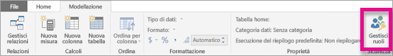
2. Creare un nuovo ruolo denominato **Manager**.

    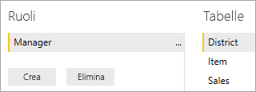
3. Nella tabella **District** immettere questa espressione DAX: **[District Manager] = USERNAME()**.

    
4. Per verificare che le regole funzionino correttamente, nella scheda **Creazione di modelli** selezionare **Visualizza come ruoli** e quindi il ruolo **Manager** creato, insieme ad **Altri utenti**. Per l'utente, immettere **AndrewMa**.

    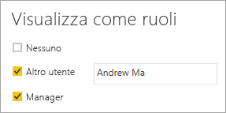

    Nei report vengono visualizzati i dati come se l'accesso fosse stato eseguito come **AndrewMa**.

Applicando il filtro, come in questa procedura, vengono filtrati tutti i record nelle tabelle **District**, **Store** e **Sales**. Tuttavia, a causa della direzione del filtro sulle relazioni tra le tabelle **Sales** e **Time** e **Sales** e **Item**, le tabelle **Item** e **Time** non vengono filtrate. Per altre informazioni sui filtri incrociati bidirezionali, scaricare il white paper [Bidirectional cross-filtering in SQL Server Analysis Services 2016 and Power BI Desktop](http://download.microsoft.com/download/2/7/8/2782DF95-3E0D-40CD-BFC8-749A2882E109/Bidirectional%20cross-filtering%20in%20Analysis%20Services%202016%20and%20Power%20BI.docx) (Filtri incrociati bidirezionali in SQL Server Analysis Services 2016 e Power BI Desktop).

## <a name="applying-user-and-role-to-an-embed-token"></a>Applicazione di utente e ruolo a un token di incorporamento

A questo punto, dopo aver configurato i ruoli di Power BI Desktop, per usare i ruoli è necessario eseguire alcune operazioni nell'applicazione.

Gli utenti vengono autenticati e autorizzati dall'applicazione e i token di incorporamento vengono usati per concedere l'accesso utente a un report specifico di Power BI Embedded. Power BI Embedded non ha informazioni specifiche sull'identità dell'utente. Per il corretto funzionamento della sicurezza a livello di riga, è necessario passare altre informazioni del contesto come parte del token di incorporamento sotto forma di identità. È possibile passare le identità usando l'API [Token di incorporamento](https://docs.microsoft.com/rest/api/power-bi/embedtoken).

L'API accetta un elenco di identità con l'indicazione dei set di dati pertinenti. Per il corretto funzionamento della sicurezza a livello di riga, è necessario passare quanto segue come parte dell'identità.

* **username (obbligatorio)**: stringa che può semplificare l'identificazione dell'utente quando si applicano le regole di sicurezza a livello di riga. È possibile specificare solo un utente. Il nome utente può essere creato con i caratteri *ASCII*.
* **roles (obbligatoria)**: stringa contenente i ruoli da selezionare quando si applicano le regole di sicurezza a livello di riga. Se si passa più di un ruolo, sarà necessario passarli come matrice di stringhe.
* **dataset (obbligatorio)**: set di dati applicabile per l'artefatto che verrà incorporato.

Per creare il token di incorporamento, usare il metodo **GenerateTokenInGroup** su **PowerBIClient.Reports**.

È ad esempio possibile modificare l'esempio [PowerBIEmbedded_AppOwnsData](https://github.com/Microsoft/PowerBI-Developer-Samples/tree/master/App%20Owns%20Data). *Le righe 76 e 77 di Services\EmbedService.cs* potrebbero essere modificate da:

```csharp
// Generate Embed Token.
var generateTokenRequestParameters = new GenerateTokenRequest(accessLevel: "view");

var tokenResponse = await client.Reports.GenerateTokenInGroupAsync(GroupId, report.Id, generateTokenRequestParameters);
```

a

```csharp
var generateTokenRequestParameters = new GenerateTokenRequest("View", null, identities: new List<EffectiveIdentity> { new EffectiveIdentity(username: "username", roles: new List<string> { "roleA", "roleB" }, datasets: new List<string> { "datasetId" }) });

var tokenResponse = await client.Reports.GenerateTokenInGroupAsync("groupId", "reportId", generateTokenRequestParameters);
```

Se si chiama l'API REST, l'API aggiornata ora accetta una matrice JSON aggiuntiva, denominata **identities**, contenente un nome utente, un elenco dei ruoli stringa e un elenco di set di dati stringa. 

Usare il codice seguente come esempio:

```json
{
    "accessLevel": "View",
    "identities": [
        {
            "username": "EffectiveIdentity",
            "roles": [ "Role1", "Role2" ],
            "datasets": [ "fe0a1aeb-f6a4-4b27-a2d3-b5df3bb28bdc" ]
        }
    ]
}
```

Ora, dopo aver eseguito tutti i passaggi, quando un utente effettua l'accesso all'applicazione per visualizzare questo artefatto, potrà visualizzare solo i dati che è autorizzato a vedere, come definito dalla sicurezza a livello di riga.

## <a name="working-with-analysis-services-live-connections"></a>Uso di connessioni dinamiche ad Analysis Services

La sicurezza a livello di riga può essere usata solo con le connessioni in tempo reale di Analysis Services per i server locali. Esistono alcuni concetti specifici che è bene conoscere quando si usa questo tipo di connessione.

L'identità effettiva specificata per la proprietà username deve essere un utente di Windows con autorizzazioni per il server Analysis Services.

### <a name="on-premises-data-gateway-configuration"></a>Configurazione del gateway dati locale

Un [gateway dati locale](../service-gateway-onprem.md) viene usato quando si lavora con connessioni dinamiche di Analysis Services. Quando si genera un token di incorporamento, con un'identità elencata, l'account principale deve essere elencato come amministratore del gateway. Se l'account master non è elencato, la sicurezza a livello di riga non viene applicata correttamente alla proprietà dei dati. Chi non è amministratore del gateway può fornire i ruoli, ma deve specificare il proprio nome utente per l'identità effettiva.

### <a name="use-of-roles"></a>Uso dei ruoli

I ruoli possono essere forniti con l'identità in un token di incorporamento. Se non vengono forniti ruoli, il nome utente fornito può essere usato per risolvere i ruoli associati.

### <a name="using-the-customdata-feature"></a>Uso della funzionalità CustomData

La funzionalità CustomData può essere usata solo per i modelli presenti in **Azure Analysis Services** e solo in modalità **Connessione dinamica**. Diversamente da utenti e ruoli, la funzionalità CustomData non può essere impostata in un file con estensione pbix. Quando si genera un token con la funzionalità CustomData, è necessario avere un nome utente.

La funzionalità CustomData consente di aggiungere un filtro di riga quando si visualizzano i dati di Power BI nell'applicazione quando si usa **Azure Analysis Services** come origine dati (visualizzazione dei dati di Power BI connessi ad Azure Analysis Services all'interno dell'applicazione ).

La funzionalità CustomData consente di passare testo libero (stringa) usando la proprietà della stringa di connessione CustomData. Analysis Services usa questo valore tramite la funzione *CUSTOMDATA()*.

L'unico modo per usare la sicurezza a livello di riga dinamica (che usa valori dinamici per la valutazione del filtro) in **Azure Analysis Services** consiste nell'usare la funzione *CUSTOMDATA()*.

È possibile usarla nella query DAX del ruolo, ma anche senza ruoli in una query DAX di misura.
CustomData fa parte della funzionalità di generazione del token per gli elementi seguenti: dashboard, report e riquadro. I dashboard possono avere più identità CustomData (una per riquadro/modello).

#### <a name="customdata-sdk-additions"></a>Aggiunte di CustomData SDK

La proprietà stringa CustomData è stata aggiunta all'identità effettiva nello scenario di generazione del token.

```json
[JsonProperty(PropertyName = "customData")]
public string CustomData { get; set; }
```

L'identità può essere creata con i dati personalizzati usando la chiamata seguente:

```csharp
public EffectiveIdentity(string username, IList<string> datasets, IList<string> roles = null, string customData = null);
```

#### <a name="customdata-sdk-usage"></a>Utilizzo di CustomData SDK

Se si chiama l'API REST, è possibile aggiungere i dati personalizzati in ogni identità, ad esempio:

```json
{
    "accessLevel": "View",
    "identities": [
        {
            "username": "EffectiveIdentity",
            "roles": [ "Role1", "Role2" ],
            "customData": "MyCustomData",
            "datasets": [ "fe0a1aeb-f6a4-4b27-a2d3-b5df3bb28bdc" ]
        }
    ]
}
```

La procedura seguente descrive come iniziare a configurare la funzionalità CustomData() con l'applicazione Power BI Embedded.

1. Creare il database di Azure Analysis Services. Accedere quindi al server Azure Analysis Services tramite [SQL Server Management Studio](https://docs.microsoft.com/sql/ssms/download-sql-server-management-studio-ssms?view=sql-server-2017).

    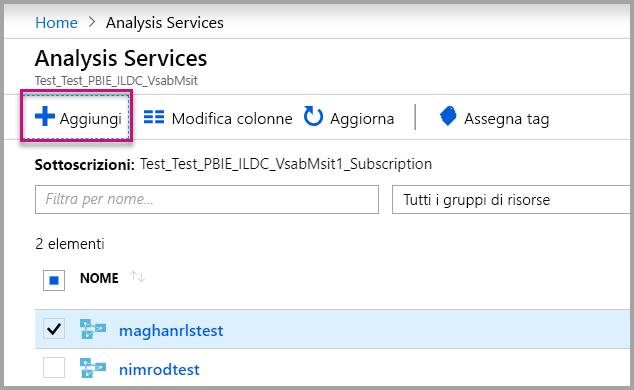

    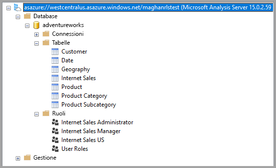

2. Creare un ruolo nel server Analysis Services.

    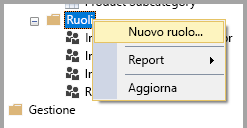

3. Impostare le opzioni **Generale**.  Assegnare **Nome ruolo** e impostare le autorizzazioni del database solo su **Lettura**.

    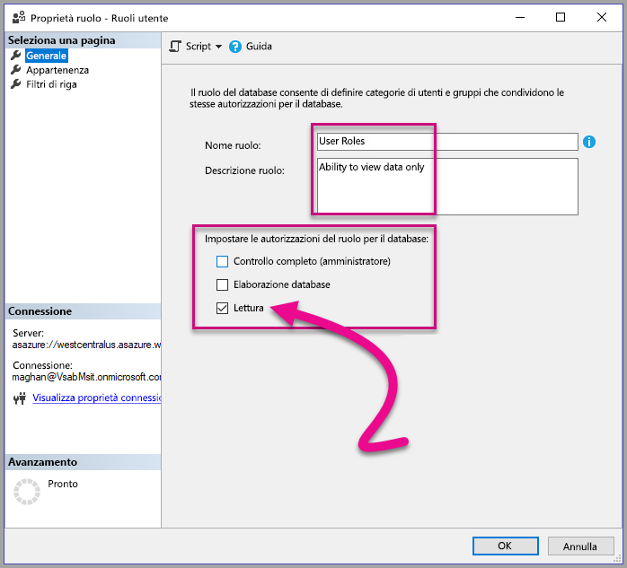

4. Impostare le opzioni **Appartenenza**. In questa sezione si aggiungono gli utenti a cui viene applicato questo ruolo.

    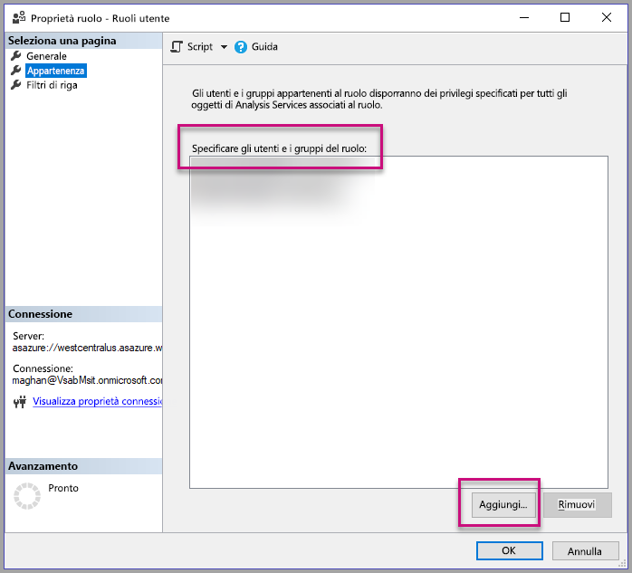

5. Impostare la query DAX in **Filtri di riga** usando la funzione *CUSTOMDATA()*.

    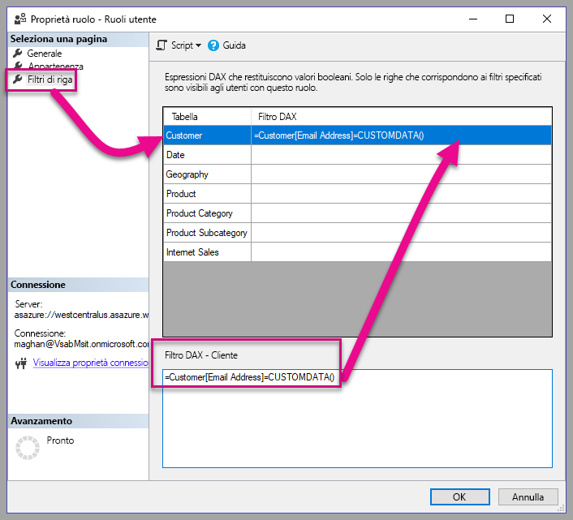

6. Creare un report Power BI e pubblicarlo in un'area di lavoro con capacità dedicata.

    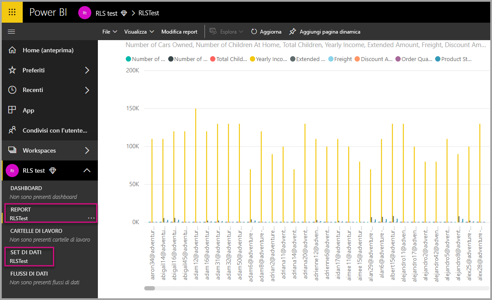

7. Usare le API Power BI per usare la funzionalità CustomData nell'applicazione.  Quando si genera un token con la funzionalità CustomData, è necessario avere un nome utente. Il nome utente deve essere uguale all'UPN dell'utente master. L'utente master deve essere un membro dei ruoli creati. Se non viene specificato alcun ruolo, per la valutazione della sicurezza a livello di riga vengono usati tutti i ruoli di cui è membro l'utente master.

    > [!Note]
    > Quando si è pronti per distribuire l'applicazione nell'ambiente di produzione, il campo o l'opzione dell'account dell'utente master non deve essere visibile per l'utente finale.

    Visualizzare il [codice](#customdata-sdk-additions) per aggiungere la funzionalità CustomData.

8. A questo punto è possibile visualizzare il report nell'applicazione prima di applicare i valori di CustomData per vedere tutti i dati contenuti nel report.

    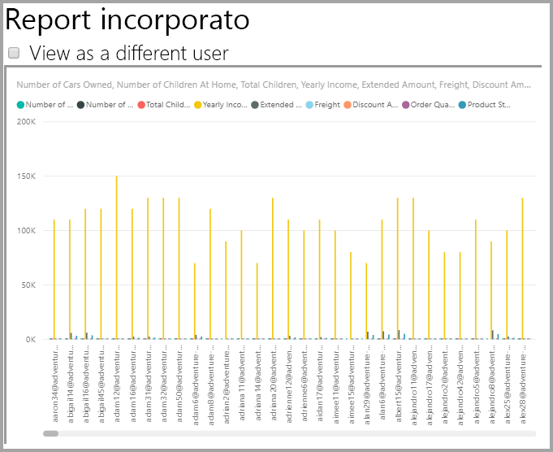

    Applicare quindi i valori di CustomData per vedere come il report visualizza un diverso set di dati.
    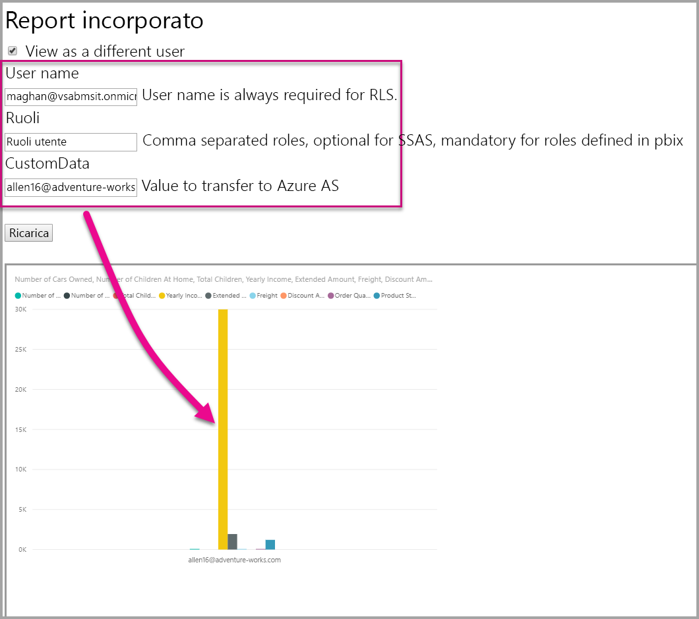

## <a name="using-rls-vs-javascript-filters"></a>Uso della sicurezza a livello di riga o dei filtri JavaScript. Filtri JavaScript

Per l'applicazione di filtri ai dati in un report, è possibile decidere di usare la **sicurezza a livello di riga** oppure **filtri JavaScript**.

La [sicurezza a livello di riga](../service-admin-rls.md) è una funzionalità che consente di filtrare i dati al livello del modello di dati. L'origine dati back-end consente di controllare le impostazioni della sicurezza a livello di riga. In base al modello di dati, la generazione del token di incorporamento imposta il nome utente e i ruoli per la sessione. Non può essere sottoposta a override, rimossa o controllata da codice sul lato client e per tale motivo è considerata sicura. È consigliabile usare la sicurezza a livello di riga per filtrare i dati in modo sicuro. È possibile filtrare i dati con la sicurezza a livello di riga usando una delle opzioni seguenti.

* [Configurazione dei ruoli in un report di Power BI](../desktop-rls.md).
* Configurazione dei ruoli a livello di origine dati (solo connessione dinamica ad Analysis Services).
* A livello di codice con un [token di incorporamento](https://docs.microsoft.com/rest/api/power-bi/embedtoken/datasets_generatetokeningroup) usando `EffectiveIdentity`. Quando si usa un token di incorporamento, il filtro effettivo passa attraverso il token di incorporamento per una specifica sessione.

I [filtri JavaScript](https://github.com/Microsoft/PowerBI-JavaScript/wiki/Filters#page-level-and-visual-level-filters) vengono usati per consentire all'utente di utilizzare una vista ridotta, con ambito o filtrata dei dati. Tuttavia, l'utente ha comunque accesso alle tabelle, alle colonne e alle misure dello schema del modello e può potenzialmente accedere ai dati presenti. L'accesso limitato ai dati può essere applicato solo con la sicurezza a livello di riga e non tramite API di filtro sul lato client.

## <a name="token-based-identity-with-azure-sql-database-preview"></a>Identità basata su token con il database SQL di Azure (anteprima)

L'**identità basata su token** consente di specificare l'identità effettiva per un token di incorporamento usando il token di accesso di **Azure Active Directory (AAD)** per un **database SQL di Azure**.

I clienti che mantengono i dati nel **database SQL di Azure** possono ora sfruttare una nuova funzionalità per gestire gli utenti e l'accesso ai dati in SQL di Azure nell'integrazione con **Power BI Embedded**.

Quando si genera il token di incorporamento, è possibile specificare l'identità effettiva di un utente in SQL di Azure. È possibile specificare l'identità effettiva di un utente passando il token di accesso AAD al server. Il token di accesso viene usato per eseguire il pull solo dei dati rilevanti per l'utente da SQL di Azure, per la sessione specifica.

Può essere usato per gestire la visualizzazione di ogni utente in SQL di Azure o per accedere a SQL di Azure come un cliente specifico in un database multi-tenant. Può anche applicare la sicurezza a livello di riga in tale sessione in Azure SQL e recuperare solo i dati pertinenti per la sessione, eliminando la necessità di gestire la sicurezza a livello di riga in Power BI.

Questi problemi di identità effettiva si applicano alle regole di sicurezza a livello di riga direttamente in SQL Server di Azure. Power BI Embedded usa il token di accesso fornito durante l'esecuzione di query sui dati da SQL Server di Azure. L'UPN dell'utente (per il quale è stato fornito il token di accesso) è accessibile come risultato della funzione SQL USER_NAME().

L'identità basata su token funziona solo per i modelli DirectQuery su capacità dedicata, connessa a un database SQL di Azure configurato per consentire l'autenticazione di AAD ([altre informazioni sull'autenticazione di AAD per il database SQL di Azure](https://docs.microsoft.com/azure/sql-database/sql-database-manage-logins)). L'origine dati del set di dati deve essere configurata per usare le credenziali OAuth2 degli utenti finali, per usare un'identità basata su token.

   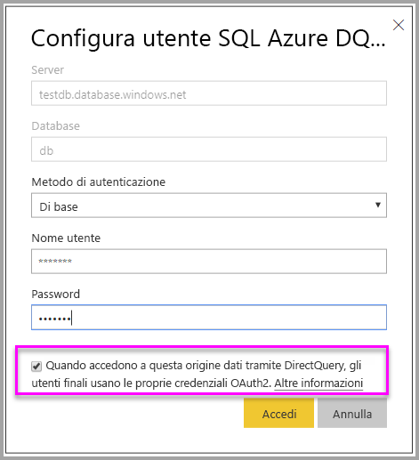

### <a name="token-based-identity-sdk-additions"></a>Aggiunte dell'SDK per l'identità basata su token

La proprietà IdentityBlob è stata aggiunta all'identità effettiva nello scenario di generazione del token.

```JSON
[JsonProperty(PropertyName = "identityBlob")]
public IdentityBlob IdentityBlob { get; set; }
```

Il tipo IdentityBlob è una struttura JSON semplice che contiene una proprietà stringa di valore

```JSON
[JsonProperty(PropertyName = "value")]
public string value { get; set; }
```

EffectiveIdentity può essere creata con IdentityBlob usando la chiamata seguente:

```C#
public EffectiveIdentity(string username, IList<string> datasets, IList<string> roles = null, string customData = null, IdentityBlob identityBlob = null);
```

La proprietà IdentityBlob può essere creata tramite la chiamata seguente.

```C#
public IdentityBlob(string value);
```

### <a name="token-based-identity-rest-api-usage"></a>Utilizzo dell'API REST per l'identità basata su token

Se si chiama l'[API REST](https://docs.microsoft.com/rest/api/power-bi/embedtoken/reports_generatetoken#definitions), è possibile aggiungere BLOB di identità all'interno di ogni identità.

```JSON
{
    "accessLevel": "View",
    "identities": [
        {
            "datasets": ["fe0a1aeb-f6a4-4b27-a2d3-b5df3bb28bdc"],
        “identityBlob”: {
            “value”: “eyJ0eXAiOiJKV1QiLCJh….”
         }
        }
    ]
}
```

Il valore specificato nel BLOB di identità deve essere un token di accesso valido per SQL Server di Azure (con un URL di risorsa (<https://database.windows.net/>).

   > [!Note]
   > Per poter creare un token di accesso per SQL di Azure, l'applicazione deve avere autorizzazioni delegate per l'**accesso a database SQL di Azure e ad Azure Data Warehouse** per l'API di **database SQL di Azure** nella configurazione di registrazione dell'app AAD nel portale di Azure.

   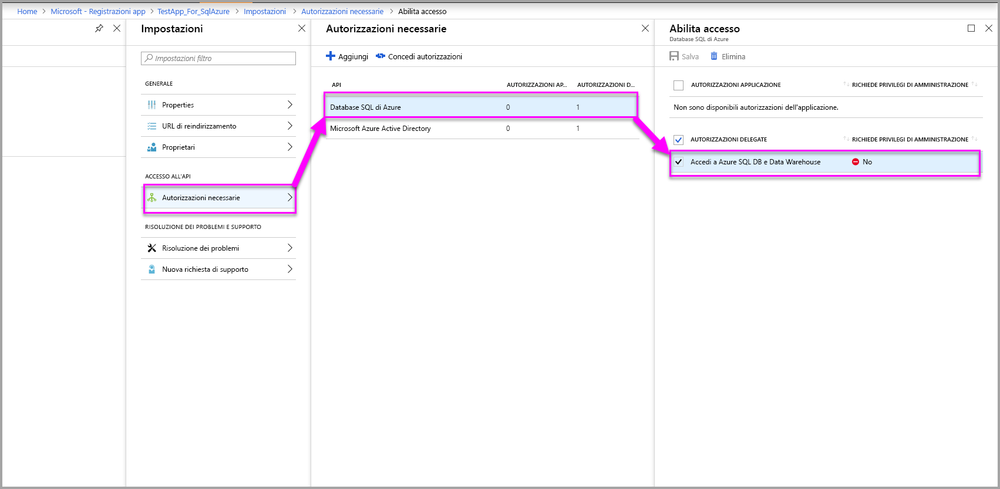

## <a name="on-premises-data-gateway-with-service-principal-preview"></a>Gateway dati locale con entità servizio (anteprima)

I clienti che configurano la sicurezza a livello di riga mediante un'origine dati con connessione dinamica locale SQL Server Analysis Services (SSAS) possono usare la nuova funzionalità [entità servizio](embed-service-principal.md) per la gestione degli utenti e del loro accesso ai dati in SSAS, nel contesto dell'integrazione con **Power BI Embedded**.

Usando le [API REST di Power BI](https://docs.microsoft.com/rest/api/power-bi/) è possibile specificare l'identità effettiva per le connessioni dinamiche locali SSAS per un token di incorporamento usando un [oggetto entità servizio](https://docs.microsoft.com/azure/active-directory/develop/app-objects-and-service-principals#service-principal-object).

Fino ad ora, per la specifica dell'identità effettiva della connessione dinamica locale SSAS, l'utente master che generava il token di incorporamento doveva essere un amministratore del gateway. Ora non è più obbligatorio che l'utente sia un amministratore del gateway, e per contro l'amministratore del gateway può concedere all'utente autorizzazioni dedicate per l'origine dati specifica. In tal modo l'utente può eseguire l'override dell'identità effettiva durante la generazione del token di incorporamento. Questa nuova funzionalità consente l'incorporamento con l'entità servizio per una connessione dinamica SSAS.

Per abilitare questo scenario, l'amministratore del gateway usa l'[API REST Add Datasource User](https://docs.microsoft.com/rest/api/power-bi/gateways/adddatasourceuser) (Aggiungi utente origine dati) per garantire all'entità servizio l'autorizzazione *ReadOverrideEffectiveIdentity* per Power BI Embedded.

Non è possibile impostare questa autorizzazione tramite il portale di amministrazione. Questa autorizzazione può essere impostata solo tramite l'API. Nel portale di amministrazione viene visualizzata un'indicazione per utenti e SPN con queste autorizzazioni.

## <a name="considerations-and-limitations"></a>Considerazioni e limitazioni

* L'assegnazione di utenti ai ruoli, all'interno del servizio Power BI, non influisce sulla sicurezza a livello di riga quando si usa un token di incorporamento.
* Il servizio Power BI non applica l'impostazione di sicurezza a livello di riga agli amministratori o ai membri con autorizzazioni di modifica, ma quando si fornisce un'identità con un token di incorporamento, l'impostazione viene applicata ai dati.
* Sono supportate le connessioni dinamiche ad Analysis Services per i server locali.
* Le connessioni dinamiche di Azure Analysis Services supportano i filtri in base al ruolo. È possibile applicare filtri dinamici usando CustomData.
* Se il set di dati sottostante non richiede la sicurezza a livello di riga, la richiesta GenerateToken **non** deve contenere un'identità effettiva.
* Se il set di dati sottostante è un modello cloud (modello memorizzato nella cache o DirectQuery), l'identità effettiva deve includere almeno un ruolo; in caso contrario, l'assegnazione ruolo non viene eseguita.
* Un elenco di identità consente più token di identità per l'incorporamento del dashboard. Per tutti gli altri elementi l'elenco contiene una singola identità.

### <a name="token-based-identity-limitations-preview"></a>Limitazioni per l'identità basata su token (anteprima)

* L'uso di questa funzionalità è limitato a Power BI Premium.
* Questa funzionalità non funziona con SQL Server in locale.
* Questa funzionalità non funziona con Multi-Geo.

Altre domande? [Provare a rivolgersi alla community di Power BI](https://community.powerbi.com/)
