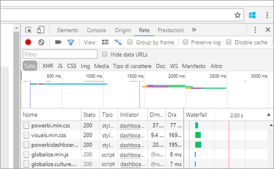

# <a name="troubleshooting-your-embedded-application"></a>Risoluzione dei problemi dell'applicazione incorporata

Questo articolo illustra alcuni problemi comuni che possono verificarsi quando si incorpora il contenuto da Power BI.

## <a name="tools-for-troubleshooting"></a>Strumenti per la risoluzione dei problemi

### <a name="fiddler-trace"></a>Traccia di Fiddler

[Fiddler](http://www.telerik.com/fiddler) è uno strumento gratuito di Telerik che monitora il traffico HTTP.  È possibile visualizzare il traffico in entrata e in uscita con le API Power BI dal computer client. Potrebbero essere illustrati errori e altre informazioni correlate.


### <a name="f12-in-browser-for-front-end-debugging"></a>F12 nel browser per il debug del front-end

F12 avvierà la finestra degli strumenti di sviluppo nel browser. Questo consentirà di osservare il traffico di rete e altre informazioni.



### <a name="extracting-error-details-from-power-bi-response"></a>Estrazione di dettagli dell'errore dalla risposta di Power BI

Questo frammento di codice mostra come estrarre i dettagli dell'errore dall'eccezione HTTP:

```
public static string GetExceptionText(this HttpOperationException exc)
{
    var errorText = string.Format("Request: {0}\r\nStatus: {1} ({2})\r\nResponse: {3}",
    exc.Request.Content, exc.Response.StatusCode, (int)exc.Response.StatusCode, exc.Response.Content);
    if (exc.Response.Headers.ContainsKey("RequestId"))
    {
        var requestId = exc.Response.Headers["RequestId"].FirstOrDefault();
        errorText += string.Format("\r\nRequestId: {0}", requestId);
    }

    return errorText;
}
```
È consigliabile registrare gli ID richiesta e i dettagli dell'errore per la risoluzione dei problemi.
Specificare l'ID richiesta quando si contatta il supporto tecnico Microsoft.

## <a name="app-registration"></a>Registrazione dell'app

**Errore di registrazione dell'app**

Messaggi di errore nel portale di Azure o nella pagina di registrazione dell'app di Power BI che indicano che i privilegi non sono sufficienti. Per registrare un'applicazione è necessario essere un amministratore nel tenant di Azure AD oppure è necessario che siano state abilitate le registrazioni delle applicazioni per gli utenti non amministratori.

**Il servizio Power BI non è visualizzato nel portale di Azure quando si registra una nuova app**

Almeno un utente deve aver effettuato l'iscrizione a Power BI. Se il **Servizio Power BI** non è visualizzato nell'elenco delle API, nessun utente ha effettuato l'iscrizione a Power BI.

## <a name="rest-api"></a>API REST

**Chiamata API che restituisce un errore con codice 401**

Potrebbe essere necessaria un'acquisizione Fiddler per ulteriori indagini. È possibile che manchi l'ambito di autorizzazioni necessarie per l'applicazione registrata in Azure AD. Verificare che l'ambito necessario sia presente nella registrazione dell'app per Azure AD nel portale di Azure.

**Chiamata API che restituisce un errore con codice 403**

Potrebbe essere necessaria un'acquisizione Fiddler per ulteriori indagini. Le cause possibili per un errore con codice 403 sono più di una.

* Il token di autenticazione di Azure AD è scaduto.
* L'utente autenticato non è un membro del gruppo (area di lavoro dell'app).
* L'utente autenticato non è un amministratore del gruppo (area di lavoro dell'app).
* L'intestazione dell'autorizzazione potrebbe non essere corretta. Assicurarsi che non siano presenti errori di ortografia.

Il back-end dell'applicazione potrebbe dover aggiornare il token di autenticazione prima di chiamare GenerateToken.

```
    GET https://wabi-us-north-central-redirect.analysis.windows.net/metadata/cluster HTTP/1.1
    Host: wabi-us-north-central-redirect.analysis.windows.net
    ...
    Authorization: Bearer eyJ0eXAiOi...
    ...
 
    HTTP/1.1 403 Forbidden
    ...
     
    {"error":{"code":"TokenExpired","message":"Access token has expired, resubmit with a new access token"}}
```

**Si verifica un errore del metodo GenerateToken quando viene specificata l'identità effettiva**

Le cause di un errore del metodo GenerateToken quando viene specificata l'identità effettiva possono essere diverse.

* Il set di dati non supporta l'identità effettiva
* Il nome utente non è stato specificato
* Il ruolo non è stato specificato
* L'ID del set di dati non è stato specificato
* L'utente non dispone delle autorizzazioni corrette

Per verificare qual è la causa, seguire questa procedura.

* Eseguire l'operazione [get dataset](https://msdn.microsoft.com/library/mt784653.aspx). La proprietà IsEffectiveIdentityRequired è impostata su true?
* Il nome utente è obbligatorio per qualsiasi identità effettiva.
* Se la proprietà IsEffectiveIdentityRolesRequired è impostata su true, il ruolo è obbligatorio.
* L'ID del set di dati è obbligatorio per qualsiasi identità effettiva.
* Per Analysis Services, l'utente master deve essere un amministratore del gateway.

## <a name="data-sources"></a>Origini dati

**L'ISV vuole avere diverse credenziali per la stessa origine dati**

Un'origine dati può avere un solo set di credenziali per un utente master. Se sono necessarie credenziali diverse, creare altri utenti master. Quindi, assegnare le diverse credenziali in ogni contesto degli utenti master e incorporarle usando il token di Azure AD per l'utente corrispondente.

## <a name="content-rendering"></a>Rendering del contenuto

**Il rendering, o utilizzo, del contenuto incorporato non riesce o raggiunge il timeout**

Assicurarsi che il token di incorporamento non sia scaduto. Assicurarsi di controllare la scadenza del token di incorporamento e di aggiornarlo. Per altre informazioni, vedere come [aggiornare il token tramite JavaScript SDK](https://github.com/Microsoft/PowerBI-JavaScript/wiki/Refresh-token-using-JavaScript-SDK-example).

**Il report o il dashboard non viene caricato**

Se l'utente non visualizza il report o il dashboard, assicurarsi che il report o il dashboard venga caricato correttamente in powerbi.com. Se il caricamento non riesce in powebi.com, il report o il dashboard non funzionerà nell'applicazione.

**Le prestazioni del report o del dashboard risultano rallentate**

Aprire il file in Power BI Desktop o in powerbi.com e verificare che le prestazioni siano accettabili per escludere problemi con l'applicazione o con le API di incorporamento.


Per le risposte alle domande frequenti, vedere le [Domande frequenti su Power BI Embedded](embedded-faq.md).

Altre domande? [Provare la community di Power BI](http://community.powerbi.com/)
