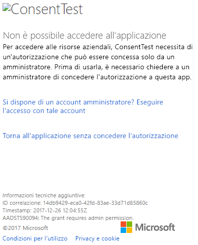
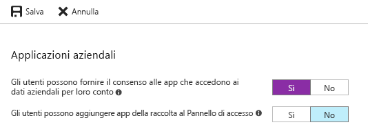

# <a name="troubleshoot-your-embedded-application"></a>Risolvere i problemi dell'applicazione incorporata

Questo articolo illustra alcuni problemi comuni che possono verificarsi quando si incorpora il contenuto da Power BI.

## <a name="tools-to-troubleshoot"></a>Strumenti per la risoluzione dei problemi

### <a name="fiddler-trace"></a>Traccia di Fiddler

[Fiddler](http://www.telerik.com/fiddler) è uno strumento gratuito di Telerik che monitora il traffico HTTP.  È possibile visualizzare il traffico con le API Power BI dal computer client. Questo strumento potrebbe visualizzare errori e altre informazioni correlate.


### <a name="f12-in-browser-for-front-end-debugging"></a>F12 nel browser per il debug del front-end

F12 avvia la finestra degli strumenti di sviluppo nel browser. Questo strumento offre la possibilità di visualizzare il traffico di rete e altre informazioni.


### <a name="extract-error-details-from-power-bi-response"></a>Estrarre i dettagli dell'errore dalla risposta di Power BI

Questo frammento di codice mostra come estrarre i dettagli dell'errore dall'eccezione HTTP:

```csharp
public static string GetExceptionText(this HttpOperationException exc)
{
    var errorText = string.Format("Request: {0}\r\nStatus: {1} ({2})\r\nResponse: {3}",
    exc.Request.Content, exc.Response.StatusCode, (int)exc.Response.StatusCode, exc.Response.Content);
    if (exc.Response.Headers.ContainsKey("RequestId"))
    {
        var requestId = exc.Response.Headers["RequestId"].FirstOrDefault();
        errorText += string.Format("\r\nRequestId: {0}", requestId);
    }

    return errorText;
}
```

È consigliabile registrare l'ID richiesta e i dettagli dell'errore per la risoluzione dei problemi.
Specificare l'ID richiesta quando si contatta il supporto tecnico Microsoft.

## <a name="app-registration"></a>Registrazione dell'app

### <a name="app-registration-failure"></a>Errore di registrazione dell'app

Messaggi di errore nel portale di Azure o nella pagina di registrazione dell'app di Power BI che indicano che i privilegi non sono sufficienti. Per registrare un'applicazione, è necessario essere un amministratore nel tenant di Azure AD oppure è necessario che siano state abilitate le registrazioni delle applicazioni per gli utenti non amministratori.

### <a name="power-bi-service-doesnt-appear-in-the-azure-portal-when-registering-a-new-app"></a>Il servizio Power BI non viene visualizzato nel portale di Azure quando si registra una nuova app

Almeno un utente deve aver effettuato l'iscrizione a Power BI. Se il **Servizio Power BI** non è visualizzato nell'elenco delle API, nessun utente ha effettuato l'iscrizione a Power BI.

## <a name="rest-api"></a>API REST

### <a name="api-call-returning-401"></a>Chiamata API che restituisce un errore con codice 401

Potrebbe essere necessaria un'acquisizione Fiddler per ulteriori indagini. È possibile che manchi l'ambito di autorizzazioni necessarie per l'applicazione registrata in Azure AD. Verificare che l'ambito necessario sia presente nella registrazione dell'app per Azure AD nel portale di Azure.

### <a name="api-call-returning-403"></a>Chiamata API che restituisce un errore con codice 403

Potrebbe essere necessaria un'acquisizione Fiddler per ulteriori indagini. Le cause possibili per un errore con codice 403 sono più di una.

* L'utente ha superato la quantità di token di incorporamento che può essere generata in una capacità condivisa. Acquistare capacità di Azure per generare token di incorporamento e assegnare l'area di lavoro a tale capacità. Vedere [Creare la capacità di Power BI Embedded nel portale di Azure](https://docs.microsoft.com/azure/power-bi-embedded/create-capacity).
* Il token di autenticazione di Azure AD è scaduto.
* L'utente autenticato non è un membro del gruppo (area di lavoro dell'app).
* L'utente autenticato non è un amministratore del gruppo (area di lavoro dell'app).
* L'intestazione dell'autorizzazione potrebbe non essere corretta. Assicurarsi che non siano presenti errori di ortografia.

Il back-end dell'applicazione potrebbe dover aggiornare il token di autenticazione prima di chiamare GenerateToken.

    ```
    GET https://wabi-us-north-central-redirect.analysis.windows.net/metadata/cluster HTTP/1.1
    Host: wabi-us-north-central-redirect.analysis.windows.net
    ...
    Authorization: Bearer eyJ0eXAiOi...
    ...

    HTTP/1.1 403 Forbidden
    ...

    {"error":{"code":"TokenExpired","message":"Access token has expired, resubmit with a new access token"}}
    ```

## <a name="authentication"></a>Autenticazione

### <a name="authentication-failed-with-aadsts90002-tenant-authorize-not-found"></a>Autenticazione non riuscita. Errore: AADSTS90002: Il tenant 'authorize' non è stato trovato

 Se al momento dell'accesso si ricevono messaggi come ***error: invalid_request, error_description: AADSTS90002: Il tenant 'authorize' non è stato trovato***, questo accade perché ADAL 4.x non supporta "https://login.microsoftonline.com/{Tenant}/oauth2/authorize/" come un URL dell'autorità.
 
Per risolvere questo problema è necessario tagliare "oauth2/authorize/" alla fine dell'URL dell'autorità. Per informazioni, vedere [Esempi di Power BI Developer](https://github.com/Microsoft/PowerBI-Developer-Samples).

 Vedere [Better Authority validation](https://github.com/AzureAD/azure-activedirectory-library-for-dotnet/wiki/Changes-adalnet-4.0#better-authority-validation) (Miglioramento della convalida di autorità) nelle note di rilascio di ADAL 4.x.

### <a name="authentication-failed-with-aadsts70002-or-aadsts50053"></a>Autenticazione non riuscita con AADSTS70002 o AADSTS50053

**_(AADSTS70002: Errore durante la convalida delle credenziali. AADSTS50053: Si è tentato di accedere troppe volte con un ID utente o una password non corretti)_**

Se si usa Power BI Embedded con l'autenticazione diretta di Azure AD e si ricevono messaggi in fase di accesso, ad esempio ***error:unauthorized_client, error_description:AADSTS70002: Errore durante la convalida delle credenziali. AADSTS50053: Si è tentato di accedere troppe volte con una password o un account non corretto***, significa che l'autenticazione diretta non è più in uso a partire dal 14 giugno 2018 per impostazione predefinita.

Esiste un modo per riattivare la funzionalità usando [criteri di Azure AD](https://docs.microsoft.com/azure/active-directory/manage-apps/configure-authentication-for-federated-users-portal#enable-direct-authentication-for-legacy-applications) con l'organizzazione o un'[entità servizio](https://docs.microsoft.com/azure/active-directory/develop/active-directory-application-objects#service-principal-object) come ambito.

È consigliabile abilitare questo criterio solo per singole app.

Per creare questo criterio, è necessario essere un **amministratore globale** per la directory in cui si crea e si assegna il criterio. Ecco un esempio di script per la creazione del criterio e la sua assegnazione alla stored procedure per questa applicazione:

1. Installare il [modulo PowerShell dell'anteprima di Azure AD](https://docs.microsoft.com/powershell/azure/active-directory/install-adv2?view=azureadps-2.0).

2. Eseguire i seguenti comandi di PowerShell riga per riga assicurandosi che la variabile $sp non abbia più di un'applicazione come risultato.

```powershell
Connect-AzureAD
```

```powershell
$sp = Get-AzureADServicePrincipal -SearchString "Name_Of_Application"
```

```powershell
$policy = New-AzureADPolicy -Definition @("{`"HomeRealmDiscoveryPolicy`":{`"AllowCloudPasswordValidation`":true}}") -DisplayName EnableDirectAuth -Type HomeRealmDiscoveryPolicy -IsOrganizationDefault $false
```

```powershell
Add-AzureADServicePrincipalPolicy -Id $sp.ObjectId -RefObjectId $policy.Id 
```

Dopo aver assegnato i criteri, attendere circa 15-20 secondi per la propagazione prima di avviare il test.

### <a name="generate-token-fails-when-providing-effective-identity"></a>Si verifica un errore del metodo GenerateToken quando viene specificata l'identità effettiva

Le cause di un errore del metodo GenerateToken quando viene specificata l'identità effettiva possono essere diverse.

* Il set di dati non supporta l'identità effettiva
* Il nome utente non è stato specificato
* Il ruolo non è stato specificato
* L'ID del set di dati non è stato specificato
* L'utente non dispone delle autorizzazioni corrette

Per verificare qual è la causa, seguire questa procedura.

* Eseguire [get dataset](https://docs.microsoft.com/rest/api/power-bi/datasets). La proprietà IsEffectiveIdentityRequired è impostata su true?
* Il nome utente è obbligatorio per qualsiasi identità effettiva.
* Se la proprietà IsEffectiveIdentityRolesRequired è impostata su true, il ruolo è obbligatorio.
* L'ID del set di dati è obbligatorio per qualsiasi identità effettiva.
* Per Analysis Services, l'utente master deve essere un amministratore del gateway.

### <a name="aadsts90094-the-grant-requires-admin-permission"></a>AADSTS90094: The grant requires admin permission (La concessione richiede l'autorizzazione di amministratore)

**_Sintomi:_**<br>
Quando un utente non amministratore tenta di accedere a un'applicazione per la prima volta e di concedere l'autorizzazione, si verifica uno degli errori seguenti:

* Per accedere alle risorse aziendali, ConsentTest necessita di un'autorizzazione che può essere concessa solo da un amministratore. Prima di usarla, è necessario chiedere a un amministratore di concedere l'autorizzazione a questa app.
* AADSTS90094: The grant requires admin permission.

    

Un utente amministratore può accedere e concedere l'autorizzazione correttamente.

**_Causa principale:_**<br>
Il consenso dell'utente è disabilitato per il tenant.

**_Sono possibili diverse correzioni:_**

*Abilitare il consenso dell'utente per l'intero tenant (tutti gli utenti, tutte le applicazioni)*

1. Nel portale di Azure passare ad "Azure Active Directory" = > "Utenti e gruppi" = > "Impostazioni utente"
2. Abilitare l'impostazione "Gli utenti possono fornire il consenso alle app che accedono ai dati aziendali per loro conto" e salvare le modifiche

    

*Concessione delle autorizzazioni* da parte di un amministratore per l'applicazione, per l'intero tenant o un utente specifico.

## <a name="data-sources"></a>Origini dati

### <a name="isv-wants-to-have-different-credentials-for-the-same-data-source"></a>L'ISV vuole avere diverse credenziali per la stessa origine dati

Un'origine dati può avere un solo set di credenziali per un utente master. Se sono necessarie credenziali diverse, creare altri utenti master. Quindi, assegnare le diverse credenziali in ogni contesto degli utenti master e incorporarle usando il token di Azure AD per l'utente corrispondente.

## <a name="troubleshoot-your-embedded-application-with-the-ierror-object"></a>Risolvere i problemi dell'applicazione incorporata con l'oggetto IError

Usare l'[**oggetto IError** restituito dall'evento *error* da **JavaScript SDK**](https://github.com/Microsoft/PowerBI-JavaScript/wiki/Troubleshooting-and-debugging-of-embedded-parts) per eseguire il debug dell'applicazione e capire meglio la causa degli errori.

Dopo aver acquisito l'oggetto IError, vedere la tabella degli errori comuni appropriata corrispondente al tipo di incorporamento in uso. Confrontare le **proprietà IError** con quelle nella tabella e individuare i possibili motivi dell'errore.

### <a name="typical-errors-when-embedding-for-power-bi-users"></a>Errori tipici durante l'incorporamento per utenti di Power BI

| Messaggio | Messaggio dettagliato | Codice di errore | Cause possibili |
|-------------------------------------------------------|-----------------------------------------------------------------------------------------------------------------------------|-----------|--------------------------------------------------------|
| TokenExpired | Il token di accesso è scaduto, inviare di nuovo con un nuovo token di accesso | 403 | Token scaduto  |
| PowerBIEntityNotFound | Recupero del report non riuscito | 404 | <li> ID del report errato <li> Il report non esiste  |
| Parametri non validi | parametro powerbiToken non specificato | N/D | <li> Nessun token di accesso fornito <li> Nessun ID di report fornito |
| LoadReportFailed | Impossibile inizializzare: non è stato possibile risolvere il cluster | 403 | * Token di accesso non corretto * Il tipo di incorporamento non corrisponde al tipo di token |
| PowerBINotAuthorizedException | Recupero del report non riuscito | 401 | <li> ID del gruppo errato <li> Gruppo non autorizzato |
| TokenExpired | Il token di accesso è scaduto, inviare di nuovo con un nuovo token di accesso. Non è stato possibile eseguire il rendering di un oggetto visivo del report con titolo: <visual title> | N/D | Token scaduto dati query |
| OpenConnectionError | Non è possibile visualizzare l'oggetto visivo. Non è stato possibile eseguire il rendering di un oggetto visivo del report con titolo: <visual title> | N/D | Capacità in pausa o eliminata mentre un report correlato alla capacità era aperto in una sessione |
| ExplorationContainer_FailedToLoadModel_DefaultDetails | Non è stato possibile caricare lo schema del modello associato a questo report. Assicurarsi di avere una connessione al server e riprovare. | N/D | <li> Capacità in pausa <li> Capacità eliminata |

### <a name="typical-errors-when-embedding-for-non-power-bi-users-using-an-embed-token"></a>Errori tipici quando si esegue l'incorporamento per utenti esterni a Power BI (usando un token di incorporamento)

| Messaggio | Messaggio dettagliato | Codice di errore | Motivi |
|-------------------------------------------------------|-------------------------------------------------------------------------------------------------------------------------------|------------|-------------------------------------------------|
| TokenExpired | Il token di accesso è scaduto, inviare di nuovo con un nuovo token di accesso | 403 | Token scaduto  |
| LoadReportFailed | Recupero del report non riuscito | 404 | <li> ID del report errato <li> Il report non esiste  |
| LoadReportFailed | Recupero del report non riuscito | 403 | L'ID del report non corrisponde al token |
| LoadReportFailed | Recupero del report non riuscito | 500 | L'ID del report specificato non è un GUID |
| Parametri non validi | parametro powerbiToken non specificato | N/D | <li> Nessun token di accesso fornito <li> Nessun ID di report fornito |
| LoadReportFailed | Impossibile inizializzare: non è stato possibile risolvere il cluster | 403 | Tipo di token non corretto, token non valido |
| PowerBINotAuthorizedException | Recupero del report non riuscito | 401 | ID del gruppo errato/non autorizzato |
| TokenExpired | Il token di accesso è scaduto, inviare di nuovo con un nuovo token di accesso. Non è stato possibile eseguire il rendering di un oggetto visivo del report con titolo: <visual title> | N/D | Token scaduto dati query |
| OpenConnectionError | Non è possibile visualizzare l'oggetto visivo. Non è stato possibile eseguire il rendering di un oggetto visivo del report con titolo: <visual title> | N/D | Capacità in pausa o eliminata mentre un report correlato alla capacità era aperto in una sessione |
| ExplorationContainer_FailedToLoadModel_DefaultDetails | Non è stato possibile caricare lo schema del modello associato a questo report. Assicurarsi di avere una connessione al server e riprovare. | N/D | <li> Capacità in pausa <li> Capacità eliminata |

## <a name="content-rendering"></a>Rendering del contenuto

### <a name="performance"></a>Prestazioni

[Prestazioni di Power BI Embedded](embedded-performance-best-practices.md)

### <a name="rendering-or-consumption-of-embedded-content-fails-or-times-out"></a>Il rendering, o utilizzo, del contenuto incorporato non riesce o raggiunge il timeout

Assicurarsi che il token di incorporamento non sia scaduto. Assicurarsi di controllare la scadenza del token di incorporamento e di aggiornarlo. Per altre informazioni, vedere come [aggiornare il token tramite JavaScript SDK](https://github.com/Microsoft/PowerBI-JavaScript/wiki/Refresh-token-using-JavaScript-SDK-example).

### <a name="report-or-dashboard-doesnt-load"></a>Il report o il dashboard non viene caricato

Se l'utente non visualizza il report o il dashboard, assicurarsi che il report o il dashboard venga caricato correttamente in powerbi.com. Se il caricamento non riesce in powerbi.com, il report o il dashboard non funziona nell'applicazione.

### <a name="report-or-dashboard-is-performing-slowly"></a>Le prestazioni del report o del dashboard risultano rallentate

Aprire il file in Power BI Desktop o in powerbi.com e verificare che le prestazioni siano accettabili per escludere problemi con l'applicazione o con le API di incorporamento.

## <a name="embed-setup-tool"></a>Strumento di installazione dell'incorporamento

È possibile usare lo [strumento di installazione dell'incorporamento](https://aka.ms/embedsetup) per scaricare rapidamente un'applicazione di esempio. confrontando quindi l'applicazione e l'esempio.

### <a name="prerequisites"></a>Prerequisiti

Prima di usare lo strumento di installazione dell'incorporamento, verificare di avere tutti i prerequisiti appropriati. Sono necessari un account **Power BI Pro** e una sottoscrizione di **Microsoft Azure**.

* Se non si è ancora iscritti a **Power BI Pro**, [iscriversi per ottenere una versione di prova gratuita](https://powerbi.microsoft.com/pricing/) prima di iniziare.
* Se non si ha una sottoscrizione di Azure, [creare un account gratuito](https://azure.microsoft.com/free/?WT.mc_id=A261C142F) prima di iniziare.
* È necessario disporre del proprio [tenant di Azure Active Directory](create-an-azure-active-directory-tenant.md) configurato.
* È richiesta l'installazione di [Visual Studio](https://www.visualstudio.com/) (versione 2013 o successive).

### <a name="common-issues"></a>Problemi comuni

Ecco alcuni problemi comuni che possono verificarsi durante il test con lo strumento di installazione dell'incorporamento:

#### <a name="using-the-embed-for-your-customers-sample-application"></a>Uso dell'incorporamento per l'applicazione di esempio per i clienti

Se si usa l'esperienza **Incorporare per i clienti**, salvare e decomprimere il file *PowerBI-Developer-Samples.zip*. Aprire quindi la cartella *PowerBI-Developer-Samples-master\App Owns Data* ed eseguire il file *PowerBIEmbedded_AppOwnsData.sln*.

Quando si seleziona **Concedi autorizzazioni** (passaggio Concedi autorizzazioni), viene visualizzato l'errore seguente:

    AADSTS70001: Application with identifier <client ID> wasn't found in the directory <directory ID>

La soluzione sta per chiudere la finestra popup, attendere qualche secondo e riprovare. Può essere necessario ripetere l'azione più volte. Il problema tra il completamento del processo di registrazione dell'applicazione e il momento in cui l'applicazione è disponibile per le API esterne è causato da un intervallo di tempo.

Quando si esegue l'app di esempio, viene visualizzato il messaggio di errore seguente:

    Password is empty. Please fill password of Power BI username in web.config.

Questo errore si verifica perché l'unico valore che non viene inserito nell'applicazione di esempio è la password dell'utente. Aprire il file Web.config nella soluzione e compilare il campo pbiPassword con la password dell'utente.

Se viene visualizzato l'errore AADSTS50079: è necessario che l'utente usi l'autenticazione a più fattori.

    Need to use an AAD account that doesn't have MFA enabled.

#### <a name="using-the-embed-for-your-organization-sample-application"></a>Uso dell'incorporamento per l'applicazione di esempio per l'organizzazione

Se si usa l'esperienza **Incorporare per l'organizzazione**, salvare e decomprimere il file *PowerBI-Developer-Samples.zip*. Aprire quindi la cartella *PowerBI-Developer-Samples-master\User Owns Data\integrate-report-web-app* ed eseguire il file *pbi-saas-embed-report.sln*.

Quando si esegue l'app di esempio **Incorporare per l'organizzazione**, viene visualizzato l'errore seguente:

    AADSTS50011: The reply URL specified in the request doesn't match the reply URLs configured for the application: <client ID>

L'errore si verifica perché l'URL di reindirizzamento specificato per il server Web dell'applicazione è diverso dall'URL dell'esempio. Se si vuole registrare l'applicazione di esempio, usare `http://localhost:13526/` come URL di reindirizzamento.

Se si vuole modificare l'applicazione registrata, vedere le istruzioni per la modifica dell'[applicazione registrata con AAD ](https://docs.microsoft.com/azure/active-directory/develop/active-directory-integrating-applications#updating-an-application), in modo che l'applicazione possa consentire l'accesso alle API Web.

Se vuole modificare il profilo utente o i dati di Power BI, vedere come modificare i [dati di Power BI](https://docs.microsoft.com/power-bi/service-basic-concepts).

Se viene visualizzato l'errore AADSTS50079: è necessario che l'utente usi l'autenticazione a più fattori.

    Need to use an AAD account that doesn't have MFA enabled.

Per altre informazioni, vedere [Power BI Embedded FAQ](embedded-faq.md) (Domande frequenti su Power BI Embedded).

Altre domande? [Provare la community di Power BI](http://community.powerbi.com/)

Se è necessaria ulteriore assistenza, [contattare il supporto tecnico](https://powerbi.microsoft.com/support/pro/?Type=documentation&q=power+bi+embedded) oppure [creare un ticket di supporto dal portale di Azure](https://ms.portal.azure.com/#blade/Microsoft_Azure_Support/HelpAndSupportBlade/newsupportrequest) e specificare i messaggi di errore riscontrati.

## <a name="next-steps"></a>Passaggi successivi

Per altre informazioni, vedere [Domande frequenti](embedded-faq.md).

Altre domande? [Provare la community di Power BI](http://community.powerbi.com/)
