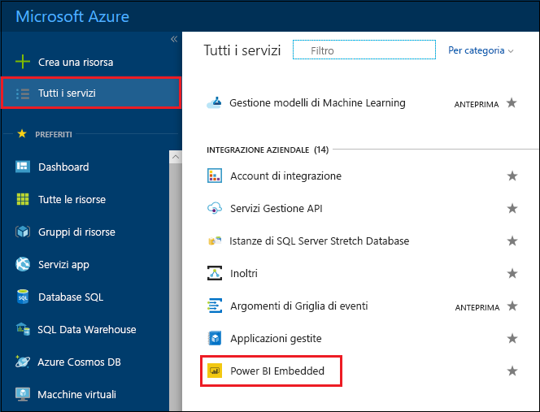
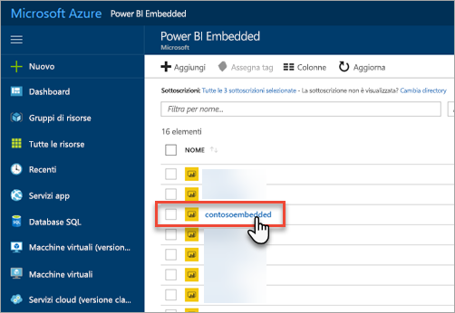
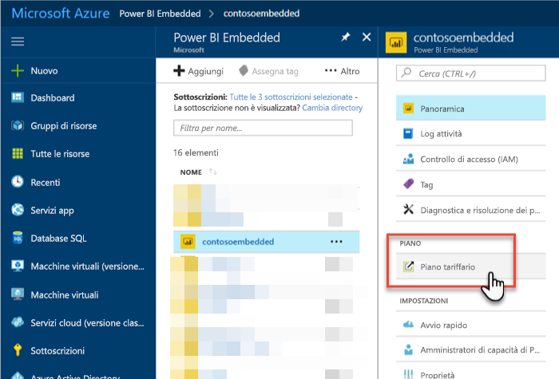
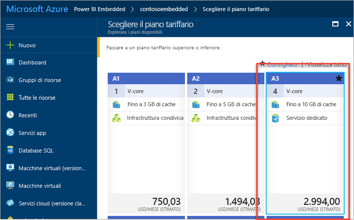
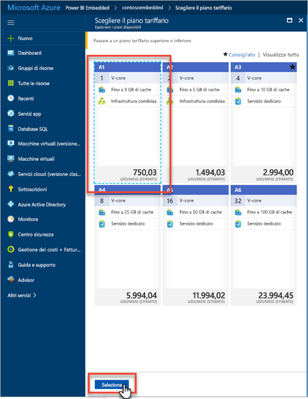
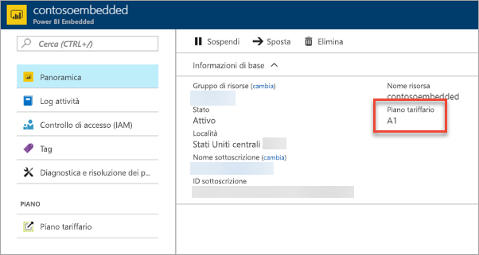

# Ridimensionare la capacità di Power BI Embedded nel portale di Azure

Questo articolo descrive in dettaglio come ridimensionare capacità di Power BI Embedded in Microsoft Azure. Il ridimensionamento consente di aumentare o ridurre le dimensioni della capacità.

Questa operazione presuppone che sia stata creata capacità di Power BI Embedded. Se non è stata creata alcuna capacità, vedere [Creare capacità di Power BI Embedded nel portale di Azure](azure-pbie-create-capacity.md).

> [!NOTE]
> Un'operazione di ridimensionamento può richiedere circa un minuto. Durante questo periodo, la capacità non è disponibile e il caricamento di contenuto incorporato potrebbe non riuscire.

## Ridimensionare una capacità

1. Accedere al [portale di Azure](https://portal.azure.com/).

2. Per visualizzare le capacità, selezionare **Tutti i servizi** > **Power BI Embedded**.

    

3. Selezionare la capacità che si vuole ridimensionare.

    

4. Selezionare **Piano tariffario** in **Scala** all'interno della capacità.

    

    Il piano tariffario corrente è evidenziato da un bordo azzurro.

    

5. Per ridimensionare verso l'alto o verso il basso, selezionare il nuovo piano a cui passare. Se si seleziona un nuovo piano, attorno alla selezione viene visualizzato un bordo azzurro tratteggiato. Selezionare **Seleziona** per eseguire il ridimensionamento al nuovo piano.

    

    Il ridimensionamento della capacità potrebbe richiedere uno o due minuti.

6. Verificare il piano tramite la scheda Panoramica. È visualizzato il piano tariffario corrente.

    

## Passaggi successivi

Per sospendere o avviare la capacità, vedere [Sospendere e avviare la capacità di Power BI Embedded nel portale di Azure](azure-pbie-pause-start.md).

Per iniziare a incorporare contenuto di Power BI all'interno dell'applicazione, vedere [Come incorporare dashboard, report e riquadri di Power BI](https://powerbi.microsoft.com/documentation/powerbi-developer-embedding-content/).

Altre domande? [Provare a rivolgersi alla community di Power BI](https://community.powerbi.com/)
