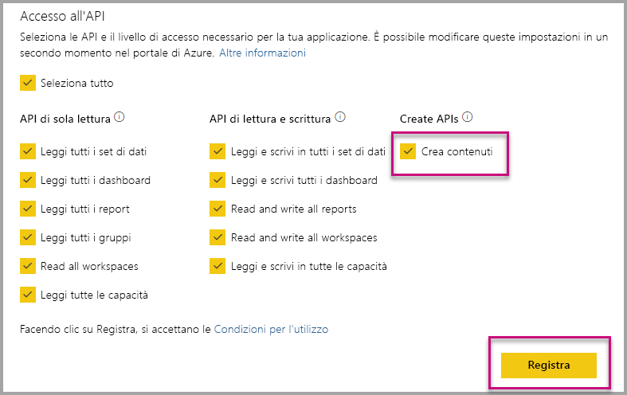

# Installare automaticamente le app di Power BI durante l'incorporamento per l'organizzazione

Per incorporare contenuto da un'app, l'utente che si occupa dell'incorporamento deve disporre di [accesso all'app](../../service-create-distribute-apps.md). Se l'app viene installata per l'utente, l'incorporamento viene eseguito correttamente. Per altre informazioni, vedere [Incorporare report o dashboard da app](embed-from-apps.md). È possibile definire in PowerBI.com che tutte le app devono essere [installate automaticamente](https://powerbi.microsoft.com/blog/automatically-install-apps/). Tuttavia, questa azione viene eseguita a livello del tenant e si applica a tutte le app.

## Installare automaticamente un'app durante l'incorporamento

Se un utente ha accesso a un'app, ma l'app non è installata, l'incorporamento ha esito negativo. Per evitare questi errori durante l'incorporamento di un'app, è possibile consentire l'installazione automatica dell'app al momento dell'incorporamento. Questa azione significa che se l'app che l'utente tenta di incorporare non è installata, l'installazione avviene automaticamente. Pertanto, il contenuto desiderato viene incorporato immediatamente garantendo un'esperienza soddisfacente per l'utente.

## Incorporare per gli utenti di Power BI (i dati sono di proprietà dell'utente)

Per consentire l'installazione automatica delle app per gli utenti, è necessario concedere all'applicazione l'autorizzazione "Create content" in fase di [registrazione dell'applicazione](register-app.md#register-with-the-power-bi-application-registration-tool) o di aggiungerla, se l'app è già registrata.

Successivamente, è necessario specificare l'ID app nell'URL di incorporamento. Per fornire l'ID app, l'autore dell'app deve prima di tutto installare l'app, quindi usare una delle chiamate [API REST di Power BI](https://docs.microsoft.com/rest/api/power-bi/) supportate: [Get Reports](https://docs.microsoft.com/rest/api/power-bi/reports/getreports) oppure [Get Dashboards](https://docs.microsoft.com/rest/api/power-bi/dashboards/getdashboards). Quindi l'autore dell'app deve prelevare l'URL di incorporamento dalla risposta dell'API REST. L'ID app viene visualizzato nell'URL se il contenuto proviene da un'app.  Una volta che si dispone dell'URL di incorporamento, è possibile usarlo per incorporare regolarmente.

## Incorporamento sicuro

Per usare l'installazione automatica delle applicazioni, l'autore dell'app deve prima di tutto installare l'app, quindi passare all'app in PowerBI.com, passare al report e ottenere il collegamento nel modo consueto. Tutti gli altri utenti con accesso all'app che possono usare il collegamento possono incorporare il report.

## Considerazioni e limitazioni

* Per questo scenario è possibile incorporare solo report e dashboard.

* Questa funzionalità non è attualmente supportata per gli scenari in cui i dati sono di proprietà dell'app e per l'incorporamento in SharePoint.