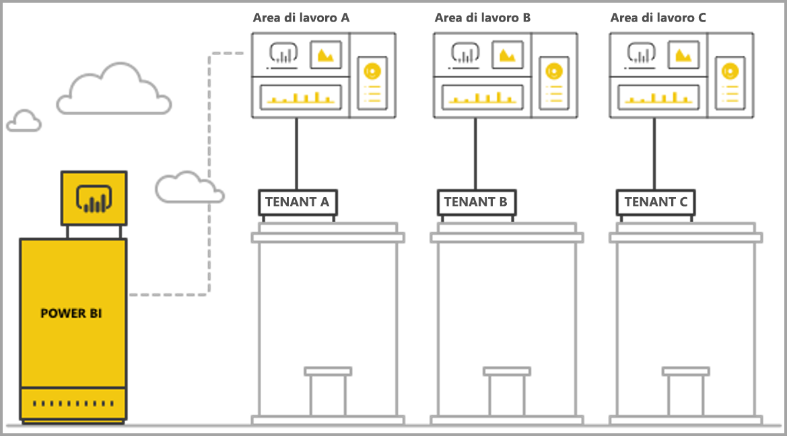
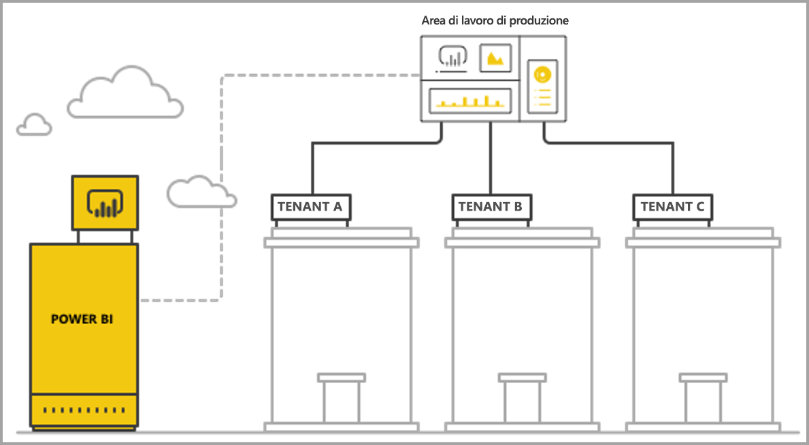

# Gestire il multi-tenancy con le funzionalità di analisi incorporata di Power BI

Quando si progetta un'applicazione SaaS multi-tenant, è necessario scegliere con attenzione il modello di tenancy più adatto alle esigenze dell'applicazione SaaS. Questo processo è valido anche per Power BI come parte che gestisce l'analisi incorporata di un'applicazione SaaS. Un modello di tenancy determina la modalità di mapping e gestione dei dati di ogni tenant all'interno di Power BI e dell'account di archiviazione. Il modello di tenancy influisce sulla progettazione e la gestione delle applicazioni. Il passaggio a un modello diverso in un secondo momento può diventare costoso e causare disservizi.

Con Power BI Embedded, esistono due principali approcci fondamentali per mantenere la separazione tra i tenant.

   1. **Isolamento basato sull'area di lavoro** con la creazione di un'area di lavoro di Power BI separata per ogni tenant.
   2. **Isolamento basato sulla sicurezza a livello di riga** in cui i dati sottostanti vengono usati per controllare e gestire l'accesso ai dati per ogni utente o gruppo.

Questo articolo descrive i diversi approcci e li analizza in base a diversi criteri di valutazione.

## Concetti e terminologia

**[AAD](https://docs.microsoft.com/azure/active-directory/fundamentals/active-directory-whatis)** - Azure Active Directory.

**Applicazione AAD** -Identità di applicazione in AAD. Per l'autenticazione è richiesta un'applicazione AAD.

**Applicazione SaaS (Software-as-a-Service)** - Sistema implementato da un'organizzazione o un ISV che in genere è un servizio online. Anche i sistemi software correlati per la gestione di più tenant (organizzazioni) dei clienti. In questo articolo **l'applicazione SaaS usa Power BI Embedded per fornire servizi di analisi ai diversi tenant**. Power BI Embedded può essere usato anche per tutti i tipi di applicazioni quando dispongono di una connessione online.

**Tenant** - Singolo cliente (organizzazione) che usa l'applicazione SaaS ed eventuali risorse o dati inseriti dal cliente nell'applicazione SaaS.

**[Power BI](../../fundamentals/power-bi-overview.md)** - Servizio cloud di Power BI che funge da piattaforma per Power BI Embedded.

**Tenant di Power BI** - Set di risorse di Power BI associato a un singolo tenant AAD.

**[Area di lavoro di Power BI](../../service-create-workspaces.md)** - Contenitore per il contenuto in Power BI.

**Artefatti di Power BI** - Esistono diversi artefatti di Power BI nelle aree di lavoro di Power BI, ad esempio dashboard, report, set di dati e flussi di dati.

**[Power BI Embedded](azure-pbie-what-is-power-bi-embedded.md)** - Set di API pubbliche che consentono agli sviluppatori di creare applicazioni per gestire il contenuto di Power BI e incorporare gli elementi di Power BI.

**[Sicurezza a livello di riga](embedded-row-level-security.md)** - Offre la possibilità di controllare l'accesso utente ai dati per le singole righe in una tabella. È possibile implementare la sicurezza a livello di riga a livello di origine dati o nel modello semantico di Power BI.

**Utente master** - Identità che rappresenta l'applicazione SaaS di Power BI e usata dall'applicazione SaaS per le chiamate alle API di Power BI. Deve essere un utente AAD con una licenza di Power BI Pro.

**Utente dell'applicazione AAD (entità servizio)**  - Identità che rappresenta l'applicazione SaaS di Power BI e usata dall'applicazione SaaS per le chiamate alle API di Power BI. Deve essere un'applicazione Web AAD. Può sostituire l'uso di un utente *master* per l'autenticazione con Power BI.

**Capacità** - Set di risorse dedicate all'esecuzione del servizio Power BI. [Capacità Premium di Power BI](../../service-premium-what-is.md) - Destinate alle aziende di grandi dimensioni che usano Power BI internamente, mentre le [capacità di Power BI Embedded](azure-pbie-create-capacity.md) sono destinate agli sviluppatori per lo sviluppo di applicazioni SaaS per terze parti.

**[Licenza di Power BI Pro](../../service-admin-purchasing-power-bi-pro.md)** : licenza per utente che concede i diritti per pubblicare contenuti nelle aree di lavoro, utilizzare le app senza capacità Premium, condividere i dashboard e sottoscrivere dashboard e report.

**[Modalità di connettività dati](../../desktop-directquery-about.md)** - Connessione a origini dati in Power BI che può essere stabilita in modalità diverse:

   * Importazione, ovvero il modo più comune per ottenere i dati.
   * DirectQuery, per la connessione diretta ai dati nel relativo repository di origine.
   * Connessione dinamica, ovvero un'altra modalità che prevede la connessione diretta a dati di Analysis Services (sia in Azure che in locale).

## Criteri di valutazione

La scelta ottimale del modello di tenancy appropriato per un'applicazione SaaS varia a seconda dei requisiti aziendali e tecnici specifici, dell'architettura dei dati e di altri aspetti. Una profonda comprensione di questi requisiti e delle opzioni disponibili per i modelli di tenancy, così come dei potenziali compromessi, può essere utile per definire un'architettura solida, efficiente, conveniente e scalabile per l'applicazione SaaS.

Le aree seguenti sono quelle di cui tenere conto per la scelta tra i diversi modelli di tenancy.

### Architettura dei dati

In genere, gli sviluppatori che creano applicazioni con Power BI Embedded hanno già a disposizione un database singolo o multi-tenant. È più facile usare un modello di tenancy per Power BI Embedded simile al modello di tenancy del database. Se il modello di tenancy del database non è ancora stato definito, è possibile prendere in considerazione altri aspetti prima di scegliere l'architettura dei dati.

### Isolamento dei dati

I dati archiviati sono sensibili? Qual è il livello di isolamento necessario per separare i tenant dei diversi clienti? La risposta potrebbe variare nei diversi settori o per clienti specifici con requisiti particolari.

### Scalabilità

Per trovare la soluzione ottimale, definire la scala che si prevede di raggiungere nel futuro. Tenere presente che una soluzione che potrebbe essere adatta nel presente, potrebbe risultare insufficiente con l'aumento dell'utilizzo e dei dati. Per l'analisi della scalabilità, tenere conto di quanto segue:

   * Numero di tenant (clienti).
   * Numero di report, dashboard e set di dati per ogni tenant.
   * Dimensioni dei dati in ogni set di dati e frequenza degli aggiornamenti.
   * Numero di utenti.
   * Numero di utenti simultanei nei periodi di picco.

Alcune applicazioni SaaS potrebbero avere un numero ridotto di clienti e un utilizzo limitato, ma grandi quantità di dati. Altre potrebbero avere molti clienti e un utilizzo elevato, ma una piccola quantità di dati e report per ogni cliente. Numeri elevati in una qualsiasi di queste situazioni possono influire sui costi e la complessità operativa futuri.

### Automazione e complessità operativa

Individuare i processi frequenti che devono essere automatizzati.

   * Qual è la frequenza di onboarding di nuovi tenant? Quali operazioni sono necessarie per completare l'onboarding di ognuno?
   * Qual è la frequenza di rilascio di contenuto di Power BI nuovo o aggiornato, che deve essere distribuito?
   * Quanti ruoli di sicurezza a livello di riga sono definiti per ogni tenant?  

L'identificazione di questi processi e della relativa modalità di gestione può essere utile per comprendere la complessità operativa per la manutenzione di ogni modello.

### Requisiti di residenza dei dati e necessità di supportare più aree geografiche

Power BI Embedded supporta la distribuzione in più aree geografiche (funzionalità di anteprima). La funzionalità [Multi-Geo](embedded-multi-geo.md) consente alle risorse di Power BI Embedded di essere distribuite in aree diverse con contenuto specifico assegnato ad aree specifiche. Questa funzionalità può essere usata in tutti i modelli, ma può influire sulla quantità di contenuto per la gestione e i costi. Attualmente la funzionalità Multi-Geo è progettata per soddisfare i requisiti di residenza dei dati e non migliora le prestazioni spostando i dati più vicino agli utenti.

### Costo

[Power BI Embedded](azure-pbie-what-is-power-bi-embedded.md) usa un modello di acquisto basato sulle risorse, come **Power BI Premium**. Si acquistano una o più capacità con memoria e potenza di elaborazione fisse. Questa capacità è l'elemento di costo principale quando si usa **Power BI Embedded**. Non sono previsti limiti al numero di utenti che usano la capacità. L'unico limite è rappresentato dalle prestazioni della capacità. È richiesta una [licenza di Power BI Pro](../../service-admin-licensing-organization.md) per ogni utente *master* o per utenti specifici che devono accedere al portale di Power BI.

È consigliabile testare e misurare il carico previsto per la capacità simulando l'ambiente e l'utilizzo reali ed eseguendo test di carico sulla capacità. È possibile misurare il carico e le prestazioni con le varie metriche disponibili nella capacità di Azure oppure con l'[app Premium Capacity Metrics](../../service-admin-premium-monitor-capacity.md).

### Creazione e personalizzazione del contenuto

Esistono due approcci alle applicazioni SaaS che offrono agli utenti la possibilità di modificare e creare report o caricare i dati nel servizio come parte del flusso:

   * [Modalità di creazione/modifica in un iFrame incorporato](https://github.com/Microsoft/PowerBI-JavaScript/wiki/Create-Report-in-Embed-View) - L'utente ottiene una visualizzazione del report o una nuova area di disegno vuota all'interno dell'applicazione SaaS. In questo modo è possibile usare la barra degli strumenti di Power BI per creare contenuto in base a un set di dati nell'area di lavoro. Questa opzione è consigliata poiché è nel contesto dell'utente in un ambiente familiare. Avviare il lavoro e le modifiche è più semplice e l'utente crea un report collegato a un set di dati esistente.

   * Usare Power BI Desktop per creare il contenuto e caricarlo tramite l'interfaccia utente dell'applicazione SaaS nell'area di lavoro. Con questo approccio, gli utenti hanno più strumenti a disposizione tramite Power BI Desktop. Tuttavia, questo approccio non è consigliato perché gli utenti devono avere familiarità con uno strumento aggiuntivo all'esterno del contesto dell'applicazione SaaS. Il caricamento di un file PBIX significa che l'utente sta aggiungendo un ulteriore set di dati, che potrebbe essere un duplicato dei set di dati già presenti nell'area di lavoro.

## Isolamento basato sull'area di lavoro di Power BI

Con l'isolamento basato sull'area di lavoro di Power BI, l'applicazione SaaS supporta più tenant da un singolo tenant di Power BI. L'isolamento basato sull'area di lavoro contiene tutto il contenuto di Power BI usato da diversi tenant. La separazione dei tenant viene eseguita a livello di area di lavoro di Power BI, tramite la creazione di più aree di lavoro. Ogni area di lavoro contiene i set di dati, i report e i dashboard pertinenti per il tenant. Inoltre, ogni area di lavoro è connessa solo ai dati di tale tenant. Se è necessario un ulteriore isolamento, è possibile creare un utente *master* o un'entità servizio per ogni area di lavoro e il relativo contenuto.

### Architettura dei dati

Esistono due approcci principali alla gestione dei dati del tenant.

* Un database separato per ogni tenant
* Un singolo database multi-tenant

Se l'archiviazione delle applicazioni SaaS mantiene un database separato per ogni tenant, la scelta più ovvia è usare i set di dati a tenant singolo in Power BI con la stringa di connessione per ogni set di dati che punta al database corrispondente.

Se l'archiviazione delle applicazioni SaaS usa un database multi-tenancy per tutti i tenant, è facile separare i tenant in base all'area di lavoro. È possibile configurare la connessione al database per il set di dati di Power BI con una query di database con parametri che recupera solo i dati del tenant pertinenti. È possibile aggiornare la connessione con [Power BI Desktop](../../desktop-query-overview.md) o usando l'[API](https://docs.microsoft.com/rest/api/power-bi/datasets/updatedatasourcesingroup) con [parametri](https://docs.microsoft.com/rest/api/power-bi/datasets/updateparametersingroup) nella query.

### Isolamento dei dati

I dati in questo modello di tenancy sono separati a livello di area di lavoro. Un mapping semplice tra un'area di lavoro e un tenant impedisce agli utenti di un tenant di visualizzare il contenuto da un altro tenant. L'uso di un singolo utente *master* richiede di avere accesso a tutte le aree di lavoro diverse. La configurazione dei dati da mostrare a un utente finale viene definita durante la [generazione del token di incorporamento](https://docs.microsoft.com/rest/api/power-bi/embedtoken), un processo esclusivamente di back-end, che gli utenti finali non possono vedere o modificare.

Per aggiungere ulteriore isolamento, uno sviluppatore di applicazioni può definire un utente *master* o un'applicazione per ogni area di lavoro anziché un singolo utente *master* o un'applicazione con accesso a più aree di lavoro. In questo modo, è possibile garantire che qualsiasi errore umano o perdita di credenziali non determini l'esposizione dei dati di più clienti.

### Scalabilità

Un vantaggio di questo modello è che la separazione dei dati in più set di dati per ogni tenant consente di superare i [limiti di dimensioni di un singolo set di dati](https://docs.microsoft.com/power-bi/service-premium-large-datasets) (attualmente 10 GB in una capacità). In caso si sovraccarico della capacità è possibile eliminare i set di dati inutilizzati per liberare memoria per i set di dati attivi. Questa attività non è possibile con un singolo set di dati di grandi dimensioni. Con l'uso di più set di dati è anche possibile separare i tenant in più capacità di Power BI, se necessario.

Nonostante questi vantaggi, è necessario considerare la possibile scala futura dell'applicazione SaaS. Ad esempio, si potrebbero raggiungere i limiti per il numero di artefatti che è possibile gestire. Per altri dettagli, vedere le [limitazioni](#summary-comparison-of-the-different-approaches) per la distribuzione più avanti in questo articolo. Lo SKU della capacità usato introduce un limite per le dimensioni della memoria disponibile per i set di dati, per il numero di aggiornamenti eseguibili contemporaneamente e per la frequenza massima di aggiornamenti dei dati. È consigliabile eseguire test quando si gestiscono centinaia o migliaia di set di dati. È anche consigliabile tenere conto del volume medio e di picco per l'utilizzo, così come di eventuali tenant specifici con grandi set di dati o di modelli di utilizzo diversi, gestiti in modo differente rispetto agli altri tenant.

### Automazione e complessità operativa

Con l'isolamento basato sull'area di lavoro di Power BI, uno sviluppatore di applicazioni potrebbe dover gestire centinaia o migliaia di artefatti. È fondamentale definire i processi frequenti nella gestione del ciclo di vita dell'applicazione e assicurarsi di avere a disposizione il set corretto di strumenti per eseguire queste operazioni su larga scala in questo modello di tenancy. Alcuni esempi di operazioni includono:

   * Aggiunta di un nuovo tenant (cliente)
   * Aggiornamento di un report o dashboard per alcuni o tutti i tenant
   * Aggiornamento dello schema del set di dati per alcuni o tutti i tenant
   * Personalizzazioni non pianificate per tenant specifici
   * Frequenza degli aggiornamenti dei set di dati

Ad esempio, la creazione di un'area di lavoro per un nuovo tenant è un'attività comune, che deve essere automatizzata. Con l'[API REST di Power BI](https://docs.microsoft.com/rest/api/power-bi/) è possibile ottenere la [completa automazione durante la creazione di aree di lavoro](https://powerbi.microsoft.com/blog/duplicate-workspaces-using-the-power-bi-rest-apis-a-step-by-step-tutorial/).

### Esigenze Multi-Geo

La funzionalità Multi-Geo implica l'acquisto di una capacità nelle aree geografiche desiderate e l'assegnazione di un'area di lavoro a tale capacità. Se è necessario supportare diversi tenant in aree diverse, occorre assegnare l'area di lavoro del tenant a una capacità nell'area desiderata. Questa attività è un'operazione semplice, con costi non superiori rispetto alla configurazione di tutte le aree di lavoro nella stessa capacità. Tuttavia, in presenza di tenant che richiedono dati residenti in più aree, tutti gli artefatti nell'area di lavoro devono essere duplicati nella capacità in ogni area, con conseguente aumento sia dei costi che della complessità di gestione.

### Costo

Gli sviluppatori di applicazioni che usano Power BI Embedded devono [acquistare la capacità Power BI Embedded per passare alla produzione](embed-sample-for-customers.md#move-to-production).  È importante comprendere l'impatto del modello di isolamento basato sull'area di lavoro e del relativo effetto sulle capacità.

Il modello di isolamento basato sull'area di lavoro è adatto alle capacità per i motivi seguenti:

   * L'oggetto più piccolo che è possibile assegnare in modo indipendente a una capacità è un'area di lavoro (non è possibile, ad esempio, assegnare un report), quindi separando i tenant in base alle aree di lavoro, si ottiene la massima flessibilità per la gestione di ogni tenant e delle relative esigenze di prestazioni, nonché per l'ottimizzazione dell'uso della capacità aumentando o riducendo le risorse. Ad esempio, i tenant di grandi dimensioni ed essenziali con volume e volatilità elevati possono essere gestiti in una capacità separata per garantire un livello di servizio coerente, raggruppando invece i tenant più piccoli in un'altra capacità per ottimizzare i costi.

   * Separare le aree di lavoro significa anche separare i set di dati tra i tenant in modo che i modelli di dati possono trovarsi in blocchi più piccoli, anziché in un singolo set di dati di grandi dimensioni. Questa attività consente alla capacità gestire meglio l'utilizzo della memoria, eliminando i set di dati piccoli e inutilizzati quando non sono necessari e mantenendo un livello di prestazioni soddisfacente per gli utenti.

Gli sviluppatori di applicazioni devono tenere conto del limite per il numero di aggiornamenti paralleli, perché i processi di aggiornamento potrebbero richiedere capacità extra in presenza di più set di dati.

### Creazione e personalizzazione del contenuto

Per i principali casi d'uso della creazione del contenuto, lo sviluppatore dell'applicazione deve valutare attentamente quali tenant dispongono di capacità di modifica e quanti utenti in ogni tenant sono autorizzati a eseguire operazioni di modifica. Consentire le modifiche a più utenti in ogni tenant può comportare la generazione di molti contenuti, con la possibilità di raggiungere un limite per il set di dati, come il numero di report per set di dati o il numero di set di dati in un'area di lavoro. Se si concede agli utenti questa capacità, è consigliabile monitorare attentamente la generazione del contenuto e aumentare le risorse in base alle esigenze. Per gli stessi motivi, non è consigliabile usare questa capacità per la personalizzazione del contenuto, in cui ogni utente può apportare piccole modifiche a un report e salvarlo per uso personale. Se l'applicazione SaaS consente la personalizzazione del contenuto, è consigliabile introdurre criteri di conservazione dell'area di lavoro per il contenuto specifico degli utenti e comunicarli, in modo da semplificare il flusso di eliminazione del contenuto quando gli utenti finali passano a una nuova posizione, lasciano l'azienda o non usano più la piattaforma.

## Isolamento basato sulla sicurezza a livello di riga

Con l'isolamento basato sulla sicurezza a livello di riga, l'applicazione SaaS usa una singola area di lavoro per ospitare più tenant. Questo significa che ogni artefatto, report, dashboard e set di dati di Power BI viene creato una sola volta e usato da tutti i tenant. La separazione dei dati tra i tenant viene ottenuta usando la [sicurezza a livello di riga](embedded-row-level-security.md) sul set di dati multi-tenant. Quando gli utenti finali accedono all'applicazione SaaS e aprono il contenuto, viene generato un token di incorporamento per la sessione dell'utente, con ruoli e filtri che garantiscono che l'utente veda solo i dati per cui è autorizzato. Se utenti dello stesso tenant non sono autorizzati a visualizzare gli stessi dati, lo sviluppatore dell'applicazione deve implementare ruoli gerarchici sia tra i tenant che all'interno dello stesso tenant.

### Architettura dei dati

L'implementazione dell'isolamento basato sulla sicurezza a livello di riga è più comoda quando i dati di tutti i tenant sono archiviati in un unico data warehouse. In questo caso, lo sviluppatore dell'applicazione può passare solo i dati pertinenti dal data warehouse al set di dati di Power BI, tramite DirectQuery o importazione dei dati. Se i dati nel database sono separati per ogni tenant, devono essere combinati in un singolo set di dati e ciò comporta un livello inferiore di separazione tra i tenant esistenti nel database.

### Isolamento dei dati

Con l'isolamento basato sulla sicurezza a livello di riga, la separazione dei dati avviene tramite [definizioni di sicurezza a livello di riga](embedded-row-level-security.md) per il set di dati e questo significa che tutti i dati coesistono. Questa forma di separazione dei dati è più soggetta alla perdita di dati a causa di errori degli sviluppatori. Anche se la sicurezza a livello di riga viene applicata sul back-end e protetta da un utente finale, se i dati sono altamente sensibili o i clienti richiedono la separazione dei dati, potrebbe essere preferibile usare l'isolamento basato sull'area di lavoro.

### Scalabilità

Con l'isolamento basato sulla sicurezza a livello di riga, i dati devono rientrare nel limite di dimensioni del set di dati, che attualmente corrisponde a 10 GB. Con l'introduzione dell'[aggiornamento incrementale](../../service-premium-incremental-refresh.md) e il prossimo rilascio di un endpoint XMLA per set di dati di Power BI, è previsto un aumento significativo del limite di dimensioni per i set di dati. Tuttavia, i dati devono comunque rientrare nella memoria della capacità, con una quantità di memoria rimanente sufficiente per l'esecuzione degli aggiornamenti dei dati. Per le distribuzioni su larga scala è necessaria una grande capacità per evitare che gli utenti riscontrano problemi a causa di requisiti di memoria che superano i limiti della capacità corrente. Alcuni modi alternativi per gestire la scalabilità includono l'uso di [aggregazioni](../../desktop-aggregations.md) o la connessione diretta all'origine dati tramite DirectQuery o una connessione dinamica, in alternativa alla memorizzazione nella cache di tutti i dati della capacità di Power BI.

### Automazione e complessità operativa

La gestione degli artefatti è decisamente più comoda con l'isolamento basato sulla sicurezza a livello di riga rispetto all'isolamento basato sull'area di lavoro, perché esiste una sola versione di un artefatto per ogni ambiente (sviluppo/test/produzione), anziché una versione per ogni tenant. Su larga scala, la gestione degli artefatti implica la gestione e l'aggiornamento di decine di artefatti, anziché da migliaia a decine di migliaia.

Power BI non include ancora un'API per modificare o creare regole e ruoli per la sicurezza a livello di riga. L'aggiunta o la modifica dei ruoli può essere eseguita solo manualmente in Power BI Desktop. Se è necessario applicare una gerarchia di sicurezza a livello di riga, la gestione può essere complessa e soggetta a errori in assenza di un'attenta pianificazione.

Se lo sviluppatore dell'applicazione deve gestire molti ruoli e definizioni di ruolo che devono essere creati o aggiornati di frequente, l'isolamento basato sulla sicurezza a livello di riga non è scalabile, dal punto di vista della gestibilità.

Un'altra complessità operativa è la necessità di monitorare attentamente l'utilizzo della memoria e sviluppare un meccanismo efficiente di avvisi e ridimensionamento per garantire un'esperienza soddisfacente agli utenti.  

### Esigenze Multi-Geo

Poiché tutti i dati sono archiviati in un singolo set di dati, è difficile soddisfare i requisiti di residenza dei dati che richiedono l'associazione di determinati dati a località specifiche. Ciò può aumentare anche notevolmente il costo dell'uso di più aree, perché tutti i dati vengono replicati e archiviati in ogni area. Se solo numero limitato di tenant richiede aree geografiche diverse, è possibile mantenere solo i dati di tali tenant in un'area diversa, usando il modello di isolamento basato sull'area di lavoro descritto in precedenza.

### Costo

Il fattore di costo principale con l'isolamento basato sulla sicurezza a livello di riga è il footprint della memoria del set di dati. È necessaria una capacità sufficiente per archiviare il set di dati e mantenere un buffer di memoria aggiuntiva per eventuali picchi nella richiesta di memoria. Un modo per tenere conto di queste esigenze consiste nell'archiviare i dati in un database di SQL Server o in un cubo di SQL Server Analysis Services e usare DirectQuery o una connessione dinamica per recuperare i dati dall'origine dati in tempo reale. Questo approccio aumenta il costo delle origini dati, ma riduce la necessità di capacità di grandi dimensioni a causa delle esigenze di memoria, riducendo di conseguenza i costi della capacità di Power BI.

### Creazione e personalizzazione del contenuto

Quando gli utenti finali modificano o creano report, possono usare il set di dati multi-tenant di produzione. Per questo motivo, è consigliabile usare solo l'opzione con iFrame incorporato per modificare o [creare report](https://github.com/Microsoft/PowerBI-JavaScript/wiki/Create-Report-in-Embed-View), poiché si basa sullo stesso set di dati, con sicurezza a livello di riga applicata. Consentire agli utenti il caricamento di file PBIX con set di dati aggiuntivi può essere costoso e difficile da gestire con l'isolamento basato sulla sicurezza a livello di riga. Inoltre, quando gli utenti generano nuovo contenuto nella stessa area di lavoro, è necessario assicurarsi che l'area di lavoro di produzione non raggiunga i limiti massimi ed elaborare un meccanismo efficiente per stabilire quale contenuto è connesso a quale tenant.

## Confronto di riepilogo tra i diversi approcci

> [!Important]
> L'analisi seguente si basa sullo stato corrente del prodotto. Dato che vengono rilasciate nuove funzionalità con cadenza mensile, verranno fornite in modo continuativo nuove capacità e funzionalità in risposta alle limitazioni e ai punti deboli esistenti. Assicurarsi di controllare i post di blog mensili per scoprire le novità e tornare a questo articolo per vedere gli effetti delle nuove funzionalità sulle raccomandazioni per il modello di tenancy.

| Criteri di valutazione | Basato sull'area di lavoro   | Basato sulla sicurezza a livello di riga  |  |  |
|--------------------------------------|----------------------------------------------------------------------------------------------------------------------|---------------------------------------------------------------------------------------|---|---|
| Architettura dei dati  | Più semplice in presenza di un database separato per ogni tenant  | Più semplice quando tutti i dati per tutti i tenant si trovano in un unico data warehouse   |  |  |
| Isolamento dei dati  | Buono. Ogni tenant ha un set di dati dedicato.  | Moderato. Tutti i dati sono nello stesso set di dati condiviso ma gestiti tramite controllo di accesso.  |  |  |
| Scalabilità  | Media. La suddivisione dei dati in più set di dati abilita l'ottimizzazione.  | Minima. Vincolata dai limiti per i set di dati.  |  |  |
| Esigenze Multi-Geo  | Appropriato quando la maggior parte dei tenant è in un'unica area.  | Non consigliato. Necessità di archiviare l'intero set di dati in più aree.  |  |  |
| Automazione e complessità operativa  | Buona automazione per singolo tenant.   Complessità di gestione di molti artefatti su larga scala.  | Facilità di gestione degli artefatti di Power BI, ma complessità di gestione della sicurezza a livello di riga su larga scala.  |  |  |
| Costo  | Medio-basso. Possibilità di ottimizzare l'utilizzo per ridurre il costo per tenant.  Possibili aumenti quando sono necessari aggiornamenti frequenti.  | Medio-alto se si usa la modalità Importazione.  Medio-basso se si usa la modalità DirectQuery.  |  |  |
| Creazione e personalizzazione del contenuto  | Buona soluzione. Potrebbero subentrare limitazioni su larga scala.  | Generazione di contenuto solo in iFrame incorporato  |  |  |

## Considerazioni e limitazioni per la distribuzione

**Limiti per gli artefatti di Power BI:**

* Il numero di aree di lavoro V1 (gruppi) di cui un singolo utente/applicazione può essere membro/amministratore è 250.
* Il numero di aree di lavoro V2 (cartelle) di cui un singolo utente/applicazione può essere membro/amministratore è 1000.
* Il numero di set di dati in una singola area di lavoro è 1000.
* Il numero di report/dashboard connessi a un singolo set di dati è 1000.
* Il limite delle dimensioni di memoria del set di dati per caricare un file *PBIX* è 10 GB.

**Considerazioni e limitazioni per le capacità di Power BI:**

* Ogni capacità può usare solo la memoria e i vCore allocati, in base allo [SKU acquistato](../../service-premium-what-is.md).
* Per le dimensioni del set di dati consigliate per ogni SKU, vedere [Supporto per set di dati di grandi dimensioni in Power BI Premium](../../service-premium-what-is.md#large-datasets).
* Le dimensioni massime per il set di dati in una capacità dedicata sono 10 GB.
* Il numero di aggiornamenti pianificati per un set di dati in *modalità Importazione* al giorno è 48.
* L'intervallo tra gli aggiornamenti pianificati per un set di dati in *modalità Importazione* è 30 minuti.
* Per informazioni sul numero di aggiornamenti che è possibile eseguire contemporaneamente in una capacità, vedere [Ottimizzazione e gestione delle risorse della capacità Microsoft Power BI Premium](../../service-premium-what-is.md#capacity-nodes).
* Il tempo medio per il ridimensionamento di una capacità è compreso tra 1 e 2 minuti. Durante questo periodo, la capacità non è disponibile. È consigliabile usare un approccio scale-out per [evitare tempi di inattività](https://powerbi.microsoft.com/blog/power-bi-developer-community-november-update-2018/#scale-script).

## Passaggi successivi

* [Analisi incorporata con Power BI](embedding.md)
* [Power BI Embedded](azure-pbie-what-is-power-bi-embedded.md)
* [Power BI Premium](../../service-premium-what-is.md)
* [Sicurezza a livello di riga](embedded-row-level-security.md)
