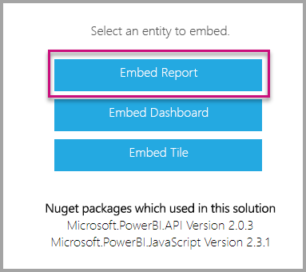

# <a name="tutorial-embed-power-bi-paginated-reports-into-an-application-for-your-customers-preview"></a>Esercitazione: Incorporare report impaginati di Power BI in un'applicazione per i clienti (anteprima)

Con **Power BI Embedded in Azure** o l'**incorporamento di Power BI in Office**, è possibile incorporare report impaginati in un'applicazione usando dati di proprietà dell'app. **I dati di proprietà dell'app** consistono nel disporre di un'applicazione che usa Power BI come piattaforma di analisi incorporata. Gli **ISV** o gli **sviluppatori** possono creare contenuto Power BI che visualizza report impaginati in un'applicazione completamente integrata e interattiva, senza richiedere agli utenti di disporre di una licenza di Power BI. Questa esercitazione illustra come integrare un report impaginato in un'applicazione tramite .NET SDK di Power BI e l'API JavaScript di Power BI.


In questa esercitazione viene illustrato come:
> [!div class="checklist"]
> * Registrare un'applicazione in Azure.
> * Incorporare un report impaginato di Power BI in un'applicazione.

## <a name="prerequisites"></a>Prerequisiti

Per iniziare, è necessario avere:

* Un'[entità servizio (token solo app)](embed-service-principal.md)
* Una sottoscrizione di [Microsoft Azure](https://azure.microsoft.com/)
* Configurazione del [tenant di Azure Active Directory](create-an-azure-active-directory-tenant.md)
* Una [capacità](#create-a-dedicated-capacity) minima A4 o P1 con il carico di lavoro [report impaginati](../../service-admin-premium-workloads.md#paginated-reports) abilitato

Se non si ha una sottoscrizione di Azure, prima di iniziare creare un [account gratuito](https://azure.microsoft.com/free/?WT.mc_id=A261C142F).

> [!IMPORTANT]
> * È necessario usare un'**entità servizio**. L'utente master non è supportato.
> * Le origini dati che richiedono il Single Sign-On (SSO) non sono supportate.
> * Il set di dati di Power BI non è supportato come [origine dati](../../service-get-data.md).

## <a name="set-up-your-power-bi-environment"></a>Configurare l'ambiente di Power BI

Per incorporare un report impaginato è necessario assegnare un'area di lavoro a una capacità dedicata e caricare il report nell'area di lavoro.

### <a name="create-an-app-workspace"></a>Crea area di lavoro per le app

Se invece si usa l'[entità servizio](embed-service-principal.md) per accedere all'applicazione, è necessario usare le [nuove aree di lavoro](../../service-create-the-new-workspaces.md). In qualità di *entità servizio*, è anche necessario essere un amministratore o un membro delle aree di lavoro per le app coinvolte nell'applicazione.

### <a name="create-a-dedicated-capacity"></a>Creare una capacità dedicata

Prima di importare o caricare un report impaginato da incorporare, l'area di lavoro contenente il report deve essere assegnata almeno a una capacità A4 o P1. In Power BI è possibile scegliere tra due tipi di capacità:
* **Power BI Premium**: per incorporare un report impaginato, è necessaria una capacità SKU *P*. Quando si incorpora il contenuto di Power BI, questa soluzione viene definita *incorporamento di Power BI*. Per altre informazioni su questa sottoscrizione, vedere [Che cos'è Power BI Premium?](../../service-premium-what-is.md)
* **Azure Power BI Embedded**: è possibile acquistare una capacità dedicata dal [portale di Microsoft Azure](https://portal.azure.com). Questa sottoscrizione usa gli SKU *A*. Per l'incorporamento di report impaginati è necessaria almeno una sottoscrizione *A4*. Per informazioni dettagliate su come creare una capacità per Power BI Embedded, vedere [Create Power BI Embedded capacity in the Azure portal](azure-pbie-create-capacity.md) (Creare capacità per Power BI Embedded nel portale di Azure).

La tabella seguente descrive le risorse e i limiti di ogni SKU. Per determinare la capacità più adatta alle proprie esigenze, vedere la tabella [Quale SKU devo acquistare per il mio scenario](https://docs.microsoft.com/power-bi/developer/embedded-faq#which-solution-should-i-choose).

| Nodi delle capacità | Totale vCore | vCore back-end | RAM (GB) | vCore front-end | 
| --- | --- | --- | --- | --- |
| P1/A4 | 8 | 4 | 25 | 4 |
| P2/A5 | 16 | 8 | 50 | 8 |
| P3/A6 | 32 | 16 | 100 | 16 |
| | | | | |

### <a name="assign-an-app-workspace-to-a-dedicated-capacity"></a>Assegnare un'area di lavoro per le app a una capacità dedicata

Dopo aver creato una capacità dedicata, è possibile assegnare l'area di lavoro dell'app alla capacità dedicata.

Per assegnare una capacità dedicata a un'area di lavoro con un'[entità servizio](embed-service-principal.md), usare l'[API REST di Power BI](https://docs.microsoft.com/rest/api/power-bi/capacities/groups_assigntocapacity). Quando si usano le API REST di Power BI, assicurarsi di usare l'[ID oggetto dell'entità servizio](embed-service-principal.md#how-to-get-the-service-principal-object-id).

### <a name="create-and-upload-your-paginated-reports"></a>Creare e caricare i report impaginati

È possibile creare il report impaginato con [Generatore report di Power BI](../../paginated-reports/paginated-reports-report-builder-power-bi.md#create-reports-in-power-bi-report-builder) e quindi [caricare il report nel servizio](../../paginated-reports/paginated-reports-quickstart-aw.md#upload-the-report-to-the-service).

È possibile importare report impaginati nelle nuove aree di lavoro usando le [API REST di Power BI](https://docs.microsoft.com/rest/api/power-bi/imports/postimportingroup).

## <a name="embed-content-using-the-sample-application"></a>Incorporare il contenuto usando l'applicazione di esempio

Questo esempio è volutamente semplice per scopo dimostrativo. Sarà l'utente o lo sviluppatore a scegliere se proteggere il segreto dell'applicazione.

Seguire questa procedura per avviare l'incorporamento del contenuto usando l'applicazione di esempio.

1. Scaricare [Visual Studio](https://www.visualstudio.com/) (2013 o versione successiva). Assicurarsi di scaricare la versione più recente [del pacchetto NuGet](https://www.nuget.org/profiles/powerbi).

2. Scaricare l'esempio [App Owns Data](https://github.com/Microsoft/PowerBI-Developer-Samples) da GitHub per iniziare.

    

3. Aprire il file **Web.config** nell'applicazione di esempio. Per eseguire l'applicazione, è necessario compilare alcuni campi. Scegliere **ServicePrincipal** per **AuthenticationType**.

    Compilare i campi seguenti:
    * [applicationId](#application-id)
    * [workspaceId](#workspace-id)
    * [reportId](#report-id)
    * [applicationsecret](#application-secret)
    * [tenant](#tenant)

    > [!Note]
    > Il valore predefinito per **AuthenticationType** in questo esempio è MasterUser. Assicurarsi di sostituirlo con **ServicePrincipal**. 


    

### <a name="application-id"></a>ID applicazione

In **applicationId** inserire il valore di **ID applicazione** di **Azure**. Il valore **applicationId** viene usato per l'identificazione dell'applicazione per gli utenti ai quali si richiedono le autorizzazioni.

Per ottenere il valore **applicationId** seguire questa procedura:

1. Accedere al [portale di Azure](https://portal.azure.com).

2. Nel riquadro di spostamento a sinistra, scegliere **Tutti i servizi** e cercare **Registrazioni app**.

    

3. Selezionare l'applicazione che deve usare il valore **applicationId**.

    

4. Viene visualizzato un **ID applicazione** che viene elencato come GUID. Usare questo **ID applicazione** come **applicationId** per l'applicazione.

    

### <a name="workspace-id"></a>ID area di lavoro

Compilare il campo **workspaceId** con il GUID (gruppo) dell'area di lavoro per le app di Power BI. È possibile ottenere queste informazioni dall'URL di accesso al servizio Power BI o usando PowerShell.

URL <br>


PowerShell <br>

```powershell
Get-PowerBIworkspace -name "Paginated Report Embed"
```

   

### <a name="report-id"></a>ID del report

Compilare il campo **reportId** con il GUID del report di Power BI. È possibile ottenere queste informazioni dall'URL di accesso al servizio Power BI o usando PowerShell.

URL<br>


PowerShell <br>

```powershell
Get-PowerBIworkspace -name "Paginated Report Embed" | Get-PowerBIReport
```


### <a name="application-secret"></a>Segreto dell'applicazione

Specificare le informazioni per **ApplicationSecret** dalla sezione **Chiavi** in **Registrazioni app** in **Azure**.

Per ottenere il valore **ApplicationSecret**, seguire questa procedura:

1. Accedere al [portale di Azure](https://portal.azure.com).

2. Nel riquadro di spostamento a sinistra, scegliere **Tutti i servizi** e cercare **Registrazioni app**.

    

3. Selezionare l'applicazione che deve usare il valore **ApplicationSecret**.

    

4. Selezionare **Certificati e segreti** in **Gestisci**.

5. Selezionare **New client secrets** (Nuovi segreti client).

6. Immettere un nome nella casella **Descrizione** e selezionare una durata. Quindi selezionare **Salva** per ottenere il **Valore** per l'applicazione. Chiudendo il riquadro **Chiavi** dopo aver salvato il valore della chiave, il campo del valore viene visualizzato solo come nascosto. A questo punto, non è possibile recuperare il valore della chiave. Se il valore della chiave viene perso, crearne uno nuovo all'interno del portale di Azure.

    

### <a name="tenant"></a>Tenant

Compilare il campo **tenant** con l'ID tenant di Azure. È possibile ottenere queste informazioni dall'[interfaccia di amministrazione di Azure AD](/onedrive/find-your-office-365-tenant-id) quando si accede al servizio Power BI o tramite PowerShell.

### <a name="run-the-application"></a>Eseguire l'applicazione

1. Selezionare **Esegui** in **Visual Studio**.

    

2. Selezionare quindi **Incorpora report**.

    

3. È ora possibile visualizzare il report nell'applicazione di esempio.

    

## <a name="embed-power-bi-paginated-reports-within-your-application"></a>Incorporare report impaginati di Power BI nell'applicazione

Anche se la procedura per incorporare i report impaginati di Power BI viene eseguita con le [API REST di Power BI](https://docs.microsoft.com/rest/api/power-bi/), i codici di esempio descritti in questo articolo vengono creati con **.NET SDK**.

Per incorporare report impaginati di Power BI per i clienti all'interno dell'applicazione, è necessario disporre di un'**entità servizio** di [Azure AD](embed-service-principal.md) e ottenere un [token di accesso di Azure AD](get-azuread-access-token.md#access-token-for-non-power-bi-users-app-owns-data) per l'applicazione Power BI, prima di effettuare chiamate alle [API REST di Power BI](https://docs.microsoft.com/rest/api/power-bi/).

Per creare il client Power BI con il **token di accesso** creare l'oggetto client Power BI, che consente di interagire con le [API REST di Power BI](https://docs.microsoft.com/rest/api/power-bi/). L'oggetto client Power BI viene creato eseguendo il wrapping di **AccessToken** in un oggetto ***Microsoft.Rest.TokenCredentials***.

```csharp
using Microsoft.IdentityModel.Clients.ActiveDirectory;
using Microsoft.Rest;
using Microsoft.PowerBI.Api.V2;

var tokenCredentials = new TokenCredentials(authenticationResult.AccessToken, "Bearer");

// Create a Power BI Client object. it's used to call Power BI APIs.
using (var client = new PowerBIClient(new Uri(ApiUrl), tokenCredentials))
{
    // Your code to embed items.
}
```

### <a name="get-the-paginated-report-you-want-to-embed"></a>Ottenere il report impaginato da incorporare

Usare l'oggetto client Power BI per recuperare un riferimento all'elemento da incorporare.

Ecco un esempio del codice per recuperare il primo report da un'area di lavoro specifica.

*Un esempio di come recuperare un elemento di contenuto da incorporare, che si tratti di un report, dashboard o riquadro, è disponibile all'interno del file Services\EmbedService.cs nell'[applicazione di esempio](https://github.com/Microsoft/PowerBI-Developer-Samples).*

```csharp
using Microsoft.PowerBI.Api.V2;
using Microsoft.PowerBI.Api.V2.Models;

// You need to provide the workspaceId where the dashboard resides.
ODataResponseListReport reports = await client.Reports.GetReportsInGroupAsync(workspaceId);

// Get the first report in the group.
Report report = reports.Value.FirstOrDefault();
```

### <a name="create-the-embed-token"></a>Creare il token di incorporamento

Generare un token di incorporamento che possa essere usato dall'API JavaScript. Per creare un token incorporato per l'incorporamento dei report impaginati di Power BI, usare l'API [Reports GenerateTokenForCreateInGroup](https://docs.microsoft.com/rest/api/power-bi/embedtoken/reports_generatetokenforcreateingroup).

Un esempio di creazione di un token di incorporamento è disponibile nel file  *Services\EmbedService.cs* dell'[applicazione di esempio](https://github.com/Microsoft/PowerBI-Developer-Samples).

```csharp
using Microsoft.PowerBI.Api.V2;
using Microsoft.PowerBI.Api.V2.Models;

// Generate Embed Token.
var generateTokenRequestParameters = new GenerateTokenRequest(accessLevel: "view");
EmbedToken tokenResponse = client.Reports.GenerateTokenInGroup(workspaceId, report.Id, generateTokenRequestParameters);

// Generate Embed Configuration.
var embedConfig = new EmbedConfig()
{
    EmbedToken = tokenResponse,
    EmbedUrl = report.EmbedUrl,
    Id = report.Id
};
```

### <a name="load-an-item-using-javascript"></a>Caricare un elemento con JavaScript

È possibile usare JavaScript per caricare un report impaginato in un elemento div nella pagina Web.

Per un esempio completo dell'uso dell'API JavaScript, è possibile usare lo [strumento Playground](https://microsoft.github.io/PowerBI-JavaScript/demo), Lo strumento Playground consente di riprodurre in modo rapido esempi di Power BI Embedded di tipo diverso. È anche possibile ottenere maggiori informazioni sull'API JavaScript visitando la pagina del [wiki Power BI-JavaScript](https://github.com/Microsoft/powerbi-javascript/wiki).

## <a name="next-steps"></a>Passaggi successivi

In questa esercitazione è stato descritto come incorporare i report impaginati di Power BI in un'applicazione per i clienti. È anche possibile provare a incorporare il contenuto di Power BI per i clienti o per l'organizzazione.

> [!div class="nextstepaction"]
>[Incorporare contenuto per i clienti](embed-sample-for-customers.md)

> [!div class="nextstepaction"]
>[Incorporare contenuto per l'organizzazione](embed-sample-for-your-organization.md)

Altre domande? [Provare a rivolgersi alla community di Power BI](https://community.powerbi.com/)
