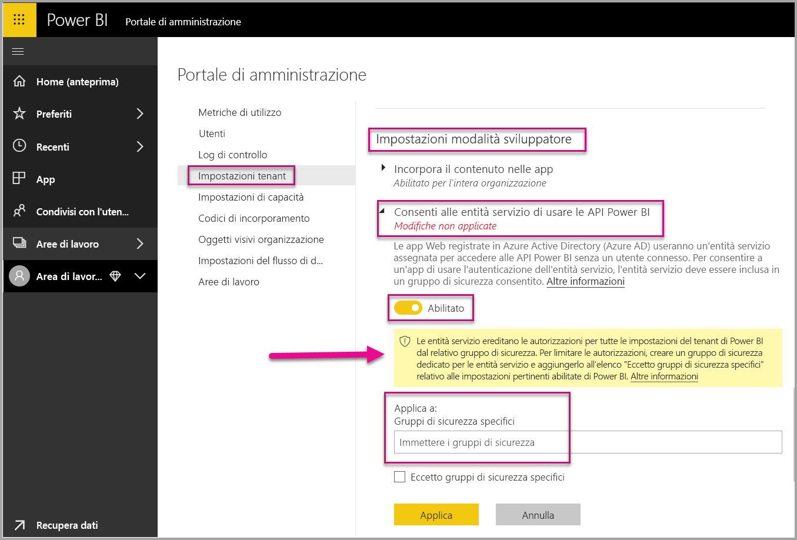
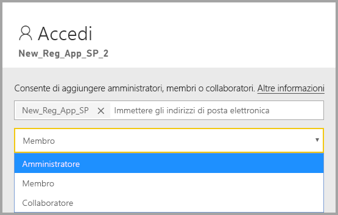

# <a name="embedding-power-bi-content-with-service-principal-and-application-secret"></a>Incorporamento di contenuto di Power BI con entità servizio e segreto dell'applicazione

[!INCLUDE[service principal overview](../../includes/service-principal-overview.md)]

Questo articolo descrive come eseguire l'autenticazione con un'entità servizio usando l'*ID applicazione* e il *segreto dell'applicazione*.

## <a name="method"></a>Metodo

Per usare un'entità servizio e un ID applicazione con l'analisi incorporata, seguire questa procedura:

1. Creare un'[app Azure AD](https://docs.microsoft.com/azure/active-directory/manage-apps/what-is-application-management).

    1. Creare il segreto dell'app Azure AD.
    
    2. Ottenere l'*ID applicazione* e il *segreto dell'applicazione* per l'app.

    >[!NOTE]
    >Queste operazioni sono descritte nel **passaggio 1**. Per altre informazioni sulla creazione di un'app Azure AD, vedere l'articolo sulla [creazione di un'app Azure AD](https://docs.microsoft.com/azure/active-directory/develop/howto-create-service-principal-portal).

2. Creare un gruppo di sicurezza di Azure AD.

3. Abilitare le impostazioni di amministrazione del servizio Power BI.

4. Aggiungere l'entità servizio all'area di lavoro.

5. Incorporare il contenuto.

> [!IMPORTANT]
> Dopo aver abilitato l'entità servizio da usare con Power BI, le autorizzazioni AD dell'applicazione non hanno più effetto. Le autorizzazioni dell'applicazione vengono quindi gestite dal portale di amministrazione di Power BI.

## <a name="step-1---create-an-azure-ad-app"></a>Passaggio 1: Creare un'app Azure AD

Creare un'app Azure AD usando uno di questi metodi:
* Creare l'app nel [portale di Microsoft Azure](https://portal.azure.com/#allservices)
* Creare l'app usando [PowerShell](https://docs.microsoft.com/powershell/azure/create-azure-service-principal-azureps?view=azps-3.6.1).

### <a name="creating-an-azure-ad-app-in-the-microsoft-azure-portal"></a>Creare un'app Azure AD nel portale di Microsoft Azure

1. Accedere a [Microsoft Azure](https://portal.azure.com/#allservices).

2. Cercare **Registrazioni app** e fare clic sul collegamento **Registrazioni app**.

    

3. Fare clic su **Nuova registrazione**.

    

4. Specificare le informazioni necessarie:
    * **Nome**: immettere un nome per l'applicazione
    * **Tipi di account supportati** - Selezionare l'account Azure AD necessario
    * (Facoltativo) **URI di reindirizzamento**: immettere un URI, se necessario

5. Fare clic su **Register**.

6. Dopo la registrazione, l'*ID applicazione* è disponibile nella scheda **Panoramica**. Copiare e salvare l'*ID applicazione* per usarlo in un secondo tempo.

    

7. Fare clic sulla scheda **Certificati e segreti**.

     

8. Fare clic su **Nuovo segreto client**

    

9. Nella finestra *Aggiungi un segreto client* immettere una descrizione, specificare una scadenza per il segreto client e fare clic su **Aggiungi**.

10. Copiare e salvare il valore *ID client*.

    

    >[!NOTE]
    >Quando si lascia questa finestra, il valore del segreto client viene nascosto e non sarà più possibile visualizzarlo o copiarlo.

### <a name="creating-an-azure-ad-app-using-powershell"></a>Creare un'app Azure AD usando PowerShell

Questa sezione include uno script di esempio che consente di creare una nuova app Azure AD usando [PowerShell](https://docs.microsoft.com/powershell/azure/create-azure-service-principal-azureps?view=azps-1.1.0).

```powershell
# The app ID - $app.appid
# The service principal object ID - $sp.objectId
# The app key - $key.value

# Sign in as a user that's allowed to create an app
Connect-AzureAD

# Create a new Azure AD web application
$app = New-AzureADApplication -DisplayName "testApp1" -Homepage "https://localhost:44322" -ReplyUrls "https://localhost:44322"

# Creates a service principal
$sp = New-AzureADServicePrincipal -AppId $app.AppId

# Get the service principal key
$key = New-AzureADServicePrincipalPasswordCredential -ObjectId $sp.ObjectId
```

## <a name="step-2---create-an-azure-ad-security-group"></a>Passaggio 2: Creare un gruppo di sicurezza di Azure AD

L'entità servizio non ha accesso al contenuto e alle API di Power BI. Per consentire l'accesso all'entità servizio, creare un gruppo di sicurezza in Azure AD e aggiungere l'entità servizio creata a quel gruppo di sicurezza.

Esistono due modi per creare un gruppo di sicurezza di Azure AD:
* Manualmente (in Azure)
* Uso di PowerShell

### <a name="create-a-security-group-manually"></a>Creare manualmente un gruppo di sicurezza

Per creare manualmente un gruppo di sicurezza di Azure, seguire le istruzioni riportate nell'articolo [Creare un gruppo di base e aggiungere membri con Azure Active Directory](https://docs.microsoft.com/azure/active-directory/fundamentals/active-directory-groups-create-azure-portal). 

### <a name="create-a-security-group-using-powershell"></a>Creare un gruppo di sicurezza con PowerShell

Di seguito è riportato uno script di esempio che consente di creare un nuovo gruppo di sicurezza e di aggiungere un'app a tale gruppo di sicurezza.

>[!NOTE]
>Se si vuole abilitare l'accesso dell'entità servizio per l'intera organizzazione, saltare questo passaggio.

```powershell
# Required to sign in as a tenant admin
Connect-AzureAD

# Create an Azure AD security group
$group = New-AzureADGroup -DisplayName <Group display name> -SecurityEnabled $true -MailEnabled $false -MailNickName notSet

# Add the service principal to the group
Add-AzureADGroupMember -ObjectId $($group.ObjectId) -RefObjectId $($sp.ObjectId)
```

## <a name="step-3---enable-the-power-bi-service-admin-settings"></a>Passaggio 3: Abilitare le impostazioni di amministrazione del servizio Power BI

Affinché un'app Azure AD sia in grado di accedere al contenuto e alle API di Power BI, un amministratore di Power BI deve abilitare l'accesso dell'entità servizio nel portale di amministrazione di Power BI.

Aggiungere il gruppo di sicurezza creato in Azure AD alla sezione dei gruppi di sicurezza specifici in **Impostazioni modalità sviluppatore**.

>[!IMPORTANT]
>Le entità servizio possono accedere a tutte le impostazioni del tenant per cui sono abilitate. In base alle impostazioni di amministrazione, sono inclusi gruppi di sicurezza specifici o l'intera organizzazione.
>
>Per limitare l'accesso dell'entità servizio a impostazioni specifiche del tenant, consentire l'accesso solo a gruppi di sicurezza specifici. In alternativa, è possibile creare un gruppo di sicurezza dedicato per le entità servizio ed escluderlo dalle impostazioni specifiche del tenant.



## <a name="step-4---add-the-service-principal-as-an-admin-to-your-workspace"></a>Passaggio 4: Aggiungere l'entità servizio come amministratore alla propria area di lavoro

Per consentire all'app Azure AD di accedere ad artefatti come report, dashboard e set di dati nel servizio Power BI, aggiungere l'entità servizio come membro o amministratore all'area di lavoro.

>[!NOTE]
>Questa sezione contiene istruzioni relative all'interfaccia utente. È anche possibile aggiungere un'entità servizio a un'area di lavoro usando l'API [Groups - add group user](https://docs.microsoft.com/rest/api/power-bi/groups/addgroupuser) (Gruppi - aggiungi utente gruppo).

1. Scorrere fino all'area di lavoro per cui si vuole abilitare l'accesso e dal menu **Altro** selezionare **Accesso all'area di lavoro**.

    

2. Aggiungere l'entità servizio come **amministratore** o **membro** all'area di lavoro.

    

## <a name="step-5---embed-your-content"></a>Passaggio 5: Incorporare il contenuto

È possibile incorporare il contenuto all'interno di un'applicazione di esempio o all'interno della propria applicazione.

* [Incorporare il contenuto usando l'applicazione di esempio](embed-sample-for-customers.md#embed-content-using-the-sample-application)
* [Incorporare il contenuto all'interno dell'applicazione](embed-sample-for-customers.md#embed-content-within-your-application)

Quando il contenuto è incorporato, si è pronti a [passare alla produzione](embed-sample-for-customers.md#move-to-production).

## <a name="considerations-and-limitations"></a>Considerazioni e limitazioni

* L'entità servizio funziona solo con le [nuove aree di lavoro](../../collaborate-share/service-create-the-new-workspaces.md).
* L'**area di lavoro personale** non è supportata durante l'uso dell'entità servizio.
* La capacità dedicata è necessaria per passare alla produzione.
* Non è possibile accedere al portale di Power BI usando l'entità servizio.
* Per abilitare l'entità servizio nelle impostazioni sviluppatore all'interno del portale di amministrazione di Power BI sono necessari i diritti di amministratore di Power BI.
* Le applicazioni [incorporate per l'organizzazione](embed-sample-for-your-organization.md) non possono usare l'entità servizio.
* La gestione dei [flussi di dati](../../transform-model/service-dataflows-overview.md) non è supportata.
* L'entità servizio attualmente non supporta le API di amministrazione.
* Quando si usa un'entità servizio con un'origine dati di [Azure Analysis Services](https://docs.microsoft.com/azure/analysis-services/analysis-services-overview), l'entità servizio deve avere le autorizzazioni di un'istanza di Azure Analysis Services. L'uso di un gruppo di sicurezza che contiene l'entità servizio a questo scopo non è supportato.

## <a name="next-steps"></a>Passaggi successivi

* [Power BI Embedded per i clienti](embed-sample-for-customers.md)

* [Sicurezza a livello di riga con gateway dati locale con entità servizio](embedded-row-level-security.md#on-premises-data-gateway-with-service-principal)
