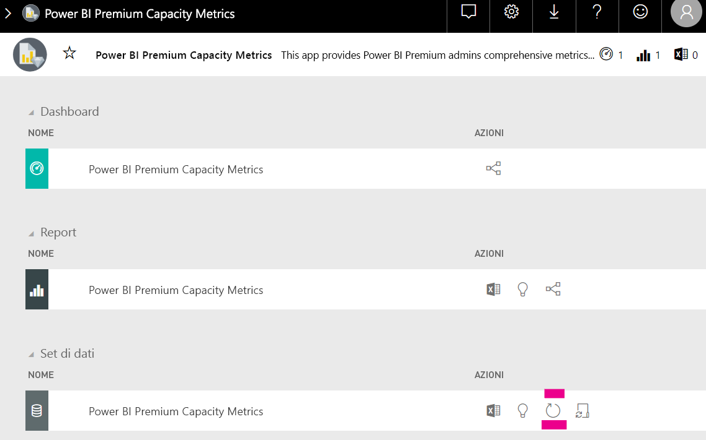

# Pianificazione della capacità per le funzionalità di analisi incorporata di Power BI

Il calcolo del tipo di capacità necessaria per una distribuzione delle funzionalità di analisi incorporata di Power BI può essere complicato. Tale calcolo è infatti basato su molti parametri, alcuni dei quali difficili da stimare.

Di seguito sono riportati alcuni elementi da tenere presenti durante la pianificazione della capacità:

* Modelli di dati in uso
* Numero e complessità delle query richieste
* Distribuzione oraria dell'utilizzo dell'applicazione
* Frequenze di aggiornamento dei dati
* Modelli di utilizzo aggiuntivi difficili da stimare.

Questo articolo consente di semplificare la pianificazione della capacità per l'analisi incorporata di Power BI, introducendo lo [strumento di valutazione del carico della capacità dedicata di Power BI](https://github.com/microsoft/PowerBI-Tools-For-Capacities/tree/master/LoadTestingPowerShellTool/), creato per automatizzare i test di carico per le funzionalità di analisi incorporata di Power BI (SKU *A*, *EM* o *P*).

## Strumento di pianificazione

 Lo [strumento di valutazione del carico della capacità dedicata di Power BI](https://github.com/microsoft/PowerBI-Tools-For-Capacities/tree/master/LoadTestingPowerShellTool/) può essere utile per comprendere la quantità di carico utente che la capacità è in grado di gestire. Usa PowerShell per creare test di carico automatizzati della capacità e consente di scegliere i report da testare e il numero di utenti simultanei da simulare.

Lo strumento genera il carico su una capacità eseguendo continuamente il rendering di ogni report con nuovi valori di filtro (per evitare prestazioni irrealisticamente ottimale dovute alla memorizzazione dei report nella cache), fino alla scadenza del token necessario per l'autenticazione dello strumento nel servizio.

### Uso dello strumento di pianificazione

Quando si esegue lo strumento, tenere presente il carico esistente sulle capacità e non eseguire i test di carico nei periodi di massimo utilizzo.

Di seguito sono riportati alcuni esempi che illustrano come è possibile usare lo strumento di pianificazione.

* Gli amministratori della capacità possono comprendere meglio il numero di utenti che la loro capacità è in grado di gestire in un determinato intervallo di tempo.
* Gli autori del report possono comprendere l'effetto del carico dell'utente misurato con l'[analizzatore prestazioni](https://docs.microsoft.com/power-bi/desktop-performance-analyzer) di Power BI Desktop.
* Nel browser si possono vedere i rendering in tempo reale.
* Con SQL Server Profiler è possibile [connettersi agli endpoint XMLA](https://powerbi.microsoft.com/blog/power-bi-open-platform-connectivity-with-xmla-endpoints-public-preview/) delle capacità misurate per vedere le query in esecuzione.
* Gli effetti del test di carico sono visibili nella pagina Set di impostazioni dell'app Premium Capacity Metrics. Gli amministratori della capacità possono usare questo strumento per generare il carico e vedere come viene visualizzato.

### Monitoraggio dei risultati del test

Per vedere gli effetti del test di carico nell'app per le metriche dopo l'esecuzione del test, seguire le istruzioni riportate di seguito. Aspettarsi un ritardo fino a 15 minuti tra il momento in cui il test inizia a generare il carico e il momento in cui il carico è visibile nelle metriche.

1. Espandere la scheda **Set di dati** della pagina di destinazione dell'app per le [metriche](../../admin/service-admin-premium-monitor-capacity.md).
2. Avviare un aggiornamento su richiesta facendo clic su **Aggiorna ora**. Questa operazione deve essere eseguita dagli amministratori.

    

## Repository GitHub degli strumenti per la capacità di Power BI

Il [repository GitHub degli strumenti per la capacità di Power BI](https://github.com/microsoft/PowerBI-Tools-For-Capacities) è stato creato per ospitare lo strumento di pianificazione della capacità e altri strumenti e utilità futuri.

Il repository è open source e gli utenti sono invitati a collaborare, aggiungere altri strumenti correlati alle capacità di Power BI Premium e Power BI Embedded e migliorare quelli esistenti.

## Passaggi successivi

> [!div class="nextstepaction"]
>[Capacità e SKU per le funzionalità di analisi incorporata di Power BI](embedded-capacity.md)

> [!div class="nextstepaction"]
>[Procedure consigliate per le prestazioni di Power BI Embedded](embedded-performance-best-practices.md)