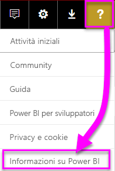
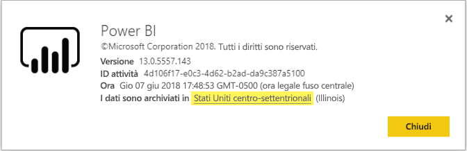

# <a name="frequently-asked-questions-about-power-bi-embedded"></a>Domande frequenti su Power BI Embedded

* Per altre domande, [provare a rivolgersi alla community di Power BI](https://community.powerbi.com/).
* Ci sono ancora problemi? Visitare la [pagina del supporto tecnico di Power BI](https://powerbi.microsoft.com/support/).

## <a name="general"></a>Generale

### <a name="what-is-power-bi-embedded"></a>Che cos'è Power BI Embedded?

[Microsoft Power BI Embedded](azure-pbie-what-is-power-bi-embedded.md) consente agli sviluppatori di applicazioni di incorporare straordinari report completamente interattivi nelle applicazioni evitando di creare controlli e visualizzazioni dei dati da zero.

### <a name="who-is-the-target-audience-for-power-bi-embedded"></a>A chi è destinato Power BI Embedded?

A sviluppatori e aziende di sviluppo software che creano applicazioni, denominati anche fornitori di software indipendenti o ISV (Independent Software Vendor).

### <a name="how-is-power-bi-embedded-different-from-power-bi-the-service"></a>Qual è la differenza tra Power BI Embedded e il servizio Power BI?

Power BI è una soluzione di analisi distribuita come servizio che offre alle organizzazioni una visualizzazione centralizzata dei dati aziendali più strategici.

Microsoft ha sviluppato Power BI Embedded per gli ISV che desiderano incorporare oggetti visivi nelle applicazioni per consentire ai clienti di prendere decisioni analitiche. In questo modo gli ISV possono evitare di creare soluzioni di analisi proprie. L'[analisi incorporata](embedding.md) consente agli utenti aziendali di accedere a dati aziendali ed eseguire query su di essi per generare informazioni dettagliate all'interno dell'applicazione.


### <a name="what-is-the-difference-between-power-bi-premium-and-power-bi-embedded"></a>Qual è la differenza tra Power BI Premium e Power BI Embedded?

Power BI Premium è una capacità destinata alle aziende che necessitano di una soluzione di business intelligence completa che offra una visione centralizzata dell'organizzazione, dei partner, dei clienti e dei fornitori. Power BI Premium semplifica il processo decisionale dell'organizzazione. Power BI Premium è un prodotto SaaS che permette agli utenti di fruire del contenuto tramite app per dispositivi mobili, app sviluppate internamente o nel portale di Power BI.

Power BI Embedded è per gli ISV che vogliono incorporare oggetti visivi nelle proprie applicazioni. Power BI Embedded agevola i processi decisionali dei clienti e poiché è progettato per gli sviluppatori di applicazioni, i clienti di queste applicazioni possono fruire del contenuto archiviato nella capacità di Power BI Embedded, che si trovino all'interno o all'esterno dell'organizzazione. Il contenuto della capacità Power BI Embedded non può essere condiviso tramite pubblicazione con un clic nel Web o in SharePoint.

### <a name="what-is-the-microsoft-recommendation-for-when-a-customer-should-buy-power-bi-premium-vs-power-bi-embedded"></a>Quali sono le indicazioni di Microsoft per scegliere tra Power BI Premium e Power BI Embedded?

Microsoft consiglia alle aziende di acquistare Power BI Premium, una soluzione di business intelligence cloud self-service di livello aziendale. Agli ISV consiglia di acquistare Power BI Embedded in ragione dei componenti di analisi incorporata basati sul cloud che contiene. Tuttavia, i clienti possono scegliere liberamente quale prodotto acquistare.

In alcuni casi, un ISV, in genere di grandi dimensioni, oltre alla necessità di incorporare gli oggetti visivi nelle applicazioni vorrà usare uno SKU P per usufruire dei vantaggi aggiuntivi offerti dal servizio Power BI predefinito all'interno dell'organizzazione. Alcune aziende possono decidere di usare SKU A in Azure, se sono interessate solo a creare applicazioni line-of-business incorporandovi le analisi e non necessitano del servizio Power BI preconfezionato.

### <a name="how-many-embed-tokens-can-i-create"></a>Quanti token di incorporamento è possibile creare?

I token di incorporamento con licenza Pro sono destinati al test di sviluppo, pertanto un account master Power BI o un'[entità servizio](embed-service-principal.md) può generare un numero limitato di token di incorporamento. [Acquistare una capacità](#technical) per l'incorporamento in un ambiente di produzione. Dopo l'acquisto di una capacità è possibile generare un numero illimitato di token di incorporamento. Vedere [Available Features](https://docs.microsoft.com/rest/api/power-bi/availablefeatures) (Funzionalità disponibili) per controllare il valore di utilizzo che indica l'attuale utilizzo incorporato espresso come percentuale.

## <a name="technical"></a>Informazioni tecniche

### <a name="where-can-i-learn-more-about-capacity-and-skus-in-power-bi-embedded-analytics"></a>Dove è possibile reperire altre informazioni sulla capacità e sugli SKU per le funzionalità di analisi incorporata di Power BI?

Vedere l'articolo [Capacità e SKU per le funzionalità di analisi incorporata di Power BI](embedded-capacity.md).

### <a name="what-are-the-prerequisites-for-creating-a-pbie-capacity-in-azure"></a>Quali sono i prerequisiti per creare una capacità PBIE in Azure?

* È necessario accedere alla directory dell'organizzazione. Gli account Microsoft non sono supportati.
* È necessario avere un tenant di Power BI, ovvero è necessario che almeno un utente nella directory abbia effettuato l'iscrizione a Power BI. 
* È necessario avere una sottoscrizione di Azure nella directory dell'organizzazione.

### <a name="how-can-i-monitor-power-bi-embedded-capacity-consumption"></a>In che modo è possibile monitorare il consumo della capacità di Power BI Embedded?

* Utilizzo del [portale di amministrazione di Power BI](../../service-admin-portal.md#power-bi-embedded).

* Download dell'[app metrica](https://docs.microsoft.com/power-bi/service-admin-premium-monitor-capacity) in Power BI.

* Utilizzo della [registrazione diagnostica di Azure](azure-pbie-diag-logs.md).

### <a name="can-my-capacity-scale-automatically-to-adjust-to-my-app-consumption"></a>La capacità può ridimensionarsi automaticamente in base all'utilizzo dell'app?

Al momento il ridimensionamento automatico non è disponibile, ma è possibile ridimensionare le API in qualsiasi momento.

### <a name="why-creatingscalingresuming-a-capacity-results-in-putting-the-capacity-into-a-suspended-state"></a>Per quale motivo la creazione, il ridimensionamento o la ripresa di una capacità ne comporta l'inserimento in uno stato sospeso?

Il provisioning di una capacità (ridimensionamento, ripresa o creazione) potrebbe non riuscire. È possibile usare l'API Get Details per controllare il valore ProvisioningState di una capacità: [Capacities - Get Details](https://docs.microsoft.com/rest/api/power-bi-embedded/capacities/getdetails).

### <a name="can-i-only-create-power-bi-embedded-capacities-in-a-specific-region"></a>È possibile creare le capacità di Power BI Embedded solo in un'area specifica?

Con la funzionalità [Multi-Geo (anteprima)](embedded-multi-geo.md), è possibile acquistare una [capacità di Power BI Embedded](azure-pbie-create-capacity.md) in un'area diversa dalla località del tenant principale di Power BI

### <a name="why-cant-i-see-a-workspace-although-i-have-permissions"></a>Per quale motivo un'area di lavoro non viene visualizzata anche se si dispone delle autorizzazioni?

Quando un utente ottiene le autorizzazioni per un'area di lavoro, un'app o un artefatto, queste potrebbero non essere immediatamente disponibili tramite le chiamate API.
Il risultato può essere l'indicazione di un artefatto mancante in una risposta dell'API 'GET' o un errore durante il tentativo di utilizzare l'artefatto.
L'utente può risolvere il problema chiamando [l'API refreshUserPermissions](https://docs.microsoft.com/rest/api/power-bi/users/refreshuserpermissions) che aggiorna le autorizzazioni dell'utente.


### <a name="how-can-i-find-my-pbi-tenant-region"></a>Come si reperisce la propria area del tenant PBI?

È possibile usare il portale PBI per risalire alla propria area del tenant PBI.

[https://app.powerbi.com/](https://app.powerbi.com/ ) > ? > Informazioni su Power BI




### <a name="what-does-the-cloud-solution-provider-csp-channel-support"></a>Che cosa supporta il canale Cloud Solution Provider (CSP)?

* Con la sottoscrizione di tipo CSP è possibile creare PBIE per il proprio tenant
* L'account partner può accedere al tenant del cliente, acquistare PBIE per il tenant del cliente e specificare l'utente del tenant del cliente come amministratore della capacità Power BI

### <a name="why-do-i-get-an-unsupported-account-message"></a>Perché viene visualizzato il messaggio di account non è supportato?

Power BI richiede l'iscrizione con un account aziendale. L'iscrizione a Power BI usando un account Microsoft non è supportata.

### <a name="can-i-use-apis-to-create-and-manage-azure-capacities"></a>È possibile usare le API per creare e gestire le capacità di Azure?

Sì, esistono API REST Azure Resource Manager e cmdlet di PowerShell che è possibile usare per creare e gestire le risorse Power BI Embedded.

* [API REST](https://docs.microsoft.com/rest/api/power-bi-embedded/) 
* [Cmdlet di PowerShell](https://docs.microsoft.com/powershell/module/azurerm.powerbiembedded/)

### <a name="what-is-the-pbi-embedded-dedicated-capacity-role-in-a-pbi-embedded-solution"></a>Che cos'è il ruolo della capacità dedicata Power PBI Embedded in una soluzione Power PBI Embedded?

Per [alzare la soluzione al livello di produzione](embed-sample-for-customers.md#move-to-production), è necessario assegnare il contenuto di Power BI, vale a dire l'area di lavoro usata dall'applicazione, a una capacità Power BI Embedded (SKU A).

### <a name="in-what-azure-regions-is-pbi-embedded-available"></a>In quali aree di Azure è disponibile PBI Embedded?

[PAM](https://ecosystemmanager.azurewebsites.net/home) (EcoManager): vedere Privileged Access Management

Aree disponibili (16 - stesse aree di Power BI)

* STATI 6 - Stati Uniti orientali, Stati Uniti orientali 2, Stati Uniti centro-settentrionali, Stati Uniti centro-meridionali, Stati Uniti occidentali, Stati Uniti occidentali 2
* Europa (2) - Europa settentrionale, Europa occidentale
* Asia Pacifico (2) - Asia sudorientale, Asia orientale
* Brasile (1) - Brasile meridionale
* Giappone (1) - Giappone orientale
* Australia (1) - Australia sud-orientale
* India (1) - India occidentale
* Canada (1) - Canada centrale
* Regno Unito (1) - Regno Unito meridionale

### <a name="what-is-power-bi-embeddeds-authentication-model"></a>Qual è il modello di autenticazione per Power BI Embedded?

Power BI Embedded continua a usare Azure AD per l'autenticazione dell'utente master, un utente designato con licenza di Power BI Pro, oppure un'[entità servizio](embed-service-principal.md) per l'autenticazione dell'applicazione all'interno di Power BI.  

 Un ISV può scegliere le procedure di autenticazione e autorizzazione da implementare per le proprie applicazioni.

Se si dispone di un tenant di Azure AD, è possibile usare la directory esistente. È anche possibile creare un nuovo tenant di Azure AD per la protezione del contenuto dell'applicazione incorporata.

Per ottenere un token AAD, è possibile usare una delle [librerie di autenticazione di Azure Active Directory](https://docs.microsoft.com/azure/active-directory/develop/active-directory-authentication-libraries). Sono disponibili librerie client per più piattaforme.

### <a name="my-application-already-uses-aad-for-user-authentication-how-can-we-use-this-identity-when-authenticating-to-power-bi-in-a-user-owns-data-scenario"></a>L'applicazione già utilizza AAD per l'autenticazione utente. Come si usa questa identità per l'autenticazione a Power BI in uno scenario "i dati sono di proprietà dell'utente"?

Si tratta di un flusso On-Behalf-Of OAuth standard (<https://docs.microsoft.com/azure/active-directory/develop/web-api>). L'applicazione deve essere configurata in modo da richiedere le autorizzazioni al servizio Power BI con gli ambiti necessari. Dopo che si è ottenuto un token utente per l'app, è sufficiente effettuare una chiamata AcquireTokenAsync all'API ADAL tramite il token di accesso utente e specificare l'URL della risorsa Power BI come ID della risorsa:

```csharp
var context = new AD.AuthenticationContext(authorityUrl);
var userAssertion = new AD.UserAssertion(userAccessToken);
var clientAssertion = new AD.ClientAssertionCertificate(MyAppId, MyAppCertificate)
var authenticationResult = await context.AcquireTokenAsync(resourceId, clientAssertion, userAssertion);
```

### <a name="what-object-id-is-the-service-principal-object-id"></a>Quale ID oggetto corrisponde all'ID oggetto entità servizio?

L'*ID oggetto* della schermata principale di un'app registrata è l'ID oggetto per l'app.

L'ID oggetto che si trova nella sezione *Applicazione gestita nella directory locale > Proprietà* è l'ID oggetto entità servizio da usare. Questo ID oggetto serve come riferimento a un'entità servizio per le operazioni o per apportare modifiche all'ID oggetto entità servizio. Per applicare, ad esempio, un'entità servizio come amministratore a un'area di lavoro.

### <a name="how-is-power-bi-embedded-different-from-other-azure-services"></a>Qual è la differenza tra Power BI Embedded e altri servizi di Azure?

È necessario avere un account Power BI per poter acquistare Power BI Embedded in Azure. L'area di distribuzione di Power BI Embedded determina l'account Power BI. Gestire la risorsa Power BI Embedded per:

* Aumentare e ridurre le prestazioni
* Aggiungere amministratori della capacità
* Sospendere e riprendere il servizio

Usare PowerBI.com per assegnare o annullare l'assegnazione di aree di lavoro alla capacità di Power BI Embedded.

### <a name="what-content-pack-data-types-can-you-embed"></a>Quali tipi di dati del pacchetto di contenuto è possibile incorporare?

*Non è possibile* incorporare **dashboard** e **riquadri** creati da set di dati del pacchetto di contenuto. Tuttavia, *è possibile* incorporare **report** creati da un set di dati del pacchetto di contenuto.

### <a name="what-is-the-difference-between-using-row-level-security-rls-vs-javascript-filters"></a>Qual è la differenza tra l'uso della sicurezza a livello di riga e dei filtri JavaScript?

La scelta di usare la sicurezza a livello di riga o i filtri JavaScript genera spesso confusione perché un metodo riguarda come controllare quello che può vedere un utente specifico e l'altro come ottimizzare la visualizzazione dell'utente.

Per la sicurezza a livello di riga, lo sviluppatore ISV controlla il filtraggio dei dati come parte della creazione del modello e della generazione dei token di incorporamento. L'utente finale vede solo ciò che l'ISV gli consente di vedere. In questo caso, l'utente può scegliere di vedere meno di ciò che consente il filtro, ma non potrà ignorare la configurazione della sicurezza a livello di riga e visualizzare più informazioni di quanto consentito.

Per i filtri sul lato client (JavaScript), l'ISV può decidere cosa vede l'utente finale nella visualizzazione iniziale, ma non può controllare le modifiche che l'utente finale potrebbe applicare alla visualizzazione stessa. Poiché il codice client Javascript utente può attivare il filtro dei dati nel back-end, questa non può essere considerata un'opzione sicura.

Per altri dettagli, vedere [Sicurezza a livello di riga e filtri JavaScript](embedded-row-level-security.md#using-rls-vs-javascript-filters).

### <a name="how-do-i-manage-permissions-for-service-principals-with-power-bi"></a>Come si gestiscono le autorizzazioni per le entità servizio con Power BI?

Dopo aver abilitato l'[entità servizio](embed-service-principal.md) da usare con Power BI, le autorizzazioni AD dell'applicazione non hanno più effetto. Le autorizzazioni dell'applicazione vengono quindi gestite dal portale di amministrazione di Power BI.

Le entità servizio ereditano le autorizzazioni per tutte le impostazioni del tenant di Power BI dal relativo gruppo di sicurezza. Per limitare le autorizzazioni, creare un gruppo di sicurezza dedicato per le entità servizio e aggiungerlo all'elenco **Eccetto gruppi di sicurezza specifici** relativo alle impostazioni pertinenti abilitate di Power BI.

Questa situazione è importante quando l'entità servizio viene aggiunta come **amministratore** alla nuova area di lavoro. È possibile gestire questa attività tramite le [API](https://docs.microsoft.com/rest/api/power-bi/groups/addgroupuser) o il servizio Power BI.

### <a name="when-to-use-an-application-id-vs-a-service-principal-object-id"></a>Quando si usa un ID applicazione o un ID oggetto dell'entità servizio?

L' **[ID applicazione](embed-sample-for-customers.md#application-id)** viene usato per creare il token di accesso quando si passa l'ID applicazione per l'autenticazione.

Per fare riferimento a un'entità servizio per le operazioni o apportare modifiche, usare l' **[ID oggetto dell'entità servizio](embed-service-principal.md#how-to-get-the-service-principal-object-id)** , applicando ad esempio un'entità servizio come amministratore a un'area di lavoro.

### <a name="can-you-manage-an-on-premises-data-gateway-with-service-principal"></a>È possibile gestire un gateway dati locale con un'entità servizio?

Non è possibile gestire un gateway dati locale (gateway dati) usando un'[entità servizio](embed-service-principal.md), così come è invece possibile con un account master.

Con un account master, è possibile installare un gateway dati, aggiungere utenti al gateway, connettersi a origini dati ed eseguire altre attività amministrative.

Con un'entità servizio, è possibile configurare la [sicurezza a livello di riga](embedded-row-level-security.md#on-premises-data-gateway-with-service-principal) usando un'origine dati con connessione dinamica locale SQL Server Analysis Services (SSAS). In questo modo è possibile gestire gli utenti e il relativo accesso ai dati in SSAS durante il processo di integrazione con **Power BI Embedded** usando un'entità servizio.

### <a name="can-you-sign-into-the-power-bi-service-with-service-principal"></a>È possibile accedere al servizio Power BI con un'entità servizio?

No, non è possibile accedere a Power BI usando un'entità servizio.

Non è possibile utilizzare il contenuto come utente in applicazioni esterne (incorporamento di SaaS), solo quando si genera un token di incorporamento.

### <a name="what-are-the-best-practices-to-improve-performance"></a>Quali sono le procedure consigliate per migliorare le prestazioni?

[Prestazioni di Power BI Embedded](embedded-performance-best-practices.md)

## <a name="licensing"></a>Gestione delle licenze

### <a name="how-do-i-purchase-power-bi-embedded"></a>Come si acquista Power BI Embedded?

Power BI Embedded è disponibile tramite Azure.

### <a name="what-happens-if-i-already-purchased-power-bi-premium-and-now-i-want-some-power-bi-embedded-in-azure-benefits"></a>Che cosa accade se ho già acquistato Power BI Premium e ora desidero usufruire di alcuni dei vantaggi offerti da Power BI Embedded in Azure?

I clienti continuano a pagare gli eventuali acquisti di Power BI Premium esistenti fino al termine del contratto e, a quel punto, potranno scegliere se sostituire le licenze di Power BI Premium in base alle esigenze.

### <a name="do-i-still-have-to-buy-power-bi-premium-to-get-access-to-power-bi-embedded"></a>È comunque necessario acquistare Power BI Premium per avere accesso a Power BI Embedded?

No. Power BI Embedded include la capacità basata su Azure necessaria per distribuire la soluzione ai clienti.

### <a name="whats-the-purchase-commitment-for-power-bi-embedded"></a>Qual è l'impegno di acquisto per Power BI Embedded?

I clienti possono cambiare l'utilizzo su base oraria. Non sono previsti impegni mensili o annuali per il servizio Power BI Embedded.

### <a name="how-does-the-usage-of-power-bi-embedded-show-up-on-my-bill"></a>In che modo verrà visualizzato l'utilizzo di Power BI Embedded nella fattura?

Power BI Embedded viene fatturato secondo una tariffa oraria prevedibile in base al tipo di nodi distribuiti. Mentre la risorsa è attiva, il costo corrispondente continua a essere addebitato, anche se la risorsa non viene usata. È necessario sospendere la risorsa per interrompere l'addebito.

### <a name="who-needs-a-power-bi-pro-license-for-power-bi-embedded-and-why"></a>Chi necessita di una licenza di Power BI Pro per Power BI Embedded e perché?

È necessaria una licenza Power BI Pro o un'[entità servizio](embed-service-principal.md) per usare le API REST. Per aggiungere report a un'area di lavoro di Power BI, un'analista deve avere una licenza di Power BI Pro o un'entità servizio. Per gestire il tenant e la capacità Power BI, un amministratore deve avere una licenza di Power BI Pro.

Poiché Power BI Embedded consente l'uso del portale di Power BI per gestire e convalidare il contenuto incorporato, la licenza di Power BI Pro è necessaria per autenticare l'app in PowerBI.com per accedere ai report nei repository corretti.

Tuttavia, per la [creazione/modifica dei report incorporati](https://github.com/Microsoft/PowerBI-JavaScript/wiki/Create-Report-in-Embed-View) all'interno dell'applicazione, l'utente finale non deve avere una licenza Pro perché l'utente non deve essere un utente di Power BI.

### <a name="can-i-get-started-for-free"></a>È possibile iniziare a usare il prodotto gratuitamente?

Sì. È possibile usare i [crediti Azure](https://azure.microsoft.com/free/) per Power BI Embedded.

### <a name="can-i-get-a-trial-experience-for-power-bi-embedded-in-azure"></a>È possibile accedere a un'esperienza di valutazione per Power BI Embedded in Azure?

Dato che Power BI Embedded fa parte di Azure, è possibile usare il servizio con il [credito di €170 ricevuto al momento dell'iscrizione ad Azure](https://azure.microsoft.com/free/).

### <a name="is-power-bi-embedded-available-for-national-clouds-us-government-germany-china"></a>Power BI Embedded è disponibile per i cloud nazionali (US Government, Germania, Cina)?

Power BI Embedded è disponibile anche per [cloud nazionali](embed-sample-for-customers-national-clouds.md).

### <a name="is-power-bi-embedded-available-for-non-profits-and-educational"></a>Power BI Embedded è disponibile per le organizzazioni no profit e gli istituti didattici?

Non sono previsti prezzi speciali di Azure per le organizzazioni no profit e gli istituti didattici.

## <a name="power-bi-workspace-collection"></a>Raccolta di aree di lavoro di Power BI

### <a name="what-is-power-bi-workspace-collection"></a>Che cos'è la raccolta di aree di lavoro di Power BI?

La **raccolta di aree di lavoro di Power BI** (**Power BI Embedded** versione 1) è una soluzione basata sulla risorsa di Azure **Raccolta di aree di lavoro di Power BI**. Questa soluzione consente di creare applicazioni **Power BI Embedded** per i clienti usando il contenuto di Power BI nella soluzione **Raccolta di aree di lavoro di Power BI**, API dedicate e chiavi della raccolta di aree di lavoro per autenticare l'applicazione per Power BI.

### <a name="can-i-migrate-from-power-bi-workspace-collection-to-power-bi-embedded"></a>È possibile eseguire la migrazione dalla raccolta di aree di lavoro di Power BI a Power BI Embedded?

1. È possibile usare lo strumento di migrazione per clonare il contenuto della **raccolta di aree di lavoro di Power BI** in Power BI - https://docs.microsoft.com/power-bi/developer/migrate-from-powerbi-embedded#content-migration.

2. Iniziare con il modello di verifica (PoC) dell'applicazione **Power BI Embedded** che usa il contenuto di Power BI.

3. Quando si è pronti per la produzione, acquistare una capacità dedicata di **Power BI Embedded** e assegnare il contenuto di Power BI (area di lavoro) a tale capacità.

    > [!Note]
    > È possibile continuare a usare la **raccolta di aree di lavoro di Power BI** durante la compilazione in parallelo con una soluzione **Power BI Embedded**. A questo punto, è possibile spostare il cliente alla nuova soluzione **Power BI Embedded** e ritirare la soluzione **Raccolta di aree di lavoro di Power BI**.

Per altre informazioni, fare riferimento a [Come eseguire la migrazione del contenuto della raccolta di aree di lavoro di Power BI in Power BI Embedded](https://docs.microsoft.com/power-bi/developer/migrate-from-powerbi-embedded).

### <a name="is-power-bi-workspace-collection-on-a-deprecation-path"></a>Raccolta di aree di lavoro di Power BI è in procinto di essere deprecata?

Sì, ma i clienti che stanno già usando la soluzione **Raccolta di aree di lavoro di Power BI** possono continuare a usarla fino a quando non sarà deprecata. I clienti possono anche creare nuove raccolte di aree di lavoro e altre applicazioni **Power BI Embedded** che continuano a usare la soluzione **Raccolta di aree di lavoro di Power BI**.

Tuttavia, ciò significa anche che non vengono aggiunte nuove funzionalità alle soluzioni **Raccolta di aree di lavoro di Power BI**. I clienti sono invitati a pianificare la migrazione alla nuova soluzione **Power BI Embedded**.

### <a name="when-is-power-bi-workspace-collection-support-discontinued"></a>Quando viene sospeso il supporto per la raccolta di aree di lavoro di Power BI?

I clienti che stanno già usando la soluzione **Raccolta di aree di lavoro di Power BI** possono continuare a usarla fino alla fine del mese di giugno 2018 o fino al termine del contratto di supporto.

### <a name="in-what-regions-can-i-create-a-pbi-workspace-collection"></a>In quali regioni può essere creata una raccolta di aree di lavoro di Power BI?

Le regioni disponibili sono Australia sud-orientale, Brasile meridionale, Canada centrale, Stati Uniti orientali 2, Giappone orientale, Stati Uniti centro-settentrionali, Europa settentrionale, Stati Uniti centro-meridionali, Asia sud-orientale, Regno Unito meridionale, Europa occidentale, India occidentale e Stati Uniti occidentali.

### <a name="why-should-i-migrate-from-pbi-workspace-collection-to-power-bi-embedded"></a>Perché occorre eseguire la migrazione dalla raccolta di aree di lavoro di Power BI a Power BI Embedded?

La soluzione **Power BI Embedded** comprende alcune nuove caratteristiche e funzionalità che non sono disponibili in **Raccolta di aree di lavoro di Power BI**.

Ecco alcune delle funzionalità:
* Sono supportate tutte le origini dati PBI. Sono supportate solo due origini dati della **Raccolta di aree di lavoro di Power BI**. 
* Nuove funzionalità come domande e risposte, aggiornamenti, segnalibri, incorporamento di dashboard e riquadri e menu personalizzati sono supportate solo nella soluzione **Power BI Embedded**.
* Modello di fatturazione della capacità.

## <a name="embedding-setup-tool"></a>Strumento di installazione dell'incorporamento

### <a name="what-is-the-embedding-setup-tool"></a>Che cos'è lo strumento di installazione dell'incorporamento?

Lo [strumento di installazione dell'incorporamento](https://aka.ms/embedsetup) consente di scaricare un'applicazione di esempio per iniziare rapidamente a usare la funzionalità di incorporamento con Power BI.

### <a name="which-solution-should-i-choose"></a>Quale soluzione è consigliabile scegliere?

* L'[incorporamento per i clienti](embedding.md#embedding-for-your-customers) offre la possibilità di incorporare dashboard e report per gli utenti che non hanno un account per Power BI. Eseguire la soluzione [Incorporare per i clienti](https://aka.ms/embedsetup/AppOwnsData).
* L'[incorporamento per l'organizzazione](embedding.md#embedding-for-your-organization) consente di estendere il servizio Power BI. Eseguire la soluzione [Incorporare per l'organizzazione](https://aka.ms/embedsetup/UserOwnsData).

### <a name="ive-downloaded-the-sample-app-which-solution-do-i-choose"></a>Dopo aver scaricato l'app di esempio, quale soluzione si deve scegliere?

Se si usa l'esperienza **Incorporare per i clienti**, salvare e decomprimere il file *PowerBI-Developer-Samples.zip*. Aprire quindi la cartella *PowerBI-Developer-Samples-master\App Owns Data* ed eseguire il file *PowerBIEmbedded_AppOwnsData.sln*.

Se si usa l'esperienza **Incorporare per l'organizzazione**, salvare e decomprimere il file *PowerBI-Developer-Samples.zip*. Aprire quindi la cartella *PowerBI-Developer-Samples-master\User Owns Data\integrate-report-web-app* ed eseguire il file *pbi-saas-embed-report.sln*.

### <a name="how-can-i-edit-my-registered-application"></a>Come si può modificare l'applicazione registrata?

Per informazioni su come modificare le applicazioni registrate con Azure AD, vedere [Avvio rapido: Aggiornare un'applicazione in Azure Active Directory](https://docs.microsoft.com/azure/active-directory/develop/quickstart-v1-update-azure-ad-app).

### <a name="how-can-i-edit-my-power-bi-user-profile-or-data"></a>Come è possibile modificare il proprio profilo utente o i propri dati in Power BI?

Le informazioni su come modificare i propri dati in Power BI sono disponibili [qui](https://docs.microsoft.com/power-bi/service-basic-concepts).

Per altre informazioni, vedere [Risoluzione dei problemi dell'applicazione incorporata](embedded-troubleshoot.md).

Altre domande? [Provare la community di Power BI](https://community.powerbi.com/)
